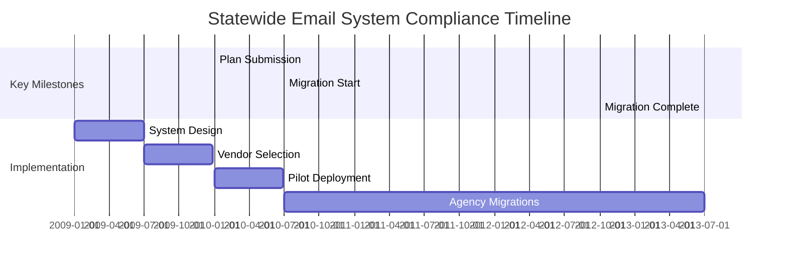

```markdown
# Software Requirements Specification
# Statewide Centralized Email System

**Document Version:** 1.0  
**Date:** [Current Date]  
**Status:** Draft  
**Project:** Florida Statewide Email System

---

## Table of Contents

1. [Introduction](#1-introduction)
2. [Overall Description](#2-overall-description)
3. [System Features](#3-system-features)
4. [External Interface Requirements](#4-external-interface-requirements)
5. [Non-Functional Requirements](#5-non-functional-requirements)
6. [Constraints, Assumptions & Dependencies](#6-constraints-assumptions--dependencies)
7. [Acceptance Criteria](#7-acceptance-criteria)

---

## 1 Introduction

### 1.1 Purpose
This Software Requirements Specification (SRS) document describes the functional and non-functional requirements for the Florida Statewide Centralized Email System. The system will replace all state agency email systems with a unified service by June 30, 2013, as mandated by Florida Statute 282.34.

### 1.2 Scope
The system shall provide centralized email, calendaring, and contact management services for all Florida state agencies. The scope includes:

**In-Scope:**
- Email messaging (send/receive)
- Calendar management
- Contact management
- Email archiving and retention
- Security controls (virus filtering, spam control, encryption)
- Mobile and web access
- Administrative provisioning and migration tools

**Out-of-Scope:**
- Collaboration tools (shared documents, workflows)
- Instant messaging and chat services
- Social media integration
- Video conferencing

### 1.3 Definitions, Acronyms, and Abbreviations

| Term | Definition |
|------|------------|
| SRS | Software Requirements Specification |
| LDAP | Lightweight Directory Access Protocol |
| TLS | Transport Layer Security |
| HIPAA | Health Insurance Portability and Accountability Act |
| SOX | Sarbanes-Oxley Act |
| API | Application Programming Interface |

### 1.4 References
- Florida Statute 282.34
- Sarbanes-Oxley Act (2002)
- HIPAA Security Rule
- Florida Public Records Law

## 2 Overall Description

### 2.1 Product Perspective
The system will replace fragmented agency-specific email systems with a centralized enterprise service. It must integrate with existing agency directories and comply with federal and state regulatory requirements.

### 2.2 User Classes and Characteristics

| User Class | Characteristics | Primary Responsibilities |
|------------|-----------------|--------------------------|
| End Users | 100,000+ state employees | Send/receive email, manage calendars and contacts, mobile access |
| Agency Administrators | IT staff per agency | User provisioning, public folder management, retention policy enforcement |
| Data Center Administrators | Central IT operations team | System configuration, security management, backup/disaster recovery |

### 2.3 Operating Environment
- **Platform:** Enterprise email server infrastructure
- **Access:** Web browsers, mobile devices (iOS, Android, BlackBerry)
- **Integration:** LDAP directories, external archiving systems
- **Security:** Enterprise-grade security infrastructure

### 2.4 Design and Implementation Constraints
- Must comply with SOX, HIPAA, and Florida Public Records Law
- Must complete migration by June 30, 2013
- Must exclude collaboration features as specified
- Must use existing agency directory infrastructure

## 3 System Features

### 3.1 Email Management

#### 3.1.1 Functional Requirements

**FR-EMAIL-001:** The system shall allow users to send and receive email messages.
> **Priority:** Mandatory  
> **Acceptance Criteria:** User can compose, send, and receive emails with attachments up to 25MB.

**FR-EMAIL-002:** The system shall support email rules and filtering.
> **Priority:** Mandatory  
> **Acceptance Criteria:** User can create, modify, and delete email rules for automatic message organization.

**FR-EMAIL-003:** The system shall provide folder management capabilities.
> **Priority:** Mandatory  
> **Acceptance Criteria:** User can create, rename, and delete email folders.

### 3.2 Calendar Management

#### 3.2.1 Functional Requirements

**FR-CAL-001:** The system shall allow users to create, edit, and delete calendar appointments.
> **Priority:** Mandatory  
> **Acceptance Criteria:** User can schedule meetings with multiple attendees.

**FR-CAL-002:** The system shall support calendar sharing between users.
> **Priority:** Mandatory  
> **Acceptance Criteria:** Users can grant viewing/editing permissions to other users.

**FR-CAL-003:** The system shall provide meeting invitation management.
> **Priority:** Mandatory  
> **Acceptance Criteria:** Users can send, accept, and decline meeting requests.

### 3.3 Contact Management

#### 3.3.1 Functional Requirements

**FR-CONTACT-001:** The system shall allow users to create and manage personal contact lists.
> **Priority:** Mandatory  
> **Acceptance Criteria:** Users can add, edit, and delete contact information.

**FR-CONTACT-002:** The system shall support contact sharing between users.
> **Priority:** Optional  
> **Acceptance Criteria:** Users can share contact lists with specified permissions.

### 3.4 Archiving and Retention

#### 3.4.1 Functional Requirements

**FR-ARCHIVE-001:** The system shall implement configurable email retention policies.
> **Priority:** Mandatory  
> **Acceptance Criteria:** System enforces retention periods based on policy rules.

**FR-ARCHIVE-002:** The system shall support legal discovery and hold capabilities.
> **Priority:** Mandatory  
> **Acceptance Criteria:** Administrators can place legal holds on user mailboxes.

**FR-ARCHIVE-003:** The system shall archive emails in compliance with SOX and HIPAA.
> **Priority:** Mandatory  
> **Acceptance Criteria:** System maintains audit trails and meets regulatory requirements.

### 3.5 Security Features

#### 3.5.1 Functional Requirements

**FR-SEC-001:** The system shall provide virus filtering for all email messages.
> **Priority:** Mandatory  
> **Acceptance Criteria:** 99.9% of email-borne viruses are detected and blocked.

**FR-SEC-002:** The system shall implement TLS encryption for email transmission.
> **Priority:** Mandatory  
> **Acceptance Criteria:** All external email transmissions use TLS 1.2 or higher.

**FR-SEC-003:** The system shall provide spam control mechanisms.
> **Priority:** Mandatory  
> **Acceptance Criteria:** System achieves 95% spam detection with <1% false positives.

### 3.6 Access and Mobility

#### 3.6.1 Functional Requirements

**FR-ACCESS-001:** The system shall provide web-based email access.
> **Priority:** Mandatory  
> **Acceptance Criteria:** Users can access full email functionality via web browser.

**FR-ACCESS-002:** The system shall support mobile access for iOS, Android, and BlackBerry.
> **Priority:** Mandatory  
> **Acceptance Criteria:** Mobile clients can sync email, calendar, and contacts.

### 3.7 Administrative Functions

#### 3.7.1 Functional Requirements

**FR-ADMIN-001:** The system shall provide user provisioning tools.
> **Priority:** Mandatory  
> **Acceptance Criteria:** Administrators can create, modify, and disable user accounts.

**FR-ADMIN-002:** The system shall support migration from agency email systems.
> **Priority:** Mandatory  
> **Acceptance Criteria:** Tools available to migrate user data from legacy systems.

**FR-ADMIN-003:** The system shall provide public folder management.
> **Priority:** Mandatory  
> **Acceptance Criteria:** Administrators can create and manage shared public folders.

## 4 External Interface Requirements

### 4.1 User Interfaces
- Web-based interface compatible with IE 8+, Firefox 3+, Chrome
- Mobile interfaces for iOS, Android, BlackBerry
- Administrative web console

### 4.2 Hardware Interfaces
- Integration with existing storage systems
- Compatibility with state data center hardware

### 4.3 Software Interfaces

**SI-LDAP-001:** The system shall integrate with agency LDAP directories for user authentication and provisioning.
> **Interface Type:** LDAP v3  
> **Purpose:** User directory synchronization

**SI-MOBILE-001:** The system shall support mobile device protocols (ActiveSync, EAS).
> **Interface Type:** Exchange ActiveSync  
> **Purpose:** Mobile device synchronization

**SI-ARCHIVE-001:** The system shall interface with external archiving systems.
> **Interface Type:** SMTP, API  
> **Purpose:** Email archiving and compliance

### 4.4 Communications Interfaces
- SMTP for email transmission
- TLS for encrypted communications
- HTTP/HTTPS for web access

## 5 Non-Functional Requirements

### 5.1 Performance Requirements

**NFR-PERF-001:** The system shall support 100,000+ concurrent users.
> **Measurement:** System maintains response times under 2 seconds for 95% of requests during peak load.

**NFR-PERF-002:** Email delivery shall occur within 30 seconds for 99% of messages.
> **Measurement:** Message queue monitoring and delivery timing metrics.

### 5.2 Security Requirements

**NFR-SEC-001:** The system shall comply with SOX, HIPAA, and Florida Public Records Law.
> **Verification:** Security audit and compliance certification.

**NFR-SEC-002:** All user authentication shall use encrypted protocols.
> **Verification:** Protocol analysis and penetration testing.

**NFR-SEC-003:** System shall maintain audit logs for all administrative actions.
> **Verification:** Log review and retention policy verification.

### 5.3 Availability Requirements

**NFR-AVAIL-001:** The system shall maintain 99.9% uptime during business hours.
> **Measurement:** Monthly availability reporting.

**NFR-AVAIL-002:** System shall implement disaster recovery with RTO of 4 hours and RPO of 1 hour.
> **Verification:** Disaster recovery testing.

### 5.4 Compliance Requirements

**NFR-COMP-001:** System shall meet all legal deadlines:
- Plan submission: December 31, 2009
- Migration start: July 1, 2010
- Migration completion: June 30, 2013

## 6 Constraints, Assumptions & Dependencies

### 6.1 Constraints
- No collaboration features (shared documents, workflows)
- No instant messaging capabilities
- Must use existing agency directory infrastructure
- Budget limitations as defined by state appropriation

### 6.2 Assumptions
- Agency inventory data will be available for migration planning
- Existing network infrastructure can support centralized service
- Agencies will cooperate with migration timeline

### 6.3 Dependencies
- Availability of agency user directory data
- State data center infrastructure readiness
- Vendor product capabilities and roadmaps

## 7 Acceptance Criteria

### 7.1 Mandatory Requirements
All basic functional requirements marked as "Mandatory" must be fully implemented and operational.

### 7.2 Compliance Verification
- Plan submission by December 31, 2009
- Migration commencement by July 1, 2010
- Full migration completion by June 30, 2013

### 7.3 Performance Validation
System must demonstrate ability to handle projected user load with required performance characteristics.

### 7.4 Security Certification
Independent verification of compliance with SOX, HIPAA, and Florida Public Records Law.

### 7.5 Migration Success Criteria
- All agency email systems successfully migrated
- No data loss during migration
- User training and support transition completed

---

## Appendix A: Requirement Priority Definitions

| Priority Level | Definition |
|----------------|------------|
| Mandatory | Required for legal compliance or basic functionality |
| Optional | Desirable but not required for initial implementation |

## Appendix B: Compliance Timeline



**Approval**

| Role | Name | Signature | Date |
|------|------|-----------|------|
| Project Sponsor | | | |
| Technical Lead | | | |
| Quality Assurance | | | |
```