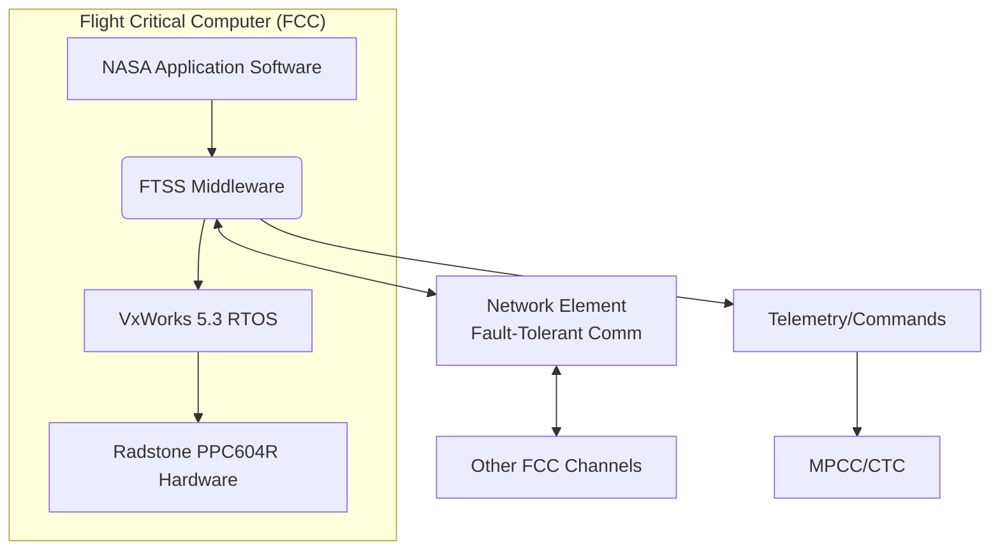

# Software Requirements Specification (SRS)
## X-38 Fault Tolerant System Services (FTSS)

**Document ID:** SRS-FTSS-X38-1.0
**Version:** 1.0
**Date:** October 26, 2023
**Status:** Draft for Review

**Prepared for:** NASA Johnson Space Center
**Prepared by:** Charles Stark Draper Laboratory

---

### 1. Introduction

#### 1.1 Purpose
This document defines the software requirements for the X-38 Fault Tolerant System Services (FTSS). The FTSS provides the core system services for the quad-redundant Flight Critical Computer (FCC) of the X-38 Crew Return Vehicle, ensuring fault-tolerant, deterministic, and synchronized operation of mission-critical flight software applications.

#### 1.2 Scope
The FTSS software acts as an intermediary layer between NASA's mission-specific application software and the underlying hardware (Radstone PowerPC 604R processors, Network Elements, VME bus) and operating system (VxWorks). Its scope includes:
*   Real-time task scheduling and execution management.
*   Synchronous, fault-tolerant inter-process communication.
*   System time management and distribution.
*   Fault detection, isolation, and recovery (FDIR) for hardware components.
*   System initialization, health monitoring, and telemetry/command handling.
*   Management of the quad-redundant (FTPP) hardware architecture.

**Out of Scope:** The design and requirements of the NASA application software, the physical hardware design of the FCC components, and the ground support software are excluded from this document.

#### 1.3 Definitions, Acronyms, and Abbreviations
| Term | Definition |
| :--- | :--- |
| **CBIT** | Continuous Built-In Test |
| **EDAC** | Error Detection and Correction |
| **FCC** | Flight Critical Computer |
| **FCP** | Fault Tolerant Processor (channel) |
| **FDIR** | Fault Detection, Isolation, and Recovery |
| **FTSS** | Fault Tolerant System Services |
| **FTPP** | Fault Tolerant Parallel Processor (architecture) |
| **IBIT** | Initiation Built-In Test |
| **ICP** | Inter-Channel Port |
| **MET** | Mission Elapsed Time |
| **MPCC/CTC** | Multi-Purpose Crew Cabin / Command and Telemetry Computer |
| **NE** | Network Element |
| **PPM** | Parts Per Million |
| **SEP** | Separation Elapsed Time |
| **SEU** | Single Event Upset |
| **VG** | Virtual Group |

#### 1.4 References
1.  X-38 Crew Return Vehicle System Requirements Document (SRD)
2.  FTPP Hardware Architecture Specification, Draper Laboratory
3.  VxWorks 5.3 Programmer's Guide, Wind River Systems

#### 1.5 Document Overview
This SRS is organized into sections covering overall description, specific functional and non-functional requirements, external interfaces, and other supporting information.

### 2. Overall Description

#### 2.1 Product Perspective
The FTSS is a middleware component within the X-38 FCC software stack.

*   **System Interfaces:** FTSS interfaces with the NASA application via a defined API, with the VxWorks OS, and directly with the FTPP hardware (NE, ICP, timers).
*   **User Interfaces:** No direct human-user interface. Interaction is via telemetry downlink and ground command uplink.
*   **Hardware Interfaces:** Radstone PowerPC 604R processors, VME bus, Network Element (NE) chips, Inter-Channel Ports (ICP), EDAC-protected DRAM.
*   **Software Interfaces:** VxWorks 5.3 Real-Time Operating System kernel and board support package (BSP).

#### 2.2 Product Functions
1.  **System Initialization & Synchronization:** Perform hardware self-tests and synchronize all operational FCPs into a Virtual Group.
2.  **Deterministic Real-Time Scheduling:** Execute application tasks within defined 50 Hz, 10 Hz, and 1 Hz rate groups.
3.  **Fault-Tolerant Communication:** Provide message queue and pipe mechanisms for data exchange between tasks across redundant channels.
4.  **Time Management:** Generate and maintain congruent Mission Elapsed Time (MET) and Separation Elapsed Time (SEP).
5.  **Fault Detection, Isolation, and Recovery (FDIR):** Continuously monitor health, detect faults, mask failed components, and attempt channel reintegration.
6.  **System Health Management:** Perform periodic memory scrubbing, execute CBIT, and report status via telemetry.
7.  **Telemetry and Command Servicing:** Package application telemetry for downlink and distribute ground commands to the application.

#### 2.3 User Characteristics
*   **Flight Software Application Developers:** Skilled in real-time C programming, familiar with fault-tolerant concepts. They use the FTSS API to build applications.
*   **System Integrators & Test Engineers:** Experts in embedded systems and avionics integration. They configure, test, and validate the integrated FTSS and application.
*   **Flight Operations Personnel:** Trained mission controllers who monitor vehicle health via telemetry but rely on autonomous FTSS recovery for most faults.

#### 2.4 Constraints
1.  **Hardware:** Must operate on the specified Radstone PowerPC 604R hardware with quad-redundant FTPP architecture.
2.  **Operating System:** Must be compatible with VxWorks 5.3.
3.  **Real-Time:** All critical functions must meet strict 50 Hz (20 ms) minor frame deadlines.
4.  **Memory:** Strict ROM and DRAM usage limits as defined in Section 3.6.
5.  **Safety-Critical:** Design must adhere to NASA standards for human-rated spaceflight software.

#### 2.5 Assumptions and Dependencies
*   The underlying VxWorks OS and hardware BSP function correctly.
*   The FTPP hardware (NE, ICP) provides the required fault-tolerant communication services.
*   NASA application software adheres to the symmetric execution and FTSS API usage guidelines.
*   External time synchronization signals (if used) are within specified accuracy.

### 3. Specific Requirements

#### 3.1 Functional Requirements

##### 3.1.1 System Initialization (FTSS-INIT)
*   **FTSS-INIT-001:** Upon power-on or CPU reset, the FTSS shall execute Initiation Built-In Tests (IBIT) on local processor and communication hardware.
*   **FTSS-INIT-002:** The FTSS shall synchronize with other operational FCPs to form a Virtual Group (VG) within **1.5 minutes** of power application.
*   **FTSS-INIT-003:** After VG formation, the FTSS shall initialize the NASA application software according to a defined startup sequence.

##### 3.1.2 Task Scheduling Services (FTSS-SCHED)
*   **FTSS-SCHED-001:** The FTSS shall provide an API for application tasks to be registered with a specific rate group (50 Hz, 10 Hz, 1 Hz).
*   **FTSS-SCHED-002:** A deterministic, priority-based scheduler shall be invoked by a 50 Hz timer interrupt.
*   **FTSS-SCHED-003:** The scheduler shall execute all tasks within their assigned rate group during the appropriate minor (20 ms) or major (200 ms, 1000 ms) frame.
*   **FTSS-SCHED-004:** Scheduler overhead, including context switching and time service updates, shall not exceed **1 ms** per 50 Hz minor frame.

##### 3.1.3 Inter-Process Communication (FTSS-IPC)
*   **FTSS-IPC-001:** The FTSS shall provide a synchronous message queue API for point-to-point communication between tasks on specified sender and receiver Virtual Groups.
*   **FTSS-IPC-002:** The FTSS shall provide a pipe API for one-to-one or one-to-many (broadcast) data transfer.
*   **FTSS-IPC-003:** All IPC operations shall be performed at rate group frame boundaries to ensure data congruence across redundant FCPs.
*   **FTSS-IPC-004:** The FTSS shall manage all data transmission via the Network Element (NE) to ensure fault-tolerant delivery.

##### 3.1.4 Time Management Services (FTSS-TIME)
*   **FTSS-TIME-001:** The FTSS shall generate and maintain a Mission Elapsed Time (MET) and a Separation Elapsed Time (SEP).
*   **FTSS-TIME-002:** MET and SEP shall be congruent across all FCPs in the active Virtual Group.
*   **FTSS-TIME-003:** The drift rate for MET and SEP shall be ≤ **50 PPM**.
*   **FTSS-TIME-004:** The FTSS shall provide an API for the application to read the current MET, SEP, minor frame count, and vehicle mode.

##### 3.1.5 Fault Detection, Isolation, and Recovery (FTSS-FDIR)
*   **FTSS-FDIR-001:** The FTSS shall perform Continuous Built-In Tests (CBIT) and presence tests (e.g., "I'm Alive" messages) at the 50 Hz rate to detect faults in FCPs, NEs, and ICPs.
*   **FTSS-FDIR-002:** Upon fault detection, the FTSS shall diagnose the faulty component (FCP, NE, ICP, or link).
*   **FTSS-FDIR-003:** The system shall be **two-fault tolerant** for any two non-simultaneous hardware faults.
*   **FTSS-FDIR-004:** A detected faulty component shall be masked (isolated) from the Virtual Group within **60 ms** of fault manifestation.
*   **FTSS-FDIR-005:** For a "babbling" NE or ICP, the FTSS shall detect the fault within **20 ms** and mask it within **40 ms**.
*   **FTSS-FDIR-006:** Following isolation, the FTSS shall attempt to reintegrate a recovered channel if its memory state can be realigned and system rules permit.
*   **FTSS-FDIR-007:** All fault events, diagnoses, and recovery actions shall be logged to the Fault Log for telemetry.

##### 3.1.6 System Health Management (FTSS-HEALTH)
*   **FTSS-HEALTH-001:** The FTSS shall implement a background memory scrubbing task that periodically reads all used DRAM to trigger EDAC correction.
*   **FTSS-HEALTH-002:** EDAC errors detected during scrubbing or normal operation shall be counted and reported via telemetry.
*   **FTSS-HEALTH-003:** The FTSS shall enforce memory segregation, maintaining a congruent memory area (≤ **4 MB**) that is kept aligned across channels and a non-congruent area for local data.

##### 3.1.7 Telemetry and Command Services (FTSS-TLMCMD)
*   **FTSS-TLMCMD-001:** The FTSS shall collect application telemetry packets during the 10 Hz rate group.
*   **FTSS-TLMCMD-002:** The FTSS shall packetize and transfer telemetry data to the MPCC/CTC for downlink.
*   **FTSS-TLMCMD-003:** The FTSS shall receive ground commands from the MPCC/CTC and deliver them to the target application task.

#### 3.2 External Interface Requirements

##### 3.2.1 Application Programming Interface (API)
*   **FTSS-API-001:** The FTSS shall provide a well-defined, documented C-language API for all services (scheduling, IPC, time, etc.).
*   **FTSS-API-002:** The API shall restrict application access to unsafe or non-deterministic OS/hardware calls that could cause channel desynchronization.

##### 3.2.2 Telemetry Interface
*   **FTSS-TLM-001:** The FTSS shall generate standard health & status telemetry packets containing: Virtual Group status, fault log entries, CBIT results, EDAC error counts, and scheduler performance metrics.

#### 3.3 Data Requirements
The FTSS shall manage the following core data structures:
*   **Virtual Group Table:** Managing VG_ID, redundancy level, member list, status.
*   **Task Control Blocks:** Managing Task_ID, function pointer, priority, rate group, state.
*   **Message Queue and Pipe Socket Descriptors:** Managing connections and buffers.
*   **Fault Log:** A circular buffer of fault records, each with timestamp, type, channel ID, diagnosis, and action.
*   **System Time Structure:** Containing current MET, SEP, minor frame count, and vehicle mode.

#### 3.4 Performance Requirements
*   **FTSS-PERF-001:** Total system initialization time shall be ≤ **1.5 minutes**.
*   **FTSS-PERF-002:** Scheduler and time service overhead shall be ≤ **1 ms** per minor frame.
*   **FTSS-PERF-003:** Fault detection and masking shall occur within **60 ms** (20 ms detection for babbling components).
*   **FTSS-PERF-004:** Channel reintegration and memory realignment shall complete within **1.5 minutes** under nominal conditions.

#### 3.5 Fault Tolerance Requirements
*   **FTSS-FT-001:** The system shall maintain full functionality with any single FCP, NE, or ICP failure.
*   **FTSS-FT-002:** The system shall maintain functionality (possibly degraded) after any two non-simultaneous hardware faults.
*   **FTSS-FT-003:** The FTSS software shall be designed to prevent common-mode errors from causing simultaneous failure across all channels (see Risk Mitigation 1).

#### 3.6 Resource Constraints
*   **FTSS-RES-001:** The combined memory footprint of the FTSS and the VxWorks 5.3 kernel shall not exceed **3 MB of ROM**.
*   **FTSS-RES-002:** The combined runtime memory usage shall not exceed **9 MB of DRAM**.
*   **FTSS-RES-003:** The congruent memory area, which must be kept aligned across channels for recovery, shall be limited to **4 MB of DRAM**.

#### 3.7 Other Non-Functional Requirements
*   **Determinism:** The execution path of all synchronous FTSS services and scheduled application tasks shall be deterministic and identical across all synchronized FCPs.
*   **Accuracy:** Time service drift as specified in FTSS-TIME-003.
*   **Interoperability:** Compliance with the defined API (FTSS-API-001).

### 4. Appendices

#### 4.1 User Stories Mapping to Requirements
| User Story | Mapped Requirements |
| :--- | :--- |
| 1. Reliable API for scheduling & IPC | FTSS-SCHED-001, FTSS-IPC-001, FTSS-IPC-002, FTSS-API-001 |
| 2. Comprehensive built-in tests | FTSS-INIT-001, FTSS-FDIR-001, FTSS-HEALTH-001 |
| 3. Autonomous redundancy management | FTSS-FDIR-003, FTSS-FDIR-004, FTSS-FDIR-006 |
| 4. Congruent system time | FTSS-TIME-001, FTSS-TIME-002, FTSS-TIME-004 |
| 5. Detailed fault telemetry | FTSS-FDIR-007, FTSS-TLM-001 |
| 6. Enforce memory segregation | FTSS-HEALTH-003, FTSS-RES-003 |

#### 4.2 Traceability Matrix
*(A separate traceability matrix document will link these software requirements to higher-level system requirements from the X-38 SRD.)*

#### 4.3 Glossary of Terms
*(See Section 1.3 for core acronyms. A full glossary would be included here.)*

---
**Document Approval**

| Role | Name | Signature | Date |
| :--- | :--- | :--- | :--- |
| **Software Lead, Draper Lab** | | | |
| **Systems Engineering, NASA JSC** | | | |
| **Quality Assurance** | | | |