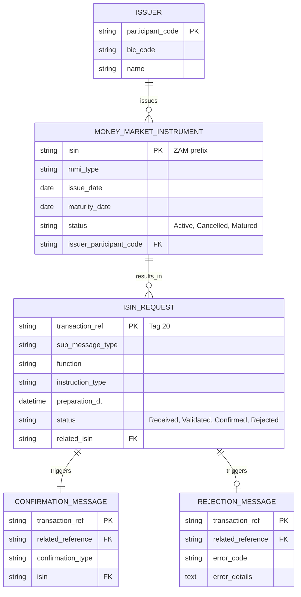

# Software Requirements Specification (SRS)
## Automated ISIN Issuance System for Money Market Instruments (MMIs)

**Document ID:** SRS-ISIN-MMI-001  
**Version:** 1.0  
**Date:** [Date of Generation]  
**Status:** Draft for Review  
**Project Sponsor:** Money Market Forum (MMF)  
**Primary Client:** STRATE (CSD/IOR)  
**System Owner:** JSE Limited (National Numbering Agent)

---

### 1. Introduction

#### 1.1 Purpose
This document defines the functional and non-functional requirements for an automated system to issue, cancel, and deregister International Securities Identification Numbers (ISINs) for Money Market Instruments (MMIs) in South Africa. The system will be operated by the JSE in its capacity as the National Numbering Agent (NNA) and will interface exclusively with STRATE via SWIFT messages to support a dematerialized, same-day (T+0) settlement environment.

#### 1.2 Document Conventions
*   **Shall / Must:** Indicates a mandatory requirement.
*   **Should:** Indicates a recommended, but not mandatory, requirement.
*   **May / Could:** Indicates an optional feature or capability.
*   **MT598:** Refers to the SWIFT message category used for securities transactions.
*   **ISIN:** International Securities Identification Number (ISO 6166).
*   **MMI:** Money Market Instrument.
*   **NNA:** National Numbering Agent.
*   **CSD/IOR:** Central Securities Depository / Instrument Ownership Register (STRATE).

#### 1.3 Project Scope
**In-Scope:**
*   Automated electronic issuance of new ISINs (prefix ZAM) for MMIs based on validated requests from STRATE.
*   Automated processing of ISIN cancellation (de-issue) and maturity deregistration requests from STRATE.
*   Communication via SWIFT MT598 messages using ISO 15022 standards.
*   A monitoring and administration front-end for JSE Clearing & Settlement staff.
*   Robust validation, error handling, and confirmation messaging.
*   Maintenance of reference data (e.g., issuer codes).

**Out-of-Scope:**
*   Direct interfaces with market participants (all communication is via STRATE).
*   Issuance of ISINs for instrument types other than specified MMIs.
*   Handling of "top-up" or "reduction" requests for issued quantities of an instrument.
*   Billing and invoicing modules (though cost data must be supportable).

#### 1.4 References
*   ISO 6166:2021 - Financial services — International securities identification number (ISIN)
*   ISO 15022 - Securities – Scheme for messages (Data Field Dictionary)
*   ANNA (Association of National Numbering Agencies) Service Bureau Standards
*   SWIFT Standards MT598 Message Guide
*   Project Charter: "Balanced Summary: ISIN Issuance for Money Market Instruments"

### 2. Overall Description

#### 2.1 Product Perspective
The system is a new, standalone application within the JSE's technology ecosystem. It will integrate with the JSE's SWIFT infrastructure to send and receive messages and will maintain its own database of issued ISINs, instrument details, and transaction logs. It serves as a critical utility supporting the South African money market's settlement infrastructure.

#### 2.2 User Classes and Characteristics
| User Class | Characteristics | Key Needs |
| :--- | :--- | :--- |
| **STRATE (System)** | Automated external system. | Send valid MT598 requests; receive timely confirmations or rejections. |
| **JSE C&S Admin** | Financial operations staff. | Monitor system activity, perform manual overrides, generate reports. |
| **JSE ASD** | Technical development and support team. | Develop, deploy, maintain, and troubleshoot the system. |

#### 2.3 Operating Environment
*   **Software:** Hosted on JSE-approved servers. Interface with SWIFT Alliance suite.
*   **Hardware:** Standard JSE enterprise server specifications.
*   **Networks:** Secure, high-availability connection to SWIFTNet.
*   **Standards:** Must comply with ISO 15022, ISO 6166, and ANNA guidelines.

#### 2.4 Design and Implementation Constraints
1.  The system **shall** use SWIFT MT598 message types as the sole communication protocol with STRATE.
2.  ISIN generation logic **must** adhere strictly to ISO 6166 and use the assigned South African prefix "ZAM".
3.  The system **shall** be developed to allow for updates to message parsing logic pending final NMPG approval of standards.
4.  A web-based front-end **shall** be provided for administrative functions.

#### 2.5 Assumptions and Dependencies
*   **Assumption:** STRATE will send well-formed MT598 messages.
*   **Assumption:** The NMPG will approve the SWIFT message standards prior to final development.
*   **Dependency:** JSE procurement of the new SWIFT BIC branch code (`XJSEZAJJXISN`).
*   **Dependency:** Signing of a formal SLA between JSE and STRATE.
*   **Dependency:** Target implementation timeline is Q2 2004.

### 3. System Features and Requirements

#### 3.1 Feature 1: Process ISIN Issuance Request (NEWM)
**Description:** The system shall receive, validate, and process a request to issue a new ISIN for an MMI.

**3.1.1 Functional Requirements:**
*   **FR1.1:** The system shall receive an incoming MT598-150 SWIFT message with Function=`NEWM` and Instruction Type=`ISSU`.
*   **FR1.2:** The system shall validate the message for:
    *   **FR1.2.1:** Correct SWIFT format and mandatory tags (e.g., Tag 20: Transaction Reference, Tag 77E: Instrument Details).
    *   **FR1.2.2:** Logical consistency of data (e.g., Maturity Date > Issue Date).
    *   **FR1.2.3:** Validity of reference data (e.g., Issuer Participant Code exists in JSE database).
    *   **FR1.2.4:** Non-duplication of request based on key instrument attributes.
*   **FR1.3:** If validation fails, the system shall generate and send an MT598-901/902 (Rejection) message to STRATE, including the original Transaction Reference and specific error code(s).
*   **FR1.4:** If validation passes, the system shall:
    *   **FR1.4.1:** Generate a unique, compliant ISIN with prefix "ZAM".
    *   **FR1.4.2:** Persist the new MMI record with all attributes and the generated ISIN in the system database.
    *   **FR1.4.3:** Generate and send an MT598-151 (Confirmation) message to STRATE, containing the new ISIN and referencing the original request.

#### 3.2 Feature 2: Process ISIN Cancellation Request (DISS)
**Description:** The system shall receive, validate, and process a request to cancel/de-issue an existing ISIN.

**3.2.1 Functional Requirements:**
*   **FR2.1:** The system shall receive an incoming MT598-150 message with Function=`NEWM` and Instruction Type=`DISS`.
*   **FR2.2:** The system shall validate the request, including:
    *   **FR2.2.1:** The existence and active status of the referenced ISIN.
    *   **FR2.2.2:** Authority to cancel (based on message originator and instrument state).
*   **FR2.3:** Upon successful validation, the system shall update the status of the ISIN to "Cancelled" and send an MT598-151 confirmation to STRATE.
*   **FR2.4:** If validation fails, the system shall send an MT598-901/902 rejection message.

#### 3.3 Feature 3: Process ISIN Maturity Deregistration (MATU)
**Description:** The system shall receive and process an automatic request to deregister an ISIN upon its maturity.

**3.3.1 Functional Requirements:**
*   **FR3.1:** The system shall receive an incoming MT598-150 message with Function=`NEWM` and Instruction Type=`MATU`.
*   **FR3.2:** The system shall validate that the referenced ISIN exists and its maturity date aligns with the request.
*   **FR3.3:** Upon validation, the system shall update the status of the ISIN to "Matured" and send an MT598-151 confirmation to STRATE.

#### 3.4 Feature 4: Administrative Front-End
**Description:** The system shall provide a secure web interface for JSE C&S staff to monitor and manage the ISIN issuance service.

**3.4.1 Functional Requirements:**
*   **FR4.1:** Users shall be able to view a dashboard showing system status and recent activity (requests, confirmations, rejections).
*   **FR4.2:** Users shall be able to search and view details of any ISIN, MMI, or message transaction.
*   **FR4.3:** Users shall be able to **manually create or update an ISIN record** (Business Continuity function), with all validations performed, and the system shall log the action as manual.
*   **FR4.4:** Users shall be able to manage reference data, such as adding or updating Issuer Participant Codes and associated BICs.
*   **FR4.5:** Users shall be able to generate standard reports (e.g., daily issuance volume, rejection summary).

#### 3.5 Feature 5: Handle Confirmation Rejection from STRATE
**Description:** The system shall process a rejection (MT598-901/902) from STRATE in response to a confirmation message (MT598-151).

**3.5.1 Functional Requirements:**
*   **FR5.1:** The system shall receive a rejection message from STRATE linked to a prior confirmation.
*   **FR5.2:** The system shall log the rejection, flag the associated transaction for investigation, and alert JSE C&S staff via the front-end.

### 4. External Interface Requirements

#### 4.1 SWIFT Interface
*   **RI1:** The system **shall** connect to the JSE's SWIFT Alliance Access or equivalent.
*   **RI2:** It **shall** listen for incoming MT598-150 messages from STRATE's BIC.
*   **RI3:** It **shall** send outgoing MT598-151 (Confirmation) and MT598-901/902 (Rejection) messages to STRATE's BIC.
*   **RI4:** All messages **must** conform to the ISO 15022 data field dictionary and the subset agreed upon by the NMPG.

### 5. Non-Functional Requirements

#### 5.1 Performance
*   **NFR1:** The system shall process 95% of ISIN issuance requests within **5 seconds** of message receipt under normal load.
*   **NFR2:** The system shall be designed to handle a sustained peak load of **500 request messages per day** without degradation of performance.

#### 5.2 Availability & Reliability
*   **NFR3:** The system shall achieve **99.5% operational availability** during market hours (06:00 - 18:00 SAST).
*   **NFR4:** A documented Business Continuity Plan (BCP) shall be provided, with manual override functionality (FR4.3) enabling service continuation during system outages.

#### 5.3 Data Integrity and Security
*   **NFR5:** All ISINs generated **must** be unique and compliant with ISO 6166.
*   **NFR6:** The system shall maintain a full, immutable audit log of all transactions (automated and manual), including user ID, timestamp, and action.
*   **NFR7:** Access to the administrative front-end shall be controlled via JSE domain authentication and role-based permissions.

#### 5.4 Maintainability
*   **NFR8:** Reference data tables (e.g., issuer codes, valid MMI types) shall be configurable via the admin front-end without code deployment.
*   **NFR9:** The system shall allow for the configuration of validation rules and error codes.

### 6. Data Model
Core entity relationship diagram:

### 7. Appendices

#### 7.1 Open / Undecided Issues
1.  **NMPG Approval:** Final SWIFT MT598 message content is pending NMPG sign-off. This is a critical path dependency.
2.  **Error Code Standardization:** A definitive list of error codes for MT598-901/902 messages needs to be agreed upon with STRATE.
3.  **SLA Finalization:** The billing methodology and exact monthly running costs are to be finalized in the SLA.
4.  **Issuer Code Management:** The precise process for updating issuer participant codes (initiation, approval, propagation) requires definition.
5.  **Change Requests:** The process for handling future business changes (e.g., reintroduction of "top-up" requests) is not defined.

#### 7.2 Glossary
*   **ANNA:** Association of National Numbering Agencies.
*   **BIC:** Bank Identifier Code (SWIFT address).
*   **Dematerialization:** The process of converting physical securities into electronic book-entry form.
*   **IOR:** Instrument Ownership Register.
*   **NMPG:** National Market Practice Group.
*   **T+0 Settlement:** Settlement of a securities transaction on the same day as the trade.

---
**Document Approval**

| Role | Name | Signature | Date |
| :--- | :--- | :--- | :--- |
| Project Sponsor (MMF) | | | |
| Primary Client (STRATE) | | | |
| System Owner (JSE NNA) | | | |
| Development Lead (JSE ASD) | | | |