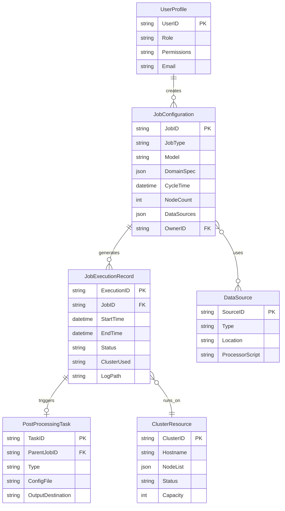

# Software Requirements Specification (SRS)
## Model Manager (MM)
**Version:** 1.0
**Date:** 2023-10-27
**Status:** Draft for Review

---

### **Revision History**

| Version | Date       | Author/Editor          | Description of Change          |
| :------ | :--------- | :--------------------- | :----------------------------- |
| 1.0     | 2023-10-27 | SRS Author             | Initial Draft Creation         |

---

## 1. Introduction

### 1.1 Purpose
This document defines the functional and non-functional requirements for the Model Manager (MM) software system. The MM is intended to automate the configuration, scheduling, execution, monitoring, and control of weather and climate model jobs across one or more high-performance computing (HPC) clusters. This SRS serves as the primary reference for the software development team, project sponsors, and other stakeholders, ensuring a common understanding of the system to be built.

### 1.2 Document Conventions
*   **Bold text** is used for key terms and interface elements.
*   `Monospaced text` is used for code, file paths, database fields, and system commands.
*   Requirements are uniquely identified as **FR** (Functional Requirement) or **NFR** (Non-Functional Requirement) followed by a numeric ID (e.g., FR-001, NFR-002).

### 1.3 Project Scope
The Model Manager will extend and enhance the current manual and script-based model back-end system. It will provide a unified, automated platform for managing operational forecasting jobs (e.g., FDDA), research experiments, and post-processing tasks. The system will feature a web-based Graphical User Interface (GUI) and a Command-Line Interface (CLI) for user interaction. It is designed to operate as a standalone application or integrated with the existing MetVault data management system.

**In-Scope:**
*   Job configuration via guided wizards and "by-hand" custom submission.
*   Multi-cluster job scheduling and resource management.
*   Real-time job monitoring, logging, and control (stop, restart, delete).
*   User and role-based access control.
*   Integration points for data sources (IC/BC, observations) and post-processors.
*   Management of job history, configurations, and output.

**Out-of-Scope:**
*   Development of the scientific models themselves (e.g., WRF, MM5).
*   Development of post-processing or data analysis algorithms.
*   Management of the underlying HPC cluster operating systems or job schedulers (e.g., Slurm, PBS). The MM will interface with these systems.

### 1.4 References
*   Project Charter: "Balanced Summary: Model Manager"
*   MetVault System Documentation
*   GCAT (ClimoFDDA) Tool Specifications

## 2. Overall Description

### 2.1 Product Perspective
The MM is a new component that sits between end-users and the existing HPC ecosystem. It abstracts the complexity of cluster job submission and management, providing a consistent interface regardless of the underlying hardware or scheduler. It will interact with external systems for data (MetVault, external data sources) and may incorporate functionalities from existing tools like GCAT.

### 2.2 User Classes and Characteristics
| User Class | Characteristics | Key Needs |
| :--- | :--- | :--- |
| **NSAP Scientists/Engineers** | Experts in operational meteorology. Responsible for reliable, scheduled model runs. | Automated, reliable scheduling of standard jobs (FDDA). Central monitoring and control. |
| **RAL/External Research Scientists** | Experts needing flexibility. Use custom executables, scripts, and data. | "By-hand" submission with full control. Ability to use personal data sources and processors. |
| **Operators / Less Experienced Users** | May monitor operations or run standard setups. Not necessarily model experts. | Simple, guided interfaces for common tasks. Clear job queue visibility. Ability to stop/restart jobs. |
| **Super Users / Administrators** | Responsible for system health and resource allocation. | Override controls for any job. User and cluster management capabilities. System configuration. |
| **Software Development Team** | Developers and testers at RAL. | Clear, testable requirements. Well-defined APIs and interfaces for extension. |

### 2.3 Operating Environment
*   **Software:** Linux-based operating systems. Must interface with cluster job schedulers (e.g., Slurm, PBS Pro). Web server backend (e.g., Python/Flask/Django, Java/Spring). Modern web browser for GUI.
*   **Hardware:** Must be deployable on a server with network access to all managed HPC clusters and storage systems (including MetVault).
*   **Networks:** Standard LAN/WAN within the research institution's secure network.

### 2.4 Design and Implementation Constraints
1.  Must support integration with the existing **MetVault** system for data storage/retrieval.
2.  Must provide a migration path for functionalities in the existing **GCAT** tool.
3.  Must use the institution's standard user authentication and authorization system (e.g., LDAP/Active Directory).
4.  The CLI must be scriptable to support automated workflows.

### 2.5 Assumptions and Dependencies
*   **Assumption:** Users have valid credentials for the target HPC clusters.
*   **Assumption:** Standard model executables and libraries are pre-installed on the clusters.
*   **Dependency:** Definitions for standard GMOD job configurations and default data sources must be finalized prior to detailed design of the guided wizards.
*   **Dependency:** Specifications for MetVault and GCAT integration APIs must be agreed upon.

## 3. System Features and Requirements

### 3.1 User Authentication and Authorization (FR-010 - FR-019)
**Description:** The system shall control access based on user identity and role.

| ID    | Requirement Description | Priority |
| :---- | :--------------------- | :------- |
| FR-010 | The system shall authenticate users via the institution's central directory service (e.g., LDAP). | High |
| FR-011 | The system shall assign one of the following roles to each authenticated user: `Viewer`, `User`, `Scientist`, `Operator`, `Administrator`. | High |
| FR-012 | A `User` shall be able to submit, monitor, and control their own jobs. | High |
| FR-013 | A `Scientist` shall have all `User` privileges and be able to submit "by-hand" jobs with custom executables. | High |
| FR-014 | An `Operator` shall have all `User` privileges and be able to view the global job queue and control (stop/restart) any job. | High |
| FR-015 | An `Administrator` shall have all privileges, including user role management and system configuration. | High |

### 3.2 Job Configuration and Submission (FR-020 - FR-039)
**Description:** Users shall be able to define and submit model jobs for execution.

| ID    | Requirement Description | Priority |
| :---- | :--------------------- | :------- |
| FR-020 | The system shall provide a **Job Setup Wizard** for configuring standard job types (e.g., Weather FDDA, Climo). | High |
| FR-021 | The wizard shall allow the user to specify at minimum: a unique `JobID`, model type (WRF/MM5), domain specification, cycle time, node count, and primary data sources. | High |
| FR-022 | The system shall provide a **"By-Hand" Submission** interface allowing users to specify a custom job script, executable path, command-line arguments, and resource requirements. | High |
| FR-023 | The system shall allow users to save a job configuration as a template for future use. | Medium |
| FR-024 | The system shall allow users to load, modify, and re-submit a previously saved job configuration or a completed job from history. | High |
| FR-025 | Before submission, the system shall validate the job configuration for completeness and basic logical consistency (e.g., node availability, data source existence). | High |
| FR-026 | Upon submission, the system shall register the job, assign it a status of `SCHEDULED`, and place it in the scheduling queue. | High |

### 3.3 Job Scheduling and Execution (FR-040 - FR-049)
**Description:** The system shall manage the dispatch and execution of jobs on target HPC clusters.

| ID    | Requirement Description | Priority |
| :---- | :--------------------- | :------- |
| FR-040 | The system shall manage a pool of configured HPC clusters (`ClusterID`, hostname, node list, capacity). | High |
| FR-041 | The scheduler shall select an appropriate cluster based on job requirements (e.g., architecture, software availability) and current resource load. | High |
| FR-042 | The system shall interface with the native cluster scheduler (e.g., submit a Slurm batch script) to launch the job. | High |
| FR-043 | Upon successful launch by the cluster, the system shall update the job status to `RUNNING` and record the cluster-specific job ID. | High |
| FR-044 | The system shall support a configurable job prioritization scheme (e.g., based on user role, project, job type). | Medium |

### 3.4 Job Monitoring and Control (FR-050 - FR-069)
**Description:** Users shall be able to view the status of jobs and perform control actions.

| ID    | Requirement Description | Priority |
| :---- | :--------------------- | :------- |
| FR-050 | The system shall provide a **Central Job Queue** display in the GUI and CLI showing all jobs the user is authorized to see. | High |
| FR-051 | The queue shall display columns for: `JobID`, `Owner`, `Status`, `Cluster`, `Nodes`, `Submitted Time`, `Start Time`, `Progress`. | High |
| FR-052 | Job `Status` shall be one of: `DRAFT`, `SCHEDULED`, `QUEUED` (on cluster), `RUNNING`, `COMPLETED`, `FAILED`, `STOPPED`. | High |
| FR-053 | The user shall be able to filter and sort the job queue by any displayed column. | Medium |
| FR-054 | The user shall be able to click on a job in the queue to view **Detailed Job Information**, including full configuration parameters, execution history, and real-time log tail. | High |
| FR-055 | An authorized user (`Owner`, `Operator`, `Admin`) shall be able to **Stop** a `SCHEDULED`, `QUEUED`, or `RUNNING` job. | High |
| FR-056 | An authorized user shall be able to **Restart** a `COMPLETED`, `FAILED`, or `STOPPED` job (re-submitting with the same configuration). | High |
| FR-057 | An authorized user shall be able to **Delete** a job record from the system, removing its configuration and queue entry but not necessarily its output files. | Low |

### 3.5 Output and Post-Processing Management (FR-070 - FR-079)
**Description:** The system shall manage model output and facilitate post-processing tasks.

| ID    | Requirement Description | Priority |
| :---- | :--------------------- | :------- |
| FR-070 | Upon job completion, the system shall record the final status and the path to the primary output directory. | High |
| FR-071 | The user shall be able to configure a job to automatically transfer its output to a specified location or to the **MetVault** system upon successful completion. | High |
| FR-072 | The system shall allow a user to define and attach **Post-Processing Tasks** (e.g., generate plots, run NAPS) to a job, to be run automatically after model completion. | Medium |
| FR-073 | The user shall be able to launch a post-processing task (e.g., plotting) on existing model output files from a completed job, without re-running the model. | Medium |

### 3.6 System Administration (FR-080 - FR-089)
**Description:** Administrators shall be able to configure and maintain the system.

| ID    | Requirement Description | Priority |
| :---- | :--------------------- | :------- |
| FR-080 | Administrators shall be able to register, edit, and disable HPC clusters in the system pool. | High |
| FR-081 | Administrators shall be able to define and manage standard **Data Source** entries (Type, Location, Processor Script). | Medium |
| FR-082 | Administrators shall be able to view system health metrics and audit logs. | Medium |

## 4. External Interface Requirements

### 4.1 User Interfaces
*   **Web GUI:** A modern, responsive web application accessible via standard browsers. It shall include dashboards, forms for job setup, interactive job queue, and detailed job views.
*   **Command-Line Interface (CLI):** A suite of commands (e.g., `mm-submit`, `mm-status`, `mm-stop`) providing full functional parity with the web GUI for scripting and expert use.

### 4.2 Hardware Interfaces
The MM server must have network connectivity to:
*   Login/head nodes of all managed HPC clusters.
*   Storage systems hosting model data and output (including MetVault servers).
*   Institutional authentication servers.

### 4.3 Software Interfaces
*   **Cluster Schedulers:** Interface via SSH and command-line tools (e.g., `sbatch`, `qsub`) or a REST API if available.
*   **MetVault System:** Interface via a defined RESTful API or filesystem protocol for data deposit and retrieval.
*   **Authentication Service:** LDAP/Active Directory protocol for user login and group membership resolution.

### 4.4 Communications Interfaces
Standard HTTPS for web GUI communication. SSH for secure communication with cluster head nodes. Internal service communication via REST APIs or message queues.

## 5. Non-Functional Requirements

| ID    | Category | Requirement Description |
| :---- | :--- | :--------------------- |
| NFR-001 | Performance | The web GUI shall load the job queue view for an average user (50-100 jobs) in less than 3 seconds. |
| NFR-002 | Performance | The system shall be capable of managing at least 500 concurrent jobs across all clusters. |
| NFR-003 | Scalability | The architecture shall allow for the addition of new model types and post-processor plugins without major code refactoring. |
| NFR-004 | Reliability | The core scheduling and monitoring services shall have an availability target of 99.9% to support 24/7 operational runs. |
| NFR-005 | Security | All user credentials shall be transmitted and stored using strong encryption. Job configurations and data shall be accessible only to authorized users. |
| NFR-006 | Usability | A trained `User` shall be able to configure and submit a standard Weather FDDA job using the wizard in under 5 minutes. |
| NFR-007 | Supportability | The system shall log all significant events (job state changes, errors, user actions) for auditing and debugging purposes. |
| NFR-008 | Compliance | The system shall comply with institutional IT security policies. |

## 6. Data Model
The core domain entities and their relationships are derived from the provided data elements.

## 7. Appendices

### 7.1 Glossary
*   **FDDA:** Four-Dimensional Data Assimilation.
*   **IC/BC:** Initial Conditions / Boundary Conditions.
*   **GMOD:** Generic term for standard model configurations.
*   **GCAT:** Existing Climatological FDDA tool.
*   **MetVault:** Existing data management and archival system.
*   **Job:** A single computational task, defined by a configuration, to be executed on a cluster.

### 7.2 Analysis Models
*   **User Stories:** Documented in Section 2.2.
*   **Process Flows:** The "Key Processes" from the input map directly to the system features in Section 3.

### 7.3 To Be Determined (TBD) / Open Issues
1.  The specific default parameters for a standard GMOD (Weather FDDA) job configuration.
2.  The detailed schema for the `DomainSpec` and `DataSource` JSON fields.
3.  The exact list of standard observational data sources and their processor scripts to be pre-configured.
4.  The model-specific physics and dynamics options to expose in the WRF job wizard.
5.  The detailed algorithm for the job prioritization scheme (FR-044).
6.  The complete set of information to display in the "Detailed Job Information" view (FR-054).