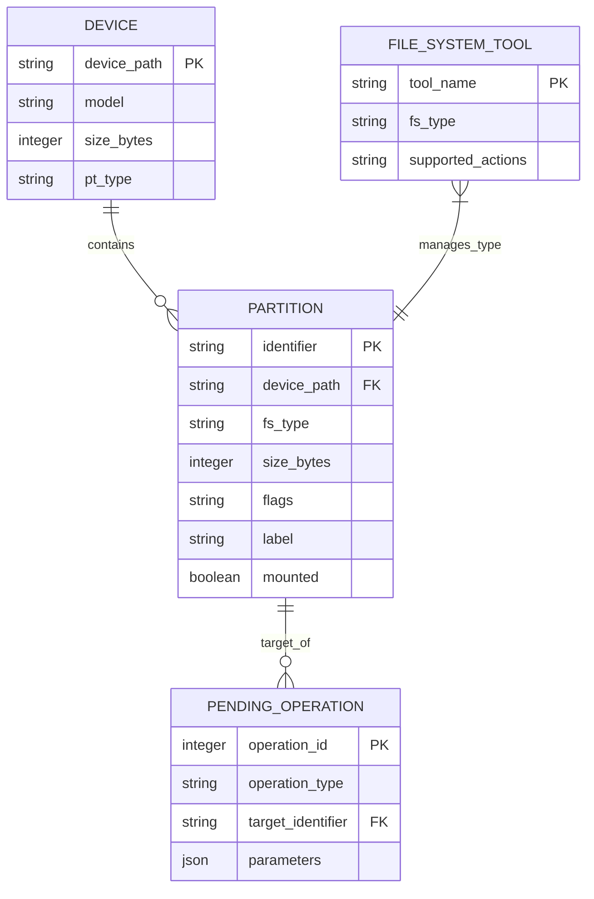

# Software Requirements Specification (SRS)
## For GParted Live 0.6.0-1

**Document Version:** 1.0  
**Date:** [Current Date]  
**Status:** Draft for Review

---

### 1. Introduction

#### 1.1 Purpose
This Software Requirements Specification (SRS) document describes the functional and non-functional requirements for GParted (GNOME Partition Editor) Live version 0.6.0-1. The intended audience includes stakeholders, developers, testers, documentation writers, and project managers involved in the development, testing, and use of the software.

#### 1.2 Document Conventions
*   **Bold text** is used for key terms and section headings.
*   `Monospaced text` is used for code, file paths, and system commands.
*   Requirements are uniquely identified as **FR** (Functional Requirement) or **NFR** (Non-Functional Requirement).

#### 1.3 Project Scope
GParted Live 0.6.0-1 is a self-contained, bootable graphical partition editor. It provides a frontend to the GNU Parted library (`libparted`) and other file system tools for managing disk partitions. The application runs entirely from RAM after booting from removable media (CD/DVD/USB), requiring no installation on a host operating system. Its core functionality includes creating, deleting, resizing, moving, copying, and checking disk partitions across a wide array of file systems.

**In-Scope:**
*   Booting from Live media to a dedicated graphical environment.
*   Graphical management of partition tables (e.g., MSDOS, GPT).
*   Operations on partitions (create, delete, resize/move, copy, format, check, label).
*   Support for file systems as enabled by underlying libraries and tools (e.g., ext2/3/4, NTFS, FAT16/32).
*   A simple, intuitive graphical user interface (GUI).
*   Operation queuing with preview and undo before final application.

**Out-of-Scope:**
*   Management of Logical Volumes (LVM) - noted as a future milestone.
*   Native installation or integration as an application within a host OS (e.g., Windows, macOS).
*   Network-based disk management.
*   RAID configuration management.
*   Data recovery from damaged partitions.

#### 1.4 References
*   GNU Parted Library (`libparted`): http://www.gnu.org/software/parted/
*   GTKmm (Gtk--) GUI Toolkit: https://www.gtkmm.org/
*   GNU General Public License, version 2: https://www.gnu.org/licenses/gpl-2.0.html

### 2. Overall Description

#### 2.1 Product Perspective
GParted Live is a standalone, system-level tool. It operates independently of any host operating system by booting its own minimal Linux environment. It acts as a mediator between the user and low-level disk manipulation libraries (`libparted`) and file system utilities.

#### 2.2 User Classes and Characteristics
| User Class | Characteristics | Key Goals |
| :--- | :--- | :--- |
| **Casual User** | Has basic computer literacy; understands concepts of disks and partitions. Seeks to perform common tasks like resizing or formatting. | Perform disk management tasks safely and successfully without deep technical knowledge. |
| **Developer** | Proficient in C++, GTKmm, and system programming. Familiar with open-source contribution workflows. | Extend features, fix bugs, and understand the codebase and dependencies for effective contribution. |
| **Tester** | Methodical, detail-oriented. Uses beta releases and edge-case scenarios. | Identify, reproduce, and report bugs. Verify functionality against requirements. |
| **Documentation Writer** | Skilled in technical writing. Understands the user base and application functionality. | Produce accurate, clear user guides, help content, and manuals based on system specifications. |

#### 2.3 Operating Environment
*   **Hardware:** x86 or x86-64 based computer system with a CD/DVD drive or USB boot capability. Minimum 256 MB RAM (512 MB recommended).
*   **Boot Media:** The software is distributed as an ISO image to be written to CD/DVD or USB flash drive.
*   **Runtime Environment:** A custom, minimal Linux-based Live system that runs entirely in system RAM.
*   **Critical Dependencies:** `libparted` (>=1.7.1), `gtkmm` (>=2.8.x), Linux kernel.

#### 2.4 Design and Implementation Constraints
1.  The GUI **must** be built using the GTKmm (C++ bindings for GTK+) framework.
2.  All core partition manipulation **must** be performed via the `libparted` library.
3.  The application **must** be distributable as a bootable Live ISO image.
4.  The code **must** be licensed under the GNU GPL version 2 or later.

#### 2.5 User Documentation
User documentation will include:
*   A help menu integrated into the application GUI.
*   A detailed manual included on the Live media and available on the project website.
*   Context-sensitive tooltips for UI elements.

#### 2.6 Assumptions and Dependencies
*   The user has physical access to the machine and can change the boot order in the BIOS/UEFI.
*   The target disk hardware is functional and uses a supported partition table type.
*   The availability and functionality of specific file system operations depend on the presence and version of optional third-party tools (e.g., `e2fsprogs`, `ntfsprogs`).

### 3. System Features and Requirements

#### 3.1 Functional Requirements

**3.1.1 Boot and System Configuration**
*   **FR-001:** The system shall present a boot menu upon starting from the Live media with options including "Default settings," "Safe graphics mode," and "Memory test."
*   **FR-002:** After the initial boot, the system shall allow the user to select a keyboard layout (keymap).
*   **FR-003:** After the initial boot, the system shall allow the user to select a language for the user interface.

**3.1.2 Device and Partition Visualization**
*   **FR-010:** The main application window shall provide a dropdown menu to select a disk device (e.g., `/dev/sda`, `/dev/sdb`).
*   **FR-011:** The application shall display a graphical representation of the selected device's partition layout.
*   **FR-012:** The application shall display a detailed list of partitions for the selected device, showing: Partition, File System, Size, Used, Unused, Flags, and Label.
*   **FR-013:** The application shall retrieve and display disk information: Model, Size, Heads, Sectors, Cylinders, and Partition Table type.

**3.1.3 Partition Operations Management**
*   **FR-020:** The user shall be able to queue the following operations on a selected partition or unallocated space: Create, Delete, Resize/Move, Copy, Paste, Format to, Label, and Check.
*   **FR-021:** For operations requiring parameters (e.g., Resize, Create), the application shall open a dialog allowing the user to configure details (e.g., new size via slider, file system type via dropdown).
*   **FR-022:** The application shall maintain a list of all pending operations before they are applied to the disk.
*   **FR-023:** The user shall be able to clear or undo any operation from the pending list before final application.
*   **FR-024:** Upon user command ("Apply"), the application shall execute all pending operations in the correct order, displaying progress and the output of each underlying command.
*   **FR-025:** The application shall prevent the queueing of logically invalid operations (e.g., moving a partition into another partition).

**3.1.4 File System Support**
*   **FR-030:** The application shall support operations on file systems as permitted by the detected underlying tools. At a minimum, support shall include:
    *   Creation, deletion, resizing (where safe), and checking of `ext2`, `ext3`, `ext4`, `fat16`, `fat32`, and `ntfs` partitions.
    *   Formatting of partitions to the aforementioned file systems.
*   **FR-031:** The application shall gray out or hide menu options for operations not supported for the selected partition's file system.

**3.1.5 System Control**
*   **FR-040:** The user shall be able to exit the GParted Live environment via a desktop menu, with options to "Reboot," "Shutdown," or "Logout" to a command prompt.

#### 3.2 Non-Functional Requirements

**3.2.1 Performance Requirements**
*   **NFR-001 (Performance):** The application shall perform all graphical rendering and operation queuing responsively on a system with a Pentium III or equivalent CPU and 256MB of RAM.

**3.2.2 Safety Requirements**
*   **NFR-002 (Safety):** Before executing any pending operation that modifies disk structures (Apply), the system shall present a clear, modal warning dialog listing the changes and stating the risk of data loss, requiring explicit user confirmation to proceed.
*   **NFR-003 (Safety):** The application shall implement an "Undo" feature for all queued operations prior to application.

**3.2.3 Security Requirements**
*   **NFR-004 (Security):** The GParted Live environment shall run with root (superuser) privileges, as required for direct disk access. This is an inherent characteristic of the Live system model.

**3.2.4 Usability Requirements**
*   **NFR-005 (Usability):** The graphical user interface shall adhere to the GNOME Human Interface Guidelines (HIG) where applicable, maintaining simplicity and intuitiveness for the Casual User persona.
*   **NFR-006 (Usability):** All user-initiated actions shall provide visual feedback (e.g., cursor change, progress bar) within 0.5 seconds.

**3.2.5 Interoperability & Portability Requirements**
*   **NFR-007 (Interoperability):** The LiveCD image shall boot and function correctly on any x86 or x86-64 hardware platform with standard BIOS or UEFI (with CSM enabled) firmware, irrespective of the host OS installed on the disk.

**3.2.6 Legal & Licensing Requirements**
*   **NFR-008 (License):** The software and its core dependencies shall be distributed under open-source licenses, with the main application under the GNU General Public License version 2 or later.

### 4. External Interface Requirements

#### 4.1 User Interfaces
*   **Boot Menu:** Text-based (SYSLINUX/ISOLINUX) menu.
*   **Configuration Screens:** Console-based dialogs for keymap and language selection.
*   **Main Application:** Graphical interface built with GTKmm, consisting of a menu bar, toolbar, device selection dropdown, graphical partition map, partition list, and operation progress window.

#### 4.2 Hardware Interfaces
*   Direct read/write access to storage devices via kernel interfaces (`/dev/sd*`, `/dev/hd*`).
*   Input from standard PS/2 or USB keyboards and mice.

#### 4.3 Software Interfaces
*   **GNU Parted (`libparted`):** Primary library for partition table manipulation and basic file system operations.
*   **File System Tools:** External command-line tools (e.g., `mkfs.ext4`, `ntfsresize`, `dosfsck`) called by the application to perform specific, advanced, or integrity-checking operations.
*   **Linux Kernel:** Provides device access, filesystem drivers, and hardware abstraction.

#### 4.4 Communication Interfaces
*   Not applicable for core functionality. Network access is optional for advanced users via command-line configuration (outside the main application's GUI scope).

### 5. System Data Models

#### 5.1 Logical Data Model
The core application manages the following primary entities:

### 6. Other Non-Functional Requirements

#### 6.1 Project Documentation
Requirements documents, architectural overviews, and contributor guides shall be maintained to facilitate the work of Developers, Testers, and Documentation Writers.

#### 6.2 Quality Attributes
*   **Reliability:** The application must validate all operations against known constraints of `libparted` and the specific file system tools before queuing.
*   **Maintainability:** The codebase shall be modular, separating GUI logic from disk operation logic.

### 7. Appendices

#### Appendix A: Supported Operations Matrix (Example)
The following is a non-exhaustive example of supported operations. Actual support depends on installed tools.

| File System | Create | Delete | Resize/Move | Copy | Format | Check | Label |
| :--- | :---: | :---: | :---: | :---: | :---: | :---: | :---: |
| **ext2 / ext3 / ext4** | Yes | Yes | Yes (Grow/Shrink) | Yes | Yes | Yes | Yes |
| **FAT16 / FAT32** | Yes | Yes | Yes (Grow/Shrink) | Yes | Yes | Yes | Yes |
| **NTFS** | Yes | Yes | Yes (Grow) | Yes | Yes | Yes | Limited |
| **HFS/HFS+** | Yes | Yes | No | Yes | Yes | Yes | No |
| **swap** | Yes | Yes | Yes | Yes | Yes | No | No |

#### Appendix B: Glossary
*   **LiveCD:** A bootable CD/DVD/USB that runs an operating system directly from the media without installation.
*   **Partition:** A logical division on a physical disk drive.
*   **File System:** A method for storing and organizing files on a partition (e.g., NTFS, ext4).
*   **libparted:** The GNU partition editing library.
*   **Unallocated Space:** Disk space not assigned to any partition.

---
*This document is considered a living specification and may be updated to reflect changes in project scope or requirements.*