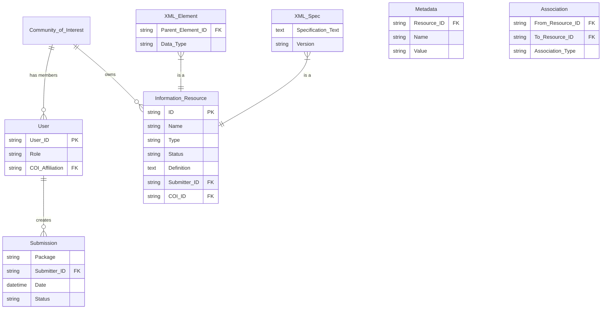

# Software Requirements Specification (SRS)
## XML Services (XS) for the Defense Information Infrastructure Common Operating Environment (DII COE)

**Document Version:** 1.0
**Date:** [Date of Generation]
**Prepared for:** Defense Information Systems Agency (DISA)
**Prepared by:** DII COE AOG Data Access Services Technical Working Group (DATATWG) / SSD-MD Sub-panel
**Status:** Draft for Review

---

## 1. Introduction

### 1.1 Purpose
This Software Requirements Specification (SRS) document defines the functional and non-functional requirements for the XML Services (XS) functional area within the DII Common Operating Environment (COE). The primary audience includes system architects, designers, developers, testers, and project managers responsible for the implementation, integration, and qualification of the XS components.

### 1.2 Scope
The XS provides core infrastructure services to enable mission and support applications to leverage XML technology for data interchange and interoperability. The scope encompasses:
*   **Registry Services:** Centralized registration, lifecycle management, and discovery of XML information resources (tags, schemas, DTDs).
*   **Design Services:** Tools and services to assist in the creation of XML schemas using registered components.
*   **Document Generation & Consumption Services:** Runtime services to produce and parse well-formed, valid XML documents.
*   **Data Management Abstraction:** Isolation of vendor-unique implementations and provision of transparent access to distributed databases.

**Out of Scope:**
*   Specification of personnel roles, staffing levels, or training requirements for embedding systems.
*   Definition of end-user application functionality.
*   Hardware procurement or network infrastructure design.

### 1.3 Definitions, Acronyms, and Abbreviations
| Term | Definition |
| :--- | :--- |
| **COE** | Common Operating Environment |
| **COI** | Community of Interest |
| **DII** | Defense Information Infrastructure |
| **DISA** | Defense Information Systems Agency |
| **DATATWG** | Data Access Services Technical Working Group |
| **DTD** | Document Type Definition |
| **POC** | Point of Contact |
| **SLA** | Service Level Agreement |
| **XS** | XML Services |
| **XML** | eXtensible Markup Language |

### 1.4 References
*   DII COE Integration and Runtime Specification (I&RTS)
*   FIPS PUB 127-2, Database Language SQL
*   World Wide Web Consortium (W3C) XML 1.0 Specification
*   *[Other relevant DoD standards and COE documents]*

### 1.5 Document Overview
This document is structured as follows: Section 2 provides a general description of the product. Section 3 details the specific requirements. Subsequent sections cover interfaces, constraints, and appendices.

## 2. Overall Description

### 2.1 Product Perspective
The XS is a middleware component of the DII COE. It interacts with other COE services (e.g., Management Services, Distributed System Services) and provides foundational XML capabilities to higher-layer mission applications. It abstracts underlying Commercial-Off-The-Shelf (COTS) RDBMS and legacy data systems.

### 2.2 Stakeholders and User Characteristics
| Stakeholder Role | Primary Interest / Responsibility |
| :--- | :--- |
| **DATATWG / SSD-MD Sub-panel** | Authors and owners of this SRS. |
| **DISA** | Sponsoring agency and ultimate recipient of the qualified COE components. |
| **COE Chief Engineer** | Approves COI POCs; mediates unresolved semantic/tag disputes. |
| **COE Data Engineering Team** | Analyzes registry submissions for consolidation/standardization opportunities. |
| **COI Point of Contact (POC)** | Manages the information resource lifecycle within their assigned domain. |
| **Application Developer (Producer)** | Submits new XML tags and schemas to the registry. |
| **Application Developer (Consumer)** | Discovers and reuses registered XML resources. |
| **System/Data/Database Manager** | Performs administrative tasks (user management, performance tuning, model oversight). |
| **DISA Configuration Manager (CM)** | Distributes the finalized XS product to system developers. |

### 2.3 Operating Environment
The XS shall operate in two primary environments:
1.  **Fixed/Static Facility:** Characterized by robust, high-bandwidth network connectivity.
2.  **Deployed/Dynamic Facility:** Characterized by potentially degraded, low-bandwidth, or intermittent communications.

The software shall be portable and executable on all hardware and operating system platforms certified as COE-compliant.

### 2.4 Design and Implementation Constraints
1.  **COE Compliance:** Must adhere to all interfaces, protocols, and compliance levels specified in the COE I&RTS.
2.  **Database Independence:** Must support ANSI standard SQL (FIPS PUB 127-2) and be compatible with Oracle, Sybase, and Informix RDBMS via transparent internal interfaces.
3.  **Legacy System Integration:** Must provide location-transparent access to legacy data systems via interfaces like DBIF and DAC.
4.  **Security:** Must enforce DoD security standards for access control and data integrity.

### 2.5 Assumptions and Dependencies
*   The COE Management and Distributed System Services will be available and provide stable APIs.
*   Communities of Interest (COIs) will appoint responsible POCs to manage their domains within the registry.
*   A "market forces" model, supported by the COE Data Engineering Team, will be used to identify candidate tags for standardization.

## 3. Specific Requirements

### 3.1 Functional Requirements

#### 3.1.1 Registry Services

**REQ-RS-01: Information Resource Submission**
The system shall allow authorized users (Producers) to submit a packaged Information Resource (e.g., XML tag, DTD) for registration.
*   **Input:** Information Resource Submittal Package (see Appendix A for format).
*   **Process:** Accept submission via online web form or batch method (email/FTP). Parse package and populate a staging area for review.
*   **Output:** Automated acknowledgment of receipt. Submission record in "Pending Review" status.

**REQ-RS-02: Submission Review & Approval Workflow**
The system shall support a review process for submitted resources.
*   The assigned COI POC or Manager shall be notified of pending submissions.
*   The reviewer shall be able to compare the submission against existing registry content and defined standards.
*   The reviewer shall be able to **Approve** (promoting resource to "Approved" status) or **Reject** the submission, providing a reason for rejection.
*   The original submitter shall be notified of the review outcome.

**REQ-RS-03: Resource Discovery & Query**
The system shall provide search capabilities for authorized users (Consumers) to discover registered Information Resources.
*   Searchable criteria shall include, but not be limited to: Resource Name, Author/Submitter, Substring within name or definition, Resource Type, Status.
*   Search results shall display core metadata and allow navigation to view detailed information, including relationships (e.g., hierarchy, versions, associated schemas).
*   Users shall be able to download approved artifact files (e.g., DTDs).

**REQ-RS-04: Lifecycle & Version Management**
The system shall manage the lifecycle state of each Information Resource.
*   Supported states shall include: Developmental, Candidate, Approved, Retired.
*   The system shall track version history, allowing relationships (e.g., `version_of`) to be established between different versions of a resource.

#### 3.1.2 Design Services

**REQ-DS-01: Schema Design Assistance**
The system shall provide services to assist developers in creating XML schemas/DTDs.
*   Services shall allow the import and reference of existing, registered `XML_Element` and `XML_Spec` resources.
*   Services shall include syntax checking and validation against baseline XML standards.

#### 3.1.3 Document Generation & Consumption Services

**REQ-DC-01: XML Document Generation**
The system shall provide services to generate XML documents.
*   The service shall assemble a document based on a schema and data input.
*   It shall check the generated document for well-formedness and validate it against its referenced schema.
*   The service shall be capable of rendering the document with sufficient metadata to support alternate views or transmission.

**REQ-DC-02: XML Document Consumption**
The system shall provide parsing services to consume incoming XML documents.
*   Parsers shall support both DOM and SAX interfaces.
*   The service shall validate incoming documents against a specified schema.
*   Upon successful validation, the service shall extract semantically valid data views or disassemble the document into a relational representation for storage.

#### 3.1.4 System Management & Operations

**REQ-SM-01: Dynamic Operational Adjustment**
The system shall allow authorized System Managers to adjust operational parameters in response to environmental conditions.
*   During degraded communications, a manager shall be able to dynamically redefine session time-out values for specific data management services.
*   New parameter values shall be applied to subsequent user sessions without requiring a system restart.

**REQ-SM-02: Administrative Management**
The system shall provide interfaces for administrative tasks:
*   Create, modify, and delete user accounts and assign roles/COI affiliations.
*   Define and manage naming conventions and metadata standards.
*   Monitor and audit changes to the data models within the registry.

### 3.2 Non-Functional Requirements

#### 3.2.1 Performance
*   **PERF-01:** Session time-out values for data management services shall be user-definable and dynamically adjustable within a configured range.
*   **PERF-02:** Query response times for registry searches shall meet operational needs as defined by performance thresholds (TBD by Performance Engineering Team).

#### 3.2.2 Reliability & Portability
*   **RELY-01:** The XS software shall be portable and execute without modification on all COE-compliant hardware and operating system platforms.
*   **RELY-02:** Services shall be designed to operate effectively in both fixed-facility and deployed environments.

#### 3.2.3 Security
*   **SEC-01:** The system shall enforce role-based access control (RBAC) for all registry operations (submit, review, query, administer).
*   **SEC-02:** All naming conventions for registered XML tags shall be checked to prevent conflict with established DoD data standards.

#### 3.2.4 Compliance & Qualifiability
*   **COMP-01:** All XS components shall adhere to the compliance level requirements specified in the COE I&RTS.
*   **COMP-02:** Each requirement shall be verifiable via one or more qualification methods: Test, Demonstration, Analysis, or Inspection.

#### 3.2.5 Observability
*   **OBSV-01:** The system shall provide tools and logs that allow managers to monitor and report on changes to the data models stored within the Registry.

### 3.3 External Interface Requirements

#### 3.3.1 User Interfaces
*   **Web-based Portal:** For interactive submission, search, review, and administration. (Details TBD by Implementation Team).
*   **Email/FTP Batch Interface:** For programmatic submission of resource packages. (Addresses and protocols TBD by Implementation Team).

#### 3.3.2 Software Interfaces
*   **Registry Query API (Inbound):** A standard API for applications to query the registry. Specification detailed in Appendix B (TBD by Design Team).
*   **COE Management Services API (Outbound):** For user management, configuration, and monitoring. Must comply with COE standards (Appendix C TBD).
*   **COE Distributed System Services API (Outbound):** For reliable messaging and notifications. Must comply with COE standards (Appendix C TBD).
*   **Database Interface (Outbound):** Transparent internal interface supporting ANSI SQL for Oracle, Sybase, Informix.
*   **Legacy System Interface (Outbound):** Transparent internal interface for DBIF, DAC, etc.

### 3.4 Domain Model & Data Requirements
The system shall persist data according to the following core entities and their relationships:

## 4. System Features (Use Cases)

### UC-01: Submit New XML Tag for Registration
**Actor:** Application Developer (Producer)
**Precondition:** User is authenticated and authorized to submit resources.
**Main Flow:**
1.  Developer downloads the submission package template.
2.  Developer populates metadata forms and attaches artifacts (DTD, sample document).
3.  Developer submits the completed package via the online portal.
4.  System validates package structure and places it in a staging area with status "Pending Review."
5.  The responsible COI POC is notified.
6.  **Postcondition:** Submission is awaiting review.

### UC-02: Discover and Reuse an Existing Tag
**Actor:** Application Developer (Consumer)
**Precondition:** User is authenticated.
**Main Flow:**
1.  Developer navigates to the registry search interface.
2.  Developer enters search criteria (e.g., substring "country code").
3.  System returns a list of matching `XML_Element` resources.
4.  Developer selects a resource to view details: definition, version history, associated DTD.
5.  Developer downloads the approved DTD artifact.
6.  **Postcondition:** Developer has obtained a reusable XML component.

### UC-03: Review and Approve a Submission
**Actor:** COI POC
**Precondition:** A submission is in "Pending Review" status for the POC's COI.
**Main Flow:**
1.  POC accesses the review queue.
2.  POC examines the submission package, checking for conflicts and completeness.
3.  POC approves the submission.
4.  System updates the resource status to "Approved," promotes metadata to the live registry, and makes artifacts downloadable.
5.  System notifies the original submitter of approval.
6.  **Postcondition:** New resource is available in the public registry.

## 5. Acceptance Criteria
*   **Tag Discovery:** Given a Consumer searches for "country codes," the system shall return the `CTRY_CD` XML_Element with its definition and a link to its DTD.
*   **Schema Validation:** Given an XML document is generated, the Generate service shall report an error if the document is not well-formed or is invalid against its schema.
*   **Submission Workflow:** Given a Producer submits a tag and the COI POC approves it, the tag's status shall be "Approved" and it shall appear in search results for all users.

## 6. Project Management Information

### 6.1 Milestones and Release Strategy
1.  Finalize and Approve SRS.
2.  Complete Detailed Design (including Appendices B & C).
3.  Develop and Integrate XS Components with COE services.
4.  Qualify Software via Formal Testing against this SRS.
5.  DISA CM Distributes Qualified Product.
6.  Deployment and Operational Use.

### 6.2 Risk Management
| ID | Risk | Mitigation Strategy |
| :--- | :--- | :--- |
| R01 | Proliferation of inconsistent XML tags. | Centralized registry with mandatory review workflow and discovery tools to encourage reuse. |
| R02 | Undefined detailed interface specs. | Specify APIs in the subsequent detailed design phase. |
| R03 | Operation in degraded environments. | Design for dynamic adjustment of session parameters (e.g., time-outs). |
| R04 | Semantic ambiguity of registered terms. | Require detailed definitions/synonyms in submissions; establish clarity rules. |
| R05 | Integration with multiple COTS RDBMS. | Use transparent internal interfaces to isolate vendor-unique code. |
| R06 | Lifecycle and versioning complexity. | Define clear statuses and versioning relationships in the data model. |
| R07 | Disputes over tag approval within a COI. | Define escalation path to the COE Chief Engineer for mediation. |
| R08 | Variable performance in different environments. | Design services to be tunable in fixed facilities and pre-configured for deployment. |

### 6.3 Open Issues and TBDs
1.  **Appendix B:** Specification of External Programming Interfaces. *Responsible: DATATWG/Design Team.*
2.  **Appendix C:** Specification of Internal COE Interfaces. *Responsible: DATATWG/Design Team (with other COE teams).*
3.  **Performance Thresholds:** Specific metrics for query response and tuning. *Responsible: DATATWG/Performance Engineering Team.*
4.  **Requirement Mapping:** Finalized precedence/criticality codes. *Responsible: DATATWG.*
5.  **Consolidation Procedures:** Tools/processes for the "market forces" model. *Responsible: COE Data Engineering Team.*
6.  **Submission Portal Details:** Specific email/FTP addresses and web portal specs. *Responsible: DISA/Registry Implementation Team.*
7.  **Federation Protocols:** Agreements for inter-registry requests. *Responsible: DATATWG/COE Chief Engineer.*
8.  **Federation Rules of Engagement:** Explicit rules for federated catalogs. *Responsible: DATATWG/COE Chief Engineer.*

---
## Appendices

### Appendix A: Information Resource Submittal Package Format
*(To be detailed by the Design Team. Will define the XML schema or file structure for the submission package, including required and optional metadata fields, artifact naming conventions, and compression format.)*

### Appendix B: External Programming Interface Specification
*(To be detailed by the Design Team. Will define the Registry Query API, including function calls, parameters, data structures, and return formats.)*

### Appendix C: Internal COE Interface Specifications
*(To be detailed by the Design Team in coordination with other COE service teams. Will define the APIs for integration with COE Management and Distributed System Services.)*