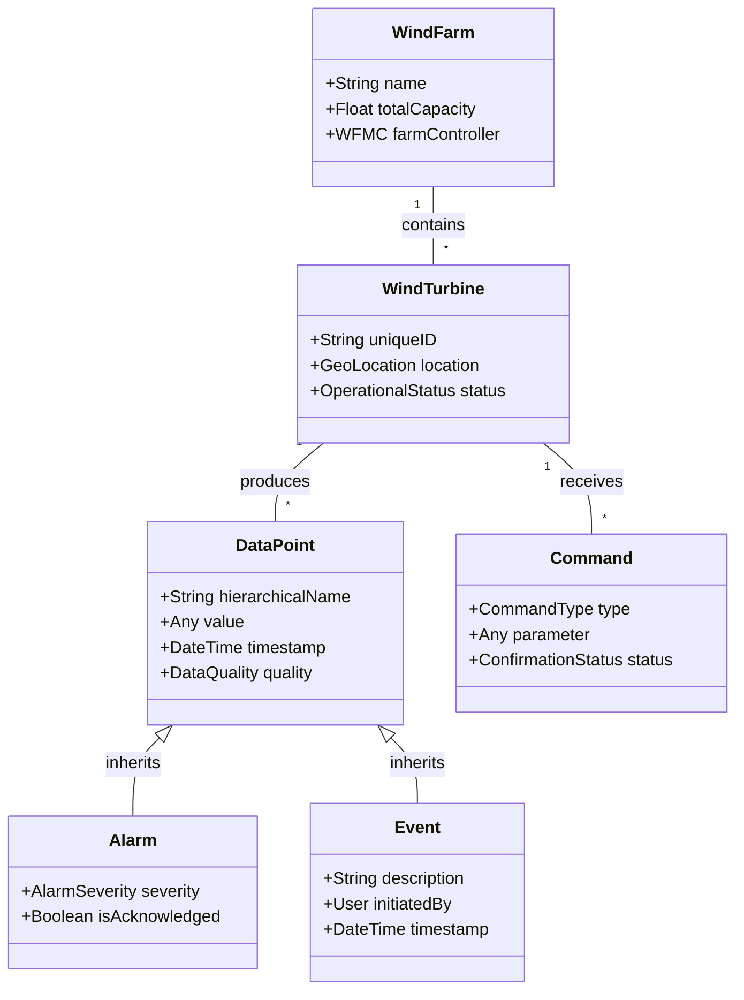

# Software Requirements Specification (SRS)
## Standardized Communication System for Wind Turbine Applications

**Document Version:** 1.0  
**Date:** 2023-10-27  
**Status:** Draft for Review  
**Classification:** Confidential

---

### 1. Introduction

#### 1.1 Purpose
This Software Requirements Specification (SRS) document defines the functional and non-functional requirements for a standardized communication system between wind turbine control systems and remote Supervisory Control and Data Acquisition (SCADA) systems. The primary purpose is to establish a vendor-neutral, interoperable specification to address the current industry fragmentation caused by proprietary solutions.

#### 1.2 Scope
The scope of this specification encompasses the data transfer and handling mechanisms for both individual wind turbines and aggregated wind farms. This includes operational functions such as remote supervision, control, alarm management, and historical data retrieval.

**In-Scope:**
*   Standardized communication protocols between Wind Turbine Controllers (WTC) and SCADA systems.
*   Data models for operational data, alarms, events, and commands.
*   Security and authentication mechanisms.
*   Redundancy and failover procedures.
*   Integration with Wind Farm Main Controllers (WFMC).
*   Gateway specifications for legacy system integration.

**Out of Scope (Non-Goals):**
*   Internal SCADA system characteristics or architecture.
*   Human-Machine Interface (HMI) design and layout.
*   Specific wind turbine control algorithms or logic.
*   Voice or video communication capabilities.
*   Local, temporary data hook-ups (e.g., for maintenance laptops).

#### 1.3 Definitions, Acronyms, and Abbreviations
*   **SCADA**: Supervisory Control and Data Acquisition
*   **WTC**: Wind Turbine Controller
*   **WFMC**: Wind Farm Main Controller
*   **HMI**: Human-Machine Interface
*   **O&M**: Operations and Maintenance
*   **IEC**: International Electrotechnical Commission
*   **SLA**: Service Level Agreement
*   **PCC**: Point of Common Coupling

#### 1.4 References
*   IEC 61400-25 Series: Communications for monitoring and control of wind power plants.
*   IEC 60870-5: Telecontrol equipment and systems.
*   IEC 61850: Communication networks and systems for power utility automation.

### 2. Overall Description

#### 2.1 Product Perspective
This system acts as a middleware layer, enabling seamless communication between heterogeneous wind turbine controllers and SCADA systems. It interfaces with the turbine's internal control system, the WFMC for farm-level coordination, and potentially gateways for legacy equipment.

#### 2.2 User Classes and Characteristics
| Stakeholder | Primary Role | Key Needs |
| :--- | :--- | :--- |
| **Electrical System Operator (Transmission)** | Manages grid stability. | Real-time power quality data, ability to receive curtailment commands. |
| **Electrical Network Operator (Distribution)** | Oversees PCC compliance. | Connection status, power output, fault data. |
| **Wind Turbine Operator (O&M)** | Daily remote supervision & maintenance. | Operational data, alarm handling, remote control (start/stop), historical logs. |
| **Owner** | Financial & asset oversight. | Production reports, performance metrics, availability statistics. |
| **External Parties (Vendors/Third Parties)** | Support, analytics, regulatory. | Secure, limited access to specific data subsets (e.g., condition monitoring). |

#### 2.3 Operating Environment
*   **Physical:** Harsh environments (offshore/onshore wind farms) with wide temperature ranges, vibration, humidity, and potential EMI.
*   **Software:** Must integrate with existing turbine control software and commercial/industrial SCADA platforms.
*   **Network:** Operate over varied links (fiber, microwave, cellular, satellite) with potential latency and bandwidth constraints.

#### 2.4 Design and Implementation Constraints
1.  Must adhere to relevant IEC standards (e.g., 61400-25, 61850).
2.  Must support open, non-proprietary communication protocols.
3.  Must enable secure communication, capable of supporting encryption.
4.  Must be capable of operating on hardware with limited computational resources (at the turbine).

#### 2.5 Assumptions and Dependencies
*   A reliable network infrastructure between the turbine and the SCADA server exists, albeit with provisions for redundancy.
*   Wind turbine controllers provide necessary data points and can accept commands via a defined interface.
*   Successful standardization is dependent on broad vendor adoption and support.

### 3. System Features and Requirements

#### 3.1 Functional Requirements

**FR-1: Connection Management**
*   **FR-1.1:** The system shall initiate a secure connection from the SCADA server to the Wind Turbine Controller.
*   **FR-1.2:** The system shall perform mutual authentication between client and server upon connection establishment.
*   **FR-1.3:** The system shall support keep-alive mechanisms to monitor connection status.
*   **FR-1.4:** The system shall gracefully handle connection drops and support automatic reconnection.

**FR-2: Data Acquisition & Monitoring**
*   **FR-2.1:** The SCADA system shall be able to subscribe to specific data points (analog measurements, binary statuses) from the turbine.
*   **FR-2.2:** The turbine shall transmit subscribed data periodically, as configured (e.g., every 1-10 seconds).
*   **FR-2.3:** All transmitted data shall be time-stamped with a source timestamp having an accuracy of ≤10ms.
*   **FR-2.4:** All data points shall include a data quality indicator (e.g., good, bad, uncertain, old).

**FR-3: Event-Driven Alarm Handling**
*   **FR-3.1:** Upon detection of a predefined abnormal condition, the turbine shall spontaneously (unsolicited) transmit an alarm message to the SCADA system.
*   **FR-3.2:** Alarm messages shall include severity level (e.g., Critical, Major, Minor, Warning), description, timestamp, and a unique identifier.
*   **FR-3.3:** The system shall support operator acknowledgment of alarms at the SCADA level, with the acknowledgment status reflected at the turbine.

**FR-4: Remote Control**
*   **FR-4.1:** Authorized operators shall be able to issue control commands (e.g., Start, Stop, Emergency Stop, Setpoint adjustment) to a turbine.
*   **FR-4.2:** The system shall implement a select-before-operate (SBO) or similar safety handshake for critical commands.
*   **FR-4.3:** The turbine shall execute a valid command and return a confirmation message (success/failure) to the SCADA system.

**FR-5: Historical Data Retrieval**
*   **FR-5.1:** The turbine shall buffer historical data (e.g., fault logs, sequence of events, minute-average data) in local non-volatile storage.
*   **FR-5.2:** The SCADA system shall be able to request historical data for a specified time range and data type.
*   **FR-5.3:** The turbine shall transmit requested historical data on-demand without disrupting real-time data flows.

**FR-6: System Configuration & Management**
*   **FR-6.1:** The system shall support remote configuration of data reporting rates and alarm setpoints.
*   **FR-6.2:** The system shall support secure remote software/firmware updates.
*   **FR-6.3:** The system shall maintain and transmit a log of all significant events (commands issued, configuration changes, system errors).

**FR-7: Time Synchronization**
*   **FR-7.1:** The system shall support network-based time synchronization (e.g., NTP, PTP) to align clocks between SCADA, WFMC, and all turbines.

**FR-8: Security & Access Control**
*   **FR-8.1:** All access attempts shall require authentication.
*   **FR-8.2:** The system shall enforce role-based access control (RBAC), defining permissions for different user classes (e.g., Operator, Engineer, Viewer).
*   **FR-8.3:** The system shall log all authentication attempts (success and failure).

**FR-9: Redundancy & Resilience**
*   **FR-9.1:** The system shall support redundant communication channels (primary and backup).
*   **FR-9.2:** In case of primary channel failure, the system shall automatically failover to the backup channel with minimal disruption.
*   **FR-9.3:** The turbine shall continue to buffer data locally during a total communication loss for later transmission upon recovery.

#### 3.2 Domain Model (UML Class Diagram Key Elements)

### 4. External Interface Requirements

#### 4.1 Hardware Interfaces
*   The WTC interface shall support standard industrial communication ports (e.g., Ethernet RJ45, serial RS-485/232).
*   Network equipment (switches, routers) must meet environmental specifications for wind farm deployment.

#### 4.2 Software Interfaces
1.  **SCADA-WTC Interface:** Bidirectional. Standardized protocol (TBD - e.g., IEC 61400-25 MMS, OPC UA) for data polling, unsolicited reports, and command transmission.
2.  **WFMC-Turbine Interface:** Bidirectional. For farm-level coordination and aggregation. May use a subset of the SCADA protocol or an optimized internal protocol.
3.  **Legacy Gateway Interface:** Bidirectional. Protocol translation service converting proprietary turbine protocols to the new standardized protocol.
4.  **External API:** Outbound. Secure RESTful API or data feed (e.g., MQTT with TLS) providing authorized third parties with access to filtered operational or historical data.

#### 4.3 Communication Interfaces
*   **Protocol:** Shall be based on an open, TCP/IP-based standard.
*   **Security:** TLS/SSL for encryption. Certificate-based or strong password authentication.
*   **SLA:**
    *   Time-critical functions (Alarms, Commands): End-to-end transfer time ≤ 0.5 seconds.
    *   Periodic monitoring data: Update cycle ≤ 1 second.
    *   System availability: > 99% per communication link.

### 5. Non-Functional Requirements

#### 5.1 Performance Requirements
*   Alarm transmission latency from detection to SCADA receipt: ≤ 500 ms.
*   Command confirmation latency: ≤ 500 ms.
*   Response time for system management functions (e.g., historical query): ≤ 2 seconds.
*   System shall support a minimum of 10,000 data points per turbine.

#### 5.2 Reliability & Availability
*   The communication system shall achieve 99% availability per annum.
*   Local data buffering shall retain at least 7 days of high-resolution data during network outages.
*   Mean Time Between Failures (MTBF) for critical components > 100,000 hours.

#### 5.3 Security Requirements
*   All external communication shall support encryption for data confidentiality.
*   Data integrity shall be ensured via message hashing or digital signatures.
*   Systems shall be hardened against common cyber-attacks (e.g., denial-of-service, replay attacks).

#### 5.4 Compliance
*   The system shall be designed for compliance with the IEC 61400-25 series of standards.
*   Shall support interoperability testing per IEC 61400-25-4.

#### 5.5 Maintainability & Observability
*   All system components shall provide detailed health and diagnostic logs.
*   Firmware shall be remotely updatable in a staged and rollback-capable manner.

### 6. Acceptance Criteria
**Verified via Factory Acceptance Test (FAT) and Site Acceptance Test (SAT).**

| Test ID | Capability | Gherkin-style Acceptance Test |
| :--- | :--- | :--- |
| **AC-01** | Real-time Monitoring | **Given** a connected SCADA system, **when** it subscribes to analog measurements, **then** values with timestamps and quality indicators are received within 1 second. |
| **AC-02** | Alarm Transmission | **Given** an active alarm condition at the turbine, **when** it is detected, **then** an alarm message is spontaneously transmitted to SCADA within 0.5 seconds. |
| **AC-03** | Remote Control | **Given** an authorized operator, **when** issuing a "Start" command with correct handshake, **then** the turbine executes the command and returns a positive confirmation. |
| **AC-04** | Historical Access | **Given** a network interruption of 1 hour, **when** connectivity is restored, **then** buffered data from the outage period is successfully transmitted to SCADA upon request. |
| **AC-05** | Security | **Given** an invalid user credential, **when** a connection attempt is made, **then** the system rejects the connection and logs the failed attempt. |

### 7. Appendices

#### 7.1 Milestones and Release Strategy
1.  **M1:** Finalize SRS (This Document) - Q1 2024
2.  **M2:** Protocol Selection & Validation - Q2 2024
3.  **M3:** Prototype Development - Q3 2024
4.  **M4:** Field Tests (Sweden & Denmark) - Q4 2024
5.  **M5:** Submission to IEC TC88 - Q1 2025
6.  **M6:** Pilot Farm Rollout - Q2 2025

#### 7.2 Risk Register
| Risk | Probability | Impact | Mitigation Strategy |
| :--- | :--- | :--- | :--- |
| Proprietary Vendor Resistance | Medium | High | Early engagement; demonstrate TCO benefits of standardization. |
| Legacy Integration Complexity | High | Medium | Develop robust, configurable protocol gateways. |
| Network Reliability | Medium | High | Design for redundant channels and local buffering. |
| Security Vulnerabilities | Medium | High | Implement defense-in-depth; mandate regular security audits. |
| Standardization Delays | Low | High | Conduct parallel field trials; seek interim industry alignment. |

#### 7.3 Open Issues and TBDs
| Issue | Description | Responsible Party |
| :--- | :--- | :--- |
| **PROT-001** | Final recommendation for core communication protocol (OPC UA vs. MMS). | Technical Working Group |
| **SEC-001** | Specification of mandatory vs. optional encryption ciphers and key lengths. | Security Team |
| **DATA-001** | Standardized data model for condition monitoring (vibration, oil analysis) signals. | Condition Monitoring Consortium |
| **BUS-001** | Commercial model for third-party data access. | Wind Farm Owner Committee |
| **INF-001** | Detailed redundancy requirements (e.g., diverse physical paths). | Design Engineering |