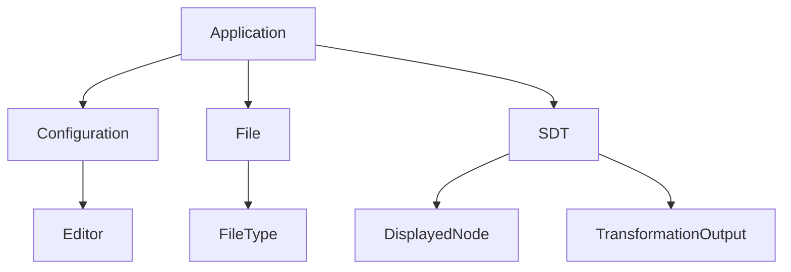

# Software Requirements Specification (SRS)
## HATS Graphical User Interface (HATS-GUI)

**Document Version:** 1.0
**Date:** [Date of Generation]
**Status:** Draft for Review

---

### 1. Introduction

#### 1.1 Purpose
This document defines the functional and non-functional requirements for the High Assurance Transformation System Graphical User Interface (HATS-GUI). It serves as a contract between the stakeholders and the development team, providing a complete description of the system's intended capabilities, behavior, and constraints.

#### 1.2 Scope
The HATS-GUI is a platform-independent desktop application that provides a user interface for the High Assurance Transformation System (HATS). Its primary purpose is to facilitate transformation-based software development by enabling users to manage applications, orchestrate the parsing and execution of transformation programs via the HATS-SML backend, and visualize the resulting Syntax Derivation Trees (SDTs) and pretty-printed text outputs.

**In-Scope:**
*   Application lifecycle management (create, open, save, close).
*   File management within an application.
*   Orchestration of HATS-SML programs (parsing, transformation, pretty-printing).
*   Visualization and interactive navigation of SDTs.
*   Display and search of pretty-printed text outputs.
*   Synchronization between SDT views and text views.
*   User configuration of editors, display properties, and file associations.
*   Cross-platform operation (Windows 2000, Solaris 8, Linux).

**Out-of-Scope (Non-Goals):**
*   Implementation of transformation logic (handled by HATS-SML).
*   Support for multiple concurrent users or collaboration features.
*   Provision of an extensive help system or tutorial content.
*   Direct editing of transformation grammars or semantic logic.

#### 1.3 Definitions, Acronyms, and Abbreviations
*   **HATS:** High Assurance Transformation System.
*   **HATS-GUI:** The graphical user interface component of HATS.
*   **HATS-SML:** The Standard ML backend service programs providing core transformation functionality.
*   **SDT:** Syntax Derivation Tree. The structured output of parsing and transformation operations.
*   **TLP:** Transformation Language Program.
*   **OS:** Operating System.

#### 1.4 References
*   [Reference to HATS System Overview Document]
*   [Reference to HATS-SML Interface Specification]

#### 1.5 Overview
The remainder of this document is structured as follows: Section 2 provides a general description of the product. Section 3 details specific functional requirements. Section 4 outlines non-functional requirements, including performance and compliance. Subsequent sections cover interfaces, acceptance criteria, and project considerations.

---

### 2. Overall Description

#### 2.1 Product Perspective
The HATS-GUI is a standalone, mediator-style application that sits between the User and the HATS-SML backend. It relies on the Host OS for file and process management.

**System Context Diagram:**
```
+---------+     UI Commands     +----------+     CLI Invocation     +-----------+
|         | ------------------> |          | ---------------------> |           |
|  User   |                     | HATS-GUI |                       | HATS-SML  |
|         | <------------------ |          | <--------------------- |           |
+---------+    Display Output   +----------+    StdOut/StdErr      +-----------+
                         |               |
                         |               | File Operations
                         |               v
                         |        +--------------+
                         +------> |  Host OS     |
                                  | File System  |
                                  +--------------+
```

#### 2.2 User Classes and Characteristics
*   **Primary User (Domain Expert):** A software developer or researcher with expertise in program transformation. They are technically proficient but not necessarily an expert in the underlying HATS-SML system. They require an efficient, reliable interface to orchestrate complex transformations and analyze results.

#### 2.3 Operating Environment
*   **Software:** Must operate identically on Windows 2000, Sun Solaris 8, and mainstream Linux distributions.
*   **Hardware:** Must function within the typical memory and CPU constraints of contemporary (for the target era) workstations.
*   **Dependencies:** Requires a compatible Java Runtime Environment (JRE) and access to the HATS-SML executable programs.

#### 2.4 Design and Implementation Constraints
1.  **Platform Independence:** Must be implemented in a language/framework that guarantees consistent behavior across all target OSs (e.g., Java Swing/AWT).
2.  **HATS-SML Integration:** Must interact with backend programs solely via command-line interface, passing file paths and capturing standard streams.
3.  **Lazy Loading:** Must implement strategies to handle very large SDTs without exhausting system memory.

#### 2.5 Assumptions and Dependencies
*   The HATS-SML backend interface (program names, arguments, output formats) is stable.
*   Users have appropriate read/write permissions on the Host OS file system for their application directories.
*   An external text editor is available for editing source files.

---

### 3. System Features and Requirements

#### 3.1 Feature: Application Management
**Description:** The system shall allow users to create, open, save, and close distinct "Applications," which are directories containing all related files (source, configuration, outputs).

**Requirements:**
*   **REQ-AM-1:** The GUI shall provide menu options (File → New/Open/Save/Close Application).
*   **REQ-AM-2:** An application shall be defined by a root directory and a configuration file (`app.config`).
*   **REQ-AM-3:** Upon opening an application, the GUI shall scan the directory and present its file structure in a navigable pane.
*   **REQ-AM-4:** Only one application may be open at a time.

#### 3.2 Feature: File Orchestration & HATS-SML Integration
**Description:** The system shall manage the lifecycle of files within an application and coordinate the execution of HATS-SML programs.

**Requirements:**
*   **REQ-FO-1:** The GUI shall execute HATS-SML programs (e.g., `ParseTarget`, `ApplyTransformations`) as external processes.
*   **REQ-FO-2:** For any operation requiring parsing, the GUI shall check the timestamp of the parser file against its source grammar/lexical files and regenerate it if outdated.
*   **REQ-FO-3:** The system shall check the currency of parsed `.sdt` files against their source files and regenerate them if outdated.
*   **REQ-FO-4:** The `FindTarget` program shall be used to identify target files for a transformation.
*   **REQ-FO-5:** All standard output and error from HATS-SML processes shall be captured and displayed in a dedicated console/log pane.
*   **REQ-FO-6:** The user shall be able to parse an individual target or TLP file via a menu option (Run → Parse [Filetype]).

#### 3.3 Feature: Transformation Execution
**Description:** The user shall be able to execute a Transformation Language Program (TLP) on identified target files.

**Requirements:**
*   **REQ-TE-1:** The trigger shall be a menu selection (Run → Execute Transformation).
*   **REQ-TE-2:** The system shall verify a TLP exists in the current application before execution.
*   **REQ-TE-3:** The system shall follow the "Apply Transformation" business process (Section 1.3 of input), ensuring all prerequisites (parser, parsed files) are current.
*   **REQ-TE-4:** The final output (new SDT files) shall be saved within the application directory and made immediately available for viewing.

#### 3.4 Feature: SDT Visualization & Navigation
**Description:** The system shall display SDTs as graphical trees and provide interactive navigation tools.

**Requirements:**
*   **REQ-SDT-1:** SDT nodes shall be rendered with configurable shapes, colors, and labels based on node type.
*   **REQ-SDT-2:** The user shall be able to expand or collapse subtrees by clicking on parent nodes.
*   **REQ-SDT-3:** The view shall support scrolling (vertical and horizontal) for large trees.
*   **REQ-SDT-4:** A dedicated "navigation window" shall provide a minimized overview of the entire SDT, with a viewport indicator.
*   **REQ-SDT-5:** The user shall be able to search for nodes by label or type, with results highlighted in the main view.
*   **REQ-SDT-6:** Selecting a node in the SDT view shall highlight the corresponding text segment in the synchronized pretty-printed text view (if open).

#### 3.5 Feature: Pretty-Printed Text Display
**Description:** The system shall generate and display formatted text output from SDTs.

**Requirements:**
*   **REQ-PP-1:** The user shall be able to select an SDT file and a pretty-print style file to generate text output.
*   **REQ-PP-2:** The generated text shall be displayed in a scrollable, monospaced-font text pane.
*   **REQ-PP-3:** The text pane shall support find/search functionality.
*   **REQ-PP-4:** Text highlighting shall be synchronized from SDT node selection (REQ-SDT-6).

#### 3.6 Feature: Configuration Management
**Description:** Users shall configure application-specific settings.

**Requirements:**
*   **REQ-CM-1:** Configuration shall be persisted to the `app.config` file.
*   **REQ-CM-2:** Users shall associate file extensions (e.g., `.tgt`, `.tlp`) with external editor programs.
*   **REQ-CM-3:** Users shall define the visual properties (color, shape) for different SDT node types.
*   **REQ-CM-4:** If a user attempts to edit a file type with no associated editor, the system shall prompt them to configure one.

#### 3.7 Feature: Utility Operations
**Description:** General system utilities.

**Requirements:**
*   **REQ-UT-1:** The user shall be able to launch an external editor on any file via a double-click or context menu.
*   **REQ-UT-2:** Selected text in any text display pane shall be copyable to the system clipboard.

---

### 4. External Interface Requirements

#### 4.1 User Interfaces
*   **Type:** Graphical, window-based desktop application.
*   **Framework:** Menu-driven (File, Application, Configure, Run, View, Help) with supporting toolbar buttons, tree panes for file navigation, and graphical/textual display canvases.
*   **Standards:** Shall follow common UI conventions (e.g., Ctrl+S for save, Ctrl+F for find) for the target platforms.

#### 4.2 Hardware Interfaces
None specified. Relies on standard display, keyboard, and mouse.

#### 4.3 Software Interfaces
*   **HATS-SML (Outbound):** Interface via command-line process invocation. The GUI shall construct the appropriate command string (program path, input file path, output file path) and execute it.
*   **Host OS File System (Bidirectional):** Use platform-independent Java `java.io` or `java.nio` APIs for all file operations.
*   **Host OS Process Management (Outbound):** Use `java.lang.ProcessBuilder` to launch HATS-SML programs and external editors.
*   **System Clipboard (Outbound):** Use Java's clipboard API.

#### 4.4 Communications Interfaces
Not applicable.

---

### 5. Non-Functional Requirements

#### 5.1 Performance Requirements
*   **PERF-1:** The system shall display an SDT containing up to 10,000 nodes within 5 seconds of the user's request to view it.
*   **PERF-2:** Scrolling or panning within a view containing 10,000 nodes shall have a UI response time of less than 3 seconds.
*   **PERF-3:** Search operations on SDTs shall complete in time proportional to O(n log n) or better relative to tree size.

#### 5.2 Reliability & Availability
*   **RELY-1:** The GUI shall not crash due to errors from HATS-SML programs. Errors shall be caught and displayed to the user.
*   **RELY-2:** File save operations shall prevent accidental overwrites through confirmation dialogs.
*   **RELY-3:** The application state (open files, UI layout) should be recoverable after an unexpected shutdown where feasible.

#### 5.3 Security
*   **SEC-1:** The GUI shall not implement its own authentication or authorization. It shall rely entirely on the Host OS's file permissions.
*   **SEC-2:** No sensitive data (e.g., passwords) shall be stored within configuration files.

#### 5.4 Compliance
*   **COMP-1:** The application shall be platform-independent and provide identical core functionality on Windows 2000, Solaris 8, and Linux.

#### 5.5 Maintainability & Observability
*   **OBSV-1:** All HATS-SML standard output and error streams shall be logged and displayed in a persistent console pane within the GUI.
*   **OBSV-2:** User navigation state (selected node, scroll position) shall be maintained during view switching where semantically sensible.

---

### 6. Acceptance Criteria
*   **AC-1:** **Execute Transformation:** Given an open application with valid grammar (`*.gram`), lexical (`*.lex`), and transformation program (`*.tlp`) files, when the user selects "Run → Execute Transformation," then new `.sdt` output files are generated in the application directory and appear in the file pane.
*   **AC-2:** **Parser Regeneration:** Given an open application where the `parser.sml` file is older than the `*.gram` or `*.lex` files, when the user initiates any operation requiring parsing, then the parser is regenerated before the operation proceeds.
*   **AC-3:** **SDT Navigation:** Given a displayed SDT graph, when the user clicks on a node marked as expandable (`+`), then its immediate child nodes are rendered on the screen.
*   **AC-4:** **View Synchronization:** Given a side-by-side display of an SDT and its corresponding pretty-printed text, when the user selects a terminal node in the SDT view, then the corresponding character range is highlighted in the text view.
*   **AC-5:** **Configuration Persistence:** Given an open application, when the user changes the display color for "VariableNode" to red and saves the configuration, then closes and reopens the application, subsequent SDT displays show VariableNodes in red.

---

### 7. Appendices

#### 7.1 Domain Model
The core conceptual entities of the HATS-GUI system:

*   **Application:** Root entity. `name`, `directoryPath`, `config`.
*   **Configuration:** `editorAssociations <Map>`, `nodeDisplaySettings <Map>`, `fileAssociations <Map>`, `parserFilename`.
*   **File:** `name`, `extension`, `path`, `lastModified`, `type`.
*   **FileType:** `extension`, `description`.
*   **SDT:** `filename`, `rootNode`.
*   **DisplayedNode:** `label`, `color`, `shape`, `type`, `sdtNodeRef`.
*   **Editor:** `name`, `command`, `associatedFileTypes <List>`.
*   **TransformationOutput:** `filename`, `type`, `sourceSDTRef`, `sourceStyleRef`.

#### 7.2 Risk Management
| Risk | Probability | Impact | Mitigation Strategy |
| :--- | :--- | :--- | :--- |
| HATS-SML interface changes | Medium | High | Implement an abstraction layer for CLI calls. Maintain close liaison with HATS team. |
| Large SDT performance degradation | High | High | Implement incremental/lazy rendering. Avoid loading entire tree into UI memory at once. |
| Platform-specific file system bugs | Medium | Medium | Use robust Java NIO APIs. Conduct early and continuous testing on all three target OSs. |
| User interface complexity/confusion | Medium | Medium | Adhere to platform-specific UI guidelines. Conduct usability testing with domain experts. |

#### 7.3 Open Issues
1.  **Maximum Supported SDT Size:** Final limits to be determined during performance testing. *(Owner: Development Team)*
2.  **Default Color Schemes:** Standard palette for common node types needs definition. *(Owner: Guidance Team)*
3.  **Pretty-Print Text/Node Correspondence:** Algorithm for handling text spans not directly mapped to terminal nodes. *(Owner: Dr. Winter)*
4.  **Installation Method:** Format of platform-specific installers/packages. *(Owner: Development Team)*