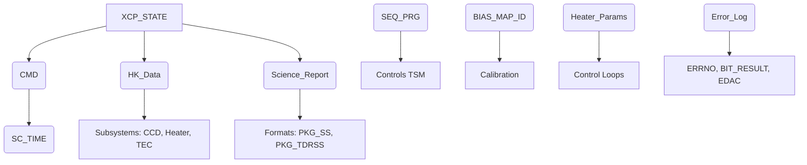

# Software Requirements Specification (SRS)
## X-Ray Telescope Control Processor (XCP) Flight Software
### For the Swift Gamma Ray Burst Explorer Mission

**Document Identifier:** SRS-XCP-FSW-LVL4  
**Revision:** 1.0  
**Date:** [Date of Generation]  
**Status:** Baseline

---

## 1. Introduction

### 1.1 Purpose
This document defines the Software Requirements Specification (SRS) for the X-Ray Telescope Control Processor (XCP) Flight Software (FSW). It is a Level 4 specification detailing the functional, performance, and interface requirements necessary to control the X-Ray Telescope (XRT) instrument aboard the Swift spacecraft. The intended audience includes software developers, system engineers, integration and test personnel, and mission stakeholders.

### 1.2 Scope
The XCP FSW is responsible for:
*   Controlling all functions of the XRT instrument.
*   Processing science data from the Charge-Coupled Device (CCD) camera.
*   Managing command and data handling interfaces with the Swift spacecraft.
*   Performing autonomous observation sequences for Gamma-Ray Burst (GRB) follow-up.
*   Managing thermal control, health, and safety of the XRT subsystem.

**Non-Goals (Out of Scope):**
*   Implementation of field-level hardware details not explicitly specified in referenced Interface Control Documents (ICDs).
*   Spacecraft-level functions (e.g., attitude control, power management) outside the responsibility of the XRT.
*   Ground-based data processing or long-term archival.

### 1.3 Definitions, Acronyms, and Abbreviations
| Term | Definition |
| :--- | :--- |
| **CCD** | Charge-Coupled Device (the XRT camera sensor) |
| **CSC** | Computer Software Component |
| **EDAC** | Error Detection and Correction |
| **FSW** | Flight Software |
| **GRB** | Gamma-Ray Burst |
| **GSE** | Ground Support Equipment |
| **HK** | Housekeeping |
| **ICD** | Interface Control Document |
| **PDM** | Power Distribution Module |
| **PID** | Proportional-Integral-Derivative (control) |
| **SCU** | Spacecraft Control Unit |
| **SLA** | Service Level Agreement / Specification Limit |
| **TAM** | Telescope Alignment Monitor |
| **TBD** | To Be Determined |
| **TBR** | To Be Reviewed |
| **TEC** | Thermo-Electric Cooler |
| **TSM** | Timer/Sequencer Module |
| **UVOT** | UltraViolet/Optical Telescope (another instrument on Swift) |
| **XCP** | X-ray telescope Control Processor |
| **XRT** | X-Ray Telescope |

### 1.4 References
1.  ICD 1143-EI-S19121, *Swift 1553 Bus Interface Control Document*
2.  GSFC-410-MIDEX-003, *NASA MIDEX Mission Assurance Requirements*
3.  LMFS RAD6000 Processor Board Hardware Manual
4.  Swift Mission Science Requirements Document
5.  *[Additional referenced documents to be populated by SwRI/PSU/GSFC - TBD]*

### 1.5 Document Overview
This SRS is organized as follows: Section 2 provides an overall description of the product and its stakeholders. Section 3 details specific system features and requirements. Section 4 outlines external interface requirements. Section 5 defines other non-functional requirements. Appendices contain supporting information such as data dictionaries and verification matrices.

## 2. Overall Description

### 2.1 Product Perspective
The XCP FSW is a component of the Swift Observatory's XRT instrument. It resides on a RAD6000 processor board and interfaces with multiple hardware subsystems within the XRT, as well as with the spacecraft's central computer (SCU) via a MIL-STD-1553B data bus.

### 2.2 Stakeholders and User Classes
| Stakeholder | Role & Interest |
| :--- | :--- |
| **Penn State University (PSU)** | **Customer/Science Lead.** Provides science requirements and develops core science algorithms (Event Recognition, Data Collection Control). Validates science data products. |
| **Southwest Research Institute (SwRI)** | **Developer/Integrator.** Responsible for overall FSW architecture, framework, low-level drivers, integration, testing, and delivery. |
| **NASA Goddard Space Flight Center (GSFC)** | **Mission Management.** Defines top-level mission, spacecraft, and safety requirements. Provides mission operations context. |
| **Swift SCU** | **External System.** Primary source of commands and sink for telemetry. Provides mission time synchronization. |
| **Lockheed Martin Federal Systems (LMFS)** | **Hardware Supplier.** Provides the RAD6000 board; its specifications drive low-level software requirements. |

### 2.3 Operating States and Modes
The XCP FSW shall operate in the following discrete states, defined by the `XCP_STATE` variable:
1.  **OFF:** Processor not executing flight code. Entry via hardware power cycle.
2.  **BOOT:** Initialization of core processor functions, memory tests, and loading of software from EEPROM.
3.  **INIT:** Software initialization, driver setup, and transition to a stable idle state (MANUAL).
4.  **MANUAL:** Ground-commanded state. All instrument functions are controlled explicitly via telecommand.
5.  **AUTO:** Autonomous observation state. Software executes pre-defined or triggered observation sequences with minimal ground intervention.
6.  **RED:** Fault recovery state. Only a subset of critical ("RED") commands is accepted. All other commands are rejected.

*State transitions are governed by specific commands, fault conditions, or sequence completion.*

### 2.4 Major Use Cases & Business Processes

#### UC-1: Automated GRB Observation Sequence
*   **Actor:** Swift Spacecraft (via SCU message)
*   **Precondition:** XCP in `AUTO` state.
*   **Trigger:** Reception of `SISCATTITUDE` message with `IS_SETTLED=false` (spacecraft begins slew).
*   **Main Success Scenario:**
    1.  **Pre-slew:** Calculate row and image bias maps. Optionally collect a raw calibration image.
    2.  **Settle Wait:** Monitor `SISCATTITUDE` for `IS_SETTLED=true`.
    3.  **Source Detection:** Upon settle, acquire CCD image frames. Sum pixels and compare to detection threshold. Repeat until source found or timeout.
    4.  **Centroid & Alert:** If source detected, compute centroid. Transmit autonomous XRT Position Message to UVOT and via TDRSS.
    5.  **Mode Selection:** Based on source flux (counts/sec), dynamically select optimal data mode (Photo-Diode, Windowed Timing, Photon Counting).
    6.  **Data Processing:** Execute the appropriate sequencer program and process incoming CCD data using the Event Recognition Processor.
    7.  **Report Generation:** Format and compress science data (light curves, spectra, event lists) into reports (`PKG_SS`, `PKG_TDRSS`).
    8.  **Observation End:** Conclude processing when target is occulted or a new slew command is received.
*   **Extensions:**
    *   **1a. Preplanned Observation:** Sequence triggered by ground command, not autonomous slew. *Omits step 4 (autonomous position message).*
    *   **1b. No Detection:** If source not detected within timeout, transmit error telemetry and remain in `AUTO` state for potential ground intervention.

#### UC-2: Command Processing in MANUAL State
*   **Actor:** Ground Operator (via SCU)
*   **Precondition:** XCP in `MANUAL` state.
*   **Main Success Scenario:** Ground sends a valid telecommand. XCP validates, executes the command (e.g., configure heater setpoints, load sequencer program, enable TAM), and generates command acknowledgment telemetry.
*   **Extensions:**
    *   **2a. Invalid Command:** Command fails validation (bad checksum, out-of-range parameter). XCP rejects command and increments error counter.
    *   **2b. Transition to RED:** Ground issues a "GO_RED" command or a severe autonomous fault (e.g., CCD over-temperature) occurs. XCP transitions to `RED` state.

#### UC-3: Periodic Housekeeping Collection & Reporting
*   **Actor:** Internal Timer
*   **Precondition:** XCP in any operational state (`INIT`, `MANUAL`, `AUTO`, `RED`).
*   **Trigger:** Expiration of the configured housekeeping period (e.g., 10 seconds).
*   **Main Success Scenario:** Software samples all defined HK sensors (voltages, temperatures, status registers), formats data into a CCSDS packet ≤230 bytes, and queues it for transmission to the SCU.

#### UC-4: Error Recovery and Fault Management
*   **Actor:** Internal Monitoring Functions
*   **Precondition:** XCP in any state.
*   **Main Success Scenario (EDAC):** Detect and correct single-bit memory error. Log the event to EEPROM and HK.
*   **Alternative Scenario (Fatal Error):** Detect uncorrectable multi-bit error or persistent task hang. Trigger watchdog timer reset. Upon reboot, if primary software image is corrupt, boot from alternate image.

### 2.5 Domain Model (Key Data Entities)

*   **`XCP_STATE`:** Enumerated operational mode (OFF, BOOT, INIT, MANUAL, AUTO, RED). **Required.**
*   **`CMD`:** CCSDS telecommand packet structure. Contains application data, timestamp, checksum. **Required.**
*   **`HK_*`:** Composite data structures containing sampled sensor values from all subsystems. **Required.**
*   **`Science_Report` (`PKG_SS`, `PKG_TDRSS`):** Final, compressed science data products for downlink. **Required.**
*   **`SEQ_PRG`:** Binary image defining CCD clocking waveforms for a specific observation mode. **Required, Unique.**
*   **`BIAS_MAP_ID`:** Reference to calibration data (pixel/column) used for image correction. **Required.**
*   **`Heater_Params` (`THTR_PARMS`, `BHTR_PARMS`):** Setpoints and hysteresis for tube and baffle heater control loops. **Required.**
*   **`Error_Log`:** Persistent record of anomalies (`ERRNO`), Built-In Test results (`BIT_RESULT`), and memory errors (`EDAC`). **Required.**

## 3. Specific Requirements

### 3.1 Functional Requirements

#### 3.1.1 Command and Data Handling (C&DH)
*   **XCP-FUN-010:** The software shall receive, validate, and decode CCSDS telecommand packets from the SCU via the 1553 bus per ICD 1143-EI-S19121.
*   **XCP-FUN-011:** The software shall execute valid commands appropriate to the current `XCP_STATE`.
*   **XCP-FUN-012:** The software shall reject commands that are invalid, out-of-sequence, or not permitted in the current state, and shall report the rejection via telemetry.
*   **XCP-FUN-013:** In the `RED` state, the software shall only execute commands from the predefined "RED command" set. All other commands shall be rejected.

#### 3.1.2 Telemetry Generation
*   **XCP-FUN-020:** The software shall generate and transmit real-time housekeeping (HK) packets to the SCU at a configurable period (nominal 10 seconds).
*   **XCP-FUN-021:** Real-time HK packets shall not exceed 230 bytes in length.
*   **XCP-FUN-022:** The software shall generate and transmit science data packets (`PKG_SS` for solid-state recorder, `PKG_TDRSS` for direct downlink) containing processed CCD data.
*   **XCP-FUN-023:** The software shall generate and transmit immediate notification messages (e.g., XRT Position Message) upon autonomous GRB detection.

#### 3.1.3 Autonomous Observation Management
*   **XCP-FUN-030:** Upon receiving a `SISCATTITUDE` message with `IS_SETTLED=false` while in `AUTO` state, the software shall initiate the pre-slew calibration sequence (bias map calculation).
*   **XCP-FUN-031:** After `IS_SETTLED=true`, the software shall autonomously acquire CCD images, detect a point source exceeding the detection threshold, and compute its centroid.
*   **XCP-FUN-032:** Following a successful centroid calculation, the software shall transmit an XRT Position Message within 5 seconds of slew settlement.
*   **XCP-FUN-033:** The software shall dynamically select the science data acquisition mode (Photo-Diode, Windowed Timing, Photon Counting) based on the measured source flux. *[Specific flux thresholds TBD by PSU].*
*   **XCP-FUN-034:** The software shall load and execute the corresponding `SEQ_PRG` for the selected observation mode.

#### 3.1.4 Science Data Processing
*   **XCP-FUN-040:** The software shall apply bias correction to raw CCD data using the current `BIAS_MAP_ID`.
*   **XCP-FUN-041:** The software shall process corrected CCD data through the Event Recognition Processor (ERP) algorithm to identify valid X-ray events. *[Specific ERP algorithm TBD by PSU].*
*   **XCP-FUN-042:** The software shall format ERP outputs into standard science products (light curves, spectra, event lists).
*   **XCP-FUN-043:** The software shall compress science data products prior to packetization.

#### 3.1.5 Thermal and Hardware Control
*   **XCP-FUN-050:** The software shall implement closed-loop PID control for the Thermo-Electric Cooler (TEC) to maintain the CCD at its operational temperature. *[PID coefficients TBD by Thermal Team].*
*   **XCP-FUN-051:** The software shall monitor and control the tube and baffle heaters using configurable setpoints and hysteresis (`THTR_PARMS`, `BHTR_PARMS`).
*   **XCP-FUN-052:** The software shall manage power relays via the PDM for heaters, TAM, TEC, and door actuators.
*   **XCP-FUN-053:** The software shall read and set CCD bias voltages via the Analog I/O system using the `DAC_TBL`.

#### 3.1.6 Fault Detection, Isolation, and Recovery (FDIR)
*   **XCP-FUN-060:** The software shall perform periodic Built-In Tests (BIT) on critical hardware interfaces and report results.
*   **XCP-FUN-061:** The software shall utilize EDAC to detect and correct single-bit memory errors and log uncorrectable multi-bit errors.
*   **XCP-FUN-062:** Upon detection of a severe fault (e.g., CCD over-temperature, critical voltage out of limits), the software shall transition to a safe state (`MANUAL` with CCD powered off, or `RED`).
*   **XCP-FUN-063:** The software shall implement a watchdog timer to trigger a processor reset in the event of a software hang.
*   **XCP-FUN-064:** The boot software shall be capable of booting from an alternate software image in EEPROM if the primary image is corrupted.

### 3.2 External Interface Requirements

#### 3.2.1 1553B Interface to SCU
*   **XCP-INT-100:** The software shall implement the MIL-STD-1553B bus protocol as a Remote Terminal (RT) as defined in ICD 1143-EI-S19121.
*   **XCP-INT-101:** The software shall respond to valid SCU messages within the latency requirements specified in the ICD.

#### 3.2.2 Camera Head (CCD) & Signal Chain Interface
*   **XCP-INT-110:** The software shall read digitized `CCD_DATA` from the Signal Chain board input buffer.
*   **XCP-INT-111:** The software shall be capable of processing the maximum expected data rate for each observation mode (e.g., ~60 kHz in Photo-Diode mode).

#### 3.2.3 Timer/Sequencer Module (TSM) Interface
*   **XCP-INT-120:** The software shall be able to load at least 64 distinct sequencer programs (`SEQ_PRG`) into the TSM.
*   **XCP-INT-121:** The software shall command the TSM to start, stop, and select specific sequencer programs.

#### 3.2.4 Telescope Alignment Monitor (TAM) Interface
*   **XCP-INT-130:** The software shall communicate with the TAM via an RS-422 serial interface.
*   **XCP-INT-131:** The software shall power the TAM on/off via the PDM and receive `TAM_DATA` images for alignment analysis.

#### 3.2.5 Power Distribution Module (PDM) Interface
*   **XCP-INT-140:** The software shall read `PDM_STAT` registers to monitor relay states and fault conditions (e.g., over-current).
*   **XCP-INT-141:** The software shall send `PDM_EN`/`PDM_DIS` signals to control power relays.

### 3.3 Performance Requirements
*   **XCP-PER-200:** The average science data rate generated by the XCP shall not exceed the allocated 3.9 kbps over any 10-minute period.
*   **XCP-PER-201:** The software shall complete the autonomous detection, centroiding, and position message transmission sequence within 5 seconds of receiving `IS_SETTLED=true`.
*   **XCP-PER-202:** CPU utilization shall maintain a minimum margin of 20% under worst-case science processing load, as detailed in performance modeling (Appendix D).
*   **XCP-PER-203:** Housekeeping sampling shall occur with an accuracy and period as defined in the telemetry specification.

### 3.4 Safety & Reliability Requirements
*   **XCP-REL-300:** The software shall comply with all safety-related requirements of NASA MIDEX directive GSFC-410-MIDEX-003.
*   **XCP-REL-301:** Flight code in EEPROM shall be write-locked to prevent corruption.
*   **XCP-REL-302:** The software shall log all significant anomalies to non-volatile EEPROM storage with wear-leveling to mitigate wear-out.
*   **XCP-REL-303:** The software shall be designed to operate without memory leaks or fragmentation for the nominal 3-year mission lifetime.

### 3.5 Design Constraints
*   **XCP-CON-400:** The software shall be developed for the RAD6000 processor using the specified operating system and toolchain.
*   **XCP-CON-401:** The software shall use static memory allocation for all time-critical and safety-critical functions.
*   **XCP-CON-402:** The design shall facilitate independent development and delivery of Core Framework (SwRI) and Science Application (PSU) CSCs.

## 4. System Features (Traceability)

*This section would typically map high-level features (e.g., "Autonomous Observation") to the specific requirements listed in Section 3. For brevity in this generated document, this mapping is implied by the requirement IDs and use cases.*

## 5. Other Non-Functional Requirements

*   **Observability:** All command rejections, memory errors, task failures, and state transitions shall be reported in housekeeping telemetry and logged to EEPROM.
*   **Maintainability:** The software architecture shall allow for patching of non-volatile code segments in flight via a defined ground procedure.
*   **Compliance:** The software development process and product shall comply with all applicable Swift mission and GSFC software engineering standards.

## 6. Appendices

### Appendix A: Verification Matrix
*TBD. Will map each requirement (XCP-XXX-XXX) to a verification method (Test, Analysis, Inspection, Demonstration) and success criteria.*

### Appendix B: Data Dictionary
*TBD. Will define the structure, format, and valid ranges for all key data entities (`XCP_STATE`, `CMD`, `HK_*`, etc.).*

### Appendix C: Undecided Issues (TBD/TBR)
1.  Final numerical values for science mode flux thresholds and parameters. *Responsible: PSU.*
2.  Specific algorithms for centroiding, event recognition, and bias calculation. *Responsible: PSU.*
3.  Precise TEC PID control coefficients. *Responsible: PSU/Thermal Team.*
4.  South Atlantic Anomaly (SAA) detection algorithm and parameters (`SAA_FLAG`). *Responsible: PSU/SwRI.*
5.  Final definition of all data dictionary items. *Responsible: SwRI/PSU.*
6.  Ground system (ITOS) compatibility with segmented packet design. *Responsible: GSFC.*

### Appendix D: Performance Modeling & CPU Margin Analysis
*TBD. Will contain detailed analysis showing CPU loading under various operational scenarios to demonstrate compliance with XCP-PER-202.*