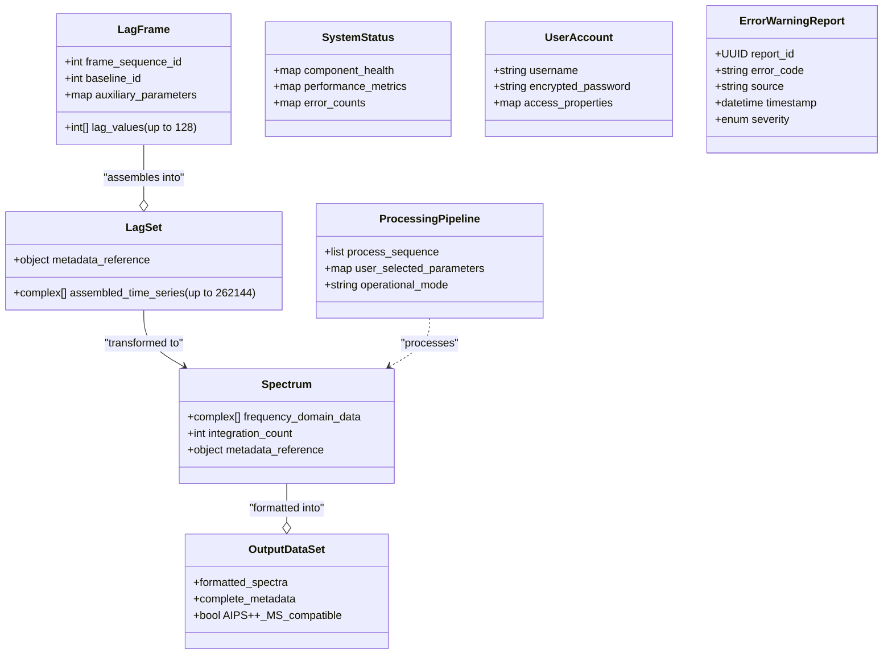

Here is a comprehensive Software Requirements Specification (SRS) document for the EVLA Correlator Backend System, structured according to professional standards.

# **Software Requirements Specification (SRS)**
## **EVLA Correlator Backend System**

**Document Version:** 1.0
**Date:** [Date of Creation]
**Status:** Draft for Review
**Project:** Very Large Array Expansion Project

---

### **Revision History**

| Version | Date       | Author/Editor          | Description of Change          |
| :------ | :--------- | :--------------------- | :----------------------------- |
| 1.0     | [Date]     | [Author Name]          | Initial draft based on project summary. |

---

## **1. Introduction**

### **1.1 Purpose**
This document defines the functional and non-functional requirements for the EVLA (Expanded Very Large Array) Correlator Backend System. It serves as the authoritative specification for developers, testers, project managers, and stakeholders, ensuring a common understanding of the system to be built.

### **1.2 Scope**
The EVLA Correlator Backend System is a critical, real-time, high-performance data processing pipeline. Its primary function is to ingest raw lag data from the Correlator, perform assembly, core Fourier transforms, optional user-selected processing, and deliver fully formatted spectral data to the End-to-End (e2e) archive system. The system must operate reliably on a distributed processor cluster interconnected by high-speed networks.

**In-Scope:**
*   Real-time reception, verification, and assembly of correlator lag frames.
*   Execution of core Fast Fourier Transforms (FFT) and optional time/frequency domain processes.
*   Integration, formatting of results into AIPS++ Measurement Set format, and delivery to the archive.
*   System health monitoring, fault detection, and automated recovery.
*   Dynamic reconfiguration based on commands from the Monitor & Control (M&C) system.
*   Secure user authentication, authorization, and access control.
*   Comprehensive logging and reporting of status, errors, and performance metrics.

**Out-of-Scope (Non-Goals):**
*   Providing direct user interfaces (all interaction is mediated through the external Monitor & Control System).
*   Combining or "stitching" spectra from different observational sub-bands.
*   Long-term archival storage of raw or processed data beyond temporary buffering.
*   The physical hardware procurement (specifies performance requirements for hardware).

### **1.3 Definitions, Acronyms, and Abbreviations**

| Term      | Definition                                                                                   |
| :-------- | :------------------------------------------------------------------------------------------- |
| **AIPS++** | Astronomical Information Processing System, a software suite for astronomical data reduction. |
| **Baseline** | A pair of antennas; the fundamental unit for interferometric correlation.                    |
| **e2e**     | End-to-End archive system.                                                                   |
| **EVLA**    | Expanded Very Large Array.                                                                   |
| **FFT**     | Fast Fourier Transform.                                                                      |
| **Lag Frame** | A packet of raw correlation data from the Correlator.                                        |
| **Lag Set** | A complete, ordered time series assembled from multiple lag frames.                          |
| **M&C**     | Monitor & Control system.                                                                    |
| **MS**      | Measurement Set (AIPS++ data format).                                                        |
| **NaN**     | Not a Number (a computational error state).                                                  |
| **SLA**     | Service Level Agreement.                                                                     |
| **SRS**     | Software Requirements Specification.                                                         |
| **UDP/IP**  | User Datagram Protocol over Internet Protocol.                                               |

### **1.4 References**
*   EVLA Expansion Project Charter
*   Interface Control Documents (ICDs) for Correlator, M&C, and e2e Archive systems.
*   AIPS++ Measurement Set Definition Documentation.

### **1.5 Document Overview**
The remainder of this document details stakeholder analysis, functional and non-functional requirements, system interfaces, domain model, and project considerations such as risks and acceptance criteria.

---

## **2. Overall Description**

### **2.1 Product Perspective**
The Correlator Backend System is a middleware component within the larger EVLA data pipeline. It interfaces upstream with the **Correlator**, downstream with the **e2e Archive**, and in parallel with the **Monitor & Control System** for command and status. It is a headless system running on a dedicated computational cluster.

**System Context Diagram:**
```
[Correlator] --(Raw Lag Data, 1.6 GB/s)--> [EVLA Backend System] --(Formatted Spectra, 25 MB/s)--> [e2e Archive]
         ^                                                                                             ^
         |                                                                                             |
         |--(Status/Errors)--------[Monitor & Control System]--------(Commands/Parameters)-------------|
```

### **2.2 Stakeholders and User Characteristics**

| Stakeholder            | Primary Interest / Role                                                                          | Interaction Channel       |
| :--------------------- | :----------------------------------------------------------------------------------------------- | :------------------------ |
| **Array Operator**     | Ensure continuous, fault-free operation of the observation pipeline.                              | M&C System Status Displays |
| **Engineer/Technician**| Perform maintenance, diagnostics, and repair of hardware/software components.                     | Remote Access, Diagnostic Tools |
| **Astronomer/Scientist** | Define optional data processing parameters to be applied to the spectral data.                    | M&C System Parameter Interface |
| **Software Developer** | Develop, debug, and maintain system software.                                                     | Development & Debugging Environments |
| **Administrator**      | Manage user accounts, access controls, and system security policies.                              | Administrative Interfaces |
| **Web User (Auth.)**   | Perform specific oversight or support tasks requiring restricted access.                          | Secure Web Interface      |

### **2.3 Use Cases**
#### **UC-1: Execute Real-Time Data Processing Pipeline**
*   **Actor:** System (Automated)
*   **Description:** The system automatically processes the incoming stream of lag data into archived spectra.
*   **Main Flow:**
    1.  Triggered by the start of lag frame transmission from the Correlator.
    2.  System receives and verifies integrity of UDP lag frames.
    3.  Frames are assembled into complete, time-ordered lag sets.
    4.  Data integrity checks and corrections (e.g., normalization) are applied.
    5.  Core FFT is performed on each lag set.
    6.  Any user-selected frequency domain processes are applied.
    7.  Spectra are integrated and formatted into AIPS++ MS entities.
    8.  Formatted data is transferred to the e2e archive, with receipt confirmation.

#### **UC-2: Apply Optional Data Processing**
*   **Actor:** Astronomer/Scientist (via M&C)
*   **Description:** A user configures and enables optional processing steps for the data pipeline.
*   **Main Flow:**
    1.  User submits processing parameters (e.g., bandpass correction, weighting) via M&C.
    2.  M&C forwards validated parameters to the Backend System.
    3.  System updates the processing pipeline configuration.
    4.  Subsequent data flows through the newly configured optional process after the core FFT.

#### **UC-3: Handle System Fault**
*   **Actor:** System (Monitoring Subsystem)
*   **Description:** The system detects, attempts to recover from, and reports a hardware or software fault.
*   **Main Flow:**
    1.  Monitoring subsystem detects a fault (e.g., process crash, high error rate).
    2.  System attempts automatic recovery (e.g., restart process, redistribute workload).
    3.  A detailed error/warning report is generated and sent to the M&C system.
    4.  Data pipeline continues operation with potentially degraded performance.

#### **UC-4: Manage User Access**
*   **Actor:** Administrator
*   **Description:** An administrator creates, modifies, or deletes user accounts and their access privileges.
*   **Main Flow:**
    1.  Administrator authenticates to the administrative interface.
    2.  Administrator modifies a user account's properties (e.g., role, permissions).
    3.  Changes are committed to the system's access control database.
    4.  Modified permissions take effect for the user's next authentication attempt.

### **2.4 Assumptions and Dependencies**
*   **Assumption:** The Correlator, M&C, and e2e Archive external systems will provide data and interfaces as defined in their respective ICDs.
*   **Assumption:** The underlying cluster hardware and network infrastructure will meet the specified performance thresholds.
*   **Dependency:** Availability of third-party libraries for high-performance FFT computations.
*   **Dependency:** The system's operational schedule is dependent on the overall EVLA observation timeline.

---

## **3. System Features and Requirements**

### **3.1 Functional Requirements**

#### **FR-1: Data Ingestion & Assembly**
*   **FR-1.1:** The system shall receive lag frame data packets via UDP/IP from the Correlator.
*   **FR-1.2:** The system shall verify the integrity and sequence of each incoming lag frame.
*   **FR-1.3:** The system shall assemble sequential lag frames into complete lag sets, as defined by the current observational mode.
*   **FR-1.4:** The system shall apply necessary data corrections (e.g., Van Vleck correction, normalization) to the assembled lag set.

#### **FR-2: Core Data Processing**
*   **FR-2.1:** The system shall perform a Fast Fourier Transform on each assembled lag set to convert time-series (lag) data to the frequency domain (spectrum).
*   **FR-2.2:** The system shall apply a configurable set of optional frequency-domain processing steps (e.g., bandpass correction, Hanning smoothing) as specified by the user via M&C.
*   **FR-2.3:** The system shall integrate (average) spectra over a configurable time interval.

#### **FR-3: Data Output & Delivery**
*   **FR-3.1:** The system shall format processed spectral data and all associated metadata into entities compliant with the AIPS++ Measurement Set standard.
*   **FR-3.2:** The system shall transfer the formatted data to the e2e Archive system.
*   **FR-3.3:** The system shall verify successful receipt of data by the e2e Archive.

#### **FR-4: System Monitoring & Fault Management**
*   **FR-4.1:** The system shall continuously monitor the health of its software processes, compute nodes, and internal networks.
*   **FR-4.2:** The system shall detect faults including process termination, hardware failure, network disruption, and computational errors (NaN, overflow).
*   **FR-4.3:** Upon fault detection, the system shall attempt automatic recovery actions according to predefined rules (e.g., restart service, failover node).
*   **FR-4.4:** The system shall generate and transmit detailed error and warning reports to the M&C system for all detected faults and recovery actions.

#### **FR-5: Operational Control**
*   **FR-5.1:** The system shall accept and process control commands and new processing parameters from the M&C system.
*   **FR-5.2:** The system shall dynamically reconfigure the data processing pipeline in response to commands or correlator mode changes without data loss or corruption.
*   **FR-5.3:** The system shall cache critical auxiliary data from M&C to allow limited continued operation during a temporary M&C outage.

#### **FR-6: Security & Access Control**
*   **FR-6.1:** All user access to system administration and diagnostic functions shall require authentication via unique username and encrypted password.
*   **FR-6.2:** The system shall enforce role-based access control (RBAC) privileges.
*   **FR-6.3:** All authentication attempts (successful and failed) and privilege changes shall be logged in a secure audit trail.
*   **FR-6.4:** An administrator shall have the capability to create, modify, and delete user accounts and their associated privileges.

### **3.2 Non-Functional Requirements**

#### **NFR-1: Performance**
*   **NFR-1.1:** The system shall sustain a continuous aggregate **input data rate** of **1.6 Gigabytes per second** from the Correlator.
*   **NFR-1.2:** The system shall sustain a continuous aggregate **output data rate** of **25 Megabytes per second** to the e2e Archive.
*   **NFR-1.3:** End-to-end processing latency (from receipt of final lag frame to delivery of formatted spectrum) shall not exceed [TBD] seconds under full load.

#### **NFR-2: Reliability & Availability**
*   **NFR-2.1:** The system shall be designed for continuous operation without requiring a total system restart between scheduled maintenance windows.
*   **NFR-2.2:** The system shall continue loss-less data processing during a temporary outage of the e2e Archive by buffering data in memory and/or on disk for a duration of **[TBD - See Undecided Issues]**.
*   **NFR-2.3:** Mean Time Between Failures (MTBF) for critical software components shall be greater than [TBD] hours.

#### **NFR-3: Security**
*   **NFR-3.1:** All passwords shall be stored using strong, industry-standard cryptographic hashing (e.g., bcrypt, Argon2).
*   **NFR-3.2:** All administrative and diagnostic network traffic shall be encrypted (e.g., using TLS/SSL).
*   **NFR-3.3:** The system shall be resilient to common network-based attacks (e.g., denial-of-service, packet injection).

#### **NFR-4: Compliance**
*   **NFR-4.1:** The data processing pipeline shall be **reversible** to the extent that the original raw lag data can be reconstructed from the formatted output data and metadata.
*   **NFR-4.2:** Software development shall follow defined coding standards and industry best practices for safety-critical real-time systems.

#### **NFR-5: Observability & Maintainability**
*   **NFR-5.1:** All system-generated reports (status, error, warning) shall include at minimum: a unique report ID, error code, source component, precise timestamp, and severity level.
*   **NFR-5.2:** The system shall provide real-time performance metrics (I/O rates, compute load, queue depths) to the M&C system.
*   **NFR-5.3:** The software architecture shall be modular to facilitate maintenance, updates, and debugging.

---

## **4. External Interface Requirements**

### **4.1 Correlator System Interface**
*   **Type:** Inbound Data Stream
*   **Protocol:** UDP/IP (Optimized for high-speed, low-latency transfer).
*   **Data Format:** Defined by Correlator ICD. Contains lag frames with sequence IDs, baseline IDs, and auxiliary parameters.
*   **SLA Requirement:** Must be capable of sustaining a 1.6 GB/s stream without packet loss under normal network conditions.
*   **Output:** Internal receipt verification; error reports sent to M&C for persistent stream issues.

### **4.2 Monitor & Control (M&C) System Interface**
*   **Type:** Bi-directional Command & Status
*   **Protocol:** TCP/IP with defined message protocol (e.g., XML/JSON over TCP, or custom binary protocol).
*   **Input (from M&C):** Control commands, observational parameters, auxiliary data (state counts, metadata).
*   **Output (to M&C):** System status, health metrics, error/warning reports, operational confirmations.
*   **SLA Requirement:** Must cache commands and critical auxiliary data to operate for a defined period if M&C is unavailable.

### **4.3 End-to-End (e2e) Archive System Interface**
*   **Type:** Outbound Data Delivery
*   **Protocol:** Reliable high-throughput protocol (e.g., TCP/IP, or specialized like GridFTP).
*   **Data Format:** AIPS++ Measurement Set (MS) files or streams.
*   **SLA Requirement:** Must sustain 25 MB/s transfer rate. Must implement buffering (memory/disk) to hold data during temporary e2e outages.

### **4.4 Internal Management Network**
*   **Type:** Internal Cluster Communication
*   **Purpose:** Inter-process communication, workload distribution, health heartbeats, and distributed system coordination.
*   **Protocol:** High-speed low-latency protocol (e.g., InfiniBand, 10GbE with custom or standard MPI-like messaging).

---

## **5. System Domain Model**
Key data entities within the system:



---

## **6. Acceptance Criteria**
*   **AC-1 (Pipeline):** During integration test, with a simulated correlator streaming at 1.6 GB/s, the system shall successfully assemble, transform, and deliver 100% of spectra to a simulated e2e archive without data loss for a continuous 24-hour period.
*   **AC-2 (Optional Processing):** When an optional frequency-domain process (e.g., Hanning smoothing) is configured via the M&C test harness, the system shall apply the process correctly, as verified by analysis of the output MS file.
*   **AC-3 (Fault Tolerance):** Upon the simulated failure of a worker node in the cluster, the monitoring system shall detect the failure within [TBD] seconds, redistribute its workload, and report the event to the M&C test harness. The data pipeline shall experience no more than [TBD] seconds of degraded throughput.
*   **AC-4 (Output Buffering):** When the connection to the simulated e2e archive is severed for a period of [TBD] minutes, the system shall buffer all output data and successfully deliver it upon reconnection with no data loss.
*   **AC-5 (Security):** An attempt to access an administrative API with invalid credentials shall be denied and result in an entry in the security audit log.

---

## **7. Project Considerations**

### **7.1 Milestones and Release Strategy**
1.  **Milestone 1:** Baseline this SRS document (Completion Gate for Requirements Phase).
2.  **Milestone 2:** Complete High-Level and Detailed Design Reviews.
3.  **Milestone 3:** Core Pipeline Component Development & Unit Test Complete (FFT, Assembler).
4.  **Milestone 4:** Subsystem Integration & End-to-End Testing with Simulated Data.
5.  **Milestone 5:** On-Site Integration Testing with actual Correlator and e2e systems.
6.  **Milestone 6:** Deployment of Initial Operational Capability (IOC).

### **7.2 Risks and Mitigations**
| ID  | Risk Description                                      | Mitigation Strategy                                                                                     |
| :-- | :---------------------------------------------------- | :------------------------------------------------------------------------------------------------------ |
| R1  | Hardware insufficient for target data rates.          | Modular, scalable design; early prototyping and benchmarking on candidate hardware.                     |
| R2  | Network disruption halts real-time flow.              | Implement robust multi-level buffering; design for redundant network paths; proactive monitoring.       |
| R3  | Software bugs cause data corruption.                  | Rigorous unit/integration testing; fault injection testing; design for idempotent/restartable processes.|
| R4  | Inability to handle dynamic mode changes.             | Design state machine for pipeline reconfiguration; implement atomic parameter table updates.            |
| R5  | Extended M&C outage halts processing.                 | Cache critical auxiliary data; implement a fallback "last-known-good" operational mode.                 |
| R6  | Security breach.                                      | Enforce principle of least privilege; regular security audits; encrypt sensitive data and communications.|
| R7  | Poor software maintainability.                        | Adopt strict coding standards; mandate comprehensive documentation; use modular architecture.           |
| R8  | Integration failure with external systems.            | Develop and agree on ICDs early; conduct joint interface testing in the development phase.              |

### **7.3 Undecided Issues (TBD)**
The following issues require resolution by the designated parties to finalize the design:
1.  **Precise memory requirements and access speeds** for real-time processing. *(Owner: System Architects)*
2.  **Capacity of output buffer** (memory/disk) for e2e outage recovery. *(Owner: Performance Engineering Team)*
3.  **Maximum duration** the system must buffer data during an e2e outage. *(Owner: Project Lead & Operations)*
4.  **Amount of correlator data to cache** during an M&C auxiliary data outage. *(Owner: Software Designers)*
5.  **Maximum allowable delay** when resuming from standby mode. *(Owner: Systems Engineering)*
6.  **Finalized coding standards** and primary programming language selection. *(Owner: Development Lead)*
7.  **Diagnostic requirements** for third-party software components. *(Owner: Integration & Test Team)*
8.  **Final list and specifications** of user-selectable time/frequency domain processes. *(Owner: Project Scientists & Developers)*

---
**END OF DOCUMENT**