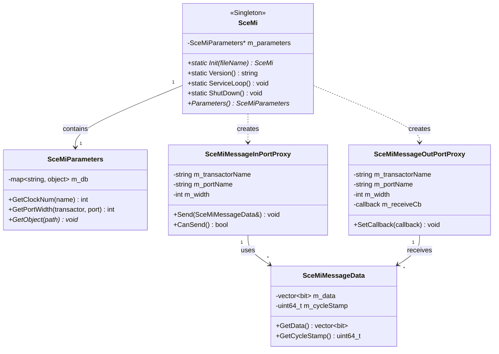

# Software Requirements Specification (SRS)
## Standard Co-Emulation Modeling Interface (SCE-MI)
### Version 1.0 Draft

---

## Document Control

| **Item**               | **Details**                              |
| ---------------------- | ---------------------------------------- |
| **Document Title**     | SRS: Standard Co-Emulation Modeling Interface (SCE-MI) |
| **Version**            | 1.0                                      |
| **Status**             | Draft                                    |
| **Date**               | [Date of Generation]                     |
| **Authors**            | SCE-API Consortium Technical Committee   |
| **Distribution**       | Consortium Members, Implementors, Users  |

---

## 1. Introduction

### 1.1 Purpose
This Software Requirements Specification (SRS) defines the functional and non-functional requirements for the Standard Co-Emulation Modeling Interface (SCE-MI). SCE-MI is a standardized, high-performance Application Programming Interface (API) designed to facilitate communication between untimed software models executing on a host workstation and cycle-accurate hardware models (e.g., RTL netlists) running on verification platforms such as hardware emulators. The purpose of this specification is to enable interoperable, plug-and-play verification solutions by replacing proprietary, vendor-specific bridging interfaces.

### 1.2 Scope
The scope of SCE-MI 1.0 is strictly limited to the core modeling interface required for co-emulation. This includes:
*   Definition of a message-based communication channel API (C++ and C) for software models.
*   Specification of hardware macros (Verilog/VHDL) for message ports and clock control to be instantiated within transactors.
*   Semantics for initializing the interface, binding software proxies to hardware ports, and controlling simulation clocks.
*   Mechanisms for transporting serialized message data between abstraction levels.

**Explicitly Out of Scope:**
*   Debug interfaces (e.g., waveform dumping, probe access).
*   Functional coverage collection and reporting.
*   Transaction recording and analysis utilities.
*   Event-based or sub-cycle accurate simulation bridging.
*   The internal implementation of the transport layer between host and emulator.

### 1.3 Definitions, Acronyms, and Abbreviations
*   **API:** Application Programming Interface.
*   **DUT:** Design Under Test.
*   **EDA:** Electronic Design Automation.
*   **HDL:** Hardware Description Language (Verilog, VHDL).
*   **IP:** Intellectual Property.
*   **RTL:** Register Transfer Level.
*   **SCE-MI:** Standard Co-Emulation Modeling Interface.
*   **SoC:** System on Chip.
*   **Transactor:** A hardware module that converts between message-level transactions and cycle-accurated signal-level activity.

### 1.4 References
*   IEEE Std 1016-2009, IEEE Standard for Information Technology—Systems Design—Software Design Descriptions.
*   Accellera Standard Co-Emulation API: Modeling Interface (SCE-MI) – Background and Rationale Document.

### 1.5 Overview
The remainder of this document is structured as follows:
*   **Section 2:** Overall description of the product, its stakeholders, operating environment, and design constraints.
*   **Section 3:** Specific system features and requirements, detailing functional and non-functional requirements.
*   **Appendix A:** Acceptance Criteria.
*   **Appendix B:** Domain Model (UML Class Diagram).
*   **Appendix C:** Undecided Issues & Open Risks.

---

## 2. Overall Description

### 2.1 Product Perspective
SCE-MI is an intermediary layer within a larger co-emulation ecosystem. It is not a standalone application but a library and a set of hardware constructs that integrate with:
1.  **User Software Models:** Untimed C/C++ testbenches, reference models, or stimulus generators.
2.  **User Hardware Models:** RTL DUT and transactor modules.
3.  **Vendor Infrastructure:** Proprietary software libraries and hardware implementations on emulators/simulators that provide the actual data transport and clock generation.

### 2.2 Stakeholders and User Classes
| **Stakeholder Class**                | **Primary Interest**                                                                 | **Key Activities**                                                                 |
| ------------------------------------ | ------------------------------------------------------------------------------------ | --------------------------------------------------------------------------------- |
| **End User (SoC Design Team)**       | Successfully verify DUT by connecting software testbench to hardware.                | Integrates pre-built transactor/proxy IP; writes test scenarios; runs co-simulation. |
| **Transactor Implementor (IP Provider)** | Create and sell reusable verification components for standard interfaces (PCIe, USB, etc.). | Develops hardware transactor modules (using SCE-MI macros) and corresponding software proxy libraries (using SCE-MI API). |
| **Infrastructure Implementor (EDA Vendor)** | Provide a compliant, high-performance SCE-MI implementation for their platform.      | Implements the SCE-MI software-side library, hardware-side macros, and the linking/transport infrastructure. |

### 2.3 Operating Environment
*   **Software Side:** Host workstation running Linux/Windows. Software models are typically C/C++, potentially within a SystemC kernel. The SCE-MI API library must be linkable.
*   **Hardware Side:** Verification platform (Emulator, FPGA Prototype, Accelerated Simulator) capable of executing structural HDL netlists containing the specified SCE-MI macros.
*   **Build Environment:** Vendor-specific toolchain for compiling/linking hardware netlists and generating necessary configuration/parameter files.

### 2.4 Design and Implementation Constraints
1.  **Abstraction Level:** The interface must be message-based, not event-based, to maintain high performance.
2.  **Language Support:** The software API must be available in both C++ and C. Hardware macros must be defined for Verilog and VHDL.
3.  **Thread Safety:** The API must be safe for use in multi-threaded software environments.
4.  **Determinism:** The behavior of clock control and message delivery must be deterministic across compliant implementations.

### 2.5 Assumptions and Dependencies
*   It is assumed the infrastructure implementor's tools can correctly parse HDL netlists to identify SCE-MI macro instances and extract their parameters.
*   The performance of the overall system is dependent on the efficiency of the implementation-specific transport layer.

---

## 3. System Features and Requirements

### 3.1 Feature: System Initialization and Configuration
**Description:** The system must provide mechanisms to initialize the SCE-MI infrastructure, load configuration parameters from the hardware design, and prepare for co-simulation.

**Requirements:**
*   **REQ-INIT-001:** The software API shall provide a singleton class or namespace `SceMi` with a static `Init()` method to initialize the infrastructure.
*   **REQ-INIT-002:** The `SceMi::Init()` method shall accept a path to a parameter file generated by the infrastructure linker.
*   **REQ-INIT-003:** Upon successful initialization, a `SceMiParameters` object shall be accessible, providing read-only access to the configuration (e.g., clock definitions, port names, transactor hierarchies).
*   **REQ-INIT-004:** The API shall provide a `SceMi::ShutDown()` method to gracefully terminate the co-modeling session and release all resources.
*   **REQ-INIT-005:** The infrastructure linker shall parse the user's hardware netlist, identify all `SceMiClockPort`, `SceMiMessageInPort`, `SceMiMessageOutPort`, and `SceMiClockControl` macro instances, and generate a platform-specific configuration file.

### 3.2 Feature: Message Port Binding
**Description:** Software models must be able to bind proxy objects to specific message ports in the hardware design using unique hierarchical names.

**Requirements:**
*   **REQ-BIND-001:** The API shall provide a function `BindMessageInPort()` to create a software proxy bound to a specific `SceMiMessageInPort` hardware macro.
*   **REQ-BIND-002:** The API shall provide a function `BindMessageOutPort()` to create a software proxy bound to a specific `SceMiMessageOutPort` hardware macro.
*   **REQ-BIND-003:** Binding functions shall require `transactorName` and `portName` arguments that uniquely identify the target hardware port, as defined in the parameter file.
*   **REQ-BIND-004:** If the specified port name is not found, the binding function shall fail and return a null pointer (or equivalent error indicator).
*   **REQ-BIND-005:** A bound `SceMiMessageOutPortProxy` shall allow the registration of a user-defined callback function to be invoked when a message is received from hardware.

### 3.3 Feature: Message Transmission (Software to Hardware)
**Description:** Software models shall send messages to hardware transactors via bound input port proxies.

**Requirements:**
*   **REQ-TX-001:** The `SceMiMessageInPortProxy` class shall provide a `Send()` method.
*   **REQ-TX-002:** The `Send()` method shall accept a `SceMiMessageData` object containing the serialized message payload.
*   **REQ-TX-003:** The `Send()` method shall be non-blocking. The message shall be queued for transport if the hardware channel is not immediately ready.
*   **REQ-TX-004:** The `SceMiMessageData` object shall encapsulate a data vector whose width matches the `PortWidth` parameter of the corresponding hardware macro.
*   **REQ-TX-005:** When the hardware transactor asserts `ReceiveReady` on the `SceMiMessageInPort` macro, the infrastructure shall transport the next queued message, presenting it on the macro's `Message` output vector on the next relevant clock edge.

### 3.4 Feature: Message Reception (Hardware to Software)
**Description:** Hardware transactors shall send messages to software models via output ports, triggering callbacks in the software.

**Requirements:**
*   **REQ-RX-001:** The `SceMiMessageOutPort` hardware macro shall have `TransmitReady` and `Message` input signals for the transactor to indicate data availability.
*   **REQ-RX-002:** When the transactor asserts `TransmitReady` and the output channel is ready (`ReceiveReady` from the macro is asserted), the infrastructure shall transport the message to the software side.
*   **REQ-RX-003:** The software infrastructure shall queue incoming messages from hardware.
*   **REQ-RX-004:** A call to `SceMi::ServiceLoop()` shall process all pending received messages, invoking the registered callback function for each `SceMiMessageOutPortProxy` with a corresponding `SceMiMessageData` object.
*   **REQ-RX-005:** The `SceMiMessageData` object delivered to the receive callback shall include a `cycleStamp` field indicating the hardware cycle at which the message was sent.

### 3.5 Feature: Clock Control
**Description:** Transactors must be able to control the clock(s) driving the DUT to safely process messages, effectively pausing simulation.

**Requirements:**
*   **REQ-CLK-001:** Every transactor module must instantiate at least one `SceMiClockControl` macro.
*   **REQ-CLK-002:** The `SceMiClockControl` macro shall provide a `ReadyForCclock` input signal from the transactor.
*   **REQ-CLK-003:** When a transactor de-asserts `ReadyForCclock`, the infrastructure shall disable (`CclockEnabled` = low) the associated controlled clock before its next positive edge, pausing the DUT logic.
*   **REQ-CLK-004:** If multiple transactors share a clock domain, the clock shall be disabled if *any* controlling transactor de-asserts its `ReadyForCclock` signal. The clock shall only resume when *all* controlling transactors re-assert `ReadyForCclock`.
*   **REQ-CLK-005:** The `SceMiClockPort` macro shall define the clock's ratio, duty cycle, phase, and reset synchronization relative to a global `uclock`.

### 3.6 Feature: Service Loop and Asynchronous Processing
**Description:** The software application must provide CPU resources to the SCE-MI infrastructure to service background tasks, primarily message delivery.

**Requirements:**
*   **REQ-SVC-001:** The API shall provide a `SceMi::ServiceLoop()` function.
*   **REQ-SVC-002:** Calling `ServiceLoop()` shall allow the infrastructure to perform necessary background processing, including:
    *   Dispatching received messages to their registered callbacks.
    *   Advancing the transport of queued outgoing messages.
*   **REQ-SVC-003:** The function shall be designed to be called repeatedly, either from a dedicated thread in a multi-threaded environment or strategically within the main loop of a single-threaded environment.

### 3.7 Feature: Error Handling
**Description:** The interface must provide clear mechanisms for reporting and handling errors.

**Requirements:**
*   **REQ-ERR-001:** Key API functions shall have an overload or variant that accepts a `SceMiEC` (Error Code) structure to return detailed error information.
*   **REQ-ERR-002:** The API shall support the registration of global error and information handler callbacks.
*   **REQ-ERR-003:** The infrastructure shall invoke the registered error handler upon detection of an irrecoverable fault (e.g., transport link failure).

### 3.8 Non-Functional Requirements

| **Category**     | **Requirement ID** | **Description**                                                                                               |
| ---------------- | ------------------ | ------------------------------------------------------------------------------------------------------------- |
| **Performance**  | **NFR-PERF-001**   | Message transport latency shall be minimized. The design shall favor throughput over single-message latency.  |
| **Performance**  | **NFR-PERF-002**   | The interface shall support burst message transfers where the underlying transport allows it.                 |
| **Reliability**  | **NFR-REL-001**    | The interface shall guarantee reliable, in-order message delivery between a bound proxy and its hardware port. |
| **Compatibility**| **NFR-COMP-001**   | The software API shall be compatible with both single-threaded and multi-threaded (e.g., POSIX, SystemC) environments. |
| **Maintainability**| **NFR-MAIN-001** | The `SceMiParameters` API shall provide introspection capabilities to query the loaded configuration.         |
| **Portability**  | **NFR-PORT-001**   | User software models written to the SCE-MI API shall be source-code portable across different compliant infrastructure implementations. |

---

## Appendix A: Acceptance Criteria

The system shall be considered compliant if the following scenarios pass:

1.  **Message Send Success:**
    *   *Given* a successfully bound `SceMiMessageInPortProxy` and its corresponding transactor asserting `ReceiveReady`.
    *   *When* the software model calls `proxy->Send(messageData)`.
    *   *Then* the `messageData` bits appear on the `Message` vector of the `SceMiMessageInPort` macro on the next appropriate `uclock` edge.

2.  **Message Receive Success:**
    *   *Given* a transactor asserting `TransmitReady` with valid data on a `SceMiMessageOutPort` macro.
    *   *When* the output channel is ready and `SceMi::ServiceLoop()` is called.
    *   *Then* the registered receive callback for the bound `SceMiMessageOutPortProxy` is invoked with a `SceMiMessageData` object containing the transmitted data.

3.  **Clock Control Success:**
    *   *Given* a transactor with an associated controlled clock.
    *   *When* the transactor de-asserts its `ReadyForCclock` signal.
    *   *Then* the `CclockEnabled` signal for that clock domain goes low before the next positive clock edge, preventing the edge.

4.  **Binding Validation:**
    *   *Given* a valid parameter file generated from a hardware netlist containing a transactor "tb.dut_axi" with port "req".
    *   *When* the software calls `BindMessageInPort("tb.dut_axi", "req", ...)`.
    *   *Then* a valid, non-null proxy handle is returned.
    *   *When* the software calls `BindMessageInPort("tb.dut_axi", "invalid_port", ...)`.
    *   *Then* a null proxy handle (or error code) is returned.

---

## Appendix B: Domain Model (UML Class Diagram - Conceptual)

*(Note: Hardware macros (Transactor, Message Port, Clock Port) are HDL constructs, not software classes, and are therefore not shown in this software-centric diagram.)*

---

## Appendix C: Undecided Issues & Open Risks

| **Issue** | **Description** | **Responsible Party** | **Status** |
| :--- | :--- | :--- | :--- |
| **C.1** | Definition and ownership of a formal conformance test suite. | SCE-API Consortium | Open |
| **C.2** | Standardization of a portable parameter file format (e.g., XML, JSON). | SCE-API Technical Committee | Under Discussion |
| **C.3** | Specification of equivalent SCE-MI macro constructs for SystemC RTL modeling. | SCE-API TC / SystemC Liaison | Future Consideration |
| **C.4** | Definition of quantitative performance metrics (latency/throughput targets). | Consortium / Implementors | Open |
| **C.5** | Standard mechanism for software-initiated DUT reset. | SCE-API Technical Committee | Open |
| **C.6** | Formal semantic distinction between "Message" and "Transaction" layers. | SCE-API Technical Committee | Open |
| **C.7** | Guidance for handling extremely wide message ports (>1024 bits). | Implementors | Implementation Detail |
| **C.8** | Detailed version negotiation and backward compatibility rules. | SCE-API Technical Committee | Open |

---
*End of Document*