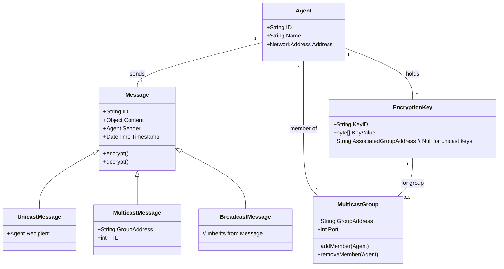

# Software Requirements Specification (SRS)
## Extended Communication Module for agentMom Framework
**Document Version:** 1.0
**Date:** [Current Date]
**Status:** Draft for Review

---

### 1. Introduction

#### 1.1 Purpose
This document defines the requirements for extending the agentMom multi-agent system framework to support broadcasting, multicasting, and secured communication capabilities. It is intended for the project development team, academic advisors, committee members, and future multi-agent system developers who will utilize the enhanced framework.

#### 1.2 Scope
This project extends the core agentMom framework (version 1.2) by implementing new communication modes and security features.

**In-Scope:**
*   Implementation of unicast, multicast, and broadcast message transmission.
*   Management of multicast group membership (join/leave).
*   Integration of optional message encryption and decryption for unicast and multicast.
*   Maintenance of backward compatibility with existing agentMom 1.2 agents and APIs.
*   Configuration of Time-To-Live (TTL) for multicast messages.

**Out-of-Scope (Non-Goals):**
*   Guaranteeing reliable, in-order delivery for multicast or broadcast messages.
*   Providing cryptographically unbreakable or certified encryption.
*   Modifying the core agent logic, reasoning, or planning algorithms.
*   Implementing complex key exchange protocols (e.g., PKI).
*   Guaranteeing delivery in hostile network environments (e.g., guaranteed firewall traversal).

#### 1.3 Definitions, Acronyms, and Abbreviations
*   **agentMom:** The existing multi-agent system framework being extended.
*   **Unicast:** One-to-one message transmission to a specific network address.
*   **Multicast:** One-to-many message transmission to a specific group address. Only agents subscribed to the group receive the message.
*   **Broadcast:** One-to-all message transmission to all agents on a local network segment.
*   **TTL (Time-To-Live):** A counter field in network packets that limits their propagation scope.
*   **SLA (Service Level Agreement):** Defined expectations for system performance or reliability.
*   **API (Application Programming Interface):** The set of methods exposed by the framework for developers to use.

#### 1.4 References
*   agentMom Framework Documentation, Version 1.2
*   Java Platform, Standard Edition Documentation, Version 1.4.0
*   IETF RFC 1112 - "Host Extensions for IP Multicasting"

#### 1.5 Overview
The remainder of this document details the overall description of the product (Section 2) and the specific requirements (Section 3). It covers functional requirements, domain models, interfaces, and constraints.

---

### 2. Overall Description

#### 2.1 Product Perspective
This project is an enhancement module that integrates with the existing agentMom framework. It sits between the core agent logic and the network transport layer, providing new communication services without altering the fundamental agent lifecycle.

#### 2.2 Stakeholders and User Classes
| Stakeholder / User Class | Primary Interest / Role |
| :--- | :--- |
| **Project Advisor & Committee** | Review technical soundness, completeness of deliverables, and academic merit. |
| **Multi-Agent System Developer** | Uses the extended framework's APIs to build agents capable of enhanced communication. Primary consumer of this SRS. |
| **Agent (as a System Actor)** | The runtime entity that sends/receives messages and manages group membership via the framework's internal mechanisms. |

#### 2.3 Operating Environment
*   **Software:** Java Runtime Environment (JRE) 1.4.0 or later.
*   **Network:** Standard TCP/IP network stack with support for IP Multicast (IGMP) for multicast functionality. UDP support for broadcast.
*   **Hardware:** Any hardware capable of running the JRE and standard network interfaces.

#### 2.4 Design and Implementation Constraints
1.  **Backward Compatibility:** The public API for existing agent communication must remain unchanged. New features must be additive.
2.  **Java 1.4.0 Compatibility:** All code must compile and run under JRE 1.4.0.
3.  **Network Protocol Reliance:** Unicast uses TCP, multicast uses IP Multicast, broadcast uses UDP. Functionality is subject to underlying network support and configuration.

#### 2.5 Assumptions and Dependencies
*   It is assumed the network infrastructure supports IP Multicast for multicast features to work.
*   The "Key Manager Agent" is an external component that must be developed and deployed separately for secure group communication to function.
*   Agents are trusted to manage their encryption keys appropriately.

---

### 3. Specific Requirements

#### 3.1 Functional Requirements

##### 3.1.1 Communication Modes
*   **FR-UC-01: Unicast Transmission**
    The system shall allow an agent to send a message directly to a single, specified recipient agent using a reliable transport protocol (TCP).
*   **FR-MC-01: Multicast Transmission**
    The system shall allow an agent to send a message to all agents currently subscribed to a specified multicast group address using IP Multicast.
*   **FR-BC-01: Broadcast Transmission**
    The system shall allow an agent to send a message to all agents reachable on the local network subnet using UDP broadcast.
*   **FR-MC-02: Group Membership Management**
    The system shall provide methods for an agent to dynamically join or leave a multicast group.
*   **FR-MC-03: Multicast Message Filtering**
    The system shall deliver a multicast message **only** to agents that have joined the specific group address to which the message was sent.

##### 3.1.2 Security Features
*   **FR-SEC-01: Optional Message Encryption**
    The system shall provide an option to encrypt the content of a message (unicast or multicast) before transmission.
*   **FR-SEC-02: Message Decryption**
    The system shall automatically attempt to decrypt an incoming encrypted message if the receiving agent possesses the correct key.
*   **FR-SEC-03: Plaintext Fallback**
    The system shall transmit messages in plaintext when encryption is not requested or no key is available.

##### 3.1.3 Configuration and Management
*   **FR-CFG-01: Configurable Multicast TTL**
    The system shall allow the Time-To-Live (TTL) value for multicast packets to be configured, either globally or per-message.
*   **FR-CFG-02: Event Logging**
    The system shall log significant communication events (e.g., message sent/received, join/leave group, encryption success/failure) to a configurable log output.

#### 3.2 Use Cases

**Primary Actor:** Agent

| Use Case ID | Use Case Name | Description |
| :--- | :--- | :--- |
| UC-01 | Send Unicast Message | An agent sends a message to one specific recipient. |
| UC-02 | Send Multicast Message | An agent sends a message to all members of a group it has joined. |
| UC-03 | Send Broadcast Message | An agent sends a message to all agents on the local network. |
| UC-04 | Join Multicast Group | An agent subscribes to receive messages for a specific multicast group. |
| UC-05 | Leave Multicast Group | An agent unsubscribes from a multicast group. |

**Exception Scenarios:**
1.  **UC-EX-01:** An agent not subscribed to Group X does not receive multicast messages sent to Group X.
2.  **UC-EX-02:** A multicast/broadcast message is dropped due to network constraints (TTL expired, firewall, lack of support). The system makes no delivery guarantee.
3.  **UC-EX-03:** An encrypted message arrives, but the recipient lacks the correct key. Decryption fails, and the message is logged as unprocessable.

#### 3.3 Domain Model (Class Diagram)

#### 3.4 External Interface Requirements

##### 3.4.1 Software Interfaces
*   **Java Runtime Environment (JRE 1.4.0):** The system is built upon and requires this JRE version.
*   **agentMom Core Framework:** The module will integrate as a plug-in/library, extending the communication service layer.

##### 3.4.2 Communication Interfaces
| Interface | Direction | Purpose | Protocol | Input | Output | SLA |
| :--- | :--- | :--- | :--- | :--- | :--- | :--- |
| Unicast Channel | Out/In | Reliable point-to-point messaging | TCP/IP | Serialized `UnicastMessage` | Network packets | Reliable, in-order delivery. |
| Multicast Channel | Out/In | Group messaging | IP Multicast | Serialized `MulticastMessage` & Group Address | Multicast packets | Best-effort delivery. Depends on network multicast support. |
| Broadcast Channel | Out/In | Local network announcement | UDP | Serialized `BroadcastMessage` | Broadcast packets | Best-effort delivery. May be blocked by OS/network policies. |
| Key Manager Agent | Out/In | Secure key distribution | Framework-defined over Unicast | Key Request Message | `EncryptionKey` Object | Must maintain list of authorized agents. Availability is critical for secure group setup. |

#### 3.5 Non-Functional Requirements

*   **NFR-PER-01: Concurrency**
    The system shall support concurrent sending and receiving of messages from multiple agents without deadlocks or significant performance degradation under normal load.
*   **NFR-PER-02: Configurable Scope**
    The network scope of multicast messages shall be controllable via the configurable TTL parameter.
*   **NFR-REL-01: Delivery Guarantees**
    Unicast messages shall be delivered reliably and in the order they were sent. Multicast and Broadcast messages are delivered on a **best-effort** basis with no guarantee of reliability or order.
*   **NFR-SEC-01: Encryption Mechanism**
    The system shall provide a mechanism for symmetric encryption/decryption of message content. The specific algorithm is TBD but shall be from a well-vetted standard library.
*   **NFR-COM-01: Backward Compatibility**
    The extended framework must be fully compatible with agents developed for agentMom version 1.2. Existing agent code must not require modification.
*   **NFR-OBS-01: Observability**
    The system shall provide configurable logging for key events (send, receive, join, leave, encryption/decryption attempt and status) to aid in debugging and monitoring.

#### 3.6 Acceptance Criteria
*   **AC-MC-01:** Given Agent A and Agent B have joined multicast group "G1", when Agent A sends a multicast message to "G1", then Agent B receives the message.
*   **AC-MC-02:** Given Agent C has **not** joined multicast group "G1", when a message is sent to "G1", then Agent C does **not** receive the message.
*   **AC-SEC-01:** Given Agent X and Agent Y possess a shared encryption key, when Agent X sends an encrypted unicast message to Agent Y, then Agent Y receives and successfully decrypts the message.
*   **AC-SEC-02:** Given an agent sends a unicast message with the encryption flag set to `false`, then the message payload is transmitted as plaintext.

---

### 4. Supporting Information

#### 4.1 Business Process Flows
**Process: Agent Sends a Message**
1.  **Trigger:** Agent logic decides to communicate.
2.  **Input:** Content, Destination (AgentID / GroupAddress / Broadcast), `encryptFlag`.
3.  Agent invokes framework send API (`sendUnicast()`, `sendMulticast()`, `sendBroadcast()`).
4.  Framework creates appropriate message object (`UnicastMessage`, etc.).
5.  If `encryptFlag==true` and a valid key exists, framework encrypts message content.
6.  Framework serializes message and passes it to the appropriate network channel (TCP, Multicast Socket, UDP Socket).
7.  Message traverses the network.
8.  Receiving framework layer receives network packets, deserializes the message.
9.  If message is encrypted, framework attempts decryption using local key store.
10. **Output:** Decrypted (or plaintext) message content is delivered to the recipient agent's `onMessage()` handler.

#### 4.2 Risk Management
| Risk | Probability | Impact | Mitigation Strategy |
| :--- | :--- | :--- | :--- |
| Multicast not supported | Medium | High | Document as a prerequisite. For critical group functions, design a fallback using serial unicast (outside core scope). |
| Broadcast blocked | Medium | Medium | Use broadcast only for non-critical discovery. Advise developers to use multicast/unicast for core messaging. |
| Weak encryption | Low | Medium | Use a standard library (e.g., JCE). Clearly document in API that security is "basic" and for non-critical data. |
| Key Manager single point of failure | Medium | High | Design the Key Manager agent for high reliability. Document its critical role in system architecture. |
| Backward compatibility broken | Low | High | Adhere to strict API compatibility. Implement extensive integration tests with v1.2 agent samples. |
| Network performance degradation | Low | Medium | Implement configurable TTL. Advise prudent use of broadcast/multicast in developer guidelines. |

#### 4.3 Open Issues / TBD Items
1.  **TBD-ALG-01:** Specific encryption algorithm and Java library to be used.
    *   *Responsible: Developer/Advisor*
2.  **TBD-API-01:** Detailed method signatures for the new communication APIs (`sendMulticast()`, `joinGroup()`, etc.).
    *   *Responsible: Developer*
3.  **TBD-DISC-01:** Mechanism for dynamic discovery of available multicast groups.
    *   *Responsible: Developer*
4.  **TBD-TTL-01:** Default TTL value for multicast messages.
    *   *Responsible: Developer*
5.  **TBD-SEC-02:** Policy for handling malformed or malicious messages (e.g., size limits, schema validation).
    *   *Responsible: Developer/Advisor*
6.  **TBD-LOG-01:** Detailed logging format, levels, and configuration mechanism.
    *   *Responsible: Developer*

---
**Document Approval:**

| Role | Name | Signature | Date |
| :--- | :--- | :--- | :--- |
| Project Developer | | | |
| Project Advisor | | | |
| Committee Member | | | |