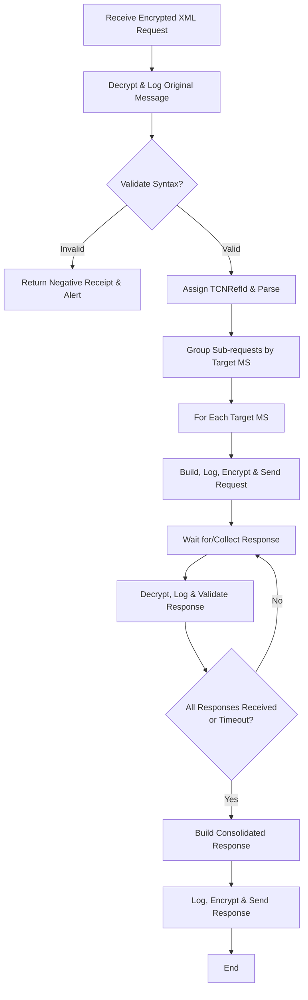
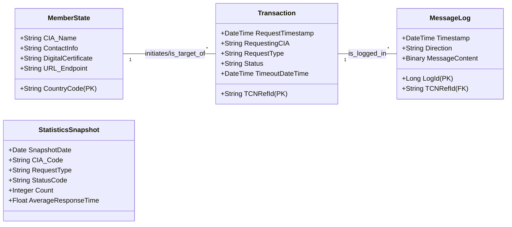

# Software Requirements Specification (SRS)
## TACHOnet System
### Version 1.0

**Document Status:** Draft for Review  
**Date:** [Current Date]  
**Authors:** [Author Names/Team]  
**Approval:** [Pending]

---

## 1. Introduction

### 1.1 Purpose
This Software Requirements Specification (SRS) document defines the functional and non-functional requirements for the TACHOnet system. It serves as a comprehensive guide for stakeholders, developers, testers, and project managers involved in the design, implementation, verification, and maintenance of the system.

### 1.2 Scope
TACHOnet is a secure network system that facilitates cross-border communication between Member States' Card Issuing Authorities (CIAs) for the administrative management of tachograph driver smart cards.

**In-Scope:**
*   Secure, asynchronous XML message exchange between CIAs for administrative tasks.
*   Core functions: Checking driver card issuance, verifying card status, declaring status modifications, and assigning cards to foreign driving licenses.
*   Provision of supporting services (Phonex search keys, transliteration).
*   Generation and presentation of system usage statistics.
*   System administration, monitoring, and configuration.
*   Guarantee of data privacy, non-repudiation, and prevention of a consolidated European database.

**Out of Scope (Non-Goals):**
*   Management of individual CIA users (handled locally by each Member State).
*   Support for non-tachograph card types (e.g., workshop or company cards).
*   Direct access to or management of driver data held in Member State national registers.

### 1.3 Definitions, Acronyms, and Abbreviations
| Term | Definition |
| :--- | :--- |
| **CIA** | Card Issuing Authority. The national authority in a Member State responsible for issuing tachograph driver cards. |
| **TCN** | TACHOnet. |
| **TESTA-II** | Trans-European Services for Telematics between Administrations. The secure private network used for communication. |
| **TCNRefId** | A unique reference identifier assigned by TACHOnet to each transaction. |
| **Phonex** | A phonetic algorithm for indexing names by sound. |
| **MOM** | Microsoft Operations Manager (System Center Operations Manager). |
| **DG TREN** | Directorate-General for Transport and Energy (European Commission). |
| **OLAP** | Online Analytical Processing. |
| **DTS/SSIS** | Data Transformation Services / SQL Server Integration Services. |

### 1.4 References
*   [Reference to relevant EU Regulations on Tachographs]
*   [Reference to TESTA-II Network Specifications]
*   [Reference to TACHOnet XML Message Schema Definition]

### 1.5 Document Overview
This document is structured to present an overall description of the product, followed by specific functional and non-functional requirements, and concluding with project planning information.

## 2. Overall Description

### 2.1 Product Perspective
TACHOnet is a middleware messaging hub. It operates within the secure TESTA-II network, connecting disparate national CIA systems without storing a central copy of driver data. It relies on external systems for network transport (TESTA-II), monitoring (MOM), and data persistence (SQL Server).

### 2.2 User Classes and Characteristics
| User Class | Characteristics | Key Responsibilities |
| :--- | :--- | :--- |
| **CIA Application** | Automated system. Represents a Member State's backend. | Sends/receives encrypted XML requests and responses via TESTA-II. |
| **CIA User** | Clerk or enforcement officer within a Member State. Managed locally. | Initiates administrative tasks via their national CIA application. May use TACHOnet's public web services (e.g., Phonex). |
| **CIA Administrator** | Technical/Admin staff within a Member State. Has a TACHOnet web account. | Administers the national CIA application interface. Browses TACHOnet usage statistics for their Member State via the secure web portal. |
| **TCN Administrator** | Central system operator. Highest level of access. | Performs overall system administration, configuration (e.g., adding Member States), monitoring, and maintenance. |

### 2.3 Operating Environment
*   **Network:** TESTA-II secure private network.
*   **Application Server:** Microsoft Windows Server, Microsoft BizTalk Server.
*   **Database:** Microsoft SQL Server.
*   **Monitoring:** Microsoft Operations Manager (MOM).
*   **Security:** Digital certificates for encryption/signing, Windows Authentication for web portal.

### 2.4 Design and Implementation Constraints
1.  **Messaging:** Must use predefined XML schemas over TESTA-II.
2.  **Security:** Must implement encryption and digital signatures as per EU cryptographic policies.
3.  **Architecture:** Must prevent the permanent storage of consolidated personal data from multiple Member States.
4.  **Integration:** Must support asynchronous, store-and-forward message patterns.

### 2.5 Assumptions and Dependencies
*   Member State CIAs possess the technical capability to connect to TESTA-II and exchange XML messages.
*   The TESTA-II network provides a reliable and secure communication channel.
*   Digital certificates for all participating CIAs are issued and managed by a trusted PKI.

## 3. System Features and Requirements

### 3.1 Feature 1: Cross-Border Administrative Messaging
**Description:** The system shall provide secure, reliable routing of administrative requests and responses between Card Issuing Authorities of different Member States.

**3.1.1 Use Case UC-01: Check Driver's Issued Cards**
*   **Actor:** CIA Application
*   **Precondition:** The requesting CIA Application is configured and connected to TACHOnet.
*   **Main Flow:**
    1.  CIA Application sends an encrypted `CheckDriverRequest` XML message containing driver details (surname, first name, date of birth).
    2.  TACHOnet validates the message, assigns a TCNRefId, and determines the target issuing Member State(s).
    3.  TACHOnet forwards the request to the CIA Application of the target Member State(s).
    4.  TACHOnet aggregates the response(s) from the target CIA(s).
    5.  TACHOnet sends an encrypted `CheckDriverResponse` back to the requesting CIA.
*   **Alternate Flows:**
    *   **Invalid Message:** If the request is malformed, TACHOnet immediately returns a negative receipt.
    *   **Timeout:** If a target CIA does not respond within the timeout period, the consolidated response indicates a timeout for that Member State.

**3.1.2 Use Case UC-02: Check Tachograph Card Status**
*   **Actor:** CIA Application
*   **Flow:** Similar to UC-01, but the request (`CheckCardRequest`) contains a specific card number and type, and is routed to the single issuing Member State.

**3.1.3 Use Case UC-03: Declaration of Card Status Modification**
*   **Actor:** CIA Application
*   **Flow:** A CIA sends a `ModifyCardStatusRequest` (e.g., status changed to "Lost") to TACHOnet, which routes it to the CIA of the Member State that issued the card.

**3.1.4 Use Case UC-04: Send Card/Driving License Assignment**
*   **Actor:** CIA Application
*   **Flow:** When a CIA issues a new card against a foreign driving license, it sends an `AssignmentNotification` to TACHOnet, which routes it to the Member State that issued the driving license.

### 3.2 Feature 2: Support Services
**Description:** The system shall provide auxiliary services to aid Member States in preparing and standardizing data.

**3.2.1 Use Case UC-05/06: Get Phonex Search Keys & Transliteration**
*   **Actor:** CIA User / CIA Application
*   **Flow:** A user or application submits a name string via a web service call or UI. The service returns the standardized Phonex phonetic key or a transliterated version (e.g., Greek to Latin).

### 3.3 Feature 3: Reporting and Statistics
**Description:** The system shall generate and present usage statistics for monitoring and auditing purposes.

**3.3.1 Use Case UC-09: Generate Statistics**
*   **Actor:** System (Scheduled Job)
*   **Flow:** A nightly SQL Server Agent/SSIS job extracts transaction data, processes it into aggregate form, and loads it into a data warehouse and OLAP cubes.

**3.3.2 Use Case UC-10: Browse Statistics**
*   **Actor:** CIA Administrator / TCN Administrator
*   **Precondition:** User has valid Windows credentials for the reporting portal.
*   **Flow:** The administrator logs into the secure ReportManager web portal, selects report parameters (e.g., date range, Member State, request type), and views or downloads the report in the chosen format (HTML, Excel, XML).

### 3.4 Feature 4: System Administration
**Description:** The system shall allow for central configuration, monitoring, and maintenance.

**3.4.1 Use Case UC-12: Monitor the System**
*   **Actor:** TCN Administrator
*   **Flow:** The administrator uses the MOM console to view system health alerts, performance counters, and event logs from TACHOnet servers and BizTalk.

**3.4.2 Use Case UC-08: Manage Member State**
*   **Actor:** TCN Administrator
*   **Flow:** The administrator adds a new Member State CIA to TACHOnet by configuring its details (country code, endpoint URL, digital certificate) in BizTalk and creating reporting accounts in Active Directory.

## 4. External Interface Requirements

### 4.1 User Interfaces
*   **Statistics Reporting Portal:** A secure, web-based interface (ReportManager) for administrators. Requires Windows Authentication.
*   **Phonex/Transliteration Service UI:** A simple public web page for manual conversion of names.

### 4.2 Hardware Interfaces
*   Interfaces with TESTA-II network infrastructure.

### 4.3 Software Interfaces
| Interface | Protocol/Standard | Purpose | Key Requirements |
| :--- | :--- | :--- | :--- |
| **CIA Application** | Encrypted XML over HTTPS (TESTA-II) | Core administrative messaging. | Asynchronous, SLA: <1 min for enforcement requests, 24x7 availability, 3 retries on failure. |
| **Phonex Web Service** | SOAP/HTTP over TESTA | Provide phonetic/transliteration services. | Synchronous, supports UTF-8 input. |
| **SQL Server Database** | T-SQL, ODBC/OLE DB | Internal data persistence and processing. | Nightly ETL jobs must not impact live transaction performance. |
| **MOM Monitoring** | WMI, MOM Agent | System health and performance monitoring. | Configurable alert rules for BizTalk and server metrics. |

### 4.4 Communications Interfaces
All cross-border communication shall occur over the secure TESTA-II network, using mutually authenticated TLS channels and message-level encryption as specified.

## 5. Non-Functional Requirements

### 5.1 Performance Requirements
*   The end-to-end response time for enforcement-related requests (e.g., card status check) shall be less than one (1) minute under normal load conditions.
*   Background statistical processing shall not cause perceptible degradation to interactive request processing.
*   The system shall handle peak message volumes as projected by the Member State rollout plan.

### 5.2 Reliability, Availability, and Maintainability
*   **Availability:** The system shall be designed for 24x7 operation with minimal planned downtime.
*   **Reliability:** The system shall be robust and tolerant of operator errors. Message loss shall be prevented through guaranteed delivery patterns and persistent logging.
*   **Maintainability:** Configuration of new Member States shall be performed via documented procedures and scripts to minimize human error.

### 5.3 Security Requirements
*   **Data Privacy:** Personal data shall not be persisted in TACHOnet longer than necessary for transaction completion and legal audit purposes. A consolidated EU database shall be prevented.
*   **Non-Repudiation:** All messages shall be immutably logged in their raw (encrypted) form to provide proof of receipt and sending.
*   **Access Control:** Access to the statistics web portal shall be controlled via Windows Integrated Authentication. Administrative functions shall require TCN Administrator privileges.
*   **Cryptography:** All cross-border messages shall be encrypted and signed using approved digital certificates and algorithms.

### 5.4 Compliance Requirements
*   The system shall comply with the XML messaging schemas and cryptographic policies defined by the governing EU body (DG TREN).
*   The system must operate exclusively within the TESTA-II network infrastructure.

## 6. System Models

### 6.1 Business Process Model
**Process: Handle Administrative Request**

### 6.2 Domain Model (Key Entities)

## 7. Acceptance Criteria
*   **Cross-Border Driver Card Check:**
    *   AC1.1: Given a valid `CheckDriverRequest`, the system shall return a consolidated `CheckDriverResponse` within the configured timeout period.
    *   AC1.2: Given an invalid XML request, the system shall immediately return a negative receipt and log an administrator alert.
*   **Secure Message Handling:**
    *   AC2.1: For every message sent or received, an immutable log of the raw message shall be stored.
    *   AC2.2: On a network failure to a Member State endpoint, the system shall retry 3 times before marking the sub-transaction with a 'Server Error' status.
*   **Administrative Reporting:**
    *   AC3.1: Following the successful completion of the nightly statistics job, CIA Administrators shall be able to view updated reports for their Member State.
    *   AC3.2: A CIA Administrator whose password has been reset by the TCN Administrator shall be forced to set a new password upon first login.

## 8. Project Planning Information

### 8.1 Milestones and Release Strategy
1.  **Milestone 1:** Approval of this SRS (v01_00).
2.  **Milestone 2:** Completion of Detailed Technical Design.
3.  **Milestone 3:** Development and Unit Testing of Core Components.
4.  **Milestone 4:** Integration Testing with Pilot Member States on TESTA-II.
5.  **Milestone 5:** Production Deployment and User Acceptance Testing (UAT).
6.  **Milestone 6:** Go-Live and Operational Handover.

### 8.2 Risk Management
| Risk | Probability | Impact | Mitigation Strategy |
| :--- | :--- | :--- | :--- |
| High message volume degrades DB performance. | Medium | High | Proactive DB sizing, archiving strategy, performance tuning. |
| Member State system heterogeneity causes integration failures. | High | High | Clear specifications, reference implementations, conformance testing phase. |
| Failure to meet <1 min response time SLA. | Medium | High | Optimize processing pipeline, enforce response SLAs on MS, implement caching. |
| Statistics generation impacts live system. | Medium | Medium | Schedule jobs for off-peak hours, use separate reporting databases. |

### 8.3 Open Issues
| Issue | Description | Responsible Party |
| :--- | :--- | :--- |
| **OPS-01** | Final data retention policy for detailed message logs. | DG TREN / Legal & Compliance |
| **OPS-02** | Final firewall configuration for MOM monitoring traffic. | EC Data Center & TCN Admin |
| **CONF-01** | Final set of allowed card status transitions. | Card Issuing Working Group |
| **CONF-02** | Requirements for additional character set transliteration. | DG TREN / Member States |

---
*[End of Document]*