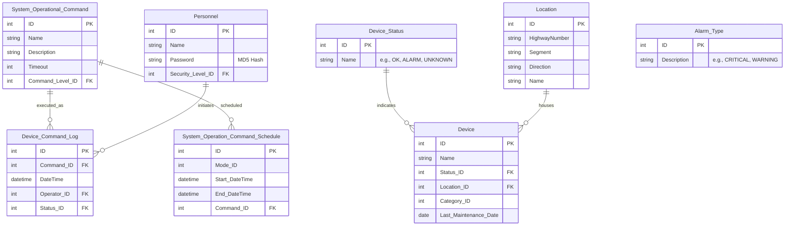

# Software Requirements Specification (SRS)
## For the I-15 Reversible Lane Control System (I-15 RLCS) Application

**Document Version:** 1.0
**Date:** October 26, 2023
**Status:** Draft for Review
**Project Sponsor:** Caltrans District 11

---

### 1. Introduction

#### 1.1 Purpose
This Software Requirements Specification (SRS) document defines the functional and non-functional requirements for the I-15 Reversible Lane Control System (RLCS) application software. It serves as the authoritative reference for developers, testers, project managers, and stakeholders, ensuring a common understanding of the system to be built.

#### 1.2 Scope
The scope of this project is the development of a new software application to replace an aging, non-expandable system. The primary purpose of the I-15 RLCS is to **safely open and close reversible lanes** for peak traffic hours and special events by monitoring and controlling field devices (e.g., gates, pop-up barriers, changeable message signs).

**In-Scope:**
*   Development of a new application with a Graphical User Interface (GUI).
*   Interface with new controller hardware and field device interface cards via standardized I/O driver software.
*   Core functionality for device monitoring, command execution, scheduling, alarm management, user security, and reporting.
*   System-level interfaces with the network, operating system, and database.

**Out of Scope (Non-Goals):**
*   Development of the underlying I/O driver software or controller firmware.
*   Interfacing with external applications beyond defined system-level interfaces (e.g., direct integration with other traffic management applications).
*   Establishing or supporting regulatory policies not specifically covering the RLCS.
*   Physical installation of field hardware or network infrastructure.

#### 1.3 Definitions, Acronyms, and Abbreviations
| Term | Definition |
| :--- | :--- |
| **RLCS** | Reversible Lane Control System |
| **ATMS** | Advanced Traffic Management System |
| **ATIS** | Advanced Traveler Information Systems |
| **TMC** | Transportation Management Center |
| **FCU** | Field Control Unit |
| **DCU** | Device Control Unit |
| **CMS** | Changeable Message Sign |
| **COTS** | Commercial Off-The-Shelf |
| **SLA** | Service Level Agreement |
| **GUI** | Graphical User Interface |

#### 1.4 References
*   *Appendix F: RLCS Safety Screening Rules* (Referenced in Compliance requirements)
*   Caltrans District 11 Operational Guidelines for Reversible Lanes

#### 1.5 Document Overview
This document is structured to present an overall description of the product, followed by specific requirements. It covers stakeholder needs, system interfaces, functional capabilities, non-functional constraints, and project considerations.

### 2. Overall Description

#### 2.1 Product Perspective
The RLCS application is a mission-critical, real-time control system. It operates as the central software component within a larger hardware and network ecosystem, including field controllers, communication networks, and external traffic systems.

#### 2.2 User Classes and Characteristics
| User Class | Characteristics & Key Responsibilities |
| :--- | :--- |
| **Operator** | Primary system controller during normal operations. Can initiate/manual commands, acknowledge alarms. Only one operator can have command control at a time. |
| **Management** | Views system status and generates/views reports. No control capabilities. |
| **Field Maintenance Staff** | Controls the system during maintenance mode. Can perform device tests and overrides from FCU workstations or via secure remote dial-in. |
| **System Administrator** | District 11 technical staff. Manages system configuration: creates/modifies user accounts, security permissions, device definitions, and operational schedules. |
| **Electrical Systems (Hardware)** | Views system status and reports for diagnostic purposes. |
| **Software Systems (Software)** | Views system status and reports for diagnostic purposes. |

#### 2.3 Operating Environment
*   **Software:** Microsoft Windows OS; COTS Database (e.g., Oracle); COTS Reporting Tool (e.g., Crystal Reports).
*   **Hardware:** TMC workstations, intelligent field controllers (e.g., 2070 ATC or equivalent), field device I/O cards.
*   **Network:** Private Caltrans network connecting TMC, FCUs, and DCUs.

#### 2.4 Design and Implementation Constraints
1.  Must interface with field hardware via standardized driver software APIs.
2.  Database schema must support configurable rules and parameters to minimize code changes for future roadway modifications.
3.  Security must implement multi-factor checks (user level, device, mode, workstation).
4.  Architecture must support redundant control paths (TMC -> FCU -> DCU -> Manual).

#### 2.5 Assumptions and Dependencies
*   The selected COTS database and reporting tools will perform as required.
*   The communication network will provide the necessary bandwidth and reliability.
*   Field device controllers and I/O drivers will be provided and will conform to specified interface standards.

### 3. System Features and Requirements

#### 3.1 Functional Requirements

**3.1.1 User Authentication and Authorization (FR-01)**
*   **FR-01.1:** The system shall require user login with a unique ID and password.
*   **FR-01.2:** The system shall store user passwords using MD5 hash encryption.
*   **FR-01.3:** The system shall enforce user command levels, preventing users from performing actions outside their permissions (e.g., "Status Only" users cannot issue control commands).
*   **FR-01.4:** The system shall allow only one user to have active command control at any given time in Normal mode.

**3.1.2 Device Monitoring and Status Propagation (FR-02)**
*   **FR-02.1:** The system shall automatically poll the status of all field devices at a configurable interval, supporting a goal of 2-second GUI updates.
*   **FR-02.2:** The system shall update the GUI display with current device status within 2 seconds of a state change.
*   **FR-02.3:** The system shall log all device status changes to the database.
*   **FR-02.4:** Upon failure of a device to report status, the system shall retry a configurable number of times before generating a device failure alarm.

**3.1.3 Command Execution and Safety Screening (FR-03)**
*   **FR-03.1:** The system shall execute pre-defined "Super Macro" command sequences (e.g., "Open Southbound Lanes") comprised of individual device commands.
*   **FR-03.2:** Before executing any command, the system shall perform multi-layered safety screening against a rule set stored in the database (e.g., prevent opening a southbound gate if a northbound gate is open).
*   **FR-03.3:** The system shall block any command that violates a safety rule and immediately notify the operator with the reason.
*   **FR-03.4:** For scheduled operations, the system shall prompt the operator for confirmation before execution begins.

**3.1.4 Sequence Management and Alarm Handling (FR-04)**
*   **FR-04.1:** During a command sequence, the system shall monitor device status after each step and wait for confirmation within a command-specific timeout period.
*   **FR-04.2:** If a device fails to confirm a commanded state within the timeout, or if a critical alarm (e.g., opposite-direction device activation) occurs, the system shall immediately halt the sequence, enter a 'Hold' state, and activate audible/visual alarms.
*   **FR-04.3:** The system shall provide authorized operators the ability to override a device status (with logging) and then resume or abort the halted sequence.

**3.1.5 Scheduling (FR-05)**
*   **FR-05.1:** The system shall allow a System Administrator to create, modify, and delete schedules for command sequences.
*   **FR-05.2:** The system shall automatically initiate a scheduled command sequence when the system time reaches the scheduled start time and the system is in the appropriate mode.

**3.1.6 Reporting (FR-06)**
*   **FR-06.1:** The system shall export log data (Alarm Log, Daily Diary, Command Log) to a COTS reporting tool for generation of standard and ad-hoc reports.
*   **FR-06.2:** Report generation shall not degrade the performance of core real-time control functions.

**3.1.7 System Administration & Configuration (FR-07)**
*   **FR-07.1:** The system shall provide a secure interface for the System Administrator to manage all configuration data: users, devices, locations, command rules, and system parameters.
*   **FR-07.2:** When a System Administrator modifies a safety rule, the system shall analyze the change for logical conflicts before saving it to the database.

**3.1.8 System Integrity and Diagnostics (FR-08)**
*   **FR-08.1:** Upon startup, the system shall perform an integrity check (e.g., MD5 hash verification) on critical data and software in field controller non-volatile memory.
*   **FR-08.2:** The system shall perform daily automatic integrity checks and generate an alarm on verification failure.

#### 3.2 External Interface Requirements

**3.2.1 Hardware Interfaces**
*   **HI-01:** The application shall communicate with field devices (gates, pop-ups, CMS) via standardized I/O driver software that abstracts the specific intelligent field controller hardware (e.g., 2070 ATC).

**3.2.2 Software Interfaces**
*   **SI-01:** **COTS Database:** The application shall persist all operational, configuration, and log data to a relational database management system (e.g., Oracle). Update/retrieval operations must support sub-2-second GUI response times.
*   **SI-02:** **External Systems Server:** The application shall publish RLCS status data (lane status, access, sign messages) to an external server every 30 seconds for consumption by ATMS, ValuePricing, and ATIS.
*   **SI-03:** **COTS Reporting Tool:** The application shall provide data export capabilities to a reporting tool (e.g., Crystal Reports) for report generation.

**3.2.3 Communications Interfaces**
*   **CI-01:** **TMC/FCU/DCU Network:** The application shall communicate over a private network using protocols that support checksums for data integrity. The network must support the polling transmission rate required for 2-second status updates.
*   **CI-02:** **Remote Dial-in Interface:** The system shall support secure remote access for Field Maintenance Staff through a firewall, requiring standard user credentials.

#### 3.3 Non-Functional Requirements

| Category | Requirement | Metric / Standard |
| :--- | :--- | :--- |
| **Performance** | GUI Status Update | Device status changes reflected in GUI within **2 seconds**. |
| | System Throughput | Must support at least **4 scheduled normal-mode operations per day**, plus concurrent emergency/maintenance events. |
| | Command Response | Field device must respond to a control command within **12 seconds** of operator confirmation. |
| **Reliability** | Availability | System availability target of **99.99%** (< 53 minutes of downtime per year). |
| | Continuous Operation | Must function without a restart due to RLCS application error for **30 consecutive days**. |
| **Security** | Data at Rest | User passwords stored using **MD5 hash**. Command rules and login data in controllers stored in **encrypted, non-volatile memory**. |
| | Access Control | Multi-factor security based on command level, device, mode, workstation, and function. |
| **Compliance** | Safety | Must adhere to all safety screening rules defined in **Appendix F** to prevent wrong-way openings. |
| **Observability** | Logging | All application activity, commands, and state changes shall be logged. |
| | Alarm Detection | Alarm conditions shall be detected and raised within **2 seconds**. |
| | Alarm Notification | System shall provide configurable audible and visual alarms for operator attention. |
| **Maintainability** | Configuration | Device rules and operational parameters shall be stored in updatable database tables to avoid source code changes for minor field modifications. |

### 4. Supporting Information

#### 4.1 Domain Model (Key Entities)

#### 4.2 Acceptance Criteria (Selected Examples)
*   **AC-01 (Monitoring):** Given the system is operational, when a field device sensor changes state, then the GUI display updates within 2 seconds and the database is updated.
*   **AC-02 (Safety):** Given the northbound gate is open, when an operator attempts to open a southbound gate, then the system blocks the command and notifies the operator of the safety violation.
*   **AC-03 (Security):** Given a user with 'Status Only' command level, when they attempt to issue a device control command, then the system denies the command and logs the attempt.

#### 4.3 Undecided Issues & Open Decisions
| # | Issue | Responsible Party |
| :--- | :--- | :--- |
| 1 | Final selection of intelligent field controller (e.g., 2070 ATC or equivalent). | Caltrans/Contractor |
| 2 | Complete definition of all 'Device Command Rules' for safety screening. | System Administrator/Caltrans |
| 3 | Specific parameters for 'System Control Parameters' (e.g., polling rates per mode). | System Administrator/Caltrans |
| 4 | Final commercial off-the-shelf (COTS) software products for database and reporting. | Contractor |
| 5 | Detailed recovery procedures for each degraded mode scenario. | Contractor/Caltrans Operations |
| 6 | Testing and acceptance criteria for the MD5 hash integrity verification process. | Contractor/Caltrans Software Systems |

---
*This document constitutes the formal requirements for the I-15 RLCS application software. Sign-off by the authorized stakeholders indicates agreement that this SRS accurately and completely describes the system to be developed.*