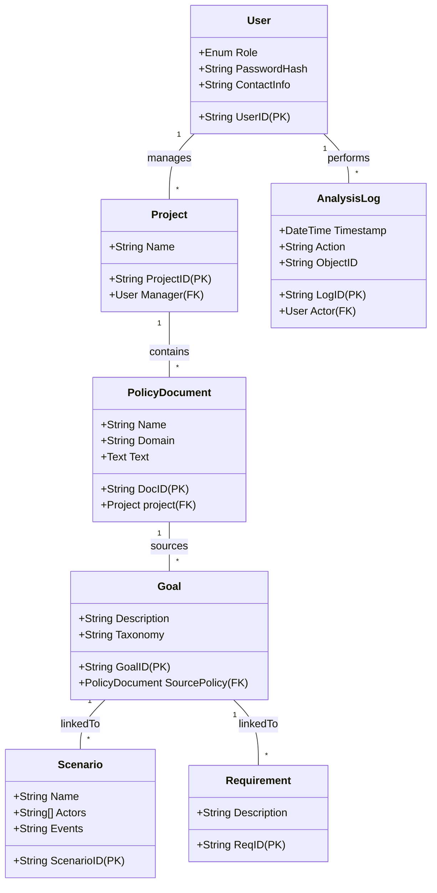

# Software Requirements Specification (SRS)
## Security and Privacy Requirements Analysis Tool (SPRAT)

**Document Version:** 1.0  
**Date:** [Date of Generation]  
**Authors:** [Generated from Provided Summary]  
**Status:** Draft for Review

---

### 1. Introduction

#### 1.1 Purpose
This document defines the functional and non-functional requirements for the Security and Privacy Requirements Analysis Tool (SPRAT). It is intended for use by the project stakeholders, including developers, testers, project managers, and end-users, to ensure a common understanding of the system to be developed.

#### 1.2 Scope
SPRAT is a specialized software tool designed to assist requirements engineers, Chief Privacy Officers, policy analysts, and auditors in the systematic mining, reconciliation, and management of goals and scenarios derived from privacy and security policies for web-based systems. The tool will maintain a centralized repository of these artifacts, ensuring traceability to source policy documents and supporting analysis to detect conflicts and misalignments.

**In-Scope:**
*   User and project management with role-based access control.
*   Policy document ingestion and management.
*   Manual and assisted extraction, classification, and management of goals, scenarios, and requirements.
*   Maintenance of traceability links between all artifacts.
*   Multi-user analysis with comparison and conflict detection features.
*   Integration with external formal analysis tools (Ponder, Alloy) for verification.
*   Generation of reports and audit logs.

**Out-of-Scope (Non-Goals):**
*   SPRAT is not a general-purpose requirements management tool.
*   It does not fully automate legal compliance verification.
*   It does not automatically parse and extract goals from policy documents without analyst input.

#### 1.3 Definitions, Acronyms, and Abbreviations
*   **SPRAT:** Security and Privacy Requirements Analysis Tool.
*   **Goal:** A high-level objective related to privacy or security, extracted from a policy.
*   **Scenario:** A sequence of events illustrating system behavior related to a goal.
*   **RACAF:** Requirements-level Access Control Analysis Framework.
*   **UAM:** User Access Module.
*   **GSM:** Goal Management Module.
*   **SSM:** Scenario Management Module.
*   **P3P:** Platform for Privacy Preferences.
*   **EPAL:** Enterprise Privacy Authorization Language.
*   **HIPAA/GLBA/COPPA:** Relevant privacy and security regulations.

#### 1.4 References
*   Project Vision and Scope Summary (Provided Input).
*   Stakeholder Interviews and Use Cases (Provided Input).

#### 1.5 Overview
The remainder of this SRS is organized as follows: Section 2 provides an overall description of the product. Section 3 details the specific system requirements. Appendices may contain supplementary information.

### 2. Overall Description

#### 2.1 Product Perspective
SPRAT is a new, standalone web-based application. It will interact with external tools for advanced analysis and will maintain its own internal database for all repository data.

**System Interfaces:**
*   **Ponder Policy Editor (External):** SPRAT will export access control policy elements to the Ponder editor for formal specification.
*   **Alloy Analyzer (External):** SPRAT will support the translation of specifications (via Ponder) for formal verification in Alloy.
*   **Web Browser (Client):** The primary user interface will be delivered via a modern web browser.
*   **Database (Internal):** A relational database (e.g., PostgreSQL, MySQL) will store all persistent data.

#### 2.2 Product Functions (High-Level)
1.  **User & Access Management:** Secure authentication and authorization for Administrators, Project Managers, Analysts, and Guests.
2.  **Project & Policy Management:** Create projects, upload/manage policy documents, and assign analysts.
3.  **Goal Management:** Create, read, update, delete, and classify goals with traceability to source policies.
4.  **Scenario & Requirement Management:** Create scenarios and requirements and link them to goals.
5.  **Analysis & Comparison:** Enable blinded, multi-user analysis of the same policy and generate comparison reports.
6.  **Data Export & Reporting:** Export project data, goals, scenarios, and generate analysis reports.
7.  **Audit Logging:** Record all critical user actions for security and compliance.
8.  **Integration Support:** Facilitate data exchange with external formal analysis tools.

#### 2.3 User Characteristics
| Role | Expertise | Key Activities |
| :--- | :--- | :--- |
| **Administrator** | IT System Administration | Manage user accounts, reset passwords, configure system groups. |
| **Project Manager** | Project Management, Privacy Law | Oversee projects, manage policy documents, assign analysts, control data export. |
| **Analyst** | Requirements Engineering, Policy Analysis | Extract and classify goals, create scenarios and requirements, perform analysis. |
| **Guest** | General (e.g., Auditor, Reviewer) | View read-only information as permitted by Project Managers. |

#### 2.4 Constraints
1.  **Technical:** Must be accessible via standard web browsers. Must support secure (hashed) password storage.
2.  **Regulatory:** The tool's classification system must support analysis frameworks relevant to regulations like HIPAA, COPPA, and GLBA.
3.  **Business:** Initial development must focus on high and medium-priority requirements as defined in the project backlog.

#### 2.5 Assumptions and Dependencies
*   **Assumption:** Users will have a basic understanding of privacy/security policy concepts.
*   **Dependency:** Successful integration with the Ponder editor requires a stable, documented API or export format from the Ponder tool.
*   **Assumption:** A dedicated database server will be available for deployment.

### 3. Specific Requirements

#### 3.1 Functional Requirements

**3.1.1 User Access Management (UAM)**
*   **FR-UAM-1:** The system shall allow an Administrator to create, modify, and deactivate user accounts.
*   **FR-UAM-2:** The system shall assign one of the following roles to each user: Administrator, Project Manager, Analyst, or Guest.
*   **FR-UAM-3:** The system shall require secure authentication (username and password) for all users except publicly available login pages.
*   **FR-UAM-4:** The system shall enforce role-based access control (RBAC) to all system functions and data based on the user's role.
*   **FR-UAM-5:** A Project Manager shall be able to control which policy documents and projects a Guest user can view.

**3.1.2 Project and Policy Management**
*   **FR-PPM-1:** A Project Manager shall be able to create a new Project, specifying a name and assigning themselves as its manager.
*   **FR-PPM-2:** A Project Manager shall be able to upload a new Policy Document (text) to a Project, assigning it a name and a domain classification (e.g., Healthcare, Finance).
*   **FR-PPM-3:** A Project Manager shall be able to assign one or more Analysts to analyze a specific Policy Document within a Project.
*   **FR-PPM-4:** The system shall maintain a master list of all Policy Documents with their metadata (ID, Name, Domain, Upload Date, Project).

**3.1.3 Goal Management (GSM)**
*   **FR-GSM-1:** An Analyst shall be able to create a new Goal linked to a specific Policy Document.
*   **FR-GSM-2:** Each Goal shall have a system-generated unique ID, a mandatory description, and a traceable link to its source policy text.
*   **FR-GSM-3:** An Analyst shall be able to classify a Goal using a taxonomy (e.g., Policy vs. Scenario Goal, Protection vs. Vulnerability).
*   **FR-GSM-4:** An Analyst shall be able to update or delete a Goal they have created (subject to project permissions).
*   **FR-GSM-5:** When a Goal is deleted, the system shall automatically update all linked Policy Documents, Scenarios, and Requirements to remove the reference, maintaining repository consistency.

**3.1.4 Scenario and Requirement Management (SSM)**
*   **FR-SSM-1:** An Analyst shall be able to create a Scenario, specifying a name, actors, and a sequence of events.
*   **FR-SSM-2:** An Analyst shall be able to link a Scenario to one or more existing Goals.
*   **FR-SSM-3:** An Analyst shall be able to create a Requirement with a description and link it to one or more existing Goals.

**3.1.5 Analysis and Comparison**
*   **FR-ANAL-1:** When multiple Analysts are assigned to the same Policy Document, the system shall withhold each Analyst's classification results from the others until all have marked their analysis as complete.
*   **FR-ANAL-2:** A Project Manager shall be able to request a comparison report for a Policy Document analyzed by multiple Analysts.
*   **FR-ANAL-3:** The system shall automatically generate a report highlighting discrepancies in Goal classifications (e.g., different taxonomy assignments) between Analysts.

**3.1.6 System and Integration**
*   **FR-SYS-1:** The system shall log all critical user actions (Add, Edit, Delete) in an Analysis Log, recording Timestamp, UserID, Action, and Object.
*   **FR-SYS-2:** The system shall provide an export function to format access control policy elements for use in the external Ponder Policy Editor.
*   **FR-SYS-3:** The system shall provide a responsive web-based graphical user interface (GUI) for all user roles.

#### 3.2 Non-Functional Requirements

**3.2.1 Performance**
*   The system shall authenticate a user's login credentials within 2 seconds under normal load.
*   The system shall generate a multi-user comparison report for a standard policy document (approx. 50 goals) within 30 seconds.

**3.2.2 Reliability**
*   The system shall maintain an availability of 99% during standard business hours (8:00 AM - 6:00 PM, Monday-Friday).
*   No user action (add, edit, delete) shall be lost; all are persisted and logged.

**3.2.3 Security**
*   User passwords shall be stored using a strong, salted cryptographic hash (e.g., bcrypt, Argon2).
*   All data transmission involving authentication shall use secure protocols (HTTPS).
*   Access to any project data shall require prior authentication and authorization.

**3.2.4 Usability**
*   The user interface shall be intuitive enough for a technically proficient Analyst to perform core tasks (add goal, create scenario) with minimal training.
*   The system shall provide templates or wizards to guide Analysts in classifying goals and creating scenarios.

**3.2.5 Compliance & Observability**
*   The goal classification taxonomy shall be extensible to accommodate concepts from regulations like HIPAA, COPPA, and GLBA.
*   Audit logs shall be retained for a minimum of 90 days and be exportable for compliance reviews.

### 4. Appendices

#### 4.1 Acceptance Criteria (Examples)
*   **AC-UAM-1:** Given an Administrator is logged in, when they create a new account with the role 'Analyst' and assign it to the 'Healthcare-Projects' group, then the new user can log in and only sees projects assigned to that group.
*   **AC-GSM-1:** Given an Analyst is viewing policy document 'PD-101', when they extract text, create a new Goal with Description "User data must be encrypted in transit," and classify it as Taxonomy: 'Protection', then the goal is saved with a unique ID (e.g., G_203) and a link to the specific sentence in 'PD-101' is stored.
*   **AC-ANAL-1:** Given Analysts 'A' and 'B' have both completed their classification of goals in policy 'PD-102', when the Project Manager runs a comparison report, then a PDF report is generated showing that Analyst 'A' classified Goal 'G_50' as 'Policy Goal' while Analyst 'B' classified it as 'Scenario Goal'.

#### 4.2 Domain Model

#### 4.3 Open Issues and Decisions Pending
1.  The specific statistical methods (e.g., Cohen's Kappa, percentage agreement) for quantifying inter-analyst reliability in comparison reports.
2.  The detailed design and implementation plan for the P3P and EPAL parser modules.
3.  The granularity of access control for viewing how many times a goal appears across policies.
4.  The feature set and limitations of the planned "demo version" of SPRAT.

---
*This document was generated based on the provided project summary.*