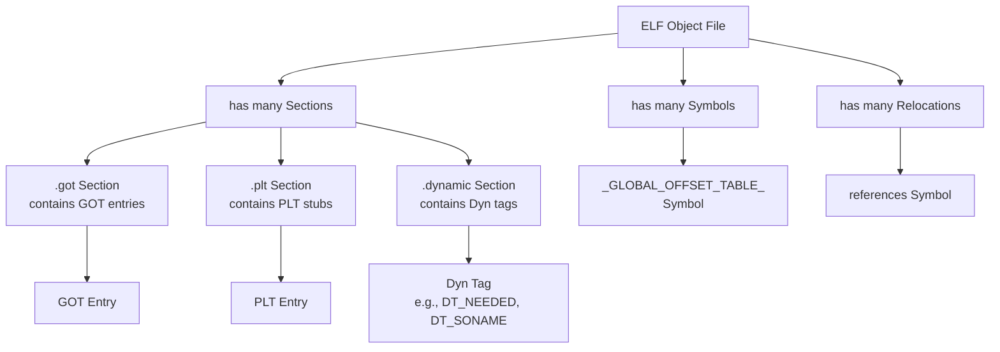

# Software Requirements Specification (SRS)
## Open Watcom Linux Port – Compiler and Linker
### Version 1.0

**Document Status:** Draft  
**Date:** [Current Date]  
**Authors:** Open Watcom Development Community  
**Stakeholders:** Compiler Developers, Linker Developers, Linux System Integrators, End-User Developers

---

## 1. Introduction

### 1.1 Purpose
This Software Requirements Specification (SRS) document defines the functional and non-functional requirements for porting the Open Watcom C Compiler (`wcc386`) and Linker (`wlink`) to the Linux operating system. The primary focus is the addition of support for generating Position-Independent Code (PIC) and creating/linking ELF shared objects, ensuring compatibility with the Linux Application Binary Interface (ABI).

### 1.2 Scope
This project encompasses modifications to the `CG386` code generator to produce PIC-compliant machine code and ELF object files, and extensions to the `wlink` linker to build and consume ELF shared libraries.

**In-Scope:**
*   Modification of `CG386` to generate ELF object files via the Object Writing Library (OWL).
*   Implementation of PIC code generation in `CG386`, including GOT base register (EBX) setup.
*   Extension of the linker (`wlink`) to process ELF-specific relocations and build GOT/PLT.
*   Ability for `wlink` to produce ELF shared objects (`.so` files) and executables that dynamically link against them.
*   Ensuring output conforms to the System V ABI (Intel386 Architecture Processor Supplement).

**Out-of-Scope:**
*   Support for non-ELF object formats (e.g., OMF, COFF) as primary output for Linux targets.
*   Major architectural changes to core code generation algorithms unrelated to PIC requirements.
*   Porting of other Open Watcom tools (e.g., debugger, IDE) to Linux.
*   Implementation of Thread-Local Storage (TLS) support (deferred to future work).

### 1.3 Definitions, Acronyms, and Abbreviations
*   **ABI:** Application Binary Interface.
*   **CG386:** The Open Watcom 32-bit x86 code generator.
*   **ELF:** Executable and Linkable Format.
*   **ET_DYN:** ELF file type for shared objects.
*   **ET_EXEC:** ELF file type for executables.
*   **ET_REL:** ELF file type for relocatable object files.
*   **GOT:** Global Offset Table.
*   **OMF:** Object Module Format (Watcom's traditional format).
*   **ORL:** Object Reading Library (Open Watcom's internal library).
*   **OWL:** Object Writing Library (Open Watcom's internal library).
*   **PIC:** Position-Independent Code.
*   **PLT:** Procedure Linkage Table.
*   **PT_DYNAMIC:** Program header type for the dynamic linking section.
*   **PT_INTERP:** Program header type for the interpreter path.
*   **PT_PHDR:** Program header type for the program header table itself.
*   **SLA:** Service Level Agreement (used here to denote interface contract).
*   **SRS:** Software Requirements Specification.

### 1.4 References
*   System V Application Binary Interface, Edition 4.1
*   System V ABI Intel386 Architecture Processor Supplement
*   Tool Interface Standard (TIS) Executable and Linking Format (ELF) Specification, Version 1.2
*   Open Watcom Source Code (`open_watcom_devel_1.1.7` branch)

### 1.5 Overview
The remainder of this document details the overall description of the product (Section 2) and the specific requirements (Section 3). It is structured to provide stakeholders with a clear, actionable specification for development and testing.

## 2. Overall Description

### 2.1 Product Perspective
The Open Watcom compiler suite is a legacy, cross-platform development toolchain. This project integrates it into the modern Linux ecosystem by enabling it to produce standard ELF binaries and shared libraries, allowing developers to create applications that interoperate with system libraries.

### 2.2 User Classes and Characteristics
| User Class | Characteristics | Key Requirements |
| :--- | :--- | :--- |
| **Compiler Developer** (SciTech/Community) | Expert in `CG386` internals, x86 assembly, and ELF format. | Implement PIC generation, integrate with OWL, map OMF fixups to ELF relocations. |
| **Linker Developer** (SciTech/Community) | Expert in `wlink`/ORL internals, linking processes, and dynamic linking. | Extend linker to build GOT/PLT, process ELF shared objects, generate `.dynamic` section. |
| **Linux System Integrator** | Responsible for system compatibility and packaging. | Ensure binaries are loadable by `ld-linux.so.2` and follow Linux library conventions. |
| **End-User Developer** | Uses `wcc386`/`wlink` to build Linux software. Needs interoperability with existing libraries. | Command-line interface to compile/link PIC code, create shared libraries, and link against `.so` files. |

### 2.3 Operating Environment
*   **Development Host:** Linux-based system.
*   **Target Platform:** Linux i386 (32-bit).
*   **Target ABI:** System V i386 ELF ABI.
*   **Dynamic Linker:** `/lib/ld-linux.so.2` or equivalent.
*   **External Tools (for testing/validation):** `gcc`, `binutils` (`readelf`, `objdump`, `ld`).

### 2.4 Design and Implementation Constraints
1.  **Backward Compatibility:** Changes must not break existing functionality for non-Linux, non-ELF targets (DOS, OS/2, Windows). Use conditional compilation (`#ifdef`).
2.  **Codebase Dependency:** Implementation must be based on the `open_watcom_devel_1.1.7` branch or a designated stable commit.
3.  **Internal API Dependence:** Must utilize existing internal libraries (ORL for reading, OWL for writing) where possible, extending them as needed.

### 2.5 Assumptions and Dependencies
*   The existing OWL library can be extended to support the required i386-specific ELF relocation types.
*   The Open Watcom community will provide review and feedback on implementation approaches.
*   The System V ABI documentation is the authoritative source for ELF and PIC specifications.

## 3. Specific Requirements

### 3.1 External Interface Requirements

#### 3.1.1 User Interfaces
**Command-Line Interface (CLI):**
*   **Compiler (`wcc386`):** Must support new command-line switches.
    ```bash
    wcc386 -elf          # Generate ELF object file (default may be OMF)
    wcc386 -pic          # Generate Position-Independent Code (switch TBD: -pic vs -zpic)
    wcc386 -c source.c   # Compile only
    ```
*   **Linker (`wlink`):** Must support new output formats and options.
    ```bash
    wlink form elf       # Produce ELF executable
    wlink form elf dll   # Produce ELF shared library
    wlink lib libc.so    # Specify a shared library for dynamic linking
    ```

#### 3.1.2 Software Interfaces
| Interface | Direction | Purpose | Input | Output | SLA / Requirements |
| :--- | :--- | :--- | :--- | :--- | :--- |
| **ORL** | Inbound | Abstract reading of input object files. | Raw bytes of ELF/OMF/COFF files. | Handles to sections, symbols, relocations. | Must correctly parse and expose all ELF relocation types needed for i386 PIC (`R_386_GOT32`, `R_386_PLT32`, `R_386_GOTOFF`, etc.). |
| **OWL** | Outbound | Abstract writing of output ELF object files. | Abstract segments, symbol definitions, relocation requests. | Raw bytes of a valid ELF relocatable (`.o`) file. | Must support writing all i386 ELF relocation types and standard sections (`.text`, `.data`, `.bss`, `.got`, `.plt`). |
| **System Linker (`ld`)** | Outbound (Testing) | Validate compiler output during development. | Watcom-generated ELF `.o` files. | Executable or shared library. | Must successfully link Watcom-generated objects without errors, confirming ELF validity. |
| **Linux Dynamic Linker (`ld-linux.so.2`)** | Runtime | Load and execute final linked binaries. | Watcom-generated ELF executable with `PT_INTERP`. | Running process. | Must resolve all dynamic symbols, PLT, and GOT entries correctly, allowing the program to run. |

### 3.2 Functional Requirements

#### 3.2.1 Compiler (`wcc386`) Requirements
**FR-CMP-01: ELF Object File Generation**
The compiler shall generate ELF format relocatable object files (type `ET_REL`) when the `-elf` option is specified.

**FR-CMP-02: PIC Code Generation**
The compiler shall generate Position-Independent Code when the PIC option (`-pic` or `-zpic`, TBD) is specified.
*   **FR-CMP-02.1:** Function prologue shall include instructions to load the address of the GOT into the EBX register.
*   **FR-CMP-02.2:** References to global data shall be implemented as `R_386_GOT32` relocations, resolved via the GOT.
*   **FR-CMP-02.3:** Calls to external functions shall be implemented as `R_386_PLT32` relocations.

**FR-CMP-03: Relocation Emission**
The compiler, via OWL, shall emit the correct ELF relocation records corresponding to the PIC and non-PIC code it generates.

#### 3.2.2 Linker (`wlink`) Requirements
**FR-LNK-01: ELF Executable Generation**
The linker shall produce standard ELF executables (type `ET_EXEC`) when `form elf` is specified.
*   **FR-LNK-01.1:** Shall generate necessary program headers (`PT_PHDR`, `PT_LOAD`).
*   **FR-LNK-01.2:** Shall correctly align sections (e.g., `.bss`) according to ELF conventions.

**FR-LNK-02: Shared Library Generation**
The linker shall produce ELF shared objects (type `ET_DYN`) when `form elf dll` is specified.
*   **FR-LNK-02.1:** Shall create a `.dynamic` section containing required tags (e.g., `DT_SONAME`, `DT_SYMTAB`, `DT_STRTAB`).
*   **FR-LNK-02.2:** Shall **not** include a `PT_PHDR` program header.
*   **FR-LNK-02.3:** Shall include a `PT_DYNAMIC` program header pointing to the `.dynamic` section.

**FR-LNK-03: GOT/PLT Construction**
The linker shall construct Global Offset Table (GOT) and Procedure Linkage Table (PLT) sections when linking PIC code or linking against shared libraries.
*   **FR-LNK-03.1:** Shall define the `_GLOBAL_OFFSET_TABLE_` symbol.
*   **FR-LNK-03.2:** Shall resolve `R_386_GOT32` and related relocations by assigning GOT entries.
*   **FR-LNK-03.3:** Shall generate PLT stubs for externally defined functions and create corresponding `R_386_JUMP_SLOT` relocations in a `.rel.plt` section.

**FR-LNK-04: Dynamic Linking Input**
The linker shall be able to read existing ELF shared objects (`.so` files) as input libraries.
*   **FR-LNK-04.1:** Shall parse the shared object's dynamic symbol table.
*   **FR-LNK-04.2:** Shall add a `DT_NEEDED` entry to the output file for each referenced shared library.

**FR-LNK-05: Executable Dynamic Linking**
When producing an executable that uses shared libraries, the linker shall:
*   **FR-LNK-05.1:** Add a `PT_INTERP` program header specifying the path to the runtime dynamic linker (`/lib/ld-linux.so.2`).
*   **FR-LNK-05.2:** Populate the `.dynamic` section of the executable with `DT_NEEDED` entries.

### 3.3 Domain Model
The following key entities and their relationships are central to the system's operation:


**Entity Attributes:**
*   **Object File:** `type` (ET_REL, ET_EXEC, ET_DYN), `sections[]`, `symbols[]`, `relocations[]`.
*   **Section:** `name` (String), `type` (e.g., SHT_PROGBITS, SHT_NOBITS), `flags` (e.g., SHF_ALLOC, SHF_EXECINSTR), `size` (Integer), `alignment` (Integer).
*   **Symbol:** `name` (String), `value` (Integer), `type` (e.g., STT_FUNC, STT_OBJECT), `binding` (STB_GLOBAL, STB_WEAK), `section` (Reference).
*   **Relocation:** `offset` (Integer), `type` (e.g., R_386_32, R_386_PLT32), `symbol` (Reference), `addend` (Integer).

### 3.4 Business Process Flows
**Primary Flow: Building a Linux Shared Library**
1.  **Trigger:** Developer runs `wcc386 -elf -pic -c libfunc.c`.
2.  **Step 1 (Compile):** `CG386` generates PIC machine code and emits ELF object file `libfunc.o` with `R_386_GOT32` and `R_386_PLT32` relocations via OWL.
3.  **Trigger:** Developer runs `wlink form elf dll mylib.so file libfunc.o`.
4.  **Step 2 (Link):** `wlink` (using ORL) reads `libfunc.o`. It identifies PIC relocations, constructs `.got` and `.plt` sections, creates a `.dynamic` section with `DT_SONAME`, and writes an `ET_DYN` file.
5.  **Output:** Shared library `mylib.so` is created.

**Alternative Flow: Building a Dynamically Linked Executable**
*   At Step 3, the developer runs `wlink form elf prog.exe file prog.o lib mylib.so`.
*   `wlink` processes `prog.o` and reads `mylib.so` as a dynamic input. It adds a `DT_NEEDED` entry for `mylib.so`, includes a `PT_INTERP` header, and generates an executable (`ET_EXEC`) that depends on the shared library.

### 3.5 Non-Functional Requirements

| Category | Requirement | Verification Method |
| :--- | :--- | :--- |
| **Performance** | PIC code performance overhead shall be within 10% of equivalent GCC-generated PIC code for standard benchmarks. | Profiling with tools like `perf`, comparison of benchmark results. |
| **Performance** | Linking time for shared objects shall scale linearly (O(n)) with the number of input object files and symbols. | Measurement with synthetic test cases of increasing size. |
| **Reliability** | The linker shall not crash or hang when processing valid, well-formed ELF input files (objects and shared libraries). | Fuzz testing with valid ELF files. |
| **Reliability** | The compiler shall produce ELF files that pass validation by standard tools (`readelf`, `objdump`) without errors. | Automated post-build validation script. |
| **Compliance** | All generated ELF files shall conform to the System V ABI (Intel386 supplement). | Inspection by `readelf` and comparison against ABI specification. |
| **Security** | The code generator and linker shall not introduce vulnerabilities (e.g., incorrect relocation application leading to memory corruption). | Code review, static analysis, and runtime testing with security tools. |
| **Usability** | Compiler and linker shall provide clear, actionable error messages for PIC/ELF-related failures (e.g., "Unsupported relocation for PIC mode"). | Review of error message catalog during testing. |

### 3.6 Acceptance Criteria
**AC-01: Generate PIC ELF Object File**
*   **Test Case:** A C source file containing `extern void func();` and `extern int global_var;` is compiled with `wcc386 -elf -pic -c`.
*   **Expected Result 1:** The output `.o` file contains a `R_386_PLT32` relocation for the call to `func` and a `R_386_GOT32` relocation for the reference to `global_var` (verifiable via `readelf -r`).
*   **Expected Result 2:** Disassembly of the object's `.text` section shows instructions in the function prologue to load the GOT address into EBX (e.g., `call __x86.get_pc_thunk.bx`).

**AC-02: Build a Functional Shared Library**
*   **Test Case:** Multiple PIC object files are linked with `wlink form ELF DLL mylib.so`.
*   **Expected Result 1:** `readelf -h mylib.so` shows `Type: DYN (Shared object file)`.
*   **Expected Result 2:** `readelf -S mylib.so` shows the presence of `.dynamic`, `.got`, and `.plt` sections.
*   **Expected Result 3:** `readelf -d mylib.so` shows a `DT_SONAME` tag and any necessary `DT_NEEDED` tags.

**AC-03: Create Executable Linking Against Shared Library**
*   **Test Case:** An object file calling `printf` is linked with `wlink form elf prog.exe file prog.o lib libc.so`.
*   **Expected Result 1:** `readelf -l prog.exe` shows a `PT_INTERP` program header.
*   **Expected Result 2:** `readelf -d prog.exe` shows a `DT_NEEDED` entry for `libc.so.6`.
*   **Expected Result 3:** The executable `prog.exe` runs successfully on the target Linux system.

## 4. Supporting Information

### 4.1 Milestones and Release Strategy
1.  **M1 (Foundation):** `CG386` produces valid non-PIC ELF object files using OWL.
2.  **M2 (Linking Basics):** `wlink` can produce working ELF executables; simple PIC objects can be linked using the system `ld` for validation.
3.  **M3 (PIC Generation):** `CG386` fully implements PIC prologue, data access, and call mechanisms.
4.  **M4 (Shared Library Creation):** `wlink` can build complete ELF shared libraries from PIC objects.
5.  **M5 (Dynamic Linking):** `wlink` can produce executables that dynamically link against system shared libraries (e.g., `libc.so`).
6.  **M6 (Integration & Release):** Comprehensive testing complete; release candidate prepared for community distribution.

### 4.2 Risk Management
| Risk | Probability | Impact | Mitigation Strategy |
| :--- | :--- | :--- | :--- |
| High complexity of modifying `CG386`. | High | High | Prototype using OWL first. Use existing RISC generator (`rscobj.c`) as a reference model. |
| OWL lacks required i386 ELF features. | Medium | High | Extend OWL in parallel with `CG386` work, based on a clear mapping of ABI requirements. |
| Incorrect GOT/PLT causes runtime crashes. | Medium | Critical | Implement extensive unit and integration tests with small cases. Compare `objdump` output side-by-side with GCC. |
| Changes break existing OMF/COFF support. | Medium | High | Use `#ifdef` guards for new ELF code. Maintain a rigorous regression test suite for other platforms. |
| Significant PIC performance overhead. | Low | Medium | Profile generated code early. Ensure standard optimizations remain enabled for PIC. |
| Community codebase has diverged. | Medium | Medium | Coordinate with the Open Watcom community. Target a specific, agreed-upon stable commit. |

### 4.3 Open Issues and Decisions Pending
| Issue | Description | Responsible Party |
| :--- | :--- | :--- |
| **CLI-001** | Final syntax for the PIC command-line switch (`-pic` vs `-zpic`). | Compiler Developers |
| **DSN-001** | Priority for implementing Position-Dependent Code (PDC) shared objects. | Linker Developers |
| **DSN-002** | Strategy for shared library versioning (SONAME handling). | Linker Developers |
| **DSN-003** | Default target behavior for Linux: Imply `-elf`, or require explicit flag? | Compiler Developers |
| **DSN-004** | Detailed design for mapping OMF fixups to OWL relocation requests in `CG386`. | Compiler Developers |
| **FUT-001** | Handling of Thread-Local Storage (TLS) – deferred but requires future design. | TBD |
| **FUT-002** | Integration with the Open Watcom IDE/debugger on Linux. | TBD |
| **QA-001** | Process for formal verification of ABI compliance in corner cases. | Quality Assurance / Developers |

---
*This document is considered the authoritative source of requirements for the Open Watcom Linux Port project.*