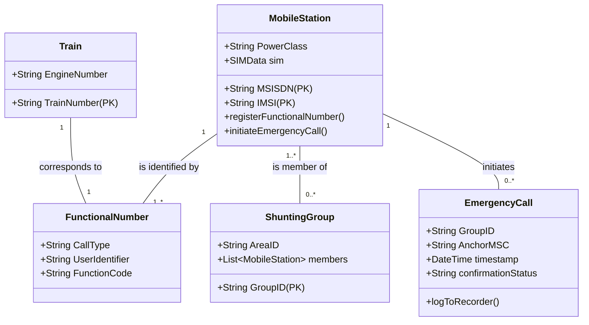

# **Software Requirements Specification (SRS)**
**For the European Integrated Railway Radio Enhanced Network (EIRENE) System**

**Document Version:** 1.0
**Date:** 2023-10-27
**Status:** Draft for Review

---

## **1. Introduction**

### **1.1 Purpose**
This document defines the comprehensive system requirements for the European Integrated Railway Radio Enhanced Network (EIRENE). It serves as the authoritative specification for vendors, developers, network operators, and railway undertakings to ensure a unified, interoperable, and safety-critical GSM-based radio communication system for European railways.

### **1.2 Scope**
The EIRENE system encompasses:
*   **Ground-to-Train Communications:** Voice and data communications between fixed network elements (e.g., Radio Block Centres, Controllers) and mobile stations on trains (Cab Radios).
*   **Ground-to-Ground Mobile Communications:** Voice and data communications for railway staff including trackside workers, station personnel, shunting teams, and maintenance crews using Operational and General Purpose radios.
*   **Interoperability:** Seamless cross-border communication for trains and roaming staff, ensuring standardized procedures and interfaces.
*   **Interfaces with Safety Systems:** Integration with the European Rail Traffic Management System (ERTMS)/European Train Control System (ETCS) for transmission of safety-critical data.

**Out of Scope:**
*   Detailed implementation specifications for non-interoperable, national fixed network components.
*   Field-level engineering and deployment plans for individual national networks.
*   Specifications for non-railway public GSM network components.

### **1.3 Definitions, Acronyms, and Abbreviations**
| Term | Definition |
| :--- | :--- |
| **BSS** | Base Station Subsystem |
| **Cab Radio** | Mobile station installed in a train driver's cab. |
| **eMLPP** | enhanced Multi-Level Precedence and Pre-emption |
| **ERTMS/ETCS** | European Rail Traffic Management System / European Train Control System |
| **ETSI** | European Telecommunications Standards Institute |
| **Functional Number** | A logical number representing a role (e.g., "Train 1234", "Controller Zurich") rather than a physical device. |
| **GSM-R** | Global System for Mobile communications – Railway |
| **IMSI** | International Mobile Subscriber Identity |
| **MSC** | Mobile Switching Centre |
| **MSISDN** | Mobile Station International Subscriber Directory Number |
| **NSS** | Network Switching Subsystem |
| **OMC** | Operations and Maintenance Centre |
| **PA** | Public Address |
| **PSTN/ISDN** | Public Switched Telephone Network / Integrated Services Digital Network |
| **Shunting** | The process of assembling, disassembling, or moving trains within a yard. |
| **UIC** | International Union of Railways |
| **USSD** | Unstructured Supplementary Service Data |
| **UUS1** | User-to-User Signalling 1 |

### **1.4 References**
*   ETSI EN 301 515: "Global System for Mobile communication (GSM); Requirements for GSM operation on railways"
*   UIC Project EIRENE System Requirements Specification (Baseline)
*   Relevant GSM and 3GPP standards series.

### **1.5 Document Overview**
This SRS is structured to present overall product perspective, specific functional and non-functional requirements, external interfaces, and supporting information for the EIRENE system.

---

## **2. Overall Description**

### **2.1 Product Perspective**
EIRENE is a self-contained system but interfaces with several external entities:
*   **ERTMS/ETCS:** For safety-critical train control data.
*   **Legacy Railway Radio Systems:** Via gateways during migration.
*   **Public Telephone Networks (PSTN/ISDN):** For breakout calls to non-GSM-R numbers.
*   **Train-Borne Recording and PA Systems:** For logging and passenger information.

### **2.2 Stakeholders and User Characteristics**
| Stakeholder | Role & Key Characteristics |
| :--- | :--- |
| **Train Driver** | Primary user of Cab Radio. Requires simple, fast access to emergency calls, direct voice contact with controllers, and clear audio. Operates in a high-vibration, safety-critical environment. |
| **Railway Controller** | Manages train movements. Uses console for individual and group calls to drivers and other controllers. Must handle multiple simultaneous calls and emergency situations. |
| **Shunting Team Member** | Uses handheld Operational Radio. Requires reliable group communication within a local area, with ability to form ad-hoc groups. |
| **Maintenance Personnel** | Uses General Purpose Radio for logistical and support communications. May require access to both railway groups and public networks. |
| **GSM-R Network Operator** | Manages and maintains the network infrastructure. Requires robust OMC tools for configuration, fault management, and performance monitoring. |
| **Network Maintenance Staff** | Manages subscriber data (SIMs, functional numbers), network configuration, and security policies. |
| **ERTMS/ETCS System** | Automated system that exchanges safety data with the Cab Radio. Requires a highly reliable, low-latency data link. |
| **Regulatory Body** | Allocates radio frequency spectrum and numbering resources (e.g., MSISDN ranges, group IDs). |

### **2.3 Use Cases and Scenarios**
#### **UC-1: Initiate Driver Emergency Call**
*   **Primary Actor:** Train Driver
*   **Precondition:** Cab Radio is powered on, registered on the GSM-R network, and has a valid functional number registered.
*   **Main Success Scenario:**
    1.  Driver presses and holds the dedicated emergency button.
    2.  Cab Radio initiates a Group Call setup with eMLPP priority level 0 to the predefined emergency group for its current location.
    3.  Network routes the call to all subscribed members (controllers, other trains) within the defined geographical area.
    4.  All recipient radios auto-answer (loudspeaker activated).
    5.  Driver states the nature of the emergency.
    6.  Controller manages the situation and terminates the call.
    7.  Cab Radio automatically sends a UUS1 confirmation message to the network confirmation centre.
    8.  Call details (timestamp, parties, duration) are logged in the train-borne recorder.
*   **Exception Scenarios:**
    *   **E1: Network unavailable:** Radio falls back to Direct Mode on the pre-defined emergency direct mode channel.
    *   **E2: Confirmation failure:** Radio retries UUS1 transmission; event is flagged in OMC.

#### **UC-2: Establish Dedicated Shunting Group**
*   **Primary Actor:** Shunting Team Leader
*   **Precondition:** All team members have Operational Radios tuned to the Common Shunting Group (ID 500).
*   **Main Success Scenario:**
    1.  Leader selects "Shunting Mode" on radio.
    2.  Radio automatically joins the Common Shunting Group (ID 500).
    3.  Leader uses USSD/Menu to register a new Dedicated Shunting Group (e.g., ID 501) for the team's specific task.
    4.  Network confirms group creation and announces the Group ID on the common channel.
    5.  Team members manually enter the announced Group ID to join via functional registration.
    6.  All subsequent shunting communications occur on the dedicated group.

#### **UC-3: Register Functional Number (Train Number)**
*   **Primary Actor:** Train Driver
*   **Precondition:** Cab Radio is network registered.
*   **Main Success Scenario:**
    1.  Driver enters the train number (e.g., 1234) via the Cab Radio interface.
    2.  Radio sends a USSD registration message (`*111*1234#`) to the network.
    3.  Network validates the format and checks for conflicts.
    4.  If free, network updates its routing database to associate the driver's MSISDN/IMSI with the functional number "Train 1234".
    5.  Network sends a confirmation USSD message to the Cab Radio.
*   **Alternative Scenario (Conflict Resolution):**
    3a. Network detects the functional number is already registered to another mobile.
    4a. Network informs the driver of the conflict via USSD.
    5a. Driver is given the option to "force" registration, which de-registers the previous mobile.
    6a. Network completes registration for the new mobile.

### **2.4 Domain Model**

---

## **3. System Requirements**

### **3.1 Functional Requirements**
#### **FR-1: Emergency Call Handling**
*   **FR-1.1:** The Cab Radio SHALL provide a dedicated, hard-key emergency button.
*   **FR-1.2:** Upon activation, the system SHALL establish a Group Call with eMLPP priority 0 within ≤ 2 seconds.
*   **FR-1.3:** The call SHALL be routed to a pre-defined group based on the caller's current geographical location (Location Dependent Addressing).
*   **FR-1.4:** All recipient radios (controllers, other trains in area) SHALL auto-answer the call in loudspeaker mode.
*   **FR-1.5:** An ongoing call of lower priority SHALL be pre-empted if a higher priority (e.g., emergency) call is initiated for a participating member.

#### **FR-2: Shunting Operations**
*   **FR-2.1:** Operational Radios SHALL support a "Shunting Mode" that provides access to a Common Shunting Group (ID 500).
*   **FR-2.2:** An authorized user (Shunting Leader) SHALL be able to register a unique Dedicated Shunting Group ID.
*   **FR-2.3:** Other team members SHALL be able to join the announced Dedicated Shunting Group via manual entry and functional registration.
*   **FR-2.4:** A Shunting Emergency Call (Group ID 599) SHALL override all other shunting group calls and be received by all shunting radios in the area.

#### **FR-3: Functional Number Management**
*   **FR-3.1:** The system SHALL allow a mobile station to register a Functional Number (e.g., Train Number, Controller ID) via USSD.
*   **FR-3.2:** The network SHALL resolve calls to Functional Numbers by routing them to the currently registered mobile station.
*   **FR-3.3:** In case of a registration conflict, the system SHALL allow an authorized user to force de-registration of the previous registrant.
*   **FR-3.4:** Upon successful border crossing (network roam), the Cab Radio SHALL automatically re-register its functional number with the new serving network.

#### **FR-4: Direct Mode Operation**
*   **FR-4.1:** Mobile stations SHALL be capable of Direct Mode (mobile-to-mobile) operation on designated channels when network coverage is unavailable.
*   **FR-4.2:** Direct Mode SHALL be simplex and use a transmission power of up to 1W.
*   **FR-4.3:** The radio SHALL automatically revert to GSM-R mode when network coverage is restored.

### **3.2 Non-Functional Requirements**
#### **NFR-1: Performance**
*   **NFR-1.1:** Emergency call setup time (button press to call established) ≤ 2 seconds.
*   **NFR-1.2:** Handover interruption time (break in speech/data) ≤ 300 ms.
*   **NFR-1.3:** End-to-end latency for ERTMS/ETCS data packets ≤ 0.5 seconds.
*   **NFR-1.4:** USSD response time for functional registration ≤ 2 seconds.

#### **NFR-2: Reliability & Availability**
*   **NFR-2.1:** Network infrastructure availability SHALL be ≥ 99.95% per annum.
*   **NFR-2.2:** Handover success rate SHALL be ≥ 99.5%.
*   **NFR-2.3:** Train-borne recorder SHALL provide non-volatile storage for call logs with zero data loss under normal power cycling.

#### **NFR-3: Security**
*   **NFR-3.1:** The system SHALL perform GSM authentication and encryption for all network-access communications.
*   **NFR-3.2:** The system SHALL support Closed User Groups (CUGs) to restrict communication between railway operational groups and public networks.
*   **NFR-3.3:** Access to network management functions (OMC) SHALL be role-based and audited.

#### **NFR-4: Compliance**
*   **NFR-4.1:** The system SHALL conform to ETSI EN 301 515 and relevant GSM/3GPP standards.
*   **NFR-4.2:** Air interface SHALL operate in the UIC-specified GSM-R frequency bands: Uplink 876-915 MHz, Downlink 921-960 MHz.

### **3.3 External Interface Requirements**
| Interface | Direction | Protocol/Standard | Key Requirement |
| :--- | :--- | :--- | :--- |
| **ERTMS/ETCS** | Bi-directional | Specified in SUBSET-037 | Latency <0.5s, High Reliability (SIL-2/3/4 as applicable) |
| **Public Address (PA)** | Cab Radio → PA System | Analog Audio / Digital Stream | Audio synchronization delay <100ms |
| **Train-Borne Recorder** | Cab Radio → Recorder | Serial (e.g., RS-485) or Digital | Continuous, timestamped logging of all call events and confirmations. |
| **GSM A-Interface** | BSS ↔ NSS | GSM 08.xx series | Support for eMLPP, group calls, and location-based routing. |
| **USSD Gateway** | Mobile ↔ Network | GSM 03.90 | Support for railway-specific USSD codes for functional registration. |
| **SMSC** | Network ↔ Mobile | GSM 03.40 | Support for SMS to/from functional numbers. |

### **3.4 Acceptance Criteria**
*   **AC-1 (Emergency Call):** In a test environment, 100 consecutive emergency call initiations shall result in a 100% success rate with a mean setup time of ≤1.8 seconds and no single instance exceeding 2.2 seconds.
*   **AC-2 (Shunting Group):** A test shunting team of 5 shall be able to form a dedicated group from the common group and establish clear voice communication within 60 seconds of the leader's initiation.
*   **AC-3 (Functional Roaming):** A simulated train crossing a network border shall successfully re-register its functional number with the new network without manual intervention, with the process completing within 30 seconds of the handover.

---

## **4. Supporting Information**

### **4.1 Milestones and Release Strategy**
1.  **Phase 1 (Core Network):** Deployment of core GSM-R network infrastructure supporting basic voice calls, SMS, and individual subscriber management.
2.  **Phase 2 (Cab Integration):** Rollout of Cab Radios with ERTMS/ETCS interface and emergency call functionality.
3.  **Phase 3 (Advanced Features):** Implementation of Functional Numbering, Location Dependent Addressing, and Shunting Mode.
4.  **Phase 4 (Resilience & Roaming):** Activation of Direct Mode and cross-border interoperability features.
5.  **Phase 5 (Validation):** Large-scale cross-border interoperability testing and operational readiness exercises.
6.  **Phase 6 (FOC):** Full Operational Capability with all mandatory EIRENE features deployed and accepted.

### **4.2 Risk Management**
| Risk | Probability | Impact | Mitigation Strategy |
| :--- | :--- | :--- | :--- |
| Frequency interference with public GSM | Medium | High | Strict adherence to UIC frequency plan; coordination with national regulators. |
| Interoperability failure at borders | Medium | High | Mandatory compliance with EIRENE specs; pre-operational cross-border testing campaigns. |
| Network congestion blocking emergency calls | Low | Critical | Implementation of eMLPP pre-emption; geographical optimization of group call areas. |
| Handover failure at very high speed (>250 km/h) | Medium | High | Optimization of handover algorithms and cell planning; consideration of synchronous handover techniques. |
| Security breach via public network interface | Low | High | Enforcement of strict CUG policies; firewalling and monitoring of gateway interfaces. |

### **4.3 Open Issues and TBDs**
1.  **TBD-1:** Format and validation rules for alphanumeric train numbers. *(Owner: National Railways)*
2.  **TBD-2:** Final integration specifications for enhanced Location Determination systems (eLDA). *(Owner: eLDA Working Group)*
3.  **TBD-3:** Definitive EMC emission limits for Cab Radio installations in all locomotive types. *(Owner: Rolling Stock Manufacturers)*
4.  **TBD-4:** Optimal routing protocols for cross-border emergency calls involving multiple network operators. *(Owner: GSM-R Operator Forum)*
5.  **TBD-5:** Standardized minimum battery life performance for handheld radios in extreme temperature ranges (-25°C to +70°C). *(Owner: Environmental Standards Committee)*

---
**Document Approval:**

| Role | Name | Signature | Date |
| :--- | :--- | :--- | :--- |
| Project Manager | | | |
| Lead System Architect | | | |
| Quality Assurance | | | |
| Customer Representative | | | |