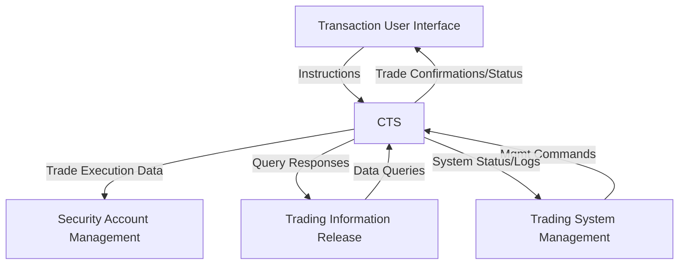

# Software Requirements Specification (SRS)
## Central Trading System (CTS)
### Version 1.0

**Document Status:** Draft  
**Date:** [Current Date]  
**Prepared for:** Stock Trading System (STS) Project Stakeholders  
**Prepared by:** [Author/Team Name]

---

## 1. Introduction

### 1.1 Purpose
This document defines the functional and non-functional requirements for the Central Trading System (CTS), the core trade execution engine within the broader Stock Trading System (STS). It is intended for use by the project team, including developers, testers, architects, and project managers, to guide the design, implementation, and verification of the system.

### 1.2 Scope
The CTS is responsible for the real-time reception, validation, matching, and execution of stock trading instructions based on the price-time priority rule. It serves as the central matching engine, interfacing with upstream and downstream subsystems to ensure accurate and compliant trade execution.

**In-Scope:**
*   Receipt and validation of buy, sell, cancel, and query instructions.
*   Maintenance of an order book for pending instructions.
*   Execution of trade matching logic.
*   Generation and dispatch of trade confirmations and system messages.
*   Provision of trading data to authorized subsystems.
*   System monitoring and management interfaces.

**Out-of-Scope (Non-Goals):**
*   Direct user interaction or presentation layers (handled by Transaction User Interface).
*   Long-term archival of historical trade data.
*   Management of user account balances and positions (handled by Security Account Management).
*   Generation of public market data feeds or analytics (handled by Trading Information Release).

### 1.3 Definitions, Acronyms, and Abbreviations
| Term | Definition |
| :--- | :--- |
| **CTS** | Central Trading System |
| **STS** | Stock Trading System |
| **Instruction** | A client request to buy, sell, cancel, or query. |
| **Order Book** | A real-time, price-ordered list of pending buy and sell instructions for a specific security. |
| **Price-Time Priority** | A matching rule where the best (highest) bid and lowest offer are matched first; at equal prices, the earliest instruction has priority. |
| **SLA** | Service Level Agreement |
| **TUI** | Transaction User Interface |
| **SAM** | Security Account Management |
| **TIR** | Trading Information Release |
| **TSM** | Trading System Management |

### 1.4 References
*   STS Project Charter
*   Financial Regulatory Compliance Guidelines [Reference Document]
*   System Architecture Overview Diagram

### 1.5 Overview
The remainder of this document is structured as follows: Section 2 provides a general description of the product and its stakeholders. Section 3 details the specific functional and non-functional requirements. Appendices may contain supplementary diagrams or data models.

## 2. Overall Description

### 2.1 Product Perspective
The CTS is a server-side subsystem within the STS ecosystem. It acts as a central hub, receiving instructions from the TUI, executing trades, and communicating results to the SAM and TIR subsystems. It is managed and monitored via the TSM interface.



### 2.2 Stakeholders and User Characteristics
| Stakeholder | Role | Interest / Interaction with CTS |
| :--- | :--- | :--- |
| **Transaction User Interface (TUI)** | Primary Actor (System) | Submits all client-originated instructions (Buy, Sell, Cancel, Query). Receives acknowledgments and final status updates. |
| **Security Account Management (SAM)** | Secondary Actor (System) | Receives confirmed trade details to update user account balances and positions. Requires high data integrity. |
| **Trading Information Release (TIR)** | Secondary Actor (System) | Queries the CTS for real-time and historical trade/order data for market data publication and analysis. |
| **Trading System Management (TSM)** | Secondary Actor (System) | Monitors system health, manages operational state (e.g., start/stop trading), and accesses logs for troubleshooting. |
| **System Maintainer** | Human User | Operates, troubleshoots, and enhances the CTS. Requires skills in Java, socket programming, and financial trading systems. |
| **Compliance Officer** | Human User | Relies on system logs and audit trails to verify regulatory adherence. |

### 2.3 Operating Environment
*   **Software:** Java-based application running on a JVM. Interfaces via defined network protocols (e.g., TCP sockets, REST APIs).
*   **Hardware:** High-availability server clusters capable of low-latency processing.
*   **Dependencies:** Relies on external subsystems (TUI, SAM, TIR) for complete business process flow.

### 2.4 Design and Implementation Constraints
1.  The matching engine **must** implement strict **price-time priority**.
2.  Core processing logic must be written in **Java**.
3.  Must support integration via **synchronous and asynchronous messaging** patterns.
4.  Must provide comprehensive, immutable **audit logs** for all instructions and trades.

### 2.5 Assumptions and Dependencies
*   External subsystems (TUI, SAM) are responsible for initial user authentication and basic instruction validation.
*   The CTS assumes it receives valid `StockID` and `UserID` references.
*   System clock synchronization is managed at the infrastructure level.

## 3. Specific Requirements

### 3.1 Functional Requirements

#### 3.1.1 Instruction Processing
**FR-1: Instruction Reception**
> The system shall accept structured instruction messages from the Transaction User Interface.

**FR-2: Instruction Validation (Pretreatment)**
> The system shall validate each incoming instruction for format correctness and business rules.
> 1.  Validate required fields (`InstructionID`, `UserID`, `StockID`, `Type`, `Quantity`, `Timestamp`).
> 2.  For Buy/Sell instructions, validate that `Price` is provided and is a positive number.
> 3.  Check price against the stock's daily price rising/falling limits. Instructions violating limits shall be rejected.
> 4.  For Buy instructions, initiate a fund freeze request (conceptual handshake with SAM).

**FR-3: Instruction Routing**
> The system shall route validated instructions to the appropriate internal handler based on the `Type` field (Trade Handler, Cancel Handler, Query Handler).

#### 3.1.2 Trade Matching & Execution
**FR-4: Order Book Management**
> The system shall maintain an order book for each stock, containing pending buy and sell instructions sorted by price-time priority.

**FR-5: Trade Matching Logic**
> For a new Buy instruction, the system shall search the order book for matching Sell instructions where `Sell.Price <= Buy.Price`. Matching shall follow price-time priority.
> For a new Sell instruction, the system shall search the order book for matching Buy instructions where `Buy.Price >= Sell.Price`. Matching shall follow price-time priority.

**FR-6: Trade Execution**
> When a match is found, the system shall:
> 1.  Create a `Trade` record with a unique `TradeID`, linking `BuyInstructionID` and `SellInstructionID`.
> 2.  Update the status of the matched instructions to "Filled" or "Partially Filled".
> 3.  For partially filled instructions, the remaining quantity shall stay in the order book.
> 4.  Immediately dispatch the trade details to the Security Account Management (SAM) subsystem.

**FR-7: Order Queuing**
> If no match is found for a new Buy/Sell instruction, the system shall insert the instruction into the appropriate order book in the correct price-time priority position.

#### 3.1.3 Cancel Instruction Processing
**FR-8: Cancel Validation**
> The system shall validate that a cancel instruction references a valid, pending (`InstructionID`).

**FR-9: Order Cancellation**
> If the target instruction is found and has a status of "Pending," the system shall remove it from the order book and update its status to "Canceled."

**FR-10: Cancel Rejection**
> If the target instruction is not found, is already filled/partially filled, or is already canceled, the system shall reject the cancel request and return an appropriate error message to the TUI.

#### 3.1.4 Query Processing
**FR-11: Data Query**
> The system shall process authorized query requests from the Trading Information Release (TIR) subsystem, filtering trade and order book data by criteria such as `StockID`, `UserID`, and time range.

#### 3.1.5 System Management
**FR-12: System Monitoring**
> The system shall expose key performance metrics (e.g., processing latency, queue depth, match rate) and system health status via the TSM interface.

**FR-13: Operational Control**
> The system shall accept management commands (e.g., "Suspend Trading," "Resume Trading," "Flush Logs") from the TSM interface.

### 3.2 External Interface Requirements

#### 3.2.1 Transaction User Interface (TUI)
*   **Protocol:** TCP Socket / Secure Messaging Queue
*   **Input Message Format (Example):**
    ```json
    {
      "instructionId": "ORD-20231027-00001",
      "userId": "U12345",
      "stockId": "STK001",
      "type": "BUY",
      "quantity": 100,
      "price": 150.50,
      "timestamp": "2023-10-27T09:30:00.000Z"
    }
    ```
*   **Output:** Acknowledgment and final instruction status.
*   **SLA:** Instruction acceptance latency < 100ms.

#### 3.2.2 Security Account Management (SAM)
*   **Protocol:** Reliable Messaging (e.g., with guaranteed delivery)
*   **Output Message Format (Example):**
    ```json
    {
      "tradeId": "TRD-20231027-00001",
      "buyInstructionId": "ORD-20231027-00001",
      "sellInstructionId": "ORD-20231027-00002",
      "stockId": "STK001",
      "quantity": 100,
      "price": 150.50,
      "executionTimestamp": "2023-10-27T09:30:00.100Z"
    }
    ```
*   **SLA:** 99.99% reliability for trade confirmation delivery.

#### 3.2.3 Trading Information Release (TIR)
*   **Protocol:** REST API / Query Interface
*   **Input:** Query request with filters.
*   **Output:** Structured dataset (JSON/XML).
*   **SLA:** Must support burst query rates of up to 100 QPS.

#### 3.2.4 Trading System Management (TSM)
*   **Protocol:** Secure REST API / Admin Console
*   **Authentication:** Mandatory token-based or certificate-based authentication.
*   **SLA:** Read-only queries should not impact core trading performance.

### 3.3 Domain Model & Data Requirements
Key entities and their critical attributes:

**Instruction**
*   `instructionId` (String, PK): Unique system-generated identifier.
*   `userId` (String, Required): Reference to the user.
*   `stockId` (String, Required): Reference to the stock.
*   `type` (Enum: BUY, SELL, CANCEL, QUERY, Required)
*   `quantity` (Integer, Required, >0)
*   `price` (Decimal, Conditional Required for BUY/SELL)
*   `timestamp` (DateTime, Required): Time of instruction receipt.
*   `status` (Enum: PENDING, FILLED, PARTIALLY_FILLED, CANCELED, EXPIRED, REJECTED)

**Trade**
*   `tradeId` (String, PK): Unique system-generated identifier.
*   `buyInstructionId` (String, FK to Instruction): Reference to the matched buy.
*   `sellInstructionId` (String, FK to Instruction): Reference to the matched sell.
*   `stockId` (String, Required)
*   `quantity` (Integer, Required)
*   `price` (Decimal, Required)
*   `executionTimestamp` (DateTime, Required)

### 3.4 Non-Functional Requirements

#### 3.4.1 Performance
*   **P-1:** The 95th percentile of instruction processing latency (from receipt to matching/dispatch) shall be less than **500 milliseconds** under expected peak load.
*   **P-2:** The system shall be capable of processing a sustained load of **10,000 instructions per second**.

#### 3.4.2 Reliability & Availability
*   **R-1:** The system shall achieve **99.9% availability** during official trading hours.
*   **R-2:** No trade execution data shall be lost due to system failure (zero data loss requirement for matched trades).

#### 3.4.3 Security
*   **S-1:** All external interfaces (TUI, SAM, TIR, TSM) shall require authentication.
*   **S-2:** All sensitive data (e.g., `userId`, `price`, `quantity`) in transit between subsystems shall be encrypted using TLS 1.2 or higher.
*   **S-3:** The system shall log all authentication attempts and failures.

#### 3.4.4 Compliance
*   **C-1:** The trade matching algorithm shall be verifiably compliant with the **price-time priority** rule as defined by financial regulatory standards.

#### 3.4.5 Observability
*   **O-1:** All state changes for Instructions and Trades shall be logged to an immutable audit trail.
*   **O-2:** Key business and performance metrics shall be exposed in a format compatible with enterprise monitoring tools (e.g., Prometheus, Grafana).

## 4. Appendices

### 4.1 Acceptance Criteria (Examples)
**AC-1: Successful Buy Trade Execution**
*   **Given** a valid buy instruction for Stock `STK001`, 100 shares @ $150.00 is received,
*   **And** a pending sell instruction for `STK001`, 100 shares @ $149.50 exists in the order book,
*   **When** the matching engine processes the buy instruction,
*   **Then** a trade is executed at $149.50,
*   **And** a trade confirmation message is sent to SAM,
*   **And** both instruction statuses are updated to "FILLED."

**AC-2: Invalid Instruction Rejection**
*   **Given** a buy instruction with a price 15% above the previous day's closing price (exceeding the daily rise limit),
*   **When** the instruction pretreatment module validates it,
*   **Then** the instruction is rejected,
*   **And** a rejection message with error code `PRICE_LIMIT_EXCEEDED` is returned to the TUI.

### 4.2 Risk Mitigation Summary
| Risk | Probability | Impact | Mitigation Strategy |
| :--- | :--- | :--- | :--- |
| High volume causing overload | Medium | High | Implement back-pressure, horizontal scaling, load testing. |
| Data inconsistency with SAM | Medium | Critical | Use idempotent messages, reconciliation jobs, reliable messaging. |
| Regulatory non-compliance | Low | Critical | Formalize matching rules; implement comprehensive test suite. |
| Complex failure recovery | Medium | High | Persistent order book state; documented recovery runbooks. |
| Security breaches | Low | High | Regular security audits; API gateway with WAF and rate limiting. |

### 4.3 Open Issues & Decisions Pending
1.  **Real-time Feedback:** Decision required on synchronous vs. asynchronous final status return to TUI. *(Owner: Product Owner)*
2.  **Exception Handling Specification:** Detailed design needed for error logging, alerting, and dashboarding. *(Owner: System Architect)*
3.  **TIR Query SLA:** Formal agreement needed on maximum query frequency and data volume limits. *(Owner: Integration Team Lead)*
4.  **Data Retention Policy:** Policy required for purging pending orders and completed trades from CTS operational datastores. *(Owner: Compliance Officer)*
5.  **Deployment Model:** Final decision on cloud provider, on-premise hardware, or hybrid approach. *(Owner: Infrastructure Team)*

---
*Document End*