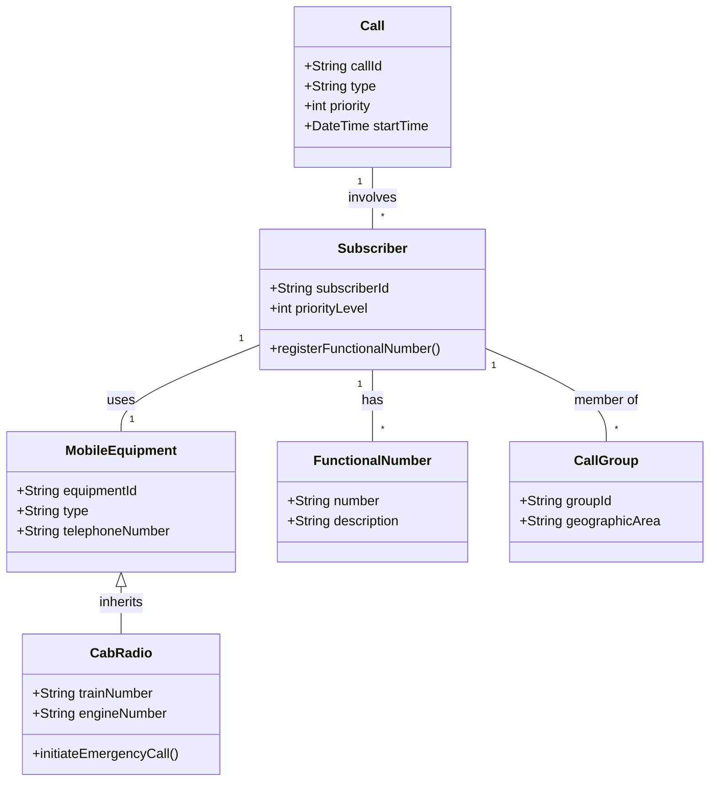

# Software Requirements Specification (SRS)
## European Integrated Railway Radio Enhanced Network (EIRENE)
**Document Version:** 1.0  
**Date:** [Date of Generation]  
**Status:** Draft for Review

---

### 1. Introduction

#### 1.1 Purpose
This Software Requirements Specification (SRS) document provides a comprehensive description of the functional and non-functional requirements for the European Integrated Railway Radio Enhanced Network (EIRENE). It serves as the definitive guide for system architects, developers, testers, and project managers involved in the implementation, deployment, and maintenance of the EIRENE system. The primary goal is to ensure interoperability for cross-border railway operations and achieve manufacturing economies of scale through standardization.

#### 1.2 Scope
The EIRENE system is a GSM-based digital radio communication system designed for European railways. This specification covers:
*   **In-Scope:**
    *   Ground-to-train voice and data communications for operational and safety purposes.
    *   Ground-based mobile communications for trackside workers, station staff, and administrative personnel.
    *   Functional requirements for three primary mobile equipment types: Cab Radio, Operational Radio, and General Purpose Radio.
    *   Interfaces with critical railway systems (e.g., ERTMS/ETCS, Train-Borne Recorder).
    *   Cross-border interoperability requirements.
*   **Out-of-Scope (Non-Goals):**
    *   Detailed hardware implementation specifications.
    *   Internal architecture of network switching subsystems.
    *   Non-railway public emergency services (e.g., 112).
    *   Detailed specification of Controller Terminal Equipment (defined by railway operators).

#### 1.3 Definitions, Acronyms, and Abbreviations
| Term | Definition |
| :--- | :--- |
| **Cab Radio** | Mobile radio equipment installed in a locomotive driver's cab. |
| **ERTMS/ETCS** | European Rail Traffic Management System / European Train Control System. |
| **DSD** | Driver Safety Device (e.g., dead man's switch). |
| **Functional Number (FN)** | A number representing a user's role (e.g., "Train 1234", "Signalman Area A"). |
| **GSM-R** | GSM for Railways, the technology standard underlying EIRENE. |
| **MMI** | Man-Machine Interface. |
| **PSTN** | Public Switched Telephone Network. |
| **RBC** | Radio Block Centre (part of ERTMS). |
| **SLA** | Service Level Agreement. |

#### 1.4 References
*   EIRENE Functional Requirements Specification (FRS) – Version 7.0
*   GSM-R System Requirements Specification (SRS)
*   Relevant European Norms (EN) for EMC, safety, and interoperability.
*   ISO 9001 Quality Management Systems.

#### 1.5 Overview
The remainder of this document is structured as follows: Section 2 provides an overall description of the product, its stakeholders, and operating environment. Section 3 details specific functional requirements. Section 4 outlines non-functional requirements. Section 5 covers interface requirements. Appendices include supplementary information such as use case details and data models.

---

### 2. Overall Description

#### 2.1 Product Perspective
EIRENE is a mission-critical mobile communication system integrated into the broader railway operational ecosystem. It acts as the primary voice and data bearer for operational control, safety systems, and general logistics.

**System Interfaces:**
*   **Train Control Systems (ERTMS/ETCS):** For transmission of safety-critical movement authorities.
*   **Recording & Logging Systems (Train-Borne Recorder):** For mandatory event logging.
*   **On-Train Systems (PA, Intercom):** For internal crew communication.
*   **External Networks (PSTN/PLMN):** For calls to/from public networks.
*   **Location Systems (Balise, GPS):** For directed network selection at borders.

#### 2.2 User Classes and Characteristics
| User Class | Primary Equipment | Key Characteristics |
| :--- | :--- | :--- |
| **Train Driver** | Cab Radio | Requires hands-free, high-priority operation. Must initiate emergency calls instantly. |
| **Primary Controller** | Controller Terminal | Manages train movements and emergencies in a control area. Handles multiple concurrent calls. |
| **Secondary/Power Controller** | Controller Terminal | Specialized roles for signalling or power supply management. |
| **Shunting Team Member** | Operational Radio | Operates in defined groups. Requires link integrity confirmation (link assurance signal). |
| **Trackside / General Staff** | General Purpose/Operational Radio | Mobile workforce requiring point-to-point and group communication. |
| **On-Train Staff (Conductor)** | Via Cab Radio System | Receives calls routed through the Cab Radio. |
| **Network Administrator** | Management Systems | Configures subscribers, functional numbers, groups, and network parameters. |

#### 2.3 Operating Environment
*   **Physical:** Equipment must operate in extreme railway environments: temperature extremes, vibration, shock, dust, and moisture.
*   **Mobile:** System must support reliable communication at speeds up to 500 km/h and handle frequent handovers.
*   **Geographic:** Must provide continuous coverage along railway lines, including tunnels. Must support seamless (or managed) handover between national networks at borders.

#### 2.4 Design and Implementation Constraints
1.  **Regulatory:** Must comply with European Norms (EN) for interoperability, EMC, and safety.
2.  **Technological:** Based on GSM-R standards. Must maintain backward compatibility where specified.
3.  **Operational:** Must not interfere with legacy analogue railway radio systems during transition periods.
4.  **Security:** Must implement a Closed User Group (CUG). All interfaces must enforce call barring and subscription checks.

#### 2.5 Assumptions and Dependencies
*   Adequate GSM-R network coverage is provided by the infrastructure operator.
*   Bilateral agreements between national network operators exist for border regions.
*   National authorities will define and translate alphanumeric train numbers into the numeric functional numbering plan.
*   Railway operators are responsible for the specification and provision of Controller Terminal Equipment.

---

### 3. System Features and Requirements

#### 3.1 Feature: Voice Call Management
**3.1.1 Description:** The system shall support establishment, maintenance, and termination of point-to-point, group, and broadcast voice calls with defined priority levels.

**3.1.2 Requirements:**
*   **REQ-VOICE-001:** The system shall allow a user to initiate a point-to-point call by dialing a Functional Number or Telephone Number.
*   **REQ-VOICE-002:** The system shall determine the destination for a "call controller" request from a Cab Radio using location-dependent addressing based on the train's current position.
*   **REQ-VOICE-003:** All operational calls shall be assigned a "Railway Operation Priority" that pre-empts non-operational calls on shared resources.
*   **REQ-VOICE-004:** Upon call establishment, the system shall exchange and display the functional identities (e.g., "Train 5678", "Control Area B") on both caller and callee terminals.
*   **REQ-VOICE-005:** The system shall provide clear audible and/or visual indication to the initiator upon call setup failure.

#### 3.2 Feature: Railway Emergency Call
**3.2.1 Description:** A highest-priority call initiated by a dedicated button to alert predefined users in a geographic area of an emergency.

**3.2.2 Requirements:**
*   **REQ-EMG-001:** A Cab Radio or Operational Radio shall have a dedicated, red, protected button to initiate a Railway Emergency Call.
*   **REQ-EMG-002:** Upon activation, the system shall establish a high-priority group/broadcast call to all predefined subscribers (e.g., controllers, other drivers) in the relevant geographic area within 2 seconds (95% of cases).
*   **REQ-EMG-003:** A distinctive warning tone shall be played to all recipients for a duration of 5 seconds (TBC by trials) before the speech path is opened.
*   **REQ-EMG-004:** A continuous visual indication (e.g., flashing red light) shall be displayed on all recipient terminals for the duration of the emergency call.
*   **REQ-EMG-005:** If a train enters an area where a Railway Emergency Call is active, its Cab Radio shall automatically provide the same audible and visual warnings to the driver.

#### 3.3 Feature: Functional Addressing & Registration
**3.3.1 Description:** The system uses role-based numbers (Functional Numbers) instead of, or in addition to, physical telephone numbers.

**3.3.2 Requirements:**
*   **REQ-FN-001:** A subscriber (e.g., a driver) shall be able to register one or more Functional Numbers (e.g., a train number) with the network.
*   **REQ-FN-002:** A caller shall be able to place a call by dialing a Functional Number. The system shall route the call to the subscriber currently registered with that number.
*   **REQ-FN-003:** The system shall prevent duplicate active registration of the same unique Functional Number (e.g., a train number). Attempts to register a duplicate shall trigger a warning to the new registrant and a notification to the existing registrant.
*   **REQ-FN-004:** An authorized administrator shall be able to configure, assign, and modify the mapping between Functional Numbers and subscribers.

#### 3.4 Feature: Shunting Operations Mode
**3.4.1 Description:** Dedicated group communication for shunting teams, featuring a link assurance signal to confirm channel integrity.

**3.4.2 Requirements:**
*   **REQ-SHUNT-001:** An authorized user (Shunting Leader) shall be able to establish a protected Shunting Group Call with predefined members.
*   **REQ-SHUNT-002:** Any member of an active Shunting Group Call shall be able to activate a Link Assurance Signal.
*   **REQ-SHUNT-003:** When activated, the Link Assurance Signal shall cause an intermittent tone (800-850 Hz) to be heard by all members of the group, confirming the communication link is live.
*   **REQ-SHUNT-004:** While the Link Assurance Signal is active, only the member who activated it shall be able to transmit voice.
*   **REQ-SHUNT-005:** The initiation of a Shunting Emergency Call shall immediately deactivate any active Link Assurance Signal and take priority.

#### 3.5 Feature: Data Communication Services
**3.5.1 Description:** The system shall provide bearer services for safety-critical and non-safety data applications.

**3.5.2 Requirements:**
*   **REQ-DATA-001:** The system shall provide a circuit-switched data bearer for safety-critical ERTMS/ETCS messages between the Radio Block Centre (RBC) and on-train equipment.
*   **REQ-DATA-002:** Data calls for ERTMS/ETCS shall be assigned a priority that ensures timely transmission alongside voice calls.
*   **REQ-DATA-003:** The system shall support a data interface for non-safety applications (e.g., text messaging) which shall not interfere with high-priority voice or safety-critical data calls.

---

### 4. Non-Functional Requirements

#### 4.1 Performance Requirements
*   **PERF-001:** Railway Emergency Call setup time shall be less than 2 seconds in 95% of operational cases.
*   **PERF-002:** The network shall provide coverage for 95% of the defined geographic area for 95% of the time for vehicle-mounted radios.
*   **PERF-003:** The system shall maintain communication integrity for trains traveling at speeds up to 500 km/h.
*   **PERF-004:** Call setup time for routine point-to-point operational calls shall be less than 5 seconds.

#### 4.2 Reliability & Availability
*   **RELY-001:** Mobile Equipment (Cab, Operational, General Purpose) shall be designed to operate reliably under defined climatic, mechanical (shock, vibration), and environmental (dust, contaminants) stress conditions.
*   **RELY-002:** Handheld Operational and General Purpose radios shall have a minimum battery life of 8 hours under a defined duty cycle (5% transmit, 5% receive, 90% standby).
*   **RELY-003:** The Cab Radio system shall have a Mean Time Between Failures (MTBF) consistent with critical train-borne equipment.

#### 4.3 Security Requirements
*   **SEC-001:** The system shall implement a Closed User Group (CUG). Only authenticated and authorized subscriber equipment shall be allowed network access.
*   **SEC-002:** The system shall support configurable call barring (e.g., bar international calls, bar public network calls) per subscriber or subscriber group.
*   **SEC-003:** The process for registering Functional Numbers shall be protected against unauthorized use or spoofing.

#### 4.4 Observability & Maintainability
*   **OBS-001:** All mobile equipment shall provide clear visual and audible indications for: call status (ringing, connected), network availability, signal strength, and failure conditions.
*   **OBS-002:** The Cab Radio shall transmit a record of specified safety-critical events (emergency call activation/termination, DSD alarm, major radio fault) to the Train-Borne Recorder immediately upon occurrence.
*   **OBS-003:** Network management systems shall provide logs and alarms for system performance, faults, and security events.

#### 4.5 Compliance Requirements
*   **COMP-001:** The design, development, and testing processes for all system components shall comply with ISO 9001 quality management standards.
*   **COMP-002:** All equipment shall meet relevant European Norms (EN) for Electromagnetic Compatibility (EMC) and protection against physical hazards.
*   **COMP-003:** National standards may be applied only if they do not prevent cross-border interoperability.

---

### 5. Interface Requirements

#### 5.1 Hardware Interfaces
*   **HI-001:** Cab Radio shall provide a physical interface (e.g., discrete I/O, serial) for receiving an alarm signal from the Driver Safety Device (DSD).
*   **HI-002:** Cab Radio shall provide a standard data interface (e.g., Ethernet, serial) for connection to the Train-Borne Recorder.
*   **HI-003:** Cab Radio shall provide an interface to receive location/network identity data from external systems (e.g., balise reader).

#### 5.2 Software/Communication Interfaces
*   **SI-001:** **ERTMS/ETCS Interface.** Protocol: As per GSM-R/ETCS standards. Function: Reliable transmission of safety-critical data packets between RBC and train. SLA: Must support requirements for ETCS Levels 2 & 3.
*   **SI-002:** **External Network (PSTN/PLMN) Interface.** Protocol: ISUP, MAP. Function: Interconnection for voice calls. SLA: Governed by bilateral agreements; must comply with open network specifications.
*   **SI-003:** **Text Message Application Interface.** Protocol: Defined by application. Function: Bearer service for text messages. Constraint: Must be lower priority than railway operational voice/data traffic.

#### 5.3 User Interfaces
*   **UI-001:** The Cab Radio MMI shall include a dedicated, red, physical emergency button.
*   **UI-002:** The MMI for all radios shall display the functional identity of the calling/called party.
*   **UI-003:** Visual indicators (LEDs) shall be used to signify: Power On, Network Registered, Call Active (Green), Emergency Call Active (Red).
*   **UI-004:** The MMI shall support a minimum of 10 languages, selectable by the user or administrator. The specific languages are a national decision.

---

### 6. Appendices

#### Appendix A: Domain Model (UML Class Diagram Snippet)

#### Appendix B: Open Issues and Decisions
| Issue | Description | Responsible Party | Status |
| :--- | :--- | :--- | :--- |
| 1 | Automatic joining of group calls for mobiles entering an area. | EIRENE Technical Working Group | Pending Technical Spec Change |
| 2 | Precise duration of emergency call warning tone (5s suggested). | Testing & Validation Team | To be confirmed by trials |
| 3 | Service class definitions for low/medium traffic rural areas. | National Railway Authorities | National Decision |
| 4 | Time `t` for MMI configuration persistence after power-off. | System Maintainers | Configurable (0-240 min) |
| 5 | Automatic vs. Directed network selection at borders. | National Railway Authorities | National Choice (Directed recommended) |

---
*Document End*