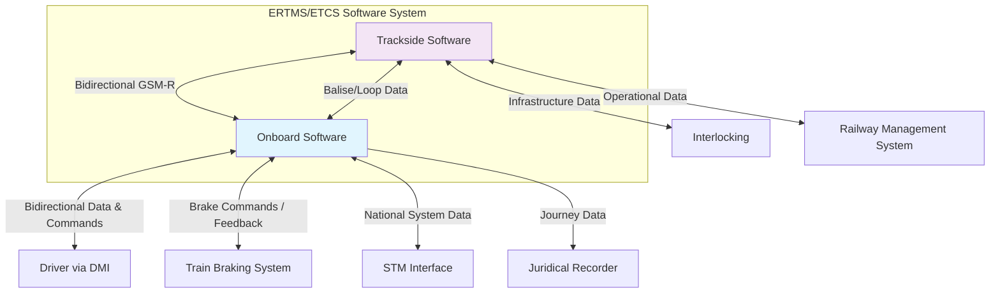

# Software Requirements Specification (SRS)
## ERTMS/ETCS Onboard and Trackside Systems
**Document Version:** 1.0  
**Based on:** ERTMS/ETCS Functional Requirements Specification (FRS) v5.00  
**Date:** [Current Date]

---

### 1. Introduction

#### 1.1 Purpose
This Software Requirements Specification (SRS) document provides a detailed, technical specification of the software requirements for the European Rail Traffic Management System/European Train Control System (ERTMS/ETCS). It translates the high-level operational requirements from the FRS into precise, verifiable software requirements for onboard, trackside, and control center subsystems. This document serves as the definitive reference for system architects, software developers, testers, and validators.

#### 1.2 Scope
This SRS covers the software required to implement ERTMS/ETCS functionality across all defined application levels (0, 1, 2, 3, and STM). It includes:
*   Onboard software for trainborne equipment (EVC, DMI, Juridical Recording Unit, etc.).
*   Trackside software for Radio Block Centres (RBC), balise/loop interfaces, and interlockings.
*   Software for managing interfaces between subsystems (e.g., GSM-R, STM, braking system).

**Out of Scope:**
*   Detailed hardware design specifications.
*   Detailed graphical design of the Driver-Machine Interface (DMI) (deferred to HMI specifications).
*   Training procedures and materials.
*   RAMS (Reliability, Availability, Maintainability, Safety) analyses, though safety principles are embedded in requirements.
*   Environmental specifications (shock, vibration, EMC).

#### 1.3 Definitions, Acronyms, and Abbreviations
*   **ERTMS:** European Rail Traffic Management System
*   **ETCS:** European Train Control System
*   **RBC:** Radio Block Centre
*   **DMI:** Driver-Machine Interface
*   **MA:** Movement Authority
*   **EVC:** European Vital Computer
*   **STM:** Specific Transmission Module
*   **GSM-R:** GSM for Railways
*   **TSI:** Technical Specification for Interoperability
*   **M/O:** Mandatory/Optional (requirement classification)
*   **SLA:** Service Level Agreement
*   **JRU:** Juridical Recording Unit

#### 1.4 References
*   ERTMS/ETCS Functional Requirements Specification (FRS), Subset-026, v5.00.
*   CCS (Control-Command and Signalling) TSI.
*   UNISIG SUBSET-091: Safety Requirements Specification.

#### 1.5 Document Overview
This document is structured to detail functional requirements, system interfaces, data models, and non-functional constraints. It is organized by major system capabilities and cross-cutting concerns.

### 2. Overall Description

#### 2.1 Product Perspective
The ERTMS/ETCS software is a component of a larger, safety-critical railway control and command system. It interfaces with external systems as depicted in the context diagram below.

#### 2.2 User Characteristics
*   **Driver:** Licensed train operator. Uses the DMI for information and input. Not a software expert. Must react to system outputs within defined time constraints.
*   **Maintenance Personnel:** Technically trained. Uses diagnostic interfaces and recorded data for troubleshooting.
*   **Infrastructure Manager Staff:** Configures and monitors trackside equipment (RBC, balise data).
*   **Safety Assessor:** Reviews software requirements and design for compliance with safety standards.

#### 2.3 General Constraints
1.  **Safety Integrity:** Core supervision functions shall be developed to Safety Integrity Level (SIL) 4 as per EN 50128/50129.
2.  **Interoperability:** Software shall implement all Mandatory (M) requirements from FRS Subset-026 without deviation.
3.  **Legacy Compatibility:** STM interface software shall not adversely affect the safety of legacy national systems.
4.  **Real-Time Operation:** Software shall meet all defined temporal deadlines (e.g., acknowledgment timers, brake command latency).

### 3. System Features and Requirements

#### 3.1 Feature: System Initialization and Data Management
**3.1.1 Description:** Software shall manage the startup sequence, self-test, and entry/validation of critical train and driver data.
**3.1.2 Requirements:**
*   **REQ-SYS-INIT-001:** Upon application of power, the onboard software shall execute a built-in self-test (BIST) of critical components. The result (Pass/Fail) shall be displayed on the DMI.
*   **REQ-SYS-INIT-002:** The software shall permit manual entry or modification of `TrainIdentification`, `MaxSpeed`, `Length`, and `BrakeCalculationData` **only** when the train's measured speed is zero.
*   **REQ-SYS-INIT-003:** The software shall validate entered train data against plausible ranges (e.g., length > 0, max speed ≤ 600 km/h). Invalid data shall be rejected with a clear error message on the DMI.
*   **REQ-SYS-INIT-004:** The software shall store and associate the active `DriverID` with all subsequently recorded journey data.

#### 3.2 Feature: Movement Authority (MA) Supervision
**3.2.1 Description:** Software shall receive, process, and supervise against Movement Authorities, including calculating speed-distance profiles.
**3.2.2 Requirements:**
*   **REQ-MA-001:** The onboard software shall calculate a `StaticSpeedProfile` based on the received `TrackData` and the train's `BrakeCalculationData`.
*   **REQ-MA-002:** Upon receiving a new MA, the software shall calculate a `DynamicSpeedProfile` (braking curve) from the train's current position and speed to the `EndLocation` of the MA.
*   **REQ-MA-003:** The software shall continuously supervise the train's current speed against the most restrictive of the `StaticSpeedProfile` and `DynamicSpeedProfile`.
*   **REQ-MA-004:** If the train speed exceeds the permitted profile by a defined, harmonized margin, the software shall issue a service or emergency brake command (as defined by the braking curve calculation).
*   **REQ-MA-005:** The software shall provide a visual and acoustic warning to the driver on the DMI at least **5 seconds** before a brake intervention based on the `DynamicSpeedProfile` is predicted to occur.

#### 3.3 Feature: Level and Mode Transition Management
**3.3.1 Description:** Software shall manage transitions between ETCS application levels and operational modes (e.g., Full Supervision, Shunting, On Sight).
**3.3.2 Requirements:**
*   **REQ-TRANS-001:** When the train passes a balise group signaling a transition to a higher ETCS level which the onboard system is equipped for, the software shall automatically and immediately switch to the higher level.
*   **REQ-TRANS-002:** For a transition that increases driver responsibility (e.g., from `Full Supervision` to `On Sight`), the software shall:
    *   a) Request explicit driver acknowledgement via the DMI.
    *   b) Start a timer of **5 seconds**.
    *   c) If no acknowledgement is received within the timer, apply the service brake until the train stops.
*   **REQ-TRANS-003:** Upon receiving a driver request for `Shunting` mode, the software shall, if under RBC control, request permission from the RBC before transitioning.
*   **REQ-TRANS-004:** In `Shunting` mode, the software shall supervise train speed against a nationally configured `NationalValue` for shunting speed limit.

#### 3.4 Feature: Failure Handling and Degraded Operations
**3.4.1 Description:** Software shall detect failures and execute predefined safe reactions.
**3.4.2 Requirements:**
*   **REQ-FAIL-001:** Upon detection of a complete loss of communication with the RBC for a duration exceeding a `NationalValue` timeout, the onboard software shall execute the reaction defined by the `NationalValue` `N_trip` (e.g., `Trip`, `Service brake`, `Continue to end of MA`).
*   **REQ-FAIL-002:** Any critical onboard equipment failure detected by the software shall result in a fail-safe reaction, typically an unconditional emergency brake command.
*   **REQ-FAIL-003:** All detected failures shall be immediately indicated to the driver via the DMI with a clear, standardized fault message.
*   **REQ-FAIL-004:** Prior to a brake intervention due to a failure, the software shall, where safety permits, provide a brief warning to the driver on the DMI.

#### 3.5 Feature: Data Recording and Juridical Recording
**3.5.1 Description:** Software shall record safety-critical and operational data for monitoring and investigation.
**3.5.2 Requirements:**
*   **REQ-REC-001:** The software shall record, at a minimum, all data entered by the driver, all MAs received, all system mode transitions, all brake interventions, and all DMI indications presented.
*   **REQ-REC-002:** Every recorded event shall be timestamped with synchronized UTC time with a resolution of at least 1 second.
*   **REQ-REC-003:** Recorded data classified as vital for accident investigation shall be stored in a non-volatile memory, protected from overwriting for a minimum of **24 hours**.
*   **REQ-REC-004:** General operational data shall be retained for at least **7 days**.

### 4. External Interface Requirements

#### 4.1 User Interfaces (DMI)
*   **REQ-UI-001:** The software shall provide an API to the DMI hardware for displaying: current speed, target distance/speed, permitted speed, system mode, and text messages.
*   **REQ-UI-002:** The software shall provide an API to receive from the DMI: button presses, acknowledgments, and data entry strings.
*   **REQ-UI-003:** The timing between the software issuing a command to display a warning and its actual appearance on the DMI screen shall be ≤ 500 ms.

#### 4.2 Communication Interfaces
*   **REQ-COM-001:** The RBC software shall implement the GSM-R interface as per FRS Subset-093, ensuring safe, sequenced, and acknowledged transmission of telegrams (e.g., MA, `Conditional Emergency Stop`).
*   **REQ-COM-002:** The onboard software shall decode balise telegrams (Eurobalise) as per FRS Subset-036 and process the contained information.
*   **REQ-COM-003:** The STM interface software shall translate national system codes into equivalent ETCS packet structures for processing by the core onboard software.

#### 4.3 Hardware Interfaces
*   **REQ-HW-001:** The onboard software shall issue brake commands via a defined, fail-safe digital output interface (`EmergencyBrakeCommand`, `ServiceBrakeCommand`).
*   **REQ-HW-002:** The software shall read odometry pulses from a designated sensor input and calculate `TrainLocation` and `OdometryError`.

### 5. Non-Functional Requirements

#### 5.1 Performance Requirements
*   **REQ-PERF-001:** All software calculations (profile calculation, odometry processing) shall be designed to function correctly at train speeds up to **500 km/h**.
*   **REQ-PERF-002:** The system response time from detecting a speed profile violation to issuing a brake command shall be ≤ **1 second**.

#### 5.2 Safety and Compliance Requirements
*   **REQ-SAFE-001:** The software design shall implement all Mandatory (M) requirements from the FRS.
*   **REQ-SAFE-002:** The software shall be developed in compliance with EN 50128 for software and EN 50129 for safety assurance.

#### 5.3 Reliability and Availability
*   **REQ-REL-001:** The mean time between critical failures (MTBCF) for the onboard software shall be > **10^9** hours.
*   **REQ-REL-002:** The software shall implement watchdog mechanisms to detect and recover from processing hangs.

#### 5.4 Security Requirements
*   **REQ-SEC-001:** Software update mechanisms shall be secured against unauthorized modification (e.g., via cryptographic signatures).

### 6. Data Model
The core data entities shall be implemented as defined in the FRS Domain Model. Key implementation details:
*   The `Train` and `Driver` data shall be stored in volatile memory for the duration of a session and also recorded juristically.
*   The `MovementAuthority` shall be represented as an internal object with fields for `EndLocation`, `LinkedTrackSections[]`, and `TimeStamps`.
*   `NationalValues` shall be stored in a configuration table, loaded at system startup or upon entering a new geographical area.

### 7. Appendices

#### 7.1 Acceptance Test Traceability
| Requirement ID | Acceptance Criteria from FRS | Test Method |
| :--- | :--- | :--- |
| REQ-MA-004, REQ-MA-005 | "Given a train... provide a warning at least 5 seconds before intervention" | Simulation, Lab Test |
| REQ-TRANS-001 | "Given a train approaches a level transition..." | Field Test with Balise |
| REQ-FAIL-001 | "Given a loss of transmission with the RBC..." | Integration Test (GSM-R Simulated) |

#### 7.2 Assumptions and Dependencies
*   It is assumed that underlying hardware (processors, sensors) meets the performance and safety integrity levels required.
*   The software depends on accurate geographic and track data from infrastructure managers.
*   National Values are provided by the relevant safety authority and are correctly configured.

---
*This SRS document is a derivative work based on the public domain description of the ERTMS/ETCS FRS v5.00. It is intended as an example of SRS structure and does not replace the official UNISIG/ERA specifications.*