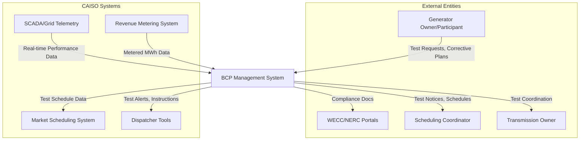

Here is a comprehensive Software Requirements Specification (SRS) document for the Black Start Capability Plan (BCP) system, based on the provided information.

***

# **Software Requirements Specification (SRS)**
## **Black Start Capability Plan (BCP) Management System**
**Document Version:** 1.0
**Date:** October 26, 2023
**Status:** Draft for Review

---

### **1. Introduction**

#### **1.1 Purpose**
This document defines the functional and non-functional requirements for a software system to support the California Independent System Operator (CAISO) in managing its Black Start Capability Plan (BCP). The system will facilitate the planning, testing, recordkeeping, compliance, and training activities necessary to ensure reliable grid restoration following a major blackout.

#### **1.2 Scope**
The BCP Management System will support the end-to-end business processes for maintaining certified Black Start generation resources within the CAISO Balancing Authority Area. This includes:
*   Managing data for Black Start Units (Voluntary, Interim, RMR).
*   Scheduling, executing, and analyzing performance tests.
*   Maintaining contracts, cranking paths, and contingency studies.
*   Managing compliance documentation for WECC/NERC.
*   Tracking operator training sessions.
*   Integrating with external systems (Market Scheduling, SCADA, Metering).

**Out of Scope:**
*   Field-level operational procedures for actual blackout events.
*   Management of generators that can only achieve auxiliary load rejection.
*   Real-time control of grid restoration (executed via SCADA/EMS).

#### **1.3 Definitions, Acronyms, and Abbreviations**
| Term | Definition |
| :--- | :--- |
| **Black Start** | The capability of a generating unit to start without an outside electrical supply and to energize a transmission line (cranking path). |
| **RMR** | Reliability Must-Run contract. A generator contractually obligated for reliability. |
| **Interim** | A temporary Black Start service contract. |
| **WECC** | Western Electricity Coordinating Council. |
| **NERC** | North American Electric Reliability Corporation. |
| **CAISO** | California Independent System Operator. |
| **PTO** | Participating Transmission Owner. |
| **SC** | Scheduling Coordinator. |
| **SCADA** | Supervisory Control and Data Acquisition. |
| **Cranking Path** | A designated transmission path from a Black Start unit to other generation or load. |
| **Availability Limit** | The proven MW output capacity of a Black Start unit, as determined by testing. |
| **E-501** | CAISO's internal System Restoration database. |

#### **1.4 References**
*   NERC Standard EOP-005: System Restoration from Blackstart Resources
*   NERC Standard EOP-009: System Restoration
*   CAISO Tariff, Section 40: Black Start Service
*   CAISO Business Practice Manual for Reliability Requirements

#### **1.5 Document Overview**
This SRS is structured to present an overall description of the system, followed by specific functional and non-functional requirements, external interfaces, and supporting information.

---

### **2. Overall Description**

#### **2.1 Product Perspective**
The BCP Management System is a component within CAISO's suite of grid reliability and market applications. It will interact with several external and internal systems.

#### **2.2 User Classes and Characteristics**
| User Class | Characteristics & Key Activities |
| :--- | :--- |
| **CAISO Grid Planner** | Performs contingency studies, determines Black Start requirements, manages the portfolio. Uses system for planning data, study results, and contract management. |
| **CAISO Test Administrator** | Schedules tests, analyzes results, manages the testing lifecycle. Primary user for test management modules. |
| **CAISO Real-Time Dispatcher** | Receives notifications, coordinates operational actions during tests/events. Requires real-time alerts and test status dashboards. |
| **Generator Owner/Participant** | Submits test requests (G-213H), reviews test results, submits corrective plans. External user with limited, secure access. |
| **Compliance Officer** | Prepares and submits documentation to WECC/NERC. Uses system for report generation and audit trails. |
| **Training Coordinator** | Schedules and records operator training sessions. Manages training materials and simulation reports. |
| **System Administrator** | Manages user accounts, access controls, and system configuration. |

#### **2.3 Operating Environment**
*   **Software:** Web-based application accessible via standard browsers. Backend built on enterprise Java/.NET stack. Oracle/SQL Server database.
*   **Hardware:** Hosted on CAISO's secure, fault-tolerant data center infrastructure.
*   **Network:** Accessible over CAISO's corporate intranet, with secure external access (VPN) for Participants.

#### **2.4 Design and Implementation Constraints**
1.  Must comply with NERC CIP security standards for access control and audit logging.
2.  Must integrate with legacy CAISO database `E-501` for Black Start records.
3.  Data exchange formats with WECC/NERC portals must adhere to prescribed XML schemas.
4.  Must support the existing business form `G-213H` (Black Start Test Request) during a transition period.

#### **2.5 Assumptions and Dependencies**
*   External systems (SCADA, Metering, Market) will provide data feeds according to defined SLAs.
*   CAISO business processes for contract negotiation and grid studies will remain largely unchanged.
*   Sufficient training will be provided to all user classes upon deployment.

---

### **3. System Features and Requirements**

#### **3.1 Feature: Black Start Portfolio & Contract Management**
**3.1.1 Description**
Maintain a master repository of all Black Start resources, including their attributes, contract status, and proven capability.

**3.1.2 Functional Requirements**
| ID | Requirement |
| :--- | :--- |
| **FR-010** | The system shall allow authorized users to create, read, update, and deactivate records for `Black Start Unit` entities, capturing all required attributes (UnitID, Name, Location, Type, FuelType, MWCapacity, Status). |
| **FR-011** | The system shall allow authorized users to associate `Contract` records (RMR/Interim) with specific `Black Start Unit` records, including tracking StartDate, EndDate, and AvailabilityLimit. |
| **FR-012** | The system shall provide dashboard views showing total contracted Black Start capacity, capacity by region, and contract expiration timelines. |
| **FR-013** | The system shall automatically flag units with contracts expiring within the next 90 days for planner review. |

#### **3.2 Feature: Performance Test Lifecycle Management**
**3.2.1 Description**
Manage the end-to-end process for scheduling, executing, analyzing, and recording Black Start Availability Tests.

**3.2.2 Functional Requirements**
| ID | Requirement |
| :--- | :--- |
| **FR-020** | The system shall allow a Participant to electronically submit a Test Request (digital equivalent of form G-213H), initiating a new `Test Event` record. |
| **FR-021** | The system shall allow a Test Administrator to schedule a test, generating a `Test Dispatch Notice` and automatically notifying the relevant SC and CAISO Dispatcher via integrated systems. |
| **FR-022** | The system shall ingest real-time MW output data from the SCADA/Telemetry system during the test window and display it on a monitoring dashboard. |
| **FR-023** | The system shall ingest the actual MWh produced from the Revenue Metering System within 24 hours post-test. |
| **FR-024** | The system shall calculate the test availability percentage using the formula: `(Actual MWh / (Requested MW * 4 hours)) * 100%`, applying a configurable temperature correction factor. |
| **FR-025** | The system shall automatically determine a test `Result` of **Pass** (>=99% availability) or **Fail** (<99% availability). |
| **FR-026** | If a test fails, the system shall automatically trigger a workflow requiring the Participant to submit a Corrective Action Plan and shall downgrade the unit's `AvailabilityLimit` in its associated Contract. |
| **FR-027** | The system shall generate a standardized `Test Report` for each completed test, storing it as a document (TestReportURL). |

#### **3.3 Feature: Planning & Contingency Analysis Support**
**3.3.1 Description**
Support Grid Planners in conducting annual studies and maintaining restoration topology data.

**3.3.2 Functional Requirements**
| ID | Requirement |
| :--- | :--- |
| **FR-030** | The system shall allow Planners to create and store `Contingency Study` records, linking them to required `Black Start Unit` resources. |
| **FR-031** | The system shall allow Planners to define and document `Cranking Path` entities, linking source and target units and storing diagram references. |
| **FR-032** | The system shall provide reporting to verify the total proven (tested) Black Start capacity against the WECC restoration plan requirements and the outputs of contingency studies. |

#### **3.4 Feature: Compliance & Recordkeeping**
**3.4.1 Description**
Maintain a complete audit trail and facilitate compliance with WECC/NERC standards.

**3.4.2 Functional Requirements**
| ID | Requirement |
| :--- | :--- |
| **FR-040** | The system shall maintain a immutable log of all user actions (create, update, delete) on key entities (Units, Tests, Contracts), with timestamp and user identity. |
| **FR-041** | The system shall allow a Compliance Officer to assemble and export packages of `Compliance Documents` (test reports, justification letters, plans) for submission to WECC/NERC portals. |
| **FR-042** | The system shall track submission deadlines for external compliance requests and provide alerts 15 days and 5 days prior to the due date. |
| **FR-043** | The system shall synchronize all critical unit, test, and contract data with the legacy internal database (`E-501`) on a daily basis. |

#### **3.5 Feature: Training Management**
**3.5.1 Description**
Track operator training and simulation sessions related to system restoration.

**3.5.2 Functional Requirements**
| ID | Requirement |
| :--- | :--- |
| **FR-050** | The system shall allow the Training Coordinator to schedule `Training Session` records, log attendees (linking to operator records), and store associated `SimulationReportURL`s. |
| **FR-051** | The system shall provide reports on operator training completion status and simulation performance metrics. |

---

### **4. External Interface Requirements**

#### **4.1 User Interfaces**
*   **UI-01:** Web-based, responsive interface following CAISO's design standards.
*   **UI-02:** Role-based dashboards presenting relevant KPIs (e.g., Test Administrator sees pending tests, Planner sees capacity summary).
*   **UI-03:** Secure external portal for Participants to submit forms and view their unit's test history.

#### **4.2 Hardware Interfaces**
*   **HI-01:** The system shall reside on standard CAISO server hardware. No direct end-user hardware interfaces are required.

#### **4.3 Software Interfaces**
| Interface | Direction | Purpose & Data |
| :--- | :--- | :--- |
| **Market Scheduling System** | Outbound | Submit Test Dispatch Notice parameters (UnitID, Test Time, Requested MW) to schedule test energy. |
| **SCADA/Grid Telemetry** | Inbound | Receive real-time unit performance data (MW, Voltage, Frequency) during scheduled test windows. |
| **Revenue Metering System** | Inbound | Receive finalized interval meter data (MWh) for the test period to validate performance. |
| **WECC/NERC Portals** | Outbound | Submit compliance documentation packages via secure, standards-based API or web service. |
| **Internal Database (E-501)** | Bi-directional | Daily synchronization of master data for Black Start Units, Tests, and Contracts. |

#### **4.4 Communications Interfaces**
*   **CI-01:** The system shall integrate with CAISO's internal messaging/email system to send notifications (test schedules, results, deadline alerts) to users and external Participants.
*   **CI-02:** The system shall provide status alerts to the Dispatcher Tools interface for real-time operator awareness.

---

### **5. Non-Functional Requirements**

#### **5.1 Performance Requirements**
| ID | Requirement |
| :--- | :--- |
| **NFR-PER-01** | The system shall support 50 concurrent users with an average response time for database transactions of less than 2 seconds. |
| **NFR-PER-02** | Test result analysis (calculation, status update) shall be processable within 1 hour of receiving all required input data (meter data, temp data). |
| **NFR-PER-03** | The system shall be capable of generating a comprehensive annual compliance report within 4 hours of request initiation. |

#### **5.2 Reliability, Availability, and Maintainability**
| ID | Requirement |
| :--- | :--- |
| **NFR-REL-01** | The system shall achieve 99.5% operational availability during business hours (0600-2000 PT). |
| **NFR-REL-02** | The core Black Start database (and its sync to E-501) shall be available with 99.9% uptime, as it is considered critical for restoration events. |
| **NFR-REL-03** | Scheduled maintenance shall be permitted during pre-defined weekend windows with a 48-hour advance notice to internal users. |

#### **5.3 Security & Compliance Requirements**
| ID | Requirement |
| :--- | :--- |
| **NFR-SEC-01** | The system shall enforce role-based access control (RBAC) as defined in Section 2.2. All access shall require CAISO domain authentication. |
| **NFR-SEC-02** | All external data exchanges (with Participants, WECC) shall be encrypted in transit using TLS 1.2 or higher. |
| **NFR-SEC-03** | The system shall maintain audit logs compliant with NERC CIP standards, retaining logs for a minimum of three (3) years. |
| **NFR-SEC-04** | All procedures and data management within the system shall support compliance with NERC EOP-005 and EOP-009 standards. |

#### **5.4 Observability & Supportability**
| ID | Requirement |
| :--- | :--- |
| **NFR-OBS-01** | The system shall provide integrated health monitoring and generate alerts for failed data integrations or system errors. |
| **NFR-OBS-02** | All business-critical processes (test scheduling, result calculation) shall produce detailed operational logs for troubleshooting. |

---

### **6. Other Requirements**

#### **6.1 Acceptance Criteria**
*   **AC-01 (Planning Verification):** The system shall allow a Planner to run a "Portfolio Sufficiency Report" that compares total proven AvailabilityLimit against the `RequiredBlackStartMW` from the latest `Contingency Study`.
*   **AC-02 (Unit Testing):** For a simulated test, the system shall correctly ingest meter data, apply the temperature correction factor, calculate a 98.5% availability, mark the test as **Fail**, and automatically generate a task for a Corrective Action Plan.
*   **AC-03 (Recordkeeping):** Upon marking a test as complete, the associated `Black Start Unit` record shall display the last test date and current status (e.g., "Available - Last Tested: 2023-10-15, Pass").

#### **6.2 Undecided Issues & Open Requirements**
1.  The specific algorithm for the temperature correction factor (`FR-024`) is TBD by the CAISO Test Administrator.
2.  The API specification and SLA for data exchange with neighboring Balancing Authorities is TBD by CAISO Planners.
3.  The user interface and workflow for integrating Voluntary (non-contracted) units into restoration sequences is TBD by CAISO Planners and Operators.
4.  Requirements for a "successive starts" simulation module are dependent on final contract language (TBD by CAISO Contract Management).

---
**Document Approval:**

| Role | Name | Signature | Date |
| :--- | :--- | :--- | :--- |
| **Product Owner** | | | |
| **Lead System Architect** | | | |
| **Quality Assurance Manager** | | | |