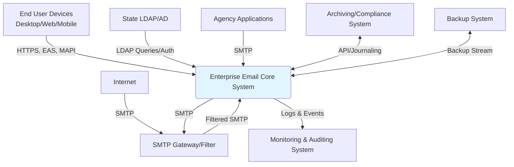

# Software Requirements Specification (SRS)
## Florida Statewide Enterprise Email, Messaging, and Calendaring Service
**Document Version:** 1.5  
**Date:** [Date of SRS Generation]  
**Status:** Approved for RFI/RFP Development  
**Project Sponsor:** Agency for Enterprise Information Technology (AEIT)

---

### 1. Introduction

#### 1.1 Purpose
This Software Requirements Specification (SRS) document defines the functional and non-functional requirements for the statewide enterprise email, messaging, and calendaring service mandated by Florida Statute 282.34. The primary purpose is to provide a comprehensive blueprint for vendors, service providers, and project stakeholders to understand the system's capabilities, constraints, and integration points. This document will serve as the foundation for the Request for Information (RFI), Request for Proposal (RFP), and subsequent system design and implementation.

#### 1.2 Document Conventions
*   **Requirements:** Functional requirements are labeled as `FR-XXX`. Non-functional requirements are labeled as `NFR-XXX`.
*   **Priority:** Implied by categorization into "Basic" (mandatory) and "Extended" (desirable) requirements within sections.
*   **Keywords:** "MUST," "SHALL," "REQUIRED" indicate mandatory requirements. "SHOULD," "RECOMMENDED" indicate desirable features. "MAY," "OPTIONAL" indicate permissible actions.

#### 1.3 Project Scope
This project encompasses the provisioning, operation, and maintenance of a unified email, calendaring, and contact management service for all executive branch agencies of the State of Florida.

**In-Scope:**
*   Core email functionality (send, receive, store, organize).
*   Calendaring and scheduling with resource management.
*   Contact/address book management.
*   Secure access via desktop clients, web browsers, and mobile devices.
*   Administrative functions for user/account lifecycle management.
*   System-wide security, anti-virus, and anti-spam filtering.
*   Archiving, retention policy enforcement, and legal e-discovery support.
*   Backup, restore, and disaster recovery capabilities.
*   Integration with existing state directory services (e.g., LDAP/Active Directory).

**Out-of-Scope:**
*   Collaboration services such as shared document workspaces, instant messaging, or discussion forums.
*   Replacement of agency-specific workflow applications that generate email.
*   Management of non-executive branch agency email systems (e.g., legislative, judicial).

#### 1.4 References
*   **Florida Statute 282.34:** Mandates the creation of a statewide enterprise technology infrastructure, including email services.
*   **Project Charter:** Florida Enterprise Email Service Initiative.
*   **Agency Survey Results & Analysis:** Compiled by the Project Workgroup Team.

### 2. Overall Description

#### 2.1 Product Perspective
The Enterprise Email System is a mission-critical component of the state's IT infrastructure. It will replace disparate agency email systems with a single, consolidated service. The system will interact with multiple external entities as shown in the context diagram below.

#### 2.2 User Classes and Characteristics
| User Class | Description | Key Characteristics & Expectations |
| :--- | :--- | :--- |
| **End User** | All state employees requiring email/calendar. | Varying technical proficiency. Requires intuitive, reliable access from office, home, and mobile devices. Daily usage. |
| **Agency Administrator** | IT staff within each executive branch agency. | Technically proficient. Responsible for user lifecycle, distribution lists, and initial archiving tasks. Requires delegated management tools. |
| **Data Center/SSRC Admin** | Personnel managing statewide infrastructure. | Highly technical. Responsible for system health, security, backups, and global policy. Requires deep operational control and monitoring. |
| **Legal/Compliance Personnel** | Staff from OIG, legal departments. | Not IT experts. Requires powerful, auditable search and legal hold capabilities to fulfill discovery requests. |
| **AEIT Management** | Project leadership and oversight. | Requires high-level reporting, cost analysis, and compliance dashboards. |

#### 2.3 Operating Environment
*   **Physical:** Hosted within secure State of Florida data centers or an approved vendor facility meeting state security standards.
*   **Technical:** Must integrate with existing state-wide LDAP/Active Directory. Must support Windows, macOS, and common web browsers for client access. Must support mobile device protocols (ActiveSync, EAS, etc.).
*   **Organizational:** Must comply with all Florida state government IT policies, security standards, and records management laws.

#### 2.4 Design and Implementation Constraints
1.  **Statutory Deadline:** A proposed plan must be submitted to government leadership by **December 31, 2009**.
2.  **Compliance:** The system must adhere to Florida statutes and relevant federal regulations (e.g., HIPAA, SOX where applicable) for data retention, privacy, and security.
3.  **Integration:** Must use existing state directory services for authentication and identity management.
4.  **Migration:** Must provide a path for migration from multiple legacy email platforms (e.g., Lotus Notes, GroupWise, various Exchange versions) with minimal user disruption.

#### 2.5 Assumptions and Dependencies
*   **Assumption:** Agencies will provide accurate user data through the centralized directory service.
*   **Assumption:** Adequate network bandwidth is available between agencies and the hosting data center(s).
*   **Dependency:** The project is dependent on the completion of the agency inventory and financial analysis surveys.
*   **Dependency:** Final solution design is dependent on the outcomes of the RFI/RFP process and sourcing model selection.

### 3. System Features and Requirements

#### 3.1 Core Email Functionality
**FR-010: Message Composition & Sending**
*   **FR-010.1:** The system SHALL allow users to compose new email messages with a subject line and body.
*   **FR-010.2:** The system SHALL allow users to attach files to messages. (`Basic`)
*   **FR-010.3:** The system SHALL provide rich-text formatting (font, size, color, bold, italic) for message bodies. (`Basic`)
*   **FR-010.4:** The system SHALL include a spell-check function. (`Basic`)

**FR-020: Message Receipt & Management**
*   **FR-020.1:** The system SHALL deliver incoming messages to the recipient's inbox.
*   **FR-020.2:** The system SHALL allow users to read, reply to, reply-all to, and forward messages.
*   **FR-020.3:** The system SHALL allow users to organize messages into user-created folders. (`Basic`)
*   **FR-020.4:** The system SHALL allow users to flag messages for follow-up or categorization.
*   **FR-020.5:** The system SHALL provide a "Deleted Items" folder with configurable retention before permanent purge.

**FR-030: Address Book & Directory**
*   **FR-030.1:** The system SHALL provide a personal contact list for users to create, edit, and manage contacts.
*   **FR-030.2:** The system SHALL provide a global address list (GAL) populated from the central directory service, searchable by name, email address, or department.
*   **FR-030.3:** The system SHALL support distribution lists. (`Basic`)

#### 3.2 Calendaring and Scheduling
**FR-040: Calendar Management**
*   **FR-040.1:** The system SHALL allow users to create, edit, and delete calendar appointments and meetings.
*   **FR-040.2:** The system SHALL allow users to invite attendees from the GAL and view their free/busy status (where permissions allow). (`Basic`)
*   **FR-040.3:** The system SHALL support recurring appointments.
*   **FR-040.4:** The system SHALL allow users to schedule resources (e.g., conference rooms, vehicles). (`Extended`)

#### 3.3 Access and Client Support
**FR-050: Client Access**
*   **FR-050.1:** The system SHALL provide a secure web-based client (HTTPS) accessible from standard browsers. (`Basic`)
*   **FR-050.2:** The system SHALL support connectivity via standard desktop mail clients (e.g., Microsoft Outlook, Apple Mail) using MAPI, POP3, or IMAP4 protocols.
*   **FR-050.3:** The system SHALL support synchronization with mobile devices (e.g., BlackBerry, iPhone, Android) using ActiveSync or comparable protocols. (`Basic`)

#### 3.4 Administrative Management
**FR-060: User Account Lifecycle**
*   **FR-060.1:** The system SHALL allow administrators to provision new user mailboxes, integrated with the central LDAP/AD directory. (`Basic`)
*   **FR-060.2:** The system SHALL allow administrators to disable, enable, and delete user mailboxes.
*   **FR-060.3:** The system SHALL allow administrators to set and modify mailbox storage quotas.
*   **FR-060.4:** The system SHALL apply a standardized email address format (e.g., `firstname.lastname@state.fl.us`). (`Basic`)

**FR-070: Distribution List Management**
*   **FR-070.1:** The system SHALL allow administrators to create static distribution lists with manual member management.
*   **FR-070.2:** The system SHALL support dynamic/query-based distribution lists where membership is based on LDAP attributes (e.g., department=Transportation). (`Extended`)

#### 3.5 Security, Compliance, and Archiving
**FR-080: Security & Filtering**
*   **FR-080.1:** The system SHALL scan 100% of inbound and outbound email for viruses and malware, quarantining infected messages. (`Basic`)
*   **FR-080.2:** The system SHALL filter inbound email for spam, with configurable quarantine or rejection policies.
*   **FR-080.3:** All user authentication SHALL be performed against the central state directory service.
*   **FR-080.4:** All data in transit (web, mobile, client access) SHALL be encrypted using TLS 1.2 or higher.

**FR-090: Archiving and E-Discovery**
*   **FR-090.1:** The system SHALL capture a copy of all sent and received email messages for archival purposes, independent of user deletion. (`Basic`)
*   **FR-090.2:** The system SHALL enforce configurable retention policies (e.g., retain for 7 years) on the archive.
*   **FR-090.3:** Authorized administrators SHALL be able to perform complex searches on the archive using criteria including sender, recipient, date range, subject, and full-text body/content. (`Basic`)
*   **FR-090.4:** The system SHALL support placing search results or custodian mailboxes on "legal hold," suspending all deletion policies for that data. (`Basic`)
*   **FR-090.5:** The system SHALL provide an audit trail for all archiving, search, and legal hold activities.

#### 3.6 System Operations and Support
**FR-100: Backup and Recovery**
*   **FR-100.1:** The system SHALL support full and incremental backups of all mailbox and system data.
*   **FR-100.2:** The system SHALL allow for the restoration of an individual user's mailbox to a previous point in time.
*   **FR-100.3:** The system SHALL have a documented disaster recovery (DR) plan capable of restoring service in the event of a data center failure.

**FR-110: Monitoring and Logging**
*   **FR-110.1:** The system SHALL generate logs for all significant events (logins, administrative actions, message delivery failures, system errors).
*   **FR-110.2:** The system SHALL provide monitoring interfaces (e.g., SNMP, syslog) for integration with statewide network operations centers.

### 4. External Interface Requirements

#### 4.1 User Interfaces
*   **Web Client:** A clean, intuitive, and accessible web interface compatible with Internet Explorer 7+, Firefox 3+, and Safari 4+.
*   **Desktop Client:** No specific UI is mandated, but the system must provide full functionality to common desktop clients like Microsoft Outlook.
*   **Mobile Interface:** The system shall present a optimized or compatible interface for mobile device synchronization.

#### 4.2 Hardware Interfaces
The system must interface with existing state storage area networks (SAN), backup tape libraries, and network infrastructure. Specifics will be determined during the architecture phase.

#### 4.3 Software Interfaces
| Interface | Purpose | Protocol/Standard | SLA/Requirement |
| :--- | :--- | :--- | :--- |
| **LDAP/Active Directory** | Authentication, User Provisioning, GAL Sync | LDAP v3 | High Availability (>99.9%) |
| **SMTP Gateway** | Inbound/Outbound Mail Flow | SMTP, TLS | 99.9% Uptime, <5 min delay |
| **Mobile Device Sync** | Push Email/Calendar/Contacts | ActiveSync, EAS | Support for major device types |
| **Archiving System** | Message Journaling & Search | SMTP Journaling, API | Meets retention law requirements |
| **Backup System** | Data Protection | VSS, Vendor-specific API | Meets defined RTO/RPO |
| **Agency Applications** | SMTP Relay | SMTP | Reliable, low-latency connection |

#### 4.4 Communications Interfaces
*   All client-to-server and server-to-server communications containing sensitive data (credentials, email content) must use encrypted channels (TLS/SSL).
*   Must support standard email ports (SMTP 25/587, IMAP 143/993, POP3 110/995, HTTPS 443).

### 5. Non-Functional Requirements

#### 5.1 Performance Requirements
*   **NFR-PERF-001:** Core user operations (opening inbox, sending a message, opening a calendar) shall have a response time of **< 1 second** under normal load for 90% of transactions.
*   **NFR-PERF-002:** The system shall be designed to support the concurrent access of **all executive branch users** (estimated [TBD] users).
*   **NFR-PERF-003:** Archive search operations for typical agency-level requests shall return results within **< 5 minutes**. Complex, multi-custodian searches may have a separate, agreed-upon SLA.

#### 5.2 Safety and Security Requirements
*   **NFR-SEC-001:** All email data at rest (on disk, in backup) **MUST** be encrypted using FIPS 140-2 validated cryptographic modules.
*   **NFR-SEC-002:** The system shall comply with all applicable Florida security standards and federal regulations (HIPAA, CJIS, etc.) relevant to agency data.
*   **NFR-SEC-003:** Comprehensive audit logs of all administrative and access events shall be maintained for a minimum of **7 years**.
*   **NFR-SEC-004:** The system shall support role-based access control (RBAC) with distinct privileges for end-users, agency admins, and system admins.

#### 5.3 Software Quality Attributes
*   **Availability (NFR-QUAL-001):** The core email and calendaring service shall have a minimum availability of **99.9%** measured monthly, excluding scheduled maintenance.
*   **Reliability (NFR-QUAL-002):** The system shall support the restoration of an individual user mailbox from backup within **4 hours** of a restore request.
*   **Maintainability (NFR-QUAL-003):** The system shall provide administrative tools for routine maintenance (patch management, performance tuning, log rotation) without requiring full service outage.
*   **Scalability (NFR-QUAL-004):** The system architecture shall allow for the addition of users, storage, and processing capacity without major redesign.

### 6. Acceptance Criteria
The following high-level acceptance tests demonstrate key capabilities:

1.  **Core Email Test:** Given a valid user account, when the user composes and sends an email with a 10MB attachment to another internal user, then the recipient shall receive the message with the attachment intact within 2 minutes.
2.  **Administration Test:** Given an agency administrator with appropriate rights, when they provision a new user account linked to an existing LDAP identity, then the new mailbox shall be accessible and the user shall appear in the Global Address List within one business day.
3.  **E-Discovery Test:** Given a set of emails subject to a 5-year retention policy, when a legal hold is applied in year 4, then those emails shall remain accessible and undeleted beyond the 5-year mark until the hold is explicitly released.
4.  **Availability Test:** Over a consecutive 3-month period post-launch, the core email service shall demonstrate 99.9% uptime as measured by independent monitoring.

### 7. Appendices

#### 7.1 Glossary
*   **AEIT:** Agency for Enterprise Information Technology.
*   **GAL:** Global Address List.
*   **E-Discovery:** Electronic discovery; the process of identifying, preserving, and producing electronically stored information for legal proceedings.
*   **Legal Hold:** A process to suspend normal data retention and deletion policies for information relevant to a legal case.
*   **RTO/RPO:** Recovery Time Objective / Recovery Point Objective; key metrics for disaster recovery.
*   **SLA:** Service Level Agreement.

#### 7.2 Domain Model Summary
Key entities and their relationships:
*   A **User** (authenticated via LDAP) owns a **Mailbox**.
*   A **Mailbox** contains many **Email Messages** and **Calendar Entries**.
*   **Email Messages** may have **Attachments** and are linked to an **Archive Record**.
*   **Distribution Lists** contain multiple **Users**.
*   **Discovery Cases** manage searches and **Legal Holds** on archived messages.
*   All significant actions generate a **System Log** entry.

#### 7.3 Open Issues and Decisions Pending
1.  Final sourcing model (in-house, outsourced, hybrid).
2.  Definitive, quantified performance benchmarks for the full user base.
3.  Detailed Disaster Recovery RTO and RPO targets.
4.  Prioritization and implementation timeline for "Extended" requirements.
5.  Standardized email address format (`first.last@state.fl.us` vs. `f.last@...`).

---
**Document Approval:**

| Role | Name | Signature | Date |
| :--- | :--- | :--- | :--- |
| Project Sponsor, AEIT | | | |
| Technical Lead | | | |
| Security Officer | | | |
| Compliance Officer | | | |