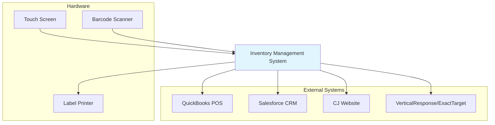

# Software Requirements Specification (SRS)
## Inventory Management System (IMS)
### For Construction Junction

**Document Version:** 1.0  
**Date:** October 26, 2023  
**Status:** Draft for Review  
**Prepared for:** Construction Junction Stakeholders  
**Prepared by:** [Your Name/Team]

---

## 1. Introduction

### 1.1 Purpose
This Software Requirements Specification (SRS) document describes the functional and non-functional requirements for the Inventory Management System (IMS) to be developed for Construction Junction (CJ). This document is intended to serve as a comprehensive guide for the development team, project managers, testers, and stakeholders throughout the project lifecycle.

### 1.2 Scope
The IMS will be a centralized system to manage the unique inventory needs of a nonprofit retail outlet for used building materials. Its core functions include:
*   Managing a hierarchical, categorized inventory of items classified as Unique, Stock, or Under $5.
*   Facilitating the processing of donations via drop-off, scheduled pickups, and deconstruction jobs.
*   Integrating bidirectionally with existing systems: QuickBooks Point of Sale (POS) and Salesforce CRM.
*   Providing data feeds to the CJ website and email marketing platforms.
*   Generating operational and compliance reports.

**Out of Scope for Initial Release:**
*   Full e-commerce functionality.
*   Mobile handheld units for associates.
*   Replacement of the existing Salesforce CRM or QuickBooks POS systems.
*   Implementation of all identified medium and low-priority features.

### 1.3 Definitions, Acronyms, and Abbreviations
| Term | Definition |
| :--- | :--- |
| **CJ** | Construction Junction |
| **IMS** | Inventory Management System |
| **POS** | Point of Sale (QuickBooks POS) |
| **CRM** | Customer Relationship Management (Salesforce) |
| **Unique Item** | A one-of-a-kind item priced individually (e.g., an antique door). |
| **Stock Item** | An item with multiple identical units sold at a standard price (e.g., common bricks). |
| **Under $5 Item** | Low-value items not individually tracked in inventory (e.g., used nails). |
| **Acquisition** | A record representing a donation event (Drop-Off, Pick Up, or Decon). |
| **Inventory Matrix** | The hierarchical visual interface for navigating Departments and Categories. |

### 1.4 References
*   CJ Business Process Documentation
*   QuickBooks POS API Documentation
*   Salesforce CRM API Documentation
*   Stakeholder Interview Notes

### 1.5 Overview
The remainder of this document is structured as follows:
*   **Section 2:** Overall Description of the system, its users, and constraints.
*   **Section 3:** Specific Requirements detailing functional, interface, and non-functional needs.
*   **Appendices:** Supporting diagrams and information.

## 2. Overall Description

### 2.1 Product Perspective
The IMS is a new, custom-developed system that will serve as the system of record for inventory. It will integrate with existing systems to form a cohesive operational ecosystem.



### 2.2 User Classes and Characteristics
| User Class | Key Characteristics | Primary Responsibilities |
| :--- | :--- | :--- |
| **Administrator** | Technical staff. | Manage system configuration: departments, categories, attributes, details. |
| **Director** | Senior management. | All Manager functions + user account management. |
| **Manager** | Supervisory staff. | All Receiving Associate functions + authority to change item properties (e.g., price). |
| **Receiving Associate** | Dock staff. | Receive drop-off donations, enter items into inventory, print receipts and tags. |
| **Customer Service Rep** | Office staff. | Manage constituent data in CRM, process returns, create drop-off acquisitions. |
| **Pickup/Decon Associate** | Field staff. | Initiate receiving process for picked-up/deconstructed items; cannot finalize inventory addition. |
| **Sales Associate** | Sales floor staff. | Process customer purchases via QuickBooks POS (integration handles inventory update). |
| **Donor** | External user. | Donate items; receive tax receipt. |
| **Buyer** | External user. | Purchase items; interacts via POS or website. |

### 2.3 Operating Environment
*   **Software:** The IMS will be a web-based application accessible via modern browsers. It will require middleware/APIs for integration with QuickBooks POS (Windows-based) and Salesforce (cloud).
*   **Hardware:** Must support interaction via touch-screen kiosks at the dock, barcode scanners, and label printers.

### 2.4 Design and Implementation Constraints
1.  Must not disrupt existing POS and CRM operations during rollout.
2.  UI must be designed for usability on touch-screen devices with potential environmental factors (dust, glare).
3.  Data model must accommodate the three distinct item types (Unique, Stock, Under $5).
4.  Must comply with nonprofit standards for generating donor tax receipts.

### 2.5 Assumptions and Dependencies
*   **Assumption:** QuickBooks POS and Salesforce APIs will remain stable and accessible.
*   **Assumption:** Adequate training will be provided to all user classes.
*   **Dependency:** Successful data migration from legacy systems using approved tools (e.g., Demand Tools).
*   **Dependency:** Resolution of undecided issues (see Section 5.1) prior to relevant development phases.

## 3. Specific Requirements

### 3.1 Functional Requirements

#### 3.1.1 Inventory Management
| ID | Requirement | Priority |
| :--- | :--- | :--- |
| **FR-IM-01** | The system shall allow authorized users (Admin) to create and manage a hierarchy of **Departments** and **Categories**. | High |
| **FR-IM-02** | Each Category shall have a **Type** (Unique, Stock, Under $5). Stock Categories must have a defined standard Price. | High |
| **FR-IM-03** | The system shall provide an **Inventory Matrix** visual interface for navigating Departments and Categories, supporting at least 30 tiles per level. | High |
| **FR-IM-04** | The system shall allow users to view a list of inventory items, filterable by Department, Category, status, and other attributes. | High |
| **FR-IM-05** | The system shall allow Managers to adjust item quantity, requiring a mandatory reason for the adjustment, which is logged. | Medium |
| **FR-IM-06** | The system shall allow Managers to split a single inventory record (e.g., a lot of 10 chairs) into multiple records (e.g., 5 chairs, 5 chairs). | Medium |
| **FR-IM-07** | The system shall maintain a complete **Item History** log for all items, recording actions (create, update, sell, adjust) with user, timestamp, and details. | High |

#### 3.1.2 Donation Processing (Acquisition)
| ID | Requirement | Priority |
| :--- | :--- | :--- |
| **FR-DP-01** | The system shall allow a Receiving Associate to initiate a new **Drop-Off Acquisition** from within the IMS, which creates a corresponding record in Salesforce CRM. | High |
| **FR-DP-02** | The system shall allow a user to search for and select an existing **Acquisition** (Pick Up, Decon, Drop-Off) that is in "Expected" or "Partially Received" status. | High |
| **FR-DP-03** | During item entry, the system shall validate required fields based on Category Type (e.g., Condition and Price required for Unique items). | High |
| **FR-DP-04** | For Unique items, the system shall suggest a price based on historical data and category, but allow manual override. | Medium |
| **FR-DP-05** | The system shall generate and print a **Donation Receipt** suitable for tax purposes for the donor upon finalizing an acquisition. | High |
| **FR-DP-06** | The system shall generate and print an **Item Tag** with barcode for Unique and Stock items added to inventory. | High |
| **FR-DP-07** | The system shall allow an item to be saved with a temporary label, leaving its parent Acquisition in "Partially Received" status for later completion. | High |
| **FR-DP-08** | Upon finalizing item entry, the system shall update the Acquisition status in Salesforce CRM to "Completed" and add item details to the acquisition record. | High |

#### 3.1.3 System Integration
| ID | Requirement | Priority |
| :--- | :--- | :--- |
| **FR-SI-01** | The system shall synchronize new and updated inventory items (including quantity) with **QuickBooks POS** in near real-time. | High |
| **FR-SI-02** | The system shall receive sale transactions from **QuickBooks POS** and immediately decrement the corresponding item quantity in the IMS, logging the sale in Item History. | High |
| **FR-SI-03** | The system shall exchange acquisition and donor data bidirectionally with **Salesforce CRM**, ensuring immediate visibility of changes in both systems. | High |
| **FR-SI-04** | The system shall provide a regular data feed of categorized inventory and availability to the **CJ Website**. | Medium |
| **FR-SI-05** | The system shall allow items to be flagged as "Blastworthy" and export data for these items to the designated email marketing platform (**VerticalResponse/ExactTarget**). | Low |

#### 3.1.4 Reporting
| ID | Requirement | Priority |
| :--- | :--- | :--- |
| **FR-RE-01** | The system shall generate standard reports for Inventory Valuation, Inventory Age, and Acquisition Summary. | High |
| **FR-RE-02** | The system shall record and report on the average processing time per acquisition. | Medium |

### 3.2 External Interface Requirements

#### 3.2.1 User Interfaces
*   The primary UI for dock operations must be optimized for **touch screens**: large buttons, adequate spacing, minimal text input.
*   The inventory matrix navigation must be intuitive and responsive.
*   Administrative interfaces can assume traditional keyboard/mouse interaction.

#### 3.2.2 Hardware Interfaces
*   The system must support USB/Bluetooth barcode scanners for scanning item tags and member cards.
*   The system must support standard label printers (e.g., Zebra, DYMO) for printing item tags and temporary labels.

#### 3.2.3 Software Interfaces (As detailed in Section 3.1.3)
1.  **QuickBooks POS Interface:** Bidirectional RESTful API or middleware-based sync for inventory and sales data.
2.  **Salesforce CRM Interface:** Bidirectional integration via Salesforce API to manage Acquisition and Donor objects.
3.  **Website Data Feed:** Scheduled XML/JSON export or API push.
4.  **Email Marketing Feed:** Scheduled CSV export or API integration.

### 3.3 Non-Functional Requirements

#### 3.3.1 Performance
*   All critical user interactions (matrix navigation, item entry, saving) must have a response time of **< 2 seconds** under normal load.
*   The system must support the concurrent activity of at least 10 Receiving Associates and 20 Sales Associates (via POS integration).

#### 3.3.2 Security
*   The system shall implement **Role-Based Access Control (RBAC)** with the 8 defined user classes.
*   All authentication must be integrated with CJ's central directory (e.g., Google Apps).
*   Sensitive operations (price changes, item deletions, quantity adjustments) must be recorded in an **audit log** with user, timestamp, and before/after values.

#### 3.3.3 Reliability & Availability
*   The system must be available for dock operations during all business hours (8 AM - 6 PM, 7 days/week).
*   Administrative and reporting functions must be available 24/7, with scheduled maintenance windows communicated in advance.
*   System uptime must be ≥ 99.5%.

#### 3.3.4 Compliance
*   The system must generate donation receipts that meet IRS guidelines for non-cash charitable contributions.

## 4. System Features (Use Cases)

### 4.1 Use Case Diagram
*(A diagram would be inserted here illustrating actors: Receiving Associate, Manager, Sales Associate, System; and use cases: Process Drop-Off Donation, Adjust Item Quantity, Sell Item via POS, Generate Inventory Report.)*

### 4.2 Detailed Use Case: Process Drop-Off Donation
*   **Actor:** Receiving Associate
*   **Precondition:** User is logged into the IMS with appropriate permissions.
*   **Main Success Scenario:**
    1.  Donor arrives at dock with items.
    2.  Associate clicks "New Drop-Off" in IMS.
    3.  System creates a new Acquisition record in Salesforce and displays it.
    4.  Associate navigates the Inventory Matrix to select the appropriate Category.
    5.  Associate enters item details (quantity, condition, description, price).
    6.  System validates data and suggests a price (if applicable).
    7.  Associate confirms and saves the item.
    8.  System prints a donation receipt and an item tag (if required).
    9.  System adds the item to inventory and syncs it to QuickBooks POS.
    10. System updates the Acquisition status in Salesforce to "Completed".
*   **Alternative Flows:**
    *   **A. Unscheduled Donor:** Begins at step 2.
    *   **B. Item Needs Processing:** At step 7, associate chooses "Print Temp Label." System prints label and leaves acquisition as "Partially Received."
*   **Postcondition:** Item is in active inventory, donor has receipt, acquisition is closed.

## 5. Appendices

### 5.1 Undecided Issues & Open Decisions
| Issue | Description | Responsible Party |
| :--- | :--- | :--- |
| **UI-01** | Final pixel dimensions and layout for Inventory Matrix tiles. | System Architect |
| **INT-01** | Selection of specific middleware/platform for QB POS & Salesforce integration. | Technical Sponsor |
| **MRK-01** | Final decision on email marketing platform (VerticalResponse vs. ExactTarget). | Business Sponsor |
| **OPS-01** | Specification of RFID vs. standard 1D/2D barcode for item tags. | Operations & Technical Sponsor |
| **ARCH-01** | Definition of "regular data transfer" frequency for website updates (e.g., hourly, daily). | System Architect |
| **HW-01** | Approval of specific hardware models for touch screens, scanners, printers. | Operations |
| **SEC-01** | Development of detailed disaster recovery and backup procedures. | Technical Sponsor |
| **ENV-01** | Resolution of potential Google Apps migration impact on system authentication. | Business Sponsor |

### 5.2 Data Model (Simplified Schema)
```sql
-- Core Entities
Department (id, name, pos_department_code, unique_tag)
Category (id, name, unique_tag, type, standard_price, department_id)
InventoryItem (id, item_number, quantity, condition, price, description, category_id, acquisition_id, created_date)
Attribute (id, name, type) -- e.g., Material, Color
Detail (id, name, type, options) -- e.g., Width (Number), Manufacturer (Text)
ItemDetail (item_id, detail_id, value) -- Links items to their specific details
Acquisition (id, acquisition_number, type, status, donor_id, date)
ItemHistory (id, item_id, action, user_id, timestamp, notes)
```

### 5.3 Acceptance Tests (Examples)
**Test ID:** AT-DP-01
*   **Capability:** Process a Drop-Off Donation.
*   **Given:** A donor arrives without an appointment and a Receiving Associate is logged in.
*   **When:** The associate creates a new Drop-Off acquisition and completes the item receipt process for a "Unique" category item.
*   **Then:**
    1.  A donation receipt is printed with donor info, item description, and date.
    2.  The item appears in the IMS inventory list with status "Available."
    3.  The item appears in the QuickBooks POS item list.
    4.  The associated Acquisition in Salesforce CRM has status "Completed."

**Test ID:** AT-SI-01
*   **Capability:** Sell a Unique Inventory Item via POS.
*   **Given:** A unique item exists in IMS and QuickBooks POS and is tagged with a barcode.
*   **When:** A Sales Associate scans the item's barcode in QuickBooks POS and completes the sale transaction.
*   **Then:**
    1.  The item's quantity in IMS is decremented to zero.
    2.  The item's status in IMS changes to "Sold."
    3.  An entry is added to the item's History log recording the sale and the POS transaction ID.

---
**Document Approval:**

| Role | Name | Signature | Date |
| :--- | :--- | :--- | :--- |
| Project Sponsor | | | |
| Business Owner | | | |
| System Architect | | | |