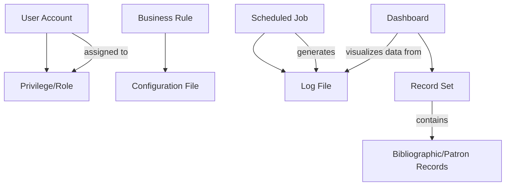

# Software Requirements Specification (SRS)
## System Administration Module for Integrated Library System (ILS)

**Document Version:** 1.0  
**Date:** October 26, 2023  
**Status:** Draft for Review  
**Authors:** System Architecture Team

---

### 1. Introduction

#### 1.1 Purpose
This document provides a comprehensive specification for the System Administration Module of a new Integrated Library System (ILS). It is intended for use by the development team, project managers, system administrators, library stakeholders, and quality assurance personnel to guide the design, implementation, and verification of the module.

#### 1.2 Scope
The System Administration Module will provide centralized management, configuration, monitoring, security, and maintenance capabilities for a large-scale, multi-branch ILS serving 50 locations. It replaces and enhances existing commercial ILS administration tools.

**In-Scope:**
*   System health monitoring and alerting.
*   Configuration management (business rules, application settings).
*   User and privilege management (Role-Based Access Control).
*   Scheduled job execution and maintenance utilities.
*   Log management and audit capabilities.
*   Integration with core ILS modules and external systems.
*   Reporting and query tool administration.

**Out-of-Scope (Non-Goals):**
*   Detailed specification of user interface components (to be developed iteratively).
*   Detailed data structure definitions for core ILS entities (e.g., MARC records, patron objects).
*   Core functionality of other ILS modules (Acquisitions, Circulation, Cataloging, OPAC), which are presupposed to exist and provide APIs.
*   Hardware procurement and network infrastructure design.

#### 1.3 Definitions, Acronyms, and Abbreviations
*   **ILS:** Integrated Library System.
*   **OPAC:** Online Public Access Catalog.
*   **RBAC:** Role-Based Access Control.
*   **SLA:** Service Level Agreement.
*   **SNMP:** Simple Network Management Protocol.
*   **MARC:** Machine-Readable Cataloging.
*   **API:** Application Programming Interface.
*   **RDBMS:** Relational Database Management System.
*   **KPI:** Key Performance Indicator.

#### 1.4 References
*   Project Charter: "Next-Generation ILS Initiative"
*   Interface Control Documents for external systems (OCLC, Backup Software, etc.)
*   WCAG 2.1 AA Accessibility Guidelines

#### 1.5 Overview
The remainder of this document is structured as follows: Section 2 provides an overall description of the product and its operating environment. Section 3 details specific functional and non-functional requirements. Appendices contain supplementary information.

### 2. Overall Description

#### 2.1 Product Perspective
The System Administration Module is a core component of the new ILS ecosystem. It interacts with all other modules (Circulation, Cataloging, etc.) to enforce policies, manage data, and ensure system stability. It serves as the primary interface for technical and managerial staff to control the library's operational backbone.

#### 2.2 User Classes and Characteristics
| User Class | Characteristics | Key Needs |
| :--- | :--- | :--- |
| **System Administrators** | Technical IT staff. Expert knowledge of servers, databases, and networking. | Full control over system configuration, performance monitoring, troubleshooting, and maintenance. Requires powerful, granular tools. |
| **Staff (Librarians/Technicians)** | Library operations staff. Varied technical proficiency. Primary users of circulation and cataloging modules. | Ability to run reports, manage patron accounts, and perform batch operations within their scope. Needs intuitive, task-oriented interfaces. |
| **Managers / Library Managers** | Supervisory and branch management staff. Focus on service design and operational metrics. | Access to reports, dashboards for KPIs, and ability to request configuration changes to business rules. |
| **Library Directors** | Executive level. Strategic oversight. | High-level dashboards summarizing system usage, performance, and cost-effectiveness. |
| **Patrons** | End-users of library services. | Indirect stakeholders; their experience is impacted by the performance and rules managed through this module. |

#### 2.3 Operating Environment
*   **Software:** The module will operate on enterprise-grade Linux servers. It will interface with an SQL-based RDBMS (e.g., PostgreSQL, Oracle). Client access will be via modern web browsers (Chrome, Firefox, Safari, Edge).
*   **Hardware:** The system will be deployed in a clustered environment across multiple physical or virtual servers to ensure high availability.
*   **Networks:** Must operate securely over the library's WAN connecting 50 branches.

#### 2.4 Design and Implementation Constraints
1.  Must use the existing corporate standard for user authentication (e.g., LDAP/Active Directory integration).
2.  All administrative web interfaces must comply with WCAG 2.1 AA accessibility standards.
3.  Must support integration with the library's existing email infrastructure (SMTP).
4.  Data exports must support standard bibliographic formats (MARC21, MARCXML).

#### 2.5 Assumptions and Dependencies
*   It is assumed that the core ILS database schema and APIs for other modules (Circulation, OPAC) will be developed concurrently and will be stable for integration.
*   The module depends on the successful selection and certification of third-party backup software.
*   Library staff will be trained on the new system, mitigating transition risks from the legacy ILS.

### 3. System Features and Requirements

#### 3.1 Functional Requirements

##### 3.1.1 System Monitoring & Alerting (FR-MON)
*   **FR-MON-01:** The system shall provide a web-based performance dashboard displaying real-time metrics for CPU utilization, memory usage, disk space, and active process counts for all application servers.
*   **FR-MON-02:** Administrators shall be able to configure threshold-based alerts for any system metric (e.g., disk space > 90%).
*   **FR-MON-03:** When an alert threshold is breached, the system shall generate an immediate notification visible on the dashboard and send an email to a configurable list of administrators.
*   **FR-MON-04:** The dashboard shall provide drill-down capabilities from a high-level alert to detailed process information (e.g., identify a specific runaway process consuming high memory).
*   **FR-MON-05:** The system shall expose performance counters via SNMP for integration with enterprise monitoring tools.

##### 3.1.2 Configuration & Business Rule Management (FR-CFG)
*   **FR-CFG-01:** The system shall provide a centralized console for creating, reading, updating, and deleting business rules that govern library policies (e.g., loan periods, fine rates, hold limits).
*   **FR-CFG-02:** Business rules shall be immediately effective upon saving, without requiring a system restart.
*   **FR-CFG-03:** Rules shall be composable based on multiple criteria (patron type, item type, material location, date).
*   **FR-CFG-04:** The system shall provide a version history for configuration files and business rules, allowing rollback to a previous state.
*   **FR-CFG-05:** Administrators shall be able to manage application-wide settings through a protected interface for configuration files.

##### 3.1.3 Security & User Administration (FR-SEC)
*   **FR-SEC-01:** The system shall implement a Role-Based Access Control (RBAC) model.
*   **FR-SEC-02:** Administrators shall be able to create, modify, and deactivate user accounts for staff and administrators.
*   **FR-SEC-03:** Administrators shall be able to define roles (e.g., "Circulation Desk", "Cataloging Manager", "System Admin") and assign granular permissions to these roles.
*   **FR-SEC-04:** User accounts shall be assignable to one or more roles, inheriting the combined permissions.
*   **FR-SEC-05:** All administrative actions (logins, configuration changes, record modifications) shall be recorded in an immutable audit log.

##### 3.1.4 Maintenance & Job Scheduling (FR-MNT)
*   **FR-MNT-01:** The system shall include a job scheduler for defining and executing automated tasks (e.g., backups, report generation, data exports).
*   **FR-MNT-02:** Jobs shall be schedulable by cron-like syntax (minute, hour, day of month, etc.).
*   **FR-MNT-03:** A console shall display the status (pending, running, succeeded, failed) of all scheduled jobs.
*   **FR-MNT-04:** The system shall support "live" or "hot" incremental and full backups of the database without requiring an outage or blocking patron transactions.
*   **FR-MNT-05:** Administrators shall be able to create and manage "Record Sets" (logical groupings of bibliographic or patron records) for performing batch operations.

##### 3.1.5 Logging & Reporting (FR-REP)
*   **FR-REP-01:** The system shall aggregate and provide a searchable, filterable interface for viewing all application, transaction, and audit log files.
*   **FR-REP-02:** Log access and queries shall not require stopping any system service.
*   **FR-REP-03:** The system shall provide a query builder tool allowing authorized staff to create custom reports against the ILS database.
*   **FR-REP-04:** A library of pre-configured standard report templates (e.g., monthly circulation by branch, collection turnover) shall be included.
*   **FR-REP-05:** Reports shall be exportable in multiple formats (PDF, CSV, HTML).

#### 3.2 External Interface Requirements

##### 3.2.1 User Interfaces
*   All administrative functions will be accessed through a secure, web-based interface.
*   Interfaces will be responsive and usable on standard desktop and tablet resolutions.
*   Consistent navigation and design patterns will be used across all consoles (Dashboard, Configuration, User Admin, etc.).

##### 3.2.2 Hardware Interfaces
*   The module will interface with server hardware via the host operating system for performance metrics.
*   It will integrate with tape/library hardware via certified third-party backup software APIs.

##### 3.2.3 Software Interfaces
| Interface | Type | Direction | Protocol/Standard | Purpose |
| :--- | :--- | :--- | :--- | :--- |
| ILS Core Database | Internal | Bi-directional | SQL, ODBC/JDBC | Primary data storage and retrieval for all modules. |
| Other ILS Module APIs | Internal | Bi-directional | REST/JSON (Assumed) | To enforce business rules and fetch data for reports. |
| Email Server | External | Outbound | SMTP with Auth | Sending alerts and notifications. |
| Vendor APIs (OCLC) | External | Outbound | SFTP, SSL, Z39.50 | Import/export of bibliographic records. |
| Backup Software | External | Outbound | Vendor-specific API | Initiating and managing backup jobs. |
| SNMP Managers | External | Outbound | SNMP v2c/v3 | Sending system health traps. |

##### 3.2.4 Communications Interfaces
*   All external communications (APIs, email) must support secure protocols (SSL/TLS, SSH).
*   Internal communications within the trusted application tier will be over secured private networks.

#### 3.3 Non-Functional Requirements

##### 3.3.1 Performance Requirements
*   The system shall support an annual transaction volume of **20 million circulations**.
*   Search queries and standard report generation shall complete within **< 30 seconds** during peak operational hours without causing noticeable degradation to core circulation and OPAC functions.
*   The performance dashboard shall update metrics at a configurable interval, with a minimum refresh time of **10 seconds**.

##### 3.3.2 Reliability & Availability
*   The administrative module shall be designed for **99.5% availability** during standard library operating hours.
*   The system architecture shall support **server clustering** to provide failover capability in the event of a hardware or software failure on a primary node.
*   Live backup functionality is **mandatory**; scheduled maintenance shall not require a full system outage.

##### 3.3.3 Security Requirements
*   All patron data in transit must be encrypted using strong cryptography (TLS 1.2+).
*   The RBAC system must prevent privilege escalation and enforce the principle of least privilege.
*   Audit logs must be protected from unauthorized modification or deletion.
*   All administrative interfaces must be protected by authentication and session management controls.

##### 3.3.4 Compliance Requirements
*   All generated web interfaces (HTML) must validate against W3C standards.
*   The application must be fully accessible, conforming to **WCAG 2.1 Level AA** guidelines, compatible with screen readers and magnification software.

##### 3.3.5 Observability & Maintainability
*   **100% of system log files** must be accessible for review through the administrative interface while the system is running.
*   All application configuration files must be accessible and manageable through the configuration console or via documented file system locations.
*   The system shall provide clear, actionable error messages within logs and user interfaces.

### 4. Supporting Information

#### 4.1 Acceptance Criteria (Key Examples)
*   **AC-01 (Monitoring):** Given the system is under normal load, when a System Administrator navigates to the Performance Dashboard, then they see current metrics for all servers updated within the last 10 seconds.
*   **AC-02 (Business Rules):** Given a new business rule limiting "New Release" DVDs to a 3-day loan, when a patron attempts to check out such an item, then the circulation module blocks the transaction and displays "Loan period limit for this item type: 3 days" to the staff member.
*   **AC-03 (Backup):** Given it is 02:00 AM, the scheduled backup time, when the backup job triggers, then the ILS continues to process patron check-outs and searches without error while the backup completes successfully.

#### 4.2 Domain Model (Key Entities)

#### 4.3 Business Process Flows
**Process: System Health Monitoring & Intervention**
1.  **Trigger:** Scheduled poll or admin login.
2.  Admin views performance dashboard.
3.  System displays real-time KPIs (CPU, Memory, Disk, Processes).
4.  Admin reviews active alert panel.
5.  **If** critical alert exists, admin drills down to process details.
6.  Admin takes action (e.g., terminates process via console).
7.  System logs the intervention in the audit log.
8.  **Output:** Resolved incident, updated logs.

#### 4.4 Milestones & Release Strategy
1.  **M1: Core Infrastructure** - Basic auth, server shell, DB setup.
2.  **M2: Monitoring & Alerting** - Dashboard, SNMP, email alerts.
3.  **M3: Configuration Management** - Business Rules & Config consoles.
4.  **M4: Maintenance Tools** - Job Scheduler, Backup integration, Record Sets.
5.  **M5: Reporting & Query** - Query builder, standard reports.
6.  **M6: Integration & Polish** - Full ILS integration, accessibility audit, documentation.

#### 4.5 Risk Management
| Risk | Probability | Impact | Mitigation Strategy |
| :--- | :--- | :--- | :--- |
| Real-time processing impacts performance | Medium | High | Design for horizontal scalability; implement proactive monitoring early. |
| RBAC model becomes unmanageable | Medium | Medium | Use sensible default roles; provide excellent role-copy and bulk-assignment tools. |
| External API dependency causes failure | High | Medium | Implement circuit breakers, queuing for retries, and clear manual override procedures. |
| Live backup conflicts with availability | Low | High | Utilize storage/database snapshot technology certified by vendors. |
| Customizations hinder system upgrades | Medium | Medium | Use versioned, modular configuration schemas; provide upgrade utilities. |

#### 4.6 Open Issues & Decisions Pending
1.  **Decision:** Final selection of certified third-party backup software. *(Owner: System Architects & Vendor)*
2.  **Decision:** Detailed configuration migration protocol from Dev/Test to Production. *(Owner: Dev Team & SysAdmins)*
3.  **Decision:** Final list of out-of-the-box standard report templates. *(Owner: Library Managers & Dev Team)*
4.  **Decision:** Primary method for client software updates (e.g., MSI, proprietary installer). *(Owner: IT Infrastructure Team)*
5.  **Decision:** Scope and timeline for the integrated online help system. *(Owner: Technical Writers & Product Manager)*

---
*This document is considered the authoritative source for requirements for the System Administration Module. Any changes must follow the approved change control process.*