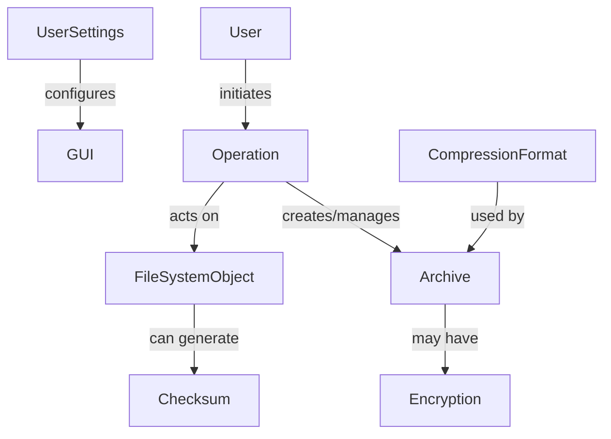

# Software Requirements Specification (SRS)
## PeaZip 2.7.1 - Cross-Platform Archive Manager

**Document Version:** 1.0
**Date:** 2023-10-27
**Status:** Approved for Development

---

### 1. Introduction

#### 1.1 Purpose
This document defines the functional and non-functional requirements for PeaZip version 2.7.1, a cross-platform, open-source file and archive manager. It serves as the authoritative specification for developers, testers, project managers, and stakeholders to ensure a common understanding of the system to be built.

#### 1.2 Scope
PeaZip 2.7.1 is a desktop application that provides a unified graphical user interface (GUI) for numerous open-source archiving and compression utilities. Its core capabilities include:
*   Creating, updating, and extracting archives across a wide range of formats.
*   File management operations (secure deletion, splitting/joining, checksum calculation).
*   Operating as a self-contained application on Windows, Linux, BSD, and other POSIX-compliant systems without requiring separate installation of backend tools.

**Out of Scope:**
*   Functioning as a web application.
*   Providing communication interfaces (e.g., network protocols) for core archiving functionality.
*   Password recovery for encrypted archives.

#### 1.3 Definitions, Acronyms, and Abbreviations
*   **GUI:** Graphical User Interface.
*   **SLA:** Service Level Agreement (regarding interface expectations).
*   **POSIX:** Portable Operating System Interface.
*   **7Z:** 7-Zip archive format.
*   **LZMA:** Lempel–Ziv–Markov chain algorithm (a compression method).
*   **PPMd:** Prediction by Partial Matching (a compression method).
*   **PeaLauncher:** The PeaZip component responsible for launching and monitoring backend command-line utilities.

#### 1.4 References
*   Project Charter and Vision Statement.
*   Licenses for bundled utilities (7-Zip, Pea, etc. - LGPL and other open-source licenses).

#### 1.5 Overview
The remainder of this document is structured as follows: Section 2 provides an overall description of the product, its stakeholders, and operating environment. Section 3 details the specific functional and non-functional requirements. Appendices may contain supplementary diagrams or data models.

---

### 2. Overall Description

#### 2.1 Product Perspective
PeaZip is an independent, standalone desktop application. It integrates with the host operating system's file system and provides a frontend layer to bundled, third-party command-line compression utilities (e.g., 7z.exe, pea). The system context diagram is as follows:

```
[User] <--> [PeaZip GUI] <--> [PeaLauncher] <--> [Backend Utilities (7z, Pea...)]
                          |
                          +--> [Host OS File System]
```

#### 2.2 Stakeholders and User Classes
| Stakeholder Class | Description | Primary Interests |
| :--- | :--- | :--- |
| **End User** | Any computer user needing to manage files/archives. | Intuitive GUI, reliable compression/extraction, broad format support, security features. |
| **Software Engineer/Developer** | Team developing and maintaining PeaZip. | Clear requirements, maintainable codebase, effective integration with backend utilities. |
| **System Administrator** | Deploys software across multiple systems. | Portable deployment, stability, configuration management, system tool integration. |

#### 2.3 Operating Environment
*   **Software:** Microsoft Windows (XP and later), Linux distributions (via GTK2), BSD, and other POSIX-compliant operating systems.
*   **Hardware:** Must run on standard consumer-grade PC hardware. Specific minimum requirements for advanced algorithms are a pending issue (see Section 5.2).
*   **Dependencies:** Self-contained; all necessary backend utilities are bundled. Some OS distributions may require GTK/GDK libraries to be installed separately.

#### 2.4 Design and Implementation Constraints
1.  **Architecture:** Must be built as a cross-platform desktop GUI application.
2.  **Licensing:** All code and bundled components must comply with open-source or royalty-free licenses (e.g., LGPL).
3.  **Security:** No persistent storage of encryption passwords or keyfile contents.
4.  **Performance:** GUI must remain responsive during long-running backend operations.

#### 2.5 User Documentation
Comprehensive user documentation, including help files and online resources, must be updated to reflect new features and changes in version 2.7.1.

#### 2.6 Assumptions and Dependencies
*   Assumes the host operating system provides stable file I/O APIs.
*   Depends on the continued availability and compatibility of the bundled open-source command-line utilities.

---

### 3. System Features and Requirements

#### 3.1 Functional Requirements

##### 3.1.1 File System Browsing and Management (FR-01)
*   **FR-01.1:** The system shall provide a graphical file manager for browsing the host operating system's directory structure.
*   **FR-01.2:** The user shall be able to select one or more files and folders within the file manager.

##### 3.1.2 Archive Creation (FR-02)
*   **FR-02.1:** The system shall allow the user to initiate archive creation from selected files via toolbar, context menu, or drag-and-drop.
*   **FR-02.2:** The user shall be able to select the output archive format from a list of supported write formats (e.g., 7Z, ZIP, TAR).
*   **FR-02.3:** The user shall be able to configure archive options, including compression level, dictionary size, and volume splitting.
*   **FR-02.4:** The user shall be able to specify an output path and filename for the new archive.
*   **FR-02.5:** The user shall be able to optionally enable encryption using a password and/or a keyfile.
*   **FR-02.6:** Upon confirmation, the system shall invoke the appropriate backend utility to create the archive at the specified location, leaving source files unchanged.

##### 3.1.3 Archive Extraction (FR-03)
*   **FR-03.1:** The system shall allow the user to initiate extraction from a selected archive file.
*   **FR-03.2:** The user shall be able to specify a target folder for the extracted contents.
*   **FR-03.3:** If the archive is encrypted, the system shall prompt the user for a password and/or keyfile.
*   **FR-03.4:** The system shall handle extraction errors (e.g., wrong password, corrupt archive) gracefully with informative messages.

##### 3.1.4 Archive Update (FR-04)
*   **FR-04.1:** The system shall allow the user to add files to an existing archive.
*   **FR-04.2:** When an existing archive is selected as the target, the "Create Archive" interface shall pre-load its contents.
*   **FR-04.3:** The user shall be able to add new files to the archive's layout and confirm the update operation.

##### 3.1.5 File Management Tools (FR-05)
*   **FR-05.1 (Secure Delete):** The system shall provide a tool to permanently delete files by overwriting their data on disk to prevent recovery.
*   **FR-05.2 (File Split/Join):** The system shall provide tools to split large files into smaller volumes and rejoin them.
*   **FR-05.3 (Checksum/Hash):** The system shall provide tools to calculate and verify file checksums (e.g., MD5, SHA256).
*   **FR-05.4 (File Compare):** The system shall provide a tool to compare the contents of two files.

##### 3.1.6 Configuration and Preferences (FR-06)
*   **FR-06.1:** The user shall be able to configure application settings, including default archive format, UI language, theme, and toolbar layout.
*   **FR-06.2:** User settings shall be persisted between application sessions.

##### 3.1.7 Operation Monitoring (FR-07)
*   **FR-07.1:** The system shall display real-time progress feedback (percentage, elapsed time, file name) for all long-running operations via the PeaLauncher interface.
*   **FR-07.2:** The user shall be able to pause or cancel an ongoing operation where supported by the backend utility.

#### 3.2 Non-Functional Requirements

##### 3.2.1 Performance (NF-01)
*   **NF-01.1:** The GUI shall not block or become unresponsive during compression/decompression operations. Processing speed is dependent on the selected algorithm and host system hardware.
*   **NF-01.2:** The system shall manage system resources effectively to avoid excessive memory consumption, especially with very large archives (mitigation strategy required - see Section 5.2).

##### 3.2.2 Reliability (NF-02)
*   **NF-02.1:** The application shall not crash due to errors from backend utilities (e.g., corrupt input, disk full). Errors shall be caught and presented to the user.
*   **NF-02.2:** The PeaLauncher shall implement timeouts and process monitoring to handle hanging backend utilities.

##### 3.2.3 Security (NF-03)
*   **NF-03.1:** Encryption passwords and keyfile data shall be held only in volatile memory for the duration of the operation and shall not be logged or persisted.
*   **NF-03.2:** The secure delete function shall use a proven, multi-pass overwriting algorithm to prevent data remanence.
*   **NF-03.3:** The application shall provide clear warnings about the irrecoverable nature of lost encryption passwords.

##### 3.2.4 Compliance (NF-04)
*   **NF-04.1:** The software and all its bundled components shall be distributed in full compliance with their respective open-source licenses.

##### 3.2.5 Usability (NF-05)
*   **NF-05.1:** Common operations (create, extract) shall be accessible within 3 clicks or actions from the main interface.
*   **NF-05.2:** The interface shall support drag-and-drop for archiving and extraction.

##### 3.2.6 Portability (NF-06)
*   **NF-06.1:** The application shall function identically across all supported target operating systems (Windows, Linux, BSD).
*   **NF-06.2:** A portable version shall be available that does not require installation.

#### 3.3 Domain Model
Key entities and their relationships:

*   **Archive:** `{Name, Format, Path, Size, EncryptionStatus}`
*   **FileSystemObject:** `{Name, Path, Type, Size, LastModifiedDate}`
*   **Encryption:** `{Password*, KeyfilePath*, Algorithm}`
*   **Operation:** `{Type, Status, ProgressPercentage, TargetObject}`
*   **UserSettings:** `{DefaultArchiveFormat, Language, UITheme, ToolbarConfiguration}`
*   **CompressionFormat:** `{Name, ReadSupport, WriteSupport}`
*   **Checksum/Hash:** `{Algorithm, Value, FileReference}`

*`Password` is stored only transiently in memory.

#### 3.4 External Interface Requirements

##### 3.4.1 User Interfaces
*   A main window with a dual-pane or single-pane file manager.
*   Dedicated dialog windows for "Create Archive," "Extract," and "Settings."
*   Context (right-click) menus for files and archives.
*   A progress window (PeaLauncher) showing operation status.

##### 3.4.2 Hardware Interfaces
None beyond standard PC hardware and storage devices.

##### 3.4.3 Software Interfaces
*   **Host OS File System:** For all file I/O operations. Must handle standard OS errors (e.g., permission denied, path not found).
*   **Bundled Command-Line Utilities (7z, Pea, etc.):** PeaZip shall invoke these utilities with appropriate parameters, capture their `stdout`/`stderr`, and interpret their exit codes.

##### 3.4.4 Communications Interfaces
Not applicable for core functionality.

---

### 4. Verification and Acceptance

#### 4.1 Acceptance Criteria
*   **AC-01 (Archive Creation with Encryption):**
    *   **Given** a user has selected files and opened the Create Archive interface,
    *   **When** they choose the 7Z format, set a password, and start the operation,
    *   **Then** a 7Z archive is created at the specified location and cannot be opened without the correct password.
*   **AC-02 (Archive Extraction):**
    *   **Given** an encrypted ZIP archive exists,
    *   **When** a user selects it, provides the correct password in the Extract interface, and chooses a target folder,
    *   **Then** the archive contents are fully extracted to the specified folder.
*   **AC-03 (Secure File Deletion):**
    *   **Given** a user selects a file and chooses the "Secure Delete" tool,
    *   **When** the operation completes successfully,
    *   **Then** the file is permanently removed, and its data is not recoverable by standard file recovery software.

#### 4.2 Testing Strategy
*   Functional testing of all use cases.
*   Cross-platform compatibility testing on all target OSes.
*   Security testing, particularly for secure delete and encryption memory handling.
*   Performance testing with large files and various compression algorithms.

---

### 5. Appendices

#### 5.1 Risk Management
| ID | Risk Description | Probability | Impact | Mitigation Strategy |
| :--- | :--- | :--- | :--- | :--- |
| R-01 | Backend utility fails/hangs during operation. | Medium | High | Implement process monitoring & user-cancel option in PeaLauncher. |
| R-02 | OS/library incompatibility. | Low | Medium | State clear system requirements; provide portable versions & library guides. |
| R-03 | User loses encryption password. | Medium | High (for user) | Provide clear, unavoidable warnings during encryption setup. |
| R-04 | Secure deletion leaves recoverable data. | Low | Critical | Use proven algorithms (e.g., DoD 5220.22-M); conduct code audits. |
| R-05 | Performance issues on low-end hardware. | Medium | Medium | Set sensible default compression levels; show resource usage estimates. |
| R-06 | License compliance issues with bundled utilities. | Low | Critical | Maintain an audited component/license list; ensure redistribution terms are met. |

#### 5.2 Open Issues
| Issue ID | Description | Responsible Party |
| :--- | :--- | :--- |
| OI-01 | Define specific minimum hardware requirements for advanced algorithms (LZMA, PPMd). | Development Team & Project Lead |
| OI-02 | Establish a prioritization framework for adding support for new archive formats. | Project Lead & Community Feedback |
| OI-03 | Define a technical strategy for handling multi-terabyte archives (memory management, UI). | Architecture/Development Team |
| OI-04 | Formalize the localization process for adding new language packs. | Development Team & Community Volunteers |

---
**Document Approval:**

| Role | Name | Signature | Date |
| :--- | :--- | :--- | :--- |
| Project Sponsor | | | |
| Project Manager | | | |
| Lead Developer | | | |
| QA Lead | | | |