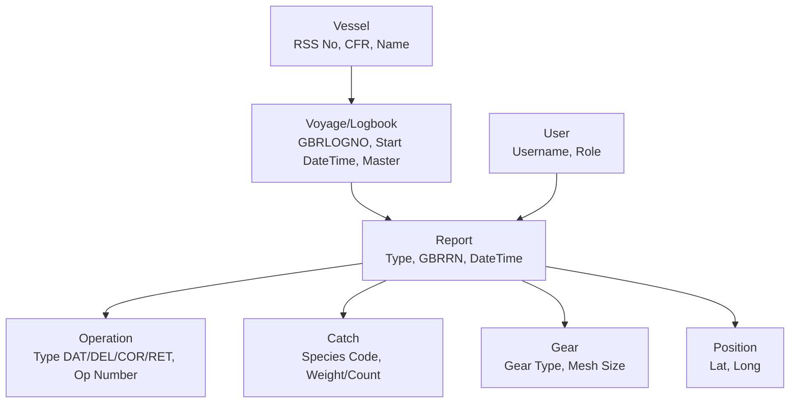

# Software Requirements Specification (SRS)
## Electronic Logbook Software System (ELSS) for UK Fishing Vessels

**Document Version:** 1.2  
**Date:** [Date of Generation]  
**Status:** Draft for Review  
**Classification:** Public

---

### 1. Introduction

#### 1.1 Purpose
This Software Requirements Specification (SRS) document defines the functional and non-functional requirements for the Electronic Logbook Software System (ELSS). The ELSS is mandated for use on UK-registered fishing vessels exceeding 15 meters in length to comply with European Union regulations (EC No. 1966/2006 and 1077/2008). This document serves as the definitive guide for suppliers developing ELSS products, for the Validation Authority conducting conformance testing, and for the UK Fisheries Administrations (UKFA) managing the approval programme.

#### 1.2 Scope
The ELSS is an onboard software application that enables the capture, local validation, secure transmission, and local storage of fishing activity data. The system generates XML messages conforming to the UK-specific schema and transmits them via email to the UK's Electronic Recording and Reporting System (ERS).

**In-Scope:**
*   Onboard data entry for all mandatory fishing reports (e.g., DEP, FAR, LAN, TRA).
*   Validation of data against the official UK XML Schema Definition (XSD).
*   Generation of unique message identifiers (GBRRN, GBRLOGNO).
*   Secure (PGP encrypted) transmission of reports via email.
*   Reception and processing of acknowledgment (RET) messages.
*   Local data retention for the duration of a fishing trip.
*   Support for conditional data fields required for fishing in specified third-country waters (e.g., Norway).
*   A defined Product Profile and Self-Declaration Form for supplier conformance.

**Out of Scope (Non-Goals):**
*   Onshore use by fishing agents or buyers (this functionality is provided by a separate ERS web portal).
*   Support for regulatory data formats of other EU member states or third countries, except where explicitly specified.
*   Long-term archival of data beyond the completion of a fishing trip.
*   Vessel tracking or Vessel Monitoring System (VMS) functionality.
*   Direct integration with sales notes or other commercial documentation systems.

#### 1.3 Definitions, Acronyms, and Abbreviations
| Term | Definition |
| :--- | :--- |
| **CFR** | Community Fleet Register number. |
| **COR** | Correction operation. |
| **DAT** | Data operation (initial submission). |
| **DEL** | Delete operation. |
| **DEP** | Departure report. |
| **DIS** | Discard report. |
| **ELSS** | Electronic Logbook Software System. |
| **EOF** | End of Fishing report. |
| **ERS** | Electronic Recording and Reporting System. |
| **FAR** | Fishing Activity Report. |
| **GBRLOGNO** | Unique logbook identifier (RSSNo + Year + Sequence). |
| **GBRRN** | Unique report message identifier (RSSNo + Date + Sequence). |
| **LAN** | Landing declaration. |
| **PGP** | Pretty Good Privacy (encryption standard). |
| **RET** | Return Acknowledgment message. |
| **RSS** | Radio Station Ship number (unique UK vessel identifier). |
| **RTP** | Return to Port report. |
| **TRA** | Transhipment report. |
| **UKFA** | UK Fisheries Administrations. |
| **XSD** | XML Schema Definition. |

#### 1.4 References
1.  Commission Regulation (EC) No 1966/2006 on electronic recording and reporting of fishing activities.
2.  Commission Regulation (EC) No 1077/2008 laying down detailed rules for the implementation of Regulation (EC) No 1966/2006.
3.  UK Fisheries Administrations - ELSS Functional Specification v1.2.
4.  UK ERS XML Schema Definition (XSD) Files.

#### 1.5 Document Overview
This SRS is structured to provide a comprehensive view of the ELSS requirements, beginning with an overall description of the product and its stakeholders, followed by detailed specific requirements covering functionality, interfaces, and constraints.

### 2. Overall Description

#### 2.1 Product Perspective
The ELSS is a standalone onboard software component that interacts with several external entities:
*   **UK ERS:** The primary external system, receiving reports and sending acknowledgments.
*   **Vessel Navigation/GPS:** Provides positional and timestamp data.
*   **Onboard Weighing Systems:** Provides catch weight data (optional integration).
*   **Supplier Update Server:** Provides software updates and patches.
*   **Users:** The Master and crew interact via the ELSS user interface.

The system context diagram is as follows:
```
[Onboard Sensors (GPS/Weighing)] --> [ELSS] --> [UK ERS via Email]
[User] --> [ELSS] <--> [Local Data Store]
```

#### 2.2 Stakeholder and User Profiles
| Stakeholder | Primary Interest / Responsibility |
| :--- | :--- |
| **UK Fisheries Administrations (UKFA)** | Define regulatory requirements, operate the ERS, monitor compliance, and manage the ELSS Approved Product Register. |
| **ELSS Supplier/Developer** | Develop, maintain, and support the ELSS software. Complete conformance documentation and seek formal approval. |
| **Vessel Owner** | Procure, install, and fund an approved ELSS. Ensure the vessel operates with a compliant system. |
| **Vessel Master** | Ultimate responsibility for accurate and timely reporting. Uses ELSS to submit all reports, manages user accounts, and oversees data entry. |
| **Onboard Crew/User** | May input data under the Master's supervision. All actions are audited to a unique user ID. |
| **Validation Authority** | Conducts independent, objective testing of supplier ELSS products against this SRS for approval. |
| **Third-Country Authority** | Receives specific data (via UK ERS) when UK vessels operate in their jurisdictional waters. |

#### 2.3 User Stories and Use Cases
**2.3.1 Primary User Stories**
*   As a **Vessel Master**, I must be able to submit a complete and valid Daily Fishing Activity Report (FAR) before 24:00 UTC each fishing day, so that I comply with regulations.
*   As a **Vessel Master**, I need to correct any error in a previously sent report from the current trip, so that the official record in the ERS is accurate.
*   As a **Crew Member**, I need to log in with my own credentials to enter catch data, so that the Master can supervise and all actions are traceable.
*   As a **Vessel Owner**, I need to install a UKFA-approved ELSS product on my vessel, so that my vessel is legally permitted to fish.

**2.3.2 Key Use Case: UC-01 Submit Fishing Activity Report (FAR)**
*   **Actor:** Vessel Master
*   **Preconditions:** Vessel is on an active fishing trip (logbook is open). User is authenticated.
*   **Main Flow:**
    1.  Master selects "Submit Daily FAR".
    2.  System presents a data entry form, pre-populating date, time (UTC), and vessel position from GPS (if available).
    3.  Master (or delegated crew) enters catch data by species, gear used, and fishing areas.
    4.  Master submits the report.
    5.  System validates all data against the UK XSD schema.
    6.  System generates a unique GBRRN and formats a valid XML message (DAT operation).
    7.  System encrypts the XML file using PGP.
    8.  System sends an email to the UK ERS address with the encrypted attachment and subject line `ERS - <GBRRN>`.
    9.  System stores the report locally and marks it as "Sent, awaiting ACK".
    10. System receives a RET acknowledgment email from UK ERS.
    11. System matches the RET to the original message and updates the report status to "Acknowledged" or displays an error.
*   **Postconditions:** A valid FAR is recorded locally and successfully transmitted to UK ERS.

#### 2.4 Domain Model
The core data entities managed by the ELSS include:


#### 2.5 Business Process Flows
**2.5.1 Main Process: Record and Submit Report**
1.  **Trigger:** Reporting event (time-based, e.g., daily FAR; or event-based, e.g., DEP).
2.  **Data Entry:** User inputs data. System should auto-populate from sensors where possible.
3.  **Validation:** Real-time validation against business rules and XSD schema.
4.  **Message Generation:** Creation of structured XML with correct operation type and unique IDs.
5.  **Transmission:** Encryption and email dispatch.
6.  **Acknowledgment Handling:** Polling for/receiving RET, matching, and status update.
7.  **Local Storage:** Persistence of report data and transmission audit trail.

**2.5.2 Process Branch: Correction (COR)**
*   Initiated when Master selects a previously sent report from the current trip for correction.
*   ELSS must generate a new COR operation containing the *entire corrected report*, not just the changed fields.
*   The COR message replaces the original report in the ERS.

### 3. System Requirements

#### 3.1 Functional Requirements
| ID | Requirement | Priority |
| :--- | :--- | :--- |
| **FR-01** | **User Management:** The system shall require user authentication via a unique username and password for access. | High |
| **FR-02** | **Vessel Profile:** The system shall allow configuration and storage of static vessel data, including RSS Number (mandatory), CFR, and vessel name. | High |
| **FR-03** | **Logbook Creation:** The system shall allow the Master to create a new fishing voyage/logbook, generating a unique GBRLOGNO. | High |
| **FR-04** | **Report Data Capture:** The system shall provide data entry screens for all mandatory report types: DEP, FAR, LAN, TRA, DIS, COE, COX, RTP, EOF. | High |
| **FR-05** | **Auto-Population:** The system shall be capable of auto-populating the date, time (UTC), and geographical position (latitude/longitude) in reports from an integrated GPS/NMEA source. | Medium |
| **FR-06** | **Data Validation:** The system shall validate all user-entered data against the current UK ERS XSD schema before allowing submission. Validation errors shall be clearly displayed to the user. | High |
| **FR-07** | **Unique ID Generation:** For each report, the system shall generate a unique GBRRN (RSSNo + Date + Sequence Number). | High |
| **FR-08** | **XML Generation:** The system shall format the validated report data into a well-formed XML document adhering to the UK ERS schema. | High |
| **FR-09** | **Encryption:** The system shall encrypt the outgoing XML message file using PGP encryption prior to transmission. | High |
| **FR-10** | **Email Transmission:** The system shall transmit the encrypted XML file as an email attachment to the designated UK ERS email address. The email subject shall be formatted as `ERS - <GBRRN>`. | High |
| **FR-11** | **Local Queuing:** The system shall queue reports for transmission if communication is unavailable and automatically attempt re-transmission at intervals. | High |
| **FR-12** | **RET Processing:** The system shall receive and process RET acknowledgment emails from UK ERS, matching them to the original sent message and updating the local report status. | High |
| **FR-13** | **Alerting:** The system shall alert the user (Master) if a RET is not received within a configurable time period after sending a report. | Medium |
| **FR-14** | **Correction & Deletion:** The system shall allow the Master to correct (COR) or delete (DEL) any report from the current trip before the EOF report is submitted. A COR must contain the full corrected report. | High |
| **FR-15** | **Test Mode:** The system shall have a test mode that sends messages (flagged with TS) to a test ERS address. Messages sent in test mode must not be stored as real fishing data. | Medium |
| **FR-16** | **Third-Country Data:** The system shall present conditional information fields (CIF) for data entry when the Master indicates fishing activity in a specified third-country zone (e.g., Norwegian waters). | Medium |
| **FR-17** | **Local Data Retention:** The system shall retain all data for the current fishing trip locally until a successful LAN or TRA report is sent, marking the end of the trip. | High |
| **FR-18** | **Audit Trail:** All report entries and submissions shall be indelibly linked to the user ID of the person who performed the action. | High |

#### 3.2 External Interface Requirements
**3.2.1 User Interfaces**
*   The UI shall be designed for use in a marine environment (considering potential moisture, vibration, and limited space).
*   All data entry screens shall clearly indicate mandatory fields.
*   The system shall provide a clear dashboard/view of report status (e.g., Draft, Sent, Acknowledged, Error).

**3.2.2 Hardware Interfaces (Input)**
*   **GPS/Navigation System:** The ELSS shall accept NMEA 0183 or other standard data streams to obtain WGS84 position (latitude/longitude) and UTC time.
*   **Weighing Systems:** The ELSS may interface with onboard weighing equipment to receive species-weight data, subject to the equipment providing a standard digital output.

**3.2.3 Communication Interfaces (Output)**
*   **Email (SMTP):** The primary communication interface. The ELSS must be configurable with SMTP server settings, port, and authentication credentials.
*   **PGP:** The system must implement PGP encryption for outgoing attachments and be capable of decrypting received RET messages (if encrypted).

#### 3.3 Non-Functional Requirements
| Category | Requirement | Verification Method |
| :--- | :--- | :--- |
| **Performance** | The system shall allow a user to complete data entry for a standard FAR and initiate submission within 5 minutes under normal operating conditions. | Test |
| **Performance** | The system shall be capable of generating and queuing XML reports within 30 seconds of user submission. | Test |
| **Reliability** | The system shall have an availability of 99.5% during a fishing trip, excluding planned maintenance or external communication failures. | Analysis |
| **Reliability** | Local data shall be protected against loss due to application crash or unexpected shutdown. | Test |
| **Security** | All user passwords shall be stored using a strong, salted hashing algorithm. | Inspection |
| **Security** | Each ELSS installation shall have a unique software identifier included in all transmissions. | Inspection |
| **Compliance** | The system shall strictly adhere to the data types, formats, and business rules defined in the official UK ERS XSD schema. | Conformance Test |
| **Compliance** | Any software update that modifies core reporting, validation, or transmission functionality shall require re-approval by the Validation Authority. | Process |
| **Usability** | A user familiar with paper logbooks shall be able to be trained to perform basic data entry and submission on the ELSS within 2 hours. | User Trial |
| **Maintainability** | The supplier shall provide a mechanism to update reference data (e.g., FAO species codes, area codes) without a full software re-release. | Design Review |

#### 3.4 Acceptance Criteria
**AC-01: Successful Daily FAR Submission**
*   **Given** the vessel is on an active trip and has catch data,
*   **When** the Master completes the FAR form and submits it before 24:00 UTC,
*   **Then** the ELSS validates the data, generates a valid XML file with a DAT operation and unique GBRRN, encrypts it, and successfully sends an email to the UK ERS. The system subsequently receives and displays a successful RET acknowledgment.

**AC-02: Report Correction**
*   **Given** a FAR report with an error in species weight has been successfully transmitted,
*   **When** the Master selects that report, corrects the weight, and submits a correction,
*   **Then** the ELSS generates and transmits a COR operation containing the complete, corrected FAR report. The original report in ERS is superseded.

**AC-03: Operation During Communication Outage**
*   **Given** the vessel has no satellite/radio email connectivity,
*   **When** the Master submits a DEP report,
*   **Then** the ELSS validates and stores the report locally, marks it as "Queued for Transmission", and automatically attempts to send it when connectivity is restored.

### 4. Appendices

#### 4.1 Assumptions and Dependencies
*   It is assumed the vessel has a reliable source of UTC time.
*   The ELSS is dependent on the vessel having an operational email communication system (e.g., satellite comms).
*   Successful approval is dependent on the supplier accurately completing the Product Profile and Self-Declaration Form.

#### 4.2 Risks and Mitigations
| Risk | Probability | Impact | Mitigation Strategy |
| :--- | :--- | :--- | :--- |
| Communication failure during critical reporting period. | Medium | High | ELSS queues reports and retries; provides clear alerts to Master. |
| Data entry errors due to complex UI or user error. | High | Medium | Robust XSD validation, intuitive UI design, and easy COR process. |
| Software update inadvertently breaks approved functionality. | Medium | High | Requirement for re-approval of updates affecting core functions; rigorous supplier testing. |
| Changes to EU/UK ERS data standards. | Low | High | UKFA to provide updated XSDs with lead time; specification includes update process. |

#### 4.3 Open Issues and TBDs
1.  The technical specification for the integration with onboard weighing systems is to be defined by individual ELSS suppliers based on market equipment.
2.  The formal policy and process for de-listing an approved product from the register is to be established by UKFA.
3.  Support for transmission protocols other than email (e.g., web services) is deferred for future evaluation by UKFA.