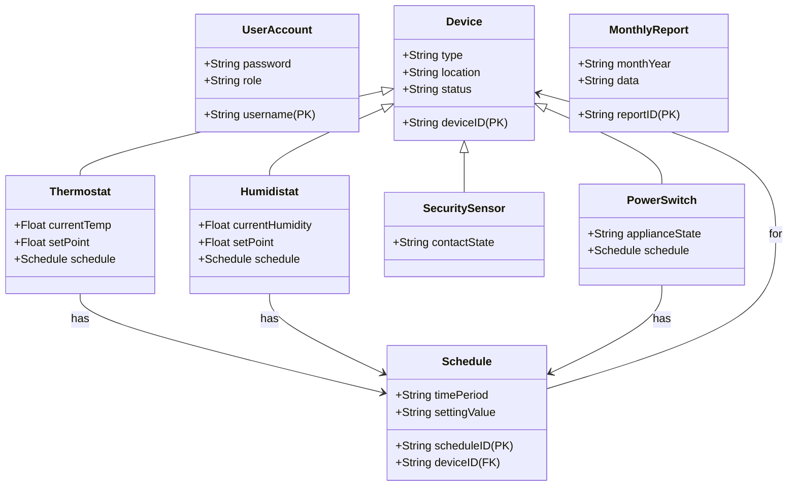

# Software Requirements Specification (SRS)
## DigitalHome Prototype System
**Document Version:** 1.0
**Date:** October 27, 2010
**Prepared for:** HomeOwner Inc., DigitalHomeOwner Division
**Prepared by:** [Development Team Lead/System Architect]

---

### 1. Introduction

#### 1.1 Purpose
This document defines the functional and non-functional requirements for the DigitalHome (DH) prototype system. It serves as the authoritative specification for the development team, testers, project managers, and stakeholders. The intended audience includes the DigitalHomeOwner Division development team, HomeOwner Inc. management, and future technical evaluators.

#### 1.2 Scope
The DigitalHome project is a prototype "Smart House" system that integrates security, environmental control (temperature, humidity, lighting), and appliance management into a unified home automation platform. The system will be accessible via a web interface and will manage a network of simulated devices within a controlled environment.

**In-Scope:**
*   Management of simulated thermostats, humidistats, security contact sensors, and power switches (appliance/lighting).
*   A web-based portal for user monitoring, control, and reporting.
*   User authentication and role-based access control (General User, Master User, DH Technician).
*   Scheduling of device settings.
*   Real-time security monitoring and alarm activation.
*   Generation of monthly environmental and security reports.
*   System configuration, backup, and recovery operations.

**Out-of-Scope (Non-Goals):**
*   Deployment or testing in physical homes with real hardware.
*   Integration with entertainment systems (audio/video).
*   Support for commercial-grade features such as billing, multi-tenant architecture, or advanced analytics.
*   Mobile-native applications (interface is browser-based).
*   Physical installation or maintenance procedures for real devices.

#### 1.3 Definitions, Acronyms, and Abbreviations
*   **DH:** DigitalHome
*   **GUI:** Graphical User Interface
*   **HVAC:** Heating, Ventilation, and Air Conditioning
*   **MTBF:** Mean Time Between Failures
*   **SLA:** Service Level Agreement
*   **SRS:** Software Requirements Specification
*   **TLS:** Transport Layer Security
*   **ASHRAE:** American Society of Heating, Refrigerating and Air-Conditioning Engineers
*   **IEEE:** Institute of Electrical and Electronics Engineers

#### 1.4 References
*   Internal HomeOwner Inc. Software Development Standards
*   IEEE Std 830-1998 - Recommended Practice for Software Requirements Specifications
*   ASHRAE Standards for HVAC Control Systems
*   Project Charter: DigitalHome Prototype Initiative

#### 1.5 Overview
The remainder of this document is structured as follows: Section 2 provides an overall description of the product, its stakeholders, and operating environment. Section 3 details the specific functional requirements. Section 4 outlines non-functional requirements. Appendices may contain supplementary diagrams or data models.

### 2. Overall Description

#### 2.1 Product Perspective
The DH system is a self-contained prototype. It acts as a middleware layer between a simulated device network and end-users via a web portal. The system interfaces with simulated device gateways and manages its own database for configuration, state, and historical data.

#### 2.2 Stakeholders and User Characteristics
| Stakeholder | Description | Key Interests |
| :--- | :--- | :--- |
| **General User** | A home resident. Uses the system for daily monitoring and control. | Ease of use, reliable access to device status and controls, clear notifications. |
| **Master User** | A resident with elevated privileges. | Ability to configure user accounts, adjust system defaults, and manage schedules. |
| **DH Technician** | A trained professional who sets up and maintains the system. | Robust configuration tools, system start/stop controls, access to logs, backup/restore functionality. |
| **Development Team** | DigitalHomeOwner Division engineers. | Clear, testable requirements, a feasible technical architecture, and a stable scope. |
| **HomeOwner Inc. Management** | Decision-makers evaluating the prototype. | Demonstrated core functionality, proof of concept for integration, data to inform business decisions. |

#### 2.3 Operating Environment
*   **Software:** The DH web portal will run on a standard web application stack (specific framework TBD). It will connect to a relational database and a simulation gateway service.
*   **Hardware:** The system will be developed and hosted on standard development servers and workstations.
*   **Simulated Environment:** The "home" environment will consist of software simulators for devices, communicating via a simulated wireless network with a range of 1000 ft.

#### 2.4 Design and Implementation Constraints
1.  The system must be a prototype, not a production-ready commercial product.
2.  Development must adhere to internal HomeOwner Inc. coding and documentation standards.
3.  All data transmission must be encrypted (specific technology TBD by System Architect).
4.  The user interface must be usable on modern web browsers and mobile device browsers.

#### 2.5 Assumptions and Dependencies
*   The simulation environment will accurately mimic the behavior and constraints of physical devices.
*   The development team of five engineers has the necessary skills to complete the project within the 12-month timeline, assuming no major scope changes.
*   Necessary development tools and licenses will be available within budget.

### 3. System Features and Requirements

#### 3.1 Functional Requirements

##### 3.1.1 User Authentication and Authorization (FR-1)
*   **FR-1.1:** The system shall require username and password authentication for all access to the web portal.
*   **FR-1.2:** The system shall support three distinct user roles: General User, Master User, and DH Technician, with permissions as defined in Section 2.2.
*   **FR-1.3:** The system shall allow a DH Technician or Master User to create, modify, and deactivate user accounts.

##### 3.1.2 Device Monitoring and Display (FR-2)
*   **FR-2.1:** The system shall display the real-time status (e.g., current temperature, ON/OFF state, OPEN/CLOSED) of all configured devices on a dashboard or device-specific panel.
*   **FR-2.2:** Displayed sensor data shall update at a minimum frequency of once every 2 seconds.
*   **FR-2.3:** The system shall acquire sensor data from the simulated network at a minimum rate of 10 Hz.

##### 3.1.3 Device Control (FR-3)
*   **FR-3.1:** The system shall allow an authenticated user to submit control commands (e.g., set a new thermostat temperature, turn a power switch ON/OFF).
*   **FR-3.2:** The system shall validate all control commands against user permissions and logical/physical constraints (e.g., temperature limits) before execution.
*   **FR-3.3:** Upon successful command execution, the system shall send the command to the target simulated device via the gateway and provide visual confirmation to the user.
*   **FR-3.4:** The system shall log all user-initiated control actions.

##### 3.1.4 Scheduling (FR-4)
*   **FR-4.1:** The system shall allow a user to create, view, edit, and delete schedules for compatible devices (Thermostat, Humidistat, PowerSwitch).
*   **FR-4.2:** A schedule shall consist of a device reference, a time period (e.g., day of week, time of day), and a target setting value.
*   **FR-4.3:** The system shall automatically execute scheduled settings at the defined times.

##### 3.1.5 Security Monitoring and Alarms (FR-5)
*   **FR-5.1:** The system shall monitor the state of all SecuritySensor devices.
*   **FR-5.2:** When the security system is armed and a contact sensor transitions to "OPEN," the system shall immediately activate the simulated sound and light alarm subsystems.
*   **FR-5.3:** All security breach events shall be logged with a precise timestamp.

##### 3.1.6 Reporting (FR-6)
*   **FR-6.1:** The system shall allow a user to request a monthly report for any past month where data exists.
*   **FR-6.2:** The monthly report shall include, at a minimum:
    *   Daily average, minimum, and maximum values for temperature and humidity.
    *   A chronological list of recorded security breaches with timestamps.
*   **FR-6.3:** The report shall be presented in a formatted, readable view within the web portal.

##### 3.1.7 System Administration (FR-7)
*   **FR-7.1:** The DH Technician role shall have access to a configuration interface to add, remove, or modify simulated devices in the system.
*   **FR-7.2:** The system shall perform an automated daily backup of all configuration data, user schedules, and historical logs to a persistent storage location (format TBD).
*   **FR-7.3:** The DH Technician shall be able to initiate a system recovery from the latest backup archive.

#### 3.2 Domain Model
The following key entities and their relationships define the system's core data structure:

### 4. Non-Functional Requirements

#### 4.1 Performance Requirements
*   **PER-1:** The web portal shall update displayed device status information within 2 seconds of a state change in the simulation environment.
*   **PER-2:** The system shall be capable of polling and processing sensor data from the simulated network at a sustained rate of 10 Hz.

#### 4.2 Reliability Requirements
*   **REL-1:** The system shall target a Mean Time Between Failures (MTBF) of 10,000 hours during the testing phase.
*   **REL-2:** The system shall implement daily automated backups to prevent data loss.
*   **REL-3:** All critical operations shall include exception handling to prevent cascading failures.

#### 4.3 Security Requirements
*   **SEC-1:** All user authentication shall be performed over an encrypted connection using a recognized standard (e.g., TLS).
*   **SEC-2:** Passwords shall be stored using industry-standard hashing algorithms.
*   **SEC-3:** User sessions shall have a configurable timeout period.

#### 4.4 Compliance Requirements
*   **COM-1:** The logic for HVAC control (thermostat, humidistat) shall adhere to relevant ASHRAE guidelines for environmental control systems.
*   **COM-2:** The software development process and documentation shall follow applicable IEEE standards and internal HomeOwner Inc. standards.

#### 4.5 Observability & Support Requirements
*   **OBS-1:** The system shall generate logs for all user actions, system events (e.g., alarms, errors), and device state changes.
*   **OBS-2:** All user-facing errors shall be accompanied by a clear, informative message describing the issue and suggested action.

### 5. Acceptance Criteria
The following test scenarios must pass for the system to be considered acceptable:

1.  **Remote Temperature Control:**
    *   *Given* a user is logged into the web portal, *when* they set a thermostat to 72°F, *then* the system displays a confirmation and the thermostat's set point is updated in the system.
    *   *Given* a user submits an invalid temperature setting (e.g., 150°F), *when* they submit it, *then* the system rejects the input and displays a descriptive error message (e.g., "Temperature out of allowable range.").

2.  **Security Monitoring:**
    *   *Given* the security system is in an "armed" state, *when* a simulated door contact sensor changes to "OPEN," *then* the simulated sound and light alarms activate within 1 second, and the event is logged.

3.  **Reporting:**
    *   *Given* at least one month of simulated operational data exists in the system, *when* a user requests the monthly report for that period, *then* a report is generated and displayed containing daily average temperature and a list of any security breaches that occurred.

### 6. Appendix

#### 6.1 Undecided Issues (To Be Resolved)
| Issue | Description | Responsible Party | Target Resolution Date |
| :--- | :--- | :--- | :--- |
| U-1 | Selection of specific encryption technology (e.g., TLS 1.2/1.3). | System Architect | Nov 10, 2010 |
| U-2 | Detailed architecture and tool selection for the device simulation environment. | Construction Engineer/Team | Nov 30, 2010 |
| U-3 | Priority matrix for non-core features in case of timeline pressure. | Team Leader & Director | Ongoing |
| U-4 | Exact format (e.g., SQL dump, compressed archive) and storage location for backups. | System Architect | Dec 1, 2010 |
| U-5 | Selection of the web application framework (e.g., Django, Spring Boot). | System Architect | Nov 10, 2010 |
| U-6 | Formal, measurable criteria for "Acceptance Testing" success. | Quality Manager & Director | May 1, 2011 |

#### 6.2 Risk Management
| Risk | Probability | Impact | Mitigation Strategy |
| :--- | :--- | :--- | :--- |
| Prototype scope creep into commercial features. | Medium | High | Strict adherence to this SRS; formal change request process requiring Director approval. |
| Simulation environment lacks real-world fidelity. | Medium | Medium | Define clear simulation specifications that mirror physical constraints; validate early. |
| Team size insufficient for timeline. | Medium | High | Maintain strict requirement prioritization; employ agile processes and productivity tools. |
| Integration challenges between system components. | High | High | Early prototyping of communication layers (web server ↔ gateway); use standard protocols. |
| Failure to meet reliability target (MTBF). | Low | High | Implement rigorous unit, integration, and system-level testing; design robust error handling. |
| Cost overruns on tools/components. | Low | Medium | Prioritize free/open-source or low-cost, widely-available technologies; obtain quotes early. |

---
**Document Approval:**

| Role | Name | Signature | Date |
| :--- | :--- | :--- | :--- |
| Project Director | | | |
| System Architect | | | |
| Quality Manager | | | |
| Development Lead | | | |