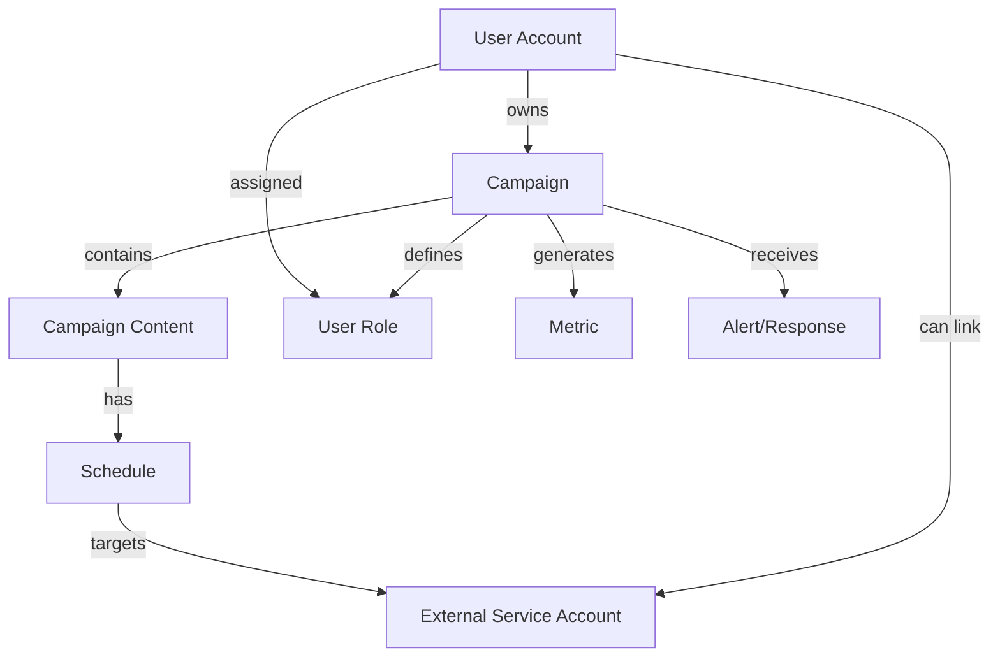

# Software Requirements Specification (SRS)
## Mashbot - Social Media Campaign Management Platform
**Version:** 1.0 (Draft)
**Date:** October 26, 2023
**Status:** For Review

---

## 1. Introduction

### 1.1 Purpose
This document defines the functional and non-functional requirements for Mashbot, a web-based service designed to help small-to-medium businesses (SMBs) manage their social media presence. It serves as a comprehensive guide for stakeholders, developers, testers, and project managers throughout the software development lifecycle.

### 1.2 Scope
Mashbot provides a unified interface for managing interactions across multiple social networks, with a primary focus on enabling scheduled, automated marketing campaigns.

**In-Scope for Initial Release:**
*   User account and role management (Contributor, Approver, Publisher, Admin).
*   Creation, editing, and management of marketing campaigns.
*   Scheduling and automated publishing of content to external social networks.
*   Basic aggregation and display of campaign performance metrics.
*   Integration with at least two major social network APIs (e.g., Twitter, Facebook).

**Out-of-Scope for Initial Release:**
*   Full customer service functionality (e.g., ticketing, agent assignment).
*   Management of traditional marketing campaigns (e.g., direct mail, SMS).
*   User-created custom campaign classes or complex workflow engines.
*   Advanced analytics and predictive modeling.

### 1.3 Definitions, Acronyms, and Abbreviations
*   **SMB**: Small-to-Medium Business.
*   **API**: Application Programming Interface.
*   **SLA**: Service Level Agreement.
*   **UI**: User Interface.
*   **UX**: User Experience.
*   **CRUD**: Create, Read, Update, Delete.
*   **TLS**: Transport Layer Security.
*   **MVP**: Minimum Viable Product.
*   **GA**: General Availability.

### 1.4 References
*   Project Charter - Mashbot
*   Stakeholder Interview Summaries
*   [External Reference: Twitter API v2 Documentation]
*   [External Reference: Facebook Graph API Documentation]

### 1.5 Overview
The remainder of this document is structured as follows: Section 2 provides an overall description of the product, its users, and constraints. Section 3 details specific functional requirements. Section 4 outlines non-functional requirements. Appendices contain supplementary information.

## 2. Overall Description

### 2.1 Product Perspective
Mashbot is a standalone, web-based application. It interacts with external social network platforms via their public APIs and is accessed by users through a modern web browser.

### 2.2 User Classes and Characteristics
| User Class | Description | Key Characteristics |
| :--- | :--- | :--- |
| **System Administrator** | Manages the system configuration, user accounts, and global security settings. | Technical proficiency, requires full system access. |
| **Contributor** | Creates, edits, and submits content (text, images) for marketing campaigns. | Content creator, may have limited technical skill. |
| **Approver** | Reviews and approves or rejects content submitted by Contributors. | Managerial or supervisory role, responsible for brand consistency. |
| **Publisher** | Schedules approved campaign content for publication and monitors publishing status. | Operational role, focused on execution and timing. |
| **End-User/Customer** | Interacts with published content on external social networks. | *Implicit stakeholder; does not interact with Mashbot UI.* |

### 2.3 Operating Environment
*   **Software:** The application will be delivered as a web service accessible via HTTPS. The server-side components will run on a modern cloud or server environment (OS TBD).
*   **Hardware:** Users require a device with a modern web browser (e.g., Chrome 90+, Firefox 88+, Safari 14+).
*   **Networks:** The application requires outbound internet access to connect to external social network APIs (e.g., `api.twitter.com`, `graph.facebook.com`).

### 2.4 Design and Implementation Constraints
1.  The architecture must be modular to support a plugin-based model for external social network adapters.
2.  User credentials for external services must be stored encrypted at rest.
3.  The system must be designed to handle API rate limits imposed by external social networks.
4.  The initial database technology must support relational data models and incremental backups.

### 2.5 Assumptions and Dependencies
*   **Assumption:** Target SMB users have basic familiarity with social media concepts.
*   **Assumption:** External social network APIs will remain relatively stable during the core development period.
*   **Dependency:** Availability and continued operation of third-party social network APIs.
*   **Dependency:** A valid SMTP server is available for sending notification emails.

## 3. System Features and Requirements

### 3.1 Functional Requirements

#### 3.1.1 User Authentication and Authorization (FR1)
*   **FR1.1:** The system shall allow users to log in with a unique username and password.
*   **FR1.2:** The system shall validate user credentials against the stored user database.
*   **FR1.3:** The system shall enforce configurable session timeouts.
*   **FR1.4:** The system shall provide a "Forgot Password" function that sends a reset link via email.
*   **FR1.5:** The system shall route authenticated users to a view based on their assigned role(s).

#### 3.1.2 User and Account Management (FR2)
*   **FR2.1:** A System Administrator shall be able to create, view, edit, and disable user accounts.
*   **FR2.2:** When creating a user, the Admin must provide: Username (unique), Password, Name, Email, and assign at least one system role.
*   **FR2.3:** A user shall be able to edit their own profile information (Name, Email) and change their password.
*   **FR2.4:** User permissions to perform actions (create, approve, publish) shall be governed by their role within a specific campaign.

#### 3.1.3 External Service Integration (FR3)
*   **FR3.1:** A user shall be able to link their external social media accounts (e.g., Twitter, Facebook) to Mashbot via OAuth or similar secure authentication flow.
*   **FR3.2:** The system shall securely store the obtained authentication tokens/credentials for linked external accounts.
*   **FR3.3:** The system shall provide an interface for users to view and revoke linked external accounts.

#### 3.1.4 Campaign Management (FR4)
*   **FR4.1:** A user with the 'Contributor' role for a campaign shall be able to create a new campaign, providing at least a campaign name.
*   **FR4.2:** The campaign creator shall be able to assign roles (Contributor, Approver, Publisher) to other users for that specific campaign.
*   **FR4.3:** A Contributor shall be able to create, edit, and delete content items (initially text and images) within a campaign.
*   **FR4.4:** A Contributor shall be able to submit a content item for approval.
*   **FR4.5:** An Approver shall be able to view a list of content pending approval, and approve or reject individual items.
*   **FR4.6:** A Publisher shall be able to schedule an approved content item for publication to one or more linked external services at a specified date and time.
*   **FR4.7:** The system shall prevent the scheduling of content that has not been approved (if an Approver role is assigned to the campaign).

#### 3.1.5 Content Publishing (FR5)
*   **FR5.1:** The system shall execute scheduled publishing actions at the specified time.
*   **FR5.2:** When publishing, the system shall format the content according to the target social network's API specifications and transmit it using stored credentials.
*   **FR5.3:** The system shall implement retry logic (e.g., 3 attempts with backoff) for handling transient API failures during publishing.
*   **FR5.4:** The system shall log the outcome (success or failure with error details) of every publishing attempt.

#### 3.1.6 Dashboard and Monitoring (FR6)
*   **FR6.1:** The system shall provide a dashboard view displaying a list of active and recent campaigns.
*   **FR6.2:** For each campaign, the dashboard shall display key metrics (e.g., number of posts published, basic engagement counts) aggregated from external services.
*   **FR6.3:** The dashboard shall display a log of recent system activities (e.g., content published, approvals granted, failed actions).

#### 3.1.7 System Administration (FR7)
*   **FR7.1:** The System Administrator shall be able to configure system-wide settings, including SMTP for emails and session timeout duration.
*   **FR7.2:** The system shall log multiple failed login attempts from a single account and alert the Administrator (via dashboard and/or email) based on a configurable threshold.

### 3.2 External Interface Requirements

#### 3.2.1 User Interfaces
The primary UI will be a responsive web application with the following key views:
*   **Login View:** Simple form for username/password entry and "Forgot Password" link.
*   **Dashboard View:** Overview of campaigns, metrics, and activity log.
*   **Campaign Management View:** Interface to create campaigns, manage members/roles, and create/edit content.
*   **Approval Queue View:** List for Approvers to review submitted content.
*   **Scheduling View:** Calendar/interface for Publishers to schedule approved content.
*   **Settings View:** For users to manage profile and linked external accounts; for Admins to manage system settings.

#### 3.2.2 Hardware Interfaces
None specified.

#### 3.2.3 Software Interfaces
| System | Direction | Protocol/API | Purpose |
| :--- | :--- | :--- | :--- |
| Twitter API | Outbound | REST (OAuth 2.0) | Publish tweets, retrieve metrics. |
| Facebook Graph API | Outbound | REST (OAuth 2.0) | Publish to Pages, retrieve insights. |
| SMTP Server | Outbound | SMTP | Send notification and password reset emails. |
| Web Browser | Both | HTTP/1.1, HTTPS, WebSockets | Serve application UI and handle user interactions. |

#### 3.2.4 Communications Interfaces
All client-server communication must use TLS 1.2 or higher. Communication with external APIs will use HTTPS.

### 3.3 System Domain Model
The core data entities and their relationships are summarized below:

**Entity Details:**
*   **User Account:** `username`, `hashed_password`, `name`, `email`, `status`
*   **Campaign:** `name`, `owner_id`, `status`, `created_at`
*   **Campaign Content:** `type`, `body`, `campaign_id`, `status`, `approved_by`, `approved_at`
*   **Schedule:** `scheduled_time`, `content_id`, `action`, `status`, `last_attempt_result`
*   **External Service Account:** `service_type`, `encrypted_credentials`, `user_id`, `linked_account_name`
*   **User Role:** `user_id`, `campaign_id`, `role_type` (Contributor/Approver/Publisher)

## 4. Non-Functional Requirements

### 4.1 Performance Requirements
*   **Publishing Latency:** The system shall publish content to external networks within 1 minute of the scheduled time under normal operating conditions.
*   **Dashboard Load Time:** The primary dashboard view shall load and display core metrics within 3 seconds for 95% of page loads, assuming a typical user data volume (<50 active campaigns).
*   **API Response:** General UI API endpoints shall respond within 2 seconds for 99% of requests.

### 4.2 Reliability, Availability, and Maintainability
*   **Availability:** The core publishing scheduler and execution engine shall target 99.5% uptime.
*   **Backups:** The system must support online, incremental backups of the database without requiring service downtime. Full backups may render the system read-only for a period not exceeding 10 minutes.
*   **Mean Time To Recovery (MTTR):** The system shall be designed to allow restoration from backup within 4 hours of a critical failure.

### 4.3 Security Requirements
*   **Data in Transit:** All communication must be encrypted using TLS 1.2+.
*   **Data at Rest:** Passwords must be hashed using a strong, adaptive algorithm (e.g., bcrypt). External service credentials (OAuth tokens) must be encrypted using a strong cipher before storage.
*   **Authentication:** All application functionality, except the login and password reset pages, shall require valid user authentication.
*   **Authorization:** The system shall enforce role-based access control (RBAC) at the campaign level.
*   **Auditing:** Key security events (logins, failed logins, role changes, credential linking) shall be logged in a secure, immutable audit trail.

### 4.4 Usability Requirements
*   **Learnability:** A new user assigned the 'Contributor' role shall be able to create their first content item and submit it for approval within 5 minutes of logging in, using only in-app guidance.
*   **User Interface:** The interface shall adhere to WCAG 2.1 Level AA guidelines for accessibility.

### 4.5 Compliance
*   The system shall allow administrators to configure user session timeout durations to comply with organizational security policies.
*   The system shall provide a mechanism for users to view and revoke access granted to external social accounts.

### 4.6 Observability & Supportability
*   **Logging:** All publishing attempts to external services (success/failure/retry) shall be logged with sufficient detail for debugging.
*   **Monitoring:** System health metrics (CPU, memory, disk, queue depths) shall be exposed for integration with external monitoring tools.
*   **Alerts:** Configurable alerts shall be generated for repeated publishing failures and security events (e.g., brute-force login attempts).

## 5. Acceptance Criteria
*   **AC1 - Successful Campaign Publishing:**
    *   **Given** a user with a linked Twitter account has created a campaign with a text content item in 'approved' status,
    *   **When** the user schedules that content for publication at a future time,
    *   **Then** at that time, the text appears as a post on the linked Twitter account, and the schedule status in Mashbot updates to 'published'.
*   **AC2 - Failed Publish with Retry:**
    *   **Given** a scheduled publish action fails due to a temporary Twitter API outage (HTTP 5xx),
    *   **When** the system executes its retry logic,
    *   **Then** the content is successfully posted on a subsequent retry attempt, and the failure and subsequent success are recorded in the system logs.
*   **AC3 - Role-Based Permissions:**
    *   **Given** a user account has been created with only the 'Contributor' role for Campaign X,
    *   **When** that user logs into Mashbot,
    *   **Then** they can create content in Campaign X but cannot see the Approval Queue or Scheduling views for any campaign.
*   **AC4 - Password Reset:**
    *   **Given** a user has requested a password reset via the login page,
    *   **When** they provide a valid email address associated with an account,
    *   **Then** they receive an email containing a unique, time-limited link to set a new password.

## Appendix A: Release Plan & Milestones
1.  **Milestone 1: Core Platform** - Open-source facade API for social networks.
2.  **Milestone 2: Alpha** - Basic user management & campaign creation for a single service (e.g., Twitter).
3.  **Milestone 3: Beta** - Scheduling, dashboard metrics, and support for a second service (e.g., Facebook).
4.  **Milestone 4: Release Candidate (RC)** - All Priority 1 & 2 requirements implemented and tested.
5.  **Milestone 5: Version 1.0 (GA)** - General Availability release.
6.  **Milestone 6: Post-GA** - Implementation of Priority 3 features (e.g., audio/video, advanced workflows).

## Appendix B: Risk Register
| ID | Risk Description | Probability | Impact | Mitigation Strategy | Owner |
| :--- | :--- | :--- | :--- | :--- | :--- |
| R01 | External social network APIs change frequently. | High | High | Use plugin-based architecture; engage community to maintain adapters. | Dev Lead |
| R02 | Complex permissions over-engineered for SMBs. | Medium | Medium | Defer advanced RBAC (Priority 3); start with simple campaign-level roles. | Product Owner |
| R03 | Data aggregation causes performance issues. | Medium | Medium | Implement async processing, caching, and pagination for dashboards. | System Architect |
| R04 | Security breach via compromised external tokens. | Medium | High | Store tokens encrypted; provide clear user education and revocation tools. | Security Lead |
| R05 | Over-reliance on a single external service for MVP. | Low | High | Prioritize support for at least two major services in the core release. | Product Owner |

## Appendix C: Open Issues and Decisions Pending
1.  **Decision:** Specific social networks for MVP. **Responsible:** Product Owner.
2.  **Decision:** Detailed content data model for future media types. **Responsible:** System Architect.
3.  **Decision:** Exact initial dashboard metric set. **Responsible:** Product Owner / UX Designer.
4.  **Decision:** Primary database technology selection. **Responsible:** System Architect / Dev Lead.
5.  **Decision:** Granularity of scheduling (timezones, recurrence). **Responsible:** Product Owner.
6.  **Decision:** Policy for content violating external service terms. **Responsible:** Product Owner / Legal.

---
*Document End*