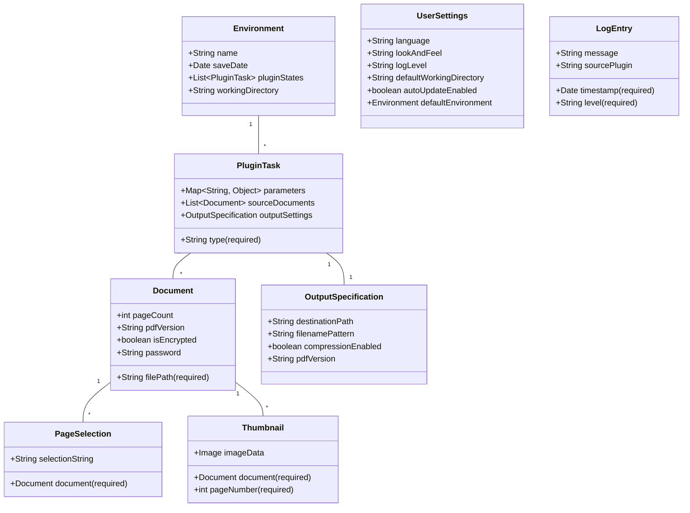

# Software Requirements Specification (SRS)
## PDF Split and Merge (PDFsam) - Version 2.1.0

**Document Version:** 1.0  
**Date:** [Current Date]  
**Status:** Approved for Development

---

### 1. Introduction

#### 1.1 Purpose
This document defines the functional and non-functional requirements for PDF Split and Merge (PDFsam) version 2.1.0. It serves as the authoritative specification for developers, testers, project maintainers, and other stakeholders involved in the development, maintenance, and use of this open-source desktop application.

#### 1.2 Scope
PDFsam v2.1.0 is a desktop application that provides users with the ability to manipulate Portable Document Format (PDF) files through a Graphical User Interface (GUI) and a Command-Line Interface (CLI). Core functionalities include splitting, merging, rotating, and visually reordering pages across one or more input documents.

**In-Scope:**
*   Basic PDF manipulation operations (split, merge, rotate, mix, visual compose).
*   Dual-interface access (GUI and CLI).
*   Saving and loading of application state (environments).
*   Logging and error handling.
*   Internationalization support.
*   Open-source distribution under GNU GPLv2.

**Out-of-Scope (Non-Goals):**
*   Web-based or mobile application versions.
*   Advanced PDF editing (modifying text, images, or vector content within a page).
*   Digital signature application or validation.
*   Optical Character Recognition (OCR).
*   Direct integration with proprietary PDF editing suites.
*   Advanced security features beyond password prompt handling.

#### 1.3 Definitions, Acronyms, and Abbreviations
*   **PDF:** Portable Document Format.
*   **GUI:** Graphical User Interface.
*   **CLI:** Command-Line Interface.
*   **JVM:** Java Virtual Machine.
*   **FOSS:** Free and Open-Source Software.
*   **GPLv2:** GNU General Public License, version 2.
*   **SLA:** Service Level Agreement (used here to define interface expectations).
*   **Plugin:** In PDFsam context, a module providing a specific PDF manipulation function (e.g., Split plugin, Merge plugin).

#### 1.4 References
*   GNU GPLv2 License: https://www.gnu.org/licenses/old-licenses/gpl-2.0.html
*   iText Library Documentation (or relevant PDF library).
*   Java Swing API Documentation.

#### 1.5 Overview
The remainder of this document is structured as follows: Section 2 provides a general description of the product, its stakeholders, and operating environment. Section 3 details the specific functional requirements. Section 4 outlines non-functional requirements, including performance, security, and compliance.

### 2. Overall Description

#### 2.1 Product Perspective
PDFsam is a standalone, self-contained desktop application. It is dependent on:
*   A Java Runtime Environment (JRE 1.6 or later).
*   An underlying FOSS PDF manipulation library (e.g., iText).
*   The host operating system's file system.

The application does not act as a component of a larger system but may be invoked by shell scripts via its CLI.

#### 2.2 Stakeholders and User Profiles
| Stakeholder | Description | Primary Interest |
| :--- | :--- | :--- |
| **End User (General)** | Individuals performing PDF tasks for personal or professional use. | Intuitive GUI, reliable execution, free access to core features. |
| **Power User / Administrator** | Users automating tasks, processing batches, or running on servers. | Robust CLI, scripting capability, stability, detailed logging. |
| **Open Source Developer** | Contributors to the PDFsam codebase. | Clean architecture, clear documentation, modular design for feature extension. |
| **Translator** | Community members localizing the application interface. | Accessible localization files, clear context for UI strings. |
| **Tester** | Individuals responsible for quality assurance. | Comprehensive requirements, reproducible test cases, clear pass/fail criteria. |

#### 2.3 Use Cases
The following high-level use cases describe the primary interactions with the system.

**UC-1: Split Document**
*   **Actor:** End User
*   **Description:** User splits a single PDF into multiple files based on criteria such as fixed page count, specific page numbers, or document bookmarks.
*   **Main Success Scenario:**
    1. User selects the "Split" plugin.
    2. User adds a source PDF file.
    3. User chooses a split method (e.g., "Every 'n' pages", "After these pages", "By bookmarks").
    4. User configures parameters for the chosen method.
    5. User sets output destination and filename pattern.
    6. User executes the operation.
    7. System generates the split PDF files.

**UC-2: Merge/Extract Documents**
*   **Actor:** End User
*   **Description:** User combines multiple PDFs, or selected page ranges from them, into a single output document.
*   **Main Success Scenario:**
    1. User selects the "Merge" plugin.
    2. User adds multiple source PDF files.
    3. For each file, user optionally specifies a page range (e.g., 1-5, 10, 15-).
    4. User reorders the files as desired.
    5. User sets output destination and filename.
    6. User executes the operation.
    7. System generates the merged PDF file.

**UC-3: Alternate Mix**
*   **Actor:** End User
*   **Description:** User interleaves pages from two PDF documents (e.g., for creating combined handouts).
*   **Main Success Scenario:**
    1. User selects the "Alternate Mix" plugin.
    2. User adds two source PDF files (File A, File B).
    3. User configures mix parameters (order, page switch interval, reverse options).
    4. User sets output destination and filename.
    5. User executes the operation.
    6. System generates the mixed PDF file.

**UC-4: Rotate Pages**
*   **Actor:** End User
*   **Description:** User rotates pages within one or more PDF documents by a specified angle (90°, 180°, 270°).
*   **Main Success Scenario:**
    1. User selects the "Rotate" plugin.
    2. User adds one or more source PDF files.
    3. User selects rotation angle.
    4. User selects target pages (All, Even, Odd, or custom range).
    5. User sets output destination and filename pattern.
    6. User executes the operation.
    7. System generates the rotated PDF file(s).

**UC-5: Visually Reorder/Compose Document**
*   **Actor:** End User
*   **Description:** User creates a new PDF by visually selecting, reordering, and manipulating thumbnails of pages from one or more source documents.
*   **Main Success Scenario:**
    1. User selects the "Visual Composer" plugin.
    2. User adds source PDF file(s). System generates thumbnails.
    3. User drags thumbnails from the source panel to the composition panel.
    4. User reorders or deletes pages in the composition panel.
    5. User may rotate individual pages.
    6. User sets output destination and filename.
    7. User executes the operation.
    8. System generates the composed PDF file.

**UC-6: Save/Load Environment**
*   **Actor:** End User, Power User
*   **Description:** User saves the complete state of all configured plugins to a file and reloads it later to resume work or replicate a job.
*   **Main Success Scenario (Save):**
    1. User configures one or more plugins with files and settings.
    2. User selects "Save Environment" from the menu.
    3. User specifies a filename and location.
    4. System saves all plugin states, file paths, and settings to an XML file.
*   **Main Success Scenario (Load):**
    1. User selects "Load Environment" from the menu.
    2. User selects a previously saved environment file.
    3. System restores all plugins to their saved state, populating file paths and parameters.

**UC-7: Handle Password-Protected PDF**
*   **Actor:** System
*   **Description:** System detects an encrypted PDF and prompts the user for a password to proceed with any operation.
*   **Main Success Scenario:**
    1. During file addition in any plugin, the system detects a PDF requires a password.
    2. System displays a modal dialog prompting for the password.
    3. User enters the correct password.
    4. System decrypts the file in memory and proceeds with the operation.
*   **Alternative Flow (Incorrect Password):**
    3a. User enters an incorrect password.
    4a. System displays an error message and does not load the file.

**UC-8: View and Manage Logs**
*   **Actor:** End User, Power User, Tester
*   **Description:** User views application event logs for information, warnings, and errors to monitor operations or troubleshoot issues.
*   **Main Success Scenario:**
    1. User views the integrated log panel.
    2. System displays timestamped log entries (INFO, WARN, ERROR).
    3. User can filter logs by level.
    4. User can copy log text or save the log to a file.

#### 2.4 Business Process
**Primary Process: Execute PDF Manipulation via GUI**
1.  **Trigger:** User launches the PDFsam application.
2.  User selects a functional plugin from the navigation pane (e.g., Split, Merge, Rotate).
3.  User imports source PDF file(s) via the "Add" button/browser.
4.  **System Action:** Validates the PDF, displays metadata (page count, version). If encrypted, triggers UC-7.
5.  User configures operation-specific parameters within the plugin's panel.
6.  User configures output preferences (destination directory, filename pattern, PDF version, compression).
7.  User clicks the "Run" button.
8.  **Output:** System processes the files, generates the output PDF(s) at the specified location, and writes success/failure entries to the log.

**Branch A: Using Saved Environment**
1.  User loads a saved environment file (UC-6 Load).
2.  System populates all plugin panels with the saved settings and file paths.
3.  User verifies or adjusts settings if necessary.
4.  User clicks "Run" to execute.

**Branch B: Using Command-Line Console**
1.  User invokes the console application (`java -jar pdfsam-console.jar`).
2.  User issues a command with required arguments (e.g., `-f file1.pdf -f file2.pdf -o output.pdf -overwrite merge`).
3.  Console parses arguments, executes the requested operation without GUI.
4.  **Output:** Operation completes, writing status messages to `stdout`/`stderr` and generating output files.

#### 2.5 Domain Model
The core conceptual entities of the PDFsam system are:

### 3. Specific Requirements

#### 3.1 Functional Requirements

**3.1.1 Plugin: Split**
*   **FR-SPLIT-1:** The system shall allow the user to select a single source PDF document.
*   **FR-SPLIT-2:** The system shall provide at least three split methods: by fixed page count, after specified page numbers, and by bookmark level.
*   **FR-SPLIT-3:** When splitting by bookmarks, the system shall allow the user to select a specific bookmark nesting level.
*   **FR-SPLIT-4:** The system shall allow the user to specify a custom pattern for naming output files (e.g., `[BASENAME]_[CURRENTPAGE]`).

**3.1.2 Plugin: Merge / Extract**
*   **FR-MERGE-1:** The system shall allow the user to add multiple PDF documents to a merge list.
*   **FR-MERGE-2:** For each document in the list, the system shall allow the user to specify an optional page selection range (e.g., "1,3,5-12").
*   **FR-MERGE-3:** The system shall allow the user to reorder the documents in the merge list via drag-and-drop or up/down buttons.
*   **FR-MERGE-4:** The system shall provide an option to normalize the output file size (compression).

**3.1.3 Plugin: Alternate Mix**
*   **FR-MIX-1:** The system shall allow the user to select exactly two source PDF documents (Primary and Secondary).
*   **FR-MIX-2:** The system shall allow the user to define the mix interval (e.g., mix 1 page from Doc A with 1 page from Doc B).
*   **FR-MIX-3:** The system shall provide options to reverse the page order of either document before mixing.

**3.1.4 Plugin: Rotate**
*   **FR-ROTATE-1:** The system shall allow the user to select one or more source PDF documents.
*   **FR-ROTATE-2:** The system shall provide rotation angle options: 90 degrees clockwise, 180 degrees, 270 degrees clockwise.
*   **FR-ROTATE-3:** The system shall allow the user to apply rotation to all pages, even pages only, odd pages only, or a custom page range.

**3.1.5 Plugin: Visual Document Composer**
*   **FR-COMPOSE-1:** The system shall generate and display thumbnail images for pages of loaded PDF documents.
*   **FR-COMPOSE-2:** The system shall allow the user to select multiple thumbnails from the source panel and add them to the composition panel.
*   **FR-COMPOSE-3:** The system shall allow the user to reorder pages within the composition panel via drag-and-drop.
*   **FR-COMPOSE-4:** The system shall allow the user to delete pages from the composition panel.
*   **FR-COMPOSE-5:** The system shall allow the user to rotate individual pages within the composition panel (90° increments).

**3.1.6 Environment Management**
*   **FR-ENV-1:** The system shall allow the user to save the current configuration state of all active plugins to an XML-based environment file.
*   **FR-ENV-2:** The system shall allow the user to load a previously saved environment file, restoring all plugins to their saved state.
*   **FR-ENV-3:** File paths in a saved environment shall be stored as absolute paths.

**3.1.7 Security & Input Handling**
*   **FR-SEC-1:** The system shall detect password-protected (encrypted) PDF files upon loading.
*   **FR-SEC-2:** The system shall prompt the user for a password when an encrypted PDF is encountered.
*   **FR-SEC-3:** The system shall validate all user input (e.g., page ranges, file paths) and provide clear, actionable error messages without crashing.

**3.1.8 Logging**
*   **FR-LOG-1:** All significant application events (operation start/end, errors, file actions) shall be recorded as timestamped log entries.
*   **FR-LOG-2:** Log entries shall have a severity level (INFO, WARN, ERROR).
*   **FR-LOG-3:** The user shall be able to view logs in a dedicated application panel.
*   **FR-LOG-4:** The user shall be able to filter the log view by severity level.
*   **FR-LOG-5:** The user shall be able to copy log text to the clipboard or save it to a text file.

**3.1.9 Command-Line Interface**
*   **FR-CLI-1:** The system shall provide a console application (`pdfsam-console`) executable from a terminal.
*   **FR-CLI-2:** The console shall support commands for all core manipulation functions (split, merge, rotate, mix).
*   **FR-CLI-3:** The console shall provide a help command (`-h` or `--help`) that lists available commands and arguments.
*   **FR-CLI-4:** The console shall return appropriate non-zero exit codes on failure.

#### 3.2 Non-Functional Requirements

**3.2.1 Performance**
*   **NFR-PERF-1:** The application GUI shall start in less than 5 seconds on a machine with average hardware (e.g., dual-core CPU, 4GB RAM, HDD).
*   **NFR-PERF-2:** PDF processing speed shall be proportional to file size, with a target of approximately 100 pages per second for standard operations on standard hardware.
*   **NFR-PERF-3:** The Visual Composer plugin shall load thumbnails progressively to maintain UI responsiveness for large documents.

**3.2.2 Reliability & Robustness**
*   **NFR-REL-1:** The application shall not terminate unexpectedly (crash) due to malformed user input. Errors shall be caught and reported via the logging system.
*   **NFR-REL-2:** Source PDF files shall remain unaltered under all circumstances. All modifications shall be written to new output files.
*   **NFR-REL-3:** The system shall handle missing source files gracefully when loading an environment, providing a clear error message.

**3.2.3 Security**
*   **NFR-SEC-1:** The application shall sanitize file path inputs to prevent directory traversal attacks (e.g., `../../../`).
*   **NFR-SEC-2:** Passwords entered for encrypted PDFs shall not be persisted to disk in plain text (e.g., in environment files or logs).

**3.2.4 Compliance**
*   **NFR-COMP-1:** The software and all its core dependencies shall be distributable under the terms of the GNU GPLv2 license.
*   **NFR-COMP-2:** The source code for the entire application shall be made publicly available with any distributed binary.

**3.2.5 Usability & Observability**
*   **NFR-OBS-1:** The user shall be able to configure the granularity of logging (e.g., DEBUG, INFO, WARN) via application settings.
*   **NFR-OBS-2:** The progress of long-running operations shall be visually indicated in the GUI.

#### 3.3 Interfaces

**3.3.1 Software Interfaces**
*   **SI-1: PDF Engine Library (e.g., iText)**
    *   **Purpose:** Core PDF parsing, rendering, and manipulation.
    *   **Input:** PDF byte streams, operation commands (merge, split, rotate).
    *   **Output:** Modified PDF byte streams, operation status/errors.
    *   **Requirement:** Must support PDF specifications up to and including version 1.7. All library exceptions must be caught and converted to application-level log entries.

*   **SI-2: Java Swing Framework**
    *   **Purpose:** Foundation for all graphical user interface components.
    *   **Input:** User interaction events.
    *   **Output:** Rendered application windows and controls.
    *   **Requirement:** Must be compatible with JVM 1.6 and later.

**3.3.2 Hardware Interfaces**
*   **HI-1:** Requires sufficient disk space for input, output, and temporary files.
*   **HI-2:** Requires a display with minimum resolution of 1024x768 for GUI operation.

**3.3.3 Communications Interfaces**
*   **CI-1: (Optional) Update Server**
    *   **Protocol:** HTTP/HTTPS.
    *   **Purpose:** Check for availability of new application versions.
    *   **Requirement:** Network calls must be asynchronous and must not block the GUI. Must implement a timeout (e.g., 10 seconds).

### 4. Acceptance Criteria
The following criteria must be met for feature acceptance.

**AC-1: Splitting by Bookmarks**
*   **Given** a PDF document with a hierarchical bookmark structure,
*   **When** the user selects the "Split by bookmark level" option, chooses a level (e.g., "Level 2"), and executes the split,
*   **Then** the system creates one output PDF file for each distinct section defined by bookmarks at the selected level, and the output files are named according to the configured pattern.

**AC-2: Visual Document Composition**
*   **Given** two or more PDF documents loaded into the Visual Composer plugin,
*   **When** the user drags thumbnails from the source panel to the composition panel, changes their order, and executes the composition,
*   **Then** a single PDF file is generated containing the selected pages in the exact order displayed in the composition panel.

**AC-3: Environment Save/Load**
*   **Given** the user has configured the Split plugin with a source file and "every 5 pages" setting, and the Merge plugin with two files and custom page ranges,
*   **When** the user saves the environment, closes the application, reopens it, and loads the saved environment file,
*   **Then** the Split and Merge plugins are visible and populated with the original source file paths and parameter settings.

### 5. Appendices

#### 5.1 Milestones and Release Strategy
1.  **v2.1.0 Release:** Finalize, test, and release version 2.1.0 as the stable "Basic" edition, with all requirements in this SRS implemented and documented.
2.  **Translation Integration:** Establish a quarterly process for integrating community-provided language translations.
3.  **Architecture Planning:** Investigate and define a plugin architecture or modular strategy to clarify the relationship between the "Basic" and "Enhanced" feature sets.
4.  **Dependency Update:** Plan and execute an update of the core PDF library to a recent, maintained version to address potential security and compatibility issues.
5.  **Test Automation:** Enhance the automated test suite to cover core manipulation functions, improving regression testing capability.
6.  **Patch Release:** Release v2.1.1 to address critical bugs identified post-v2.1.0 release.

#### 5.2 Risk Management
| Risk | Probability | Impact | Mitigation Strategy |
| :--- | :--- | :--- | :--- |
| Core PDF library becomes obsolete or changes license. | Medium | High | Monitor library development. Identify and evaluate alternative FOSS PDF libraries (e.g., PDFBox) as a contingency. |
| Large files cause `OutOfMemoryError`. | Medium | High | Document JVM heap size configuration for users. Implement lazy loading and chunked processing in memory-intensive plugins (Visual Composer). |
| Community maintenance slows. | Medium | Medium | Maintain high-quality documentation (SRS, code comments, contributor guides). Simplify build and test processes. |
| New PDF standards are unsupported. | Low | Medium | Clearly document supported PDF versions (1.7). Rely on underlying library for format compliance; update library as needed. |
| Swing GUI appears outdated. | High | Low | Utilize modern Swing look-and-feel themes. Prioritize functional reliability over major UI redesign. |
| CLI complexity hinders adoption. | Medium | Low | Provide extensive CLI help, examples in documentation, and verbose, clear error messages. |
| Environment files with absolute paths are not portable. | High | Low | Clearly document this limitation in the user manual. Consider implementing relative path resolution as a future enhancement. |
| OS updates break Java compatibility. | Low | High | State JRE 1.6+ as a minimum prerequisite. Test on latest stable versions of target OSes (Windows, macOS, Linux). |

#### 5.3 Open Issues and TBDs
| Issue | Description | Responsible Party |
| :--- | :--- | :--- |
| **Form Field Handling** | Behavior for AcroForm data during merge/extract operations is undefined (e.g., flatten, discard, merge). | Lead Developer |
| **Plugin Architecture** | The long-term strategy for integrating "Enhanced" features into the codebase is not defined. | Project Maintainer |
| **Update Installation** | The mechanism for downloading and applying application updates is unspecified. | Lead Developer |
| **Performance Limits** | Maximum recommended number of files for merge or pages for visual composition is not established. | Lead Developer / Tester |
| **Accessibility** | Requirements for keyboard navigation and screen reader support are minimal. | UI Developer |
| **Filename Collision** | Strategy for handling duplicate output filenames (e.g., append number, overwrite prompt) is not detailed. | Lead Developer |