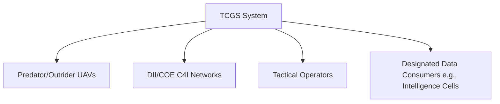

# Software Requirements Specification (SRS)
## Tactical Common Ground Station (TCGS) System

**Document Version:** 1.0  
**Date:** 2023-10-27  
**Status:** Draft for Review  
**Classification:** Controlled Unclassified Information (CUI)

---

### 1. Introduction

#### 1.1 Purpose
This Software Requirements Specification (SRS) document defines the functional and non-functional requirements for the Tactical Common Ground Station (TCGS). The TCGS is intended to provide a single, integrated system for the command, control, data receipt, processing, and dissemination of information from tactical Unmanned Aerial Vehicles (UAVs). This document serves as a contractual agreement between the development team and stakeholders and will be the primary reference for system designers, developers, testers, and project managers.

#### 1.2 Scope
The TCGS will be a software-centric system designed to interface with multiple UAV platforms and Command, Control, Communications, Computers, and Intelligence (C4I) networks. Its core purpose is to eliminate stove-piped, platform-specific ground stations by providing a unified system capable of:
*   Controlling multiple types of UAV air vehicles and their sensor payloads.
*   Planning and managing complex UAV missions.
*   Receiving, processing, exploiting, and disseminating payload-derived data (e.g., imagery, video, signals intelligence) to authorized users within a tactical network.

The system will operate within defined Defense Information Infrastructure (DII) Common Operating Environment (COE) standards to ensure interoperability and integration into broader military networks. The initial release will focus on interoperability with the Predator and Outrider UAV families.

#### 1.3 Definitions, Acronyms, and Abbreviations
| Term | Definition |
| :--- | :--- |
| **C4I** | Command, Control, Communications, Computers, and Intelligence |
| **COE** | Common Operating Environment |
| **DII** | Defense Information Infrastructure |
| **Dissemination** | The controlled distribution of processed data to authorized systems and users. |
| **GCS** | Ground Control Station |
| **Interoperability** | The ability of systems to exchange and use information. |
| **Payload** | A UAV's sensor package (e.g., Electro-Optical/Infrared camera, Synthetic Aperture Radar). |
| **TCGS** | Tactical Common Ground Station |
| **UAV** | Unmanned Aerial Vehicle |

#### 1.4 References
*   DII/COE Standards, Version [Insert Specific Version]
*   Joint Architecture for Unmanned Systems (JAUS) Standards
*   STANAG 4586 (Standard Interface of UAV Control System (UCS) for NATO UAV Interoperability)
*   Project Charter: TCGS, Version 1.0

#### 1.5 Document Overview
This SRS is organized into sections describing the overall product perspective, specific functional requirements organized by feature, external interface requirements, and non-functional requirements including performance, security, and compliance.

### 2. Overall Description

#### 2.1 Product Perspective
The TCGS is a new, self-contained component intended to replace legacy, platform-specific Ground Control Stations. It will interface as a node within larger DII/COE-compliant C4I networks. The system must interact with external entities as shown in the context diagram below:

#### 2.2 Product Functions
The high-level functions of the TCGS are:
1.  **UAV Command & Control (C2):** Send flight control commands and payload control directives to UAVs.
2.  **Mission Planning:** Create, edit, validate, and upload mission plans including flight routes, loiter patterns, and payload tasking.
3.  **Data Link Management:** Establish and maintain secure data links with UAVs for telemetry and payload data.
4.  **Payload Data Handling:** Receive, decode, process, display, record, and manage payload data (e.g., video streams, still imagery).
5.  **Data Dissemination:** Route processed data and products to authorized consumers on the C4I network.
6.  **System & Security Management:** Manage user roles, permissions, audit logs, and system configuration.

#### 2.3 User Characteristics
| User Class | Expertise | Primary Interaction |
| :--- | :--- | :--- |
| **UAV Operator** | Highly trained in UAV flight dynamics and payload operation. | Real-time vehicle C2, payload control, and monitoring. |
| **Mission Commander** | Tactical expertise in intelligence collection and mission objectives. | Mission planning, re-tasking, and product analysis. |
| **Intelligence Analyst** | Trained in imagery and data analysis. | Viewing, exploiting, and annotating received payload data. |
| **System Administrator** | IT and network administration skills. | System installation, configuration, user management, and maintenance. |

#### 2.4 Constraints
1.  **Interoperability:** The system **must** achieve five defined levels of interaction (as per STANAG 4586 or equivalent) with both Predator and Outrider UAVs:
    *   Level 1: Indirect Receipt/Transmission of UAV Product.
    *   Level 2: Direct Receipt of UAV Product.
    *   Level 3: Control and Monitoring of UAV Payload.
    *   Level 4: Control and Monitoring of UAV.
    *   Level 5: Control and Monitoring of UAV and Launch/Recovery.
2.  **Architectural Compliance:** The software **must** be DII/COE compliant, ensuring adherence to mandated APIs, services, and infrastructure standards.
3.  **Proprietary Software:** The core software **shall not** rely on proprietary, closed-source components that would hinder government ownership, security review, or future modification. Use of COTS products must be justified and comply with COE standards.
4.  **Operating Environment:** The system must be deployable on tactical, ruggedized hardware as specified in separate hardware documents.

#### 2.5 Assumptions and Dependencies
*   **Assumption:** UAV platforms will provide standardized data link interfaces (e.g., Common Data Link) and message formats.
*   **Assumption:** The hosting C4I network will provide necessary security infrastructure (PKI, firewalls).
*   **Dependency:** Successful integration is dependent on accurate and stable Interface Control Documents (ICDs) from UAV and C4I system vendors.
*   **Dependency:** The system relies on the underlying DII/COE middleware and operating system services.

### 3. Specific Requirements

#### 3.1 Functional Requirements

##### 3.1.1 UAV Command and Control (C2)
| ID | Requirement | Priority |
| :--- | :--- | :--- |
| **C2-001** | The system shall allow an authorized operator to send basic flight control commands (e.g., altitude, airspeed, heading changes) to a connected UAV. | High |
| **C2-002** | The system shall provide a real-time display of UAV telemetry including position, altitude, airspeed, fuel state, and system status. | High |
| **C2-003** | The system shall allow control of UAV payloads (e.g., sensor slewing, mode selection, power on/off). | High |
| **C2-004** | The system shall provide "Lost Link" procedures and automatic behaviors configurable by the operator prior to flight. | Medium |

##### 3.1.2 Mission Planning
| ID | Requirement | Priority |
| :--- | :--- | :--- |
| **MP-001** | The system shall provide a graphical map-based interface for plotting UAV flight routes, including waypoints, loiter patterns, and payload engagement areas. | High |
| **MP-002** | The system shall perform automated route validation checking for terrain clearance, airspace restrictions, and UAV performance limits. | High |
| **MP-003** | The system shall allow the association of specific payload tasks (e.g., "capture image," "begin surveillance") with specific route points or areas. | High |
| **MP-004** | The system shall allow for dynamic re-planning and transmission of updated mission plans to a UAV in flight. | Medium |

##### 3.1.3 Payload Data Handling
| ID | Requirement | Priority |
| :--- | :--- | :--- |
| **PDH-001** | The system shall receive, decode, and display real-time video streams from UAV payloads in standard formats (e.g., H.264, MPEG-2). | High |
| **PDH-002** | The system shall receive, process, and display still imagery and associated metadata. | High |
| **PDH-003** | The system shall provide basic image exploitation tools (e.g., zoom, pan, measurement, annotation). | Medium |
| **PDH-004** | The system shall record all received payload data to a searchable database with metadata tags (time, location, sensor type). | High |

##### 3.1.4 Data Dissemination
| ID | Requirement | Priority |
| :--- | :--- | :--- |
| **DIS-001** | The system shall be capable of connecting to and registering with DII/COE-compliant C4I networks. | High |
| **DIS-002** | The system shall allow an operator to selectively push or publish processed data products (e.g., annotated images, video clips) to designated recipients or common operational picture (COP) servers on the network. | High |
| **DIS-003** | All dissemination actions shall be logged and comply with configured data rights management and classification rules. | High |

##### 3.1.5 System Management
| ID | Requirement | Priority |
| :--- | :--- | :--- |
| **SYSM-001** | The system shall support role-based access control (RBAC) with at least three roles: Operator, Commander, Administrator. | High |
| **SYSM-002** | The system shall maintain a secure audit log of all user actions, system events, and data transactions. | High |
| **SYSM-003** | The system shall provide configuration management for data link parameters, network settings, and map data sources. | Medium |

#### 3.2 External Interface Requirements

##### 3.2.1 UAV Interfaces
*   **Physical:** Must support standard data link terminals (e.g., CDL, Tactical Common Data Link).
*   **Protocol:** Must implement Level 1-5 interoperability protocols as defined in the UAV ICDs (leveraging standards such as STANAG 4586 or JAUS).

##### 3.2.2 C4I Network Interfaces
*   **Physical:** Standard Ethernet (TCP/IP).
*   **Protocol:** DII/COE compliant messaging and service interfaces (e.g., CORBA, Web Services as per COE standards).

##### 3.2.3 User Interfaces
*   The primary interface shall be a Graphical User Interface (GUI) with multi-panel displays for map, video, telemetry, and control.
*   The system shall support standard keyboard, mouse, and tactical hand controller inputs.

#### 3.3 Non-Functional Requirements

##### 3.3.1 Performance
*   Command latency from operator action to receipt by UAV shall be less than 500 milliseconds under normal conditions.
*   The system shall be capable of simultaneously controlling up to two (2) UAVs and monitoring data from a third.
*   The video display shall update at the native frame rate provided by the UAV (up to 30 fps) with less than 2 seconds of end-to-end latency.

##### 3.3.2 Safety & Security
*   The system shall be evaluated and certified to [Insert Required Security Level, e.g., DIACAP, RMF].
*   All data-at-rest and data-in-transit shall be encrypted using NSA-approved algorithms.
*   The system shall prevent unauthorized C2 of a UAV (e.g., positive control handover protocols).

##### 3.3.3 Reliability & Availability
*   The system shall achieve an operational availability of 99.5% during a 72-hour continuous mission.
*   Mean Time Between Critical Failures (MTBCF) shall be greater than 1000 hours.

##### 3.3.4 Compliance
*   **Primary Constraint:** The entire software suite **shall be DII/COE compliant**.
*   **Primary Constraint:** The software **shall be non-proprietary**. All source code developed under this project shall be delivered to the government with unlimited rights. Use of any GOTS/COTS software must be pre-approved and come with licensing suitable for tactical deployment and government ownership.

---
**Appendices**

*Appendix A: Data Dictionary*  
*Appendix B: Traceability Matrix*  
*Appendix C: Preliminary Use Cases*