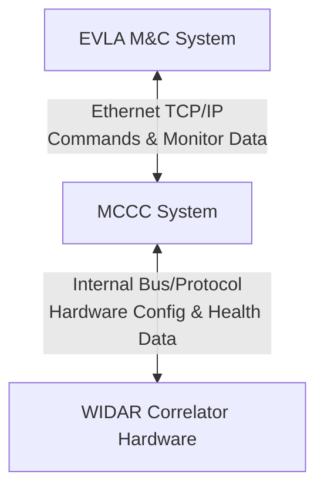

# Software Requirements Specification (SRS)
## For the WIDAR Correlator Monitor & Control Computer (MCCC)

**Document Version:** 1.0
**Date:** 2023-10-27
**Status:** Draft for Review

---

### 1. Introduction

#### 1.1 Purpose
This Software Requirements Specification (SRS) document defines the functional and non-functional requirements for the WIDAR Correlator Monitor & Control Computer (MCCC) system. The MCCC serves as the critical intermediary between the EVLA Monitor & Control (M&C) system and the WIDAR correlator hardware. This document is intended for use by stakeholders, project managers, software architects, developers, and testers involved in the system's design, implementation, and validation.

#### 1.2 Document Conventions
*   **Requirements:** Functional requirements are labeled as `FR-XXX`. Non-functional requirements are labeled as `NFR-XXX`.
*   **Keywords:** The terms "MUST," "SHALL," "REQUIRED," "SHOULD," "MAY," and "OPTIONAL" in this document are to be interpreted as described in IETF RFC 2119.
*   **Acronyms:**
    *   **EVLA:** Expanded Very Large Array
    *   **M&C:** Monitor and Control
    *   **MCCC:** Monitor & Control Computer (the system specified herein)
    *   **WIDAR:** Wideband Interferometric Digital ARchitecture
    *   **OS:** Operating System

#### 1.3 Project Scope
The MCCC system provides the essential physical and logical link for the configuration, real-time operation, health monitoring, and servicing of the WIDAR Correlator. It is responsible for translating high-level observational commands into low-level hardware configurations, ensuring system health, and facilitating the bidirectional flow of control and monitor data. The scope includes the software running on the MCCC hardware and its interfaces with the external EVLA M&C network and the internal correlator hardware subsystems. The design and manufacture of the correlator hardware itself are out of scope.

#### 1.4 References
*   EVLA System Architecture Description
*   WIDAR Correlator Hardware Interface Control Document (ICD)
*   EVLA M&C Network Communication Protocol Specification

### 2. Overall Description

#### 2.1 Product Perspective
The MCCC is a subsystem within the larger EVLA instrument control ecosystem. It acts as a server/client within the EVLA M&C network and as a master controller for the WIDAR correlator hardware. The following context diagram illustrates its position:

#### 2.2 Product Functions
The core functions of the MCCC system are:
1.  **Configuration Translation:** Receive, validate, and translate observational configuration data from the EVLA M&C system into specific commands and data streams for the correlator hardware.
2.  **Health Monitoring & Fault Management:** Continuously monitor the state of the correlator hardware and its own computing platform. Detect faults and execute predefined autonomous recovery procedures where possible.
3.  **Data Processing & Transfer:** Process dynamic control inputs (e.g., phase adjustments) and collate, package, and transmit monitor data (e.g., temperatures, voltages, data rates) back to the EVLA M&C system.

#### 2.3 User Classes and Characteristics
*   **Astronomer/Observer:** Uses the EVLA M&C interface to submit configurations; requires reliable operation and accurate status feedback.
*   **Telescope Operator:** Monitors the overall system health via the EVLA M&C interface; may initiate manual recovery procedures.
*   **Hardware Engineer:** Services the system; requires detailed diagnostic data and maintenance modes accessible via the MCCC.
*   **System Administrator:** Maintains the MCCC software and OS; requires system management interfaces.

#### 2.4 Operating Environment
*   **Hardware:** Industrial-grade server(s) with redundant components (PSU, disks, network interfaces) as required to meet availability constraints.
*   **Operating System:** A deterministic, real-time capable OS (e.g., Real-Time Linux variant) or a standard OS with real-time extensions.
*   **Network:** Connection to EVLA M&C network via 100 Mbits/sec or faster Ethernet interface. Internal communication to correlator hardware via proprietary or standard high-speed bus (e.g., PCIe, custom backplane).

#### 2.5 Design and Implementation Constraints
*   `NFR-CONST-001`: The interface between the MCCC and the external EVLA M&C networks **SHALL** be Ethernet with a minimum sustained data rate of 100 Mbits/sec.
*   `NFR-CONST-002`: The system **MUST** be designed for high availability. Its unavailability leads directly to the loss of incoming astronomical data.
*   `NFR-CONST-003`: The system **MUST** be self-monitoring and capable of automatic recovery from processor failures, OS crashes, and internal communications failures without requiring external intervention for predefined fault classes.

#### 2.6 Assumptions and Dependencies
*   The EVLA M&C system will provide configuration data in the agreed-upon format and protocol.
*   The WIDAR correlator hardware will provide accessible health, monitor, and control interfaces as defined in its ICD.
*   The underlying hardware platform provides necessary reliability features (e.g., watchdog timers, hardware health sensors).

### 3. System Features and Requirements

#### 3.1 Configuration Management
*   `FR-CONF-001`: The system **SHALL** accept configuration data blocks from the EVLA M&C system via the defined Ethernet protocol.
*   `FR-CONF-002`: The system **SHALL** validate the syntax and semantic integrity of incoming configuration data against the current hardware state and capability.
*   `FR-CONF-003`: The system **SHALL** translate validated high-level configuration parameters into the specific register writes, firmware loads, and data paths required to configure the WIDAR correlator hardware.
*   `FR-CONF-004`: The system **SHALL** send an acknowledgment (success or detailed error) back to the EVLA M&C system upon completion of a configuration operation.

#### 3.2 Health Monitoring & Fault Recovery
*   `FR-HLTH-001`: The system **SHALL** periodically poll (or receive interrupts from) correlator hardware subsystems for health parameters (e.g., voltage, temperature, clock lock, data errors).
*   `FR-HLTH-002`: The system **SHALL** continuously monitor its own internal state, including CPU load, memory usage, disk space, OS processes, and internal communication link integrity.
*   `FR-HLTH-003`: The system **SHALL** compare monitored values against predefined nominal ranges and thresholds.
*   `FR-HLTH-004`: Upon detection of a fault within predefined classes (e.g., application process crash, communication time-out, correctable hardware error), the system **SHALL** autonomously execute a recovery sequence without operator intervention. This may include process restart, link reset, or hardware subsystem power cycle.
*   `FR-HLTH-005`: The system **SHALL** log all fault events and recovery actions with a timestamp and severity level to a persistent local log.
*   `FR-HLTH-006`: For faults requiring external intervention (e.g., hardware failure), the system **SHALL** immediately generate an alarm message to the EVLA M&C system.

#### 3.3 Data Processing & Transfer
*   `FR-DATA-001`: The system **SHALL** process dynamic control data (e.g., delay, phase, or gain adjustments) received from the EVLA M&C system and apply them to the correlator hardware with low latency (< 100 ms defined by external spec).
*   `FR-DATA-002`: The system **SHALL** aggregate, timestamp, and packetize monitor data from all hardware subsystems and its own internal state.
*   `FR-DATA-003`: The system **SHALL** transmit monitor data packets to the EVLA M&C system at a configurable rate (e.g., 1 Hz for slow health data, 10 Hz for critical parameters).

#### 3.4 Service & Maintenance Interface
*   `FR-SERV-001`: The system **SHALL** provide a secure, authenticated maintenance interface (e.g., SSH, dedicated service port) for system administrators and hardware engineers.
*   `FR-SERV-002`: Through this interface, authorized users **SHALL** be able to access detailed diagnostic logs, force specific hardware states, run built-in tests, and update system software.

### 4. External Interface Requirements

#### 4.1 User Interfaces
Primary user interaction is via the EVLA M&C system client software. The MCCC itself provides a text-based or minimal web-based service interface for maintenance (`FR-SERV-001`).

#### 4.2 Hardware Interfaces
*   **EVLA M&C Network:** 100/1000BASE-T Ethernet interface.
*   **WIDAR Correlator Hardware:** Defined by hardware ICD (e.g., multiple 10GbE links, PCIe, or custom serial/parallel control buses).

#### 4.3 Software Interfaces
*   **EVLA M&C System:** TCP/IP-based protocol using XML/JSON or a custom binary format for commands and data.
*   **Internal Services:** Inter-process communication (e.g., D-Bus, ZeroMQ) or shared memory for communication between monitoring, control, and recovery processes.

#### 4.4 Communications Interfaces
Complies with standard Ethernet (IEEE 802.3) and IP stack. Specific application-layer protocol shall be defined in a separate Interface Control Document.

### 5. Non-Functional Requirements

#### 5.1 Performance Requirements
*   `NFR-PERF-001`: The system **SHALL** apply a new correlator configuration within `X` seconds (TBD based on hardware capability) of receipt from the EVLA M&C system.
*   `NFR-PERF-002`: The latency for applying dynamic control updates **SHALL** be less than 100 ms end-to-end (from M&C command receipt to hardware actuation).
*   `NFR-PERF-003`: The system **SHALL** be capable of sustaining the required monitor data throughput without dropping packets under normal operational load.

#### 5.2 Safety & Criticality Requirements
*   `NFR-SAFE-001`: The system is **CRITICAL**. Design **MUST** prioritize stability and predictability over new features.
*   `NFR-SAFE-002`: Any autonomous recovery action **MUST NOT** put hardware at risk of damage (e.g., uncontrolled power cycling).

#### 5.3 Reliability & Availability Requirements
*   `NFR-RELY-001`: The system **SHALL** have a target availability of 99.9% over a calendar year, excluding scheduled maintenance.
*   `NFR-RELY-002`: The Mean Time To Recovery (MTTR) for software/firmware faults covered by autonomous recovery **SHALL** be less than 60 seconds.

#### 5.4 Security Requirements
*   `NFR-SEC-001`: All external communication interfaces **SHALL** require authentication.
*   `NFR-SEC-002`: The system **SHALL** be designed to resist denial-of-service attacks that could impede its control or monitoring functions.

#### 5.5 Maintainability & Support Requirements
*   `NFR-MAIN-001`: All software **SHALL** be version-controlled, and the system **SHALL** support remote software updates with a rollback capability.
*   `NFR-MAIN-002`: System logs **SHALL** be retained for a minimum of 90 days.

---
**Document Approval**

| Role | Name | Signature | Date |
| :--- | :--- | :--- | :--- |
| Product Manager | | | |
| Lead Architect | | | |
| Quality Assurance | | | |