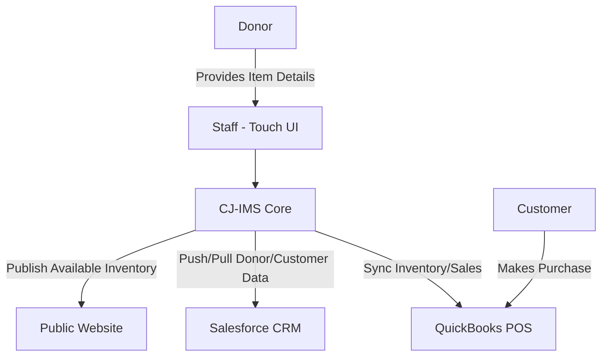

# Software Requirements Specification (SRS)
## Construction Junction Inventory Management System (CJ-IMS)
**Version:** 1.0
**Date:** October 26, 2023
**Status:** Draft for Review

---

### 1. Introduction

#### 1.1 Purpose
This document defines the functional and non-functional requirements for the Construction Junction Inventory Management System (CJ-IMS). The primary purpose of this system is to provide a centralized platform for tracking donated construction and building materials from the point of donation through to final sale, while seamlessly integrating with existing business systems. This SRS serves as a contract between the stakeholders (Construction Junction management, staff, and IT) and the development team.

#### 1.2 Document Conventions
*   **Requirements IDs:** Functional requirements are labeled `FR-XXX`. Non-functional requirements are labeled `NFR-XXX`.
*   **Priority:** (H)igh, (M)edium, (L)ow.
*   **Keywords:** `MUST`, `SHALL`, `WILL` indicate mandatory requirements. `SHOULD`, `COULD`, `MAY` indicate desirable but not mandatory features.

#### 1.3 Project Scope
The CJ-IMS will manage the complete lifecycle of inventory for Construction Junction, a non-profit retailer of used and surplus building materials. The system's core is the tracking of unique items (e.g., specific windows, doors) and stock items (e.g., boxes of nails, bundles of shingles). It will replace or augment manual and disparate tracking methods with a unified digital system.

**In-Scope:**
*   Donation intake, item categorization, valuation, and receipt generation.
*   Real-time inventory database management.
*   Sale processing at Point-of-Sale (POS) with immediate inventory deduction.
*   Bi-directional synchronization of inventory and sales data with QuickBooks Point of Sale (QBPOS).
*   Donor and customer data synchronization with Salesforce CRM.
*   A touch-optimized user interface for warehouse and sales floor use.
*   Basic reporting on inventory levels, donations, and sales.

**Out-of-Scope:**
*   Financial accounting beyond sales data sent to QBPOS.
*   Advanced CRM campaign management within Salesforce.
*   E-commerce shopping cart functionality on the public website (integration only).
*   Payroll or human resources management.
*   Advanced logistics or delivery scheduling.

#### 1.4 References
*   QuickBooks Point of Sale SDK/API Documentation
*   Salesforce REST API Documentation
*   Construction Junction Business Process Manual

### 2. Overall Description

#### 2.1 Product Perspective
The CJ-IMS is a new, self-contained system that will act as the "system of record" for inventory. It will interface with three critical external systems:
1.  **QuickBooks Point of Sale (QBPOS):** For final sale transaction processing and financial record-keeping.
2.  **Salesforce CRM:** For maintaining donor and customer records.
3.  **Construction Junction Website:** For displaying inventory availability and status.

#### 2.2 User Classes and Characteristics
*   **Warehouse Staff:** Primary users. Receive donations, categorize items, tag items, move inventory. Require simple, fast, touch-screen data entry.
*   **Sales Staff:** Process sales at POS. Need quick lookup of item details and location. Use both CJ-IMS (lookup) and QBPOS (transaction).
*   **Manager/Supervisor:** Oversee operations, run reports, adjust inventory, handle discrepancies. Require more detailed views and administrative functions.
*   **System Administrator:** Configure system settings, manage user accounts, monitor integrations.

#### 2.3 Operating Environment
*   **Hardware:** Must operate on standard desktop PCs and ruggedized touch-screen terminals in a warehouse environment.
*   **Software:** Client application compatible with Windows 10/11, or modern web browser (Chrome, Edge). Server component to be hosted on a reliable local server or cloud infrastructure (e.g., AWS, Azure).
*   **Networks:** Must function reliably on the organization's local area network (LAN).

#### 2.4 Design and Implementation Constraints
1.  `NFR-CON-001` (H): The system **MUST** integrate with the existing QuickBooks Point of Sale system using its published API/SDK.
2.  `NFR-CON-002` (H): The system **MUST** integrate with the organization's Salesforce CRM instance.
3.  `NFR-CON-003` (H): The primary user interface for warehouse and sales floor terminals **MUST** be fully operable via touch screen (minimum target size 44x44 pixels).
4.  `NFR-CON-004` (H): System availability **MUST** be 99.5% during all business operating hours (9:00 AM - 7:00 PM, 7 days a week).

#### 2.5 Assumptions and Dependencies
*   The QBPOS and Salesforce APIs will remain stable and accessible for the lifespan of the project.
*   Adequate network infrastructure is in place to support real-time data synchronization.
*   Users will receive appropriate training on the new system.

### 3. System Features and Requirements

#### 3.1 Donation Intake & Receipting
**Description:** This feature allows warehouse staff to log new donations, categorize items, assign values, and generate tax receipts for donors.

*   `FR-001` (H): The system **SHALL** allow a user to create a new donor record or select an existing one from Salesforce.
*   `FR-002` (H): The user **SHALL** be able to add one or more items to a donation log, specifying for each: description, category (e.g., door, lumber, hardware), condition, quantity, and estimated fair market value.
*   `FR-003` (H): The system **SHALL** automatically generate a unique identifier (e.g., tag number, SKU) for each unique item or stock lot.
*   `FR-004` (H): The system **SHALL** generate a printable or emailable official donation receipt summarizing all items and their total value, referencing the donor.
*   `FR-005` (M): The system **SHALL** allow a user to print physical inventory tags/barcodes for items.

#### 3.2 Inventory Management
**Description:** This is the core database for all items in Construction Junction's possession, tracking status, location, and attributes.

*   `FR-010` (H): The system **SHALL** maintain a searchable database of all inventory items, distinguishing between "Unique" (one-of-a-kind) and "Stock" (multiple identical items) items.
*   `FR-011` (H): Each inventory record **SHALL** store: ID, description, category, condition, location (aisle/bin), status (Available, Sold, Hold, Discarded), date received, donor source, and value.
*   `FR-012` (H): The system **SHALL** allow authorized users to update item location, status, and other attributes.
*   `FR-013` (H): The system **SHALL** provide real-time inventory counts by category and status.

#### 3.3 Sales Processing & POS Integration
**Description:** This feature facilitates the sale of items and ensures inventory is synchronized with the financial system.

*   `FR-020` (H): Sales staff **SHALL** be able to look up an item in CJ-IMS by scanning its barcode or entering its ID/description to confirm availability, price, and location.
*   `FR-021` (H): Upon finalizing a sale in QBPOS, the QBPOS system **SHALL** send a transaction message to CJ-IMS (via API). This message **MUST** include the CJ-IMS item IDs and quantities sold.
*   `FR-022` (H): Upon receiving a valid sale message from QBPOS, CJ-IMS **SHALL** automatically update the status of the sold item(s) to "Sold" and decrement stock quantities.
*   `FR-023` (M): The system **SHALL** provide a reconciliation report to identify any discrepancies between CJ-IMS inventory and QBPOS sales data.

#### 3.4 Integration Requirements
*   `FR-030` (H): The system **SHALL** synchronize donor and customer contact information bi-directionally with Salesforce CRM, ensuring a single source of truth.
*   `FR-031` (H): The system **SHALL** publish a daily feed of "Available" inventory items (ID, description, category, price, photo) to the Construction Junction website.

### 4. External Interface Requirements

#### 4.1 User Interfaces
*   `NFR-UI-001`: All primary data entry and lookup screens **SHALL** be designed for touch interaction, with large buttons, minimal text input, and clear visual feedback.
*   `NFR-UI-002`: The application **SHALL** have a responsive layout that adapts to both desktop monitor and touch-screen kiosk resolutions.

#### 4.2 Hardware Interfaces
*   Must support standard USB barcode scanners for item tag scanning.
*   Must support standard label printers for generating donation receipts and inventory tags.

#### 4.3 Software Interfaces
1.  **QuickBooks Point of Sale Interface:** Integration via QBPOS SDK or REST API. CJ-IMS will act as a client, pushing inventory updates and listening for sale transaction messages.
2.  **Salesforce CRM Interface:** Integration via Salesforce REST API using OAuth 2.0 authentication. CJ-IMS will create/update Contact and Account records.
3.  **Website Interface:** Integration via a secure (HTTPS) API call or file transfer (JSON/XML) to the website's content management system.

#### 4.4 Communications Interfaces
*   All communications between CJ-IMS and external systems (QBPOS, Salesforce, Website) **MUST** use encrypted protocols (TLS 1.2+).

### 5. Non-Functional Requirements

#### 5.1 Performance Requirements
*   `NFR-PER-001`: Item lookup by barcode scan **SHALL** return results in less than 2 seconds under normal load.
*   `NFR-PER-002`: The system **SHALL** support a minimum of 20 concurrent users.

#### 5.2 Safety and Security Requirements
*   `NFR-SEC-001`: User access **SHALL** be controlled by role-based permissions (e.g., Warehouse, Sales, Manager, Admin).
*   `NFR-SEC-002`: All donor personal information **MUST** be stored and transmitted in accordance with relevant data protection guidelines.

#### 5.3 Software Quality Attributes
*   **Availability:** As specified in `NFR-CON-004`.
*   **Reliability:** The system shall have a mean time between failures (MTBF) of no less than 720 hours.
*   **Maintainability:** The system shall be designed with modular components to allow for easy updates to individual integration points (e.g., QBPOS API version change).

---

**Appendices**

*Appendix A: Glossary*
*   **Unique Item:** A one-of-a-kind item with distinct characteristics (e.g., a specific antique door).
*   **Stock Item:** Multiple identical items treated as a single lot (e.g., 100 identical hinges).
*   **QBPOS:** QuickBooks Point of Sale.
*   **CRM:** Customer Relationship Management (Salesforce).

*Appendix B: To Be Determined (TBD)*
*   Specific field mappings for Salesforce integration.
*   Branding and color scheme for the UI.
*   Detailed disaster recovery procedures.