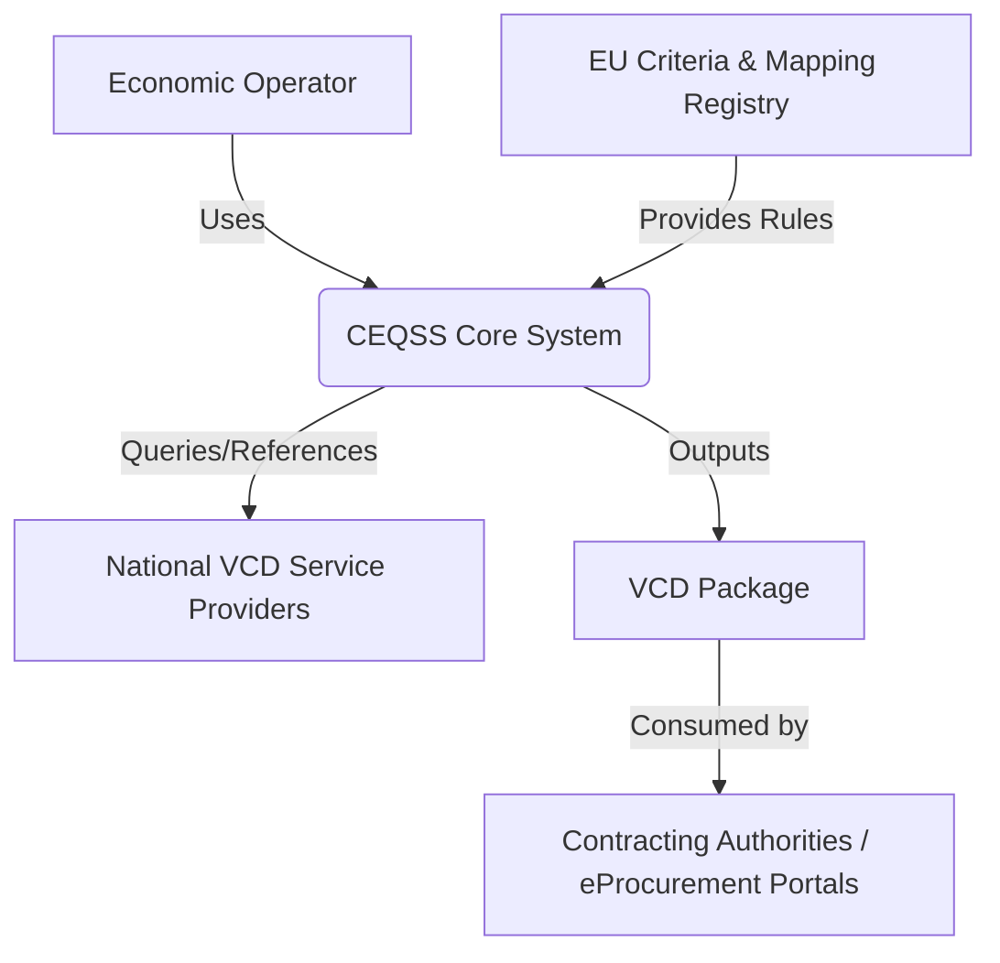

# Software Requirements Specification (SRS)
## Cross-Border eProcurement Qualification Submission System (CEQSS)

**Document Version:** 1.0  
**Date:** 2023-10-27  
**Status:** Draft for Review

---

### 1. Introduction

#### 1.1 Purpose
This Software Requirements Specification (SRS) document defines the functional and non-functional requirements for the Cross-Border eProcurement Qualification Submission System (CEQSS). The primary purpose of this system is to enable economic operators (companies) to electronically submit and validate their qualification documents for public procurement procedures across European Union Member States. It specifically addresses the mapping of national attestations to the EU's standardized selection and exclusion criteria.

This document is intended for use by:
*   Project stakeholders and sponsors
*   System architects and software developers
*   Quality assurance and testing teams
*   Legal and compliance advisors

#### 1.2 Scope
The CEQSS will be a centralized software platform that facilitates the cross-border exchange of company qualification data in the context of EU public procurement. The system operates within the framework of the European Single Procurement Document (ESPD) and the future e-Certis evolution, focusing on the **Voluntary Cross-border Digital (VCD)** document concept.

**In-Scope:**
*   A web-based tool for companies to map their existing national attestations to EU selection/exclusion criteria.
*   Automated compilation and packaging of qualification evidence into standardized VCD packages.
*   Generation of both "VCD Simple" (document-based) and "VCD Advanced" (structured data) packages.
*   Management of metadata necessary for the verification and mutual recognition of attestations.
*   Compliance checks against Directive 2004/18/EC Articles 45-50.

**Out-of-Scope:**
*   The system will **not** act as a national VCD service provider; it is dependent on their establishment and integration.
*   It does **not** handle the actual public tender submission or evaluation process.
*   It does **not** store or manage the original authoritative attestation data; it references and packages it.
*   Legal adjudication of disputes regarding attestation recognition is outside the system's boundary.

#### 1.3 Definitions, Acronyms, and Abbreviations
| Term | Definition |
| :--- | :--- |
| **CEQSS** | Cross-border eProcurement Qualification Submission System (this system). |
| **VCD** | Voluntary Cross-border Digital document. A standardized digital package of qualification evidence. |
| **VCD Simple** | A VCD package containing scanned documents/images with descriptive metadata. |
| **VCD Advanced** | A VCD package containing structured, machine-interpretable data (e.g., XML/JSON). |
| **Economic Operator** | A company or legal entity seeking to qualify for a public procurement procedure. |
| **Attestation** | A document or certificate issued by a competent national authority (e.g., tax compliance certificate, social security declaration). |
| **ESPD** | European Single Procurement Document. A self-declaration form of a company's qualifications. |
| **Directive 2004/18/EC** | The EU Public Procurement Directive governing selection and exclusion criteria. |

#### 1.4 References
1.  Directive 2004/18/EC of the European Parliament and of the Council on the coordination of procedures for the award of public works contracts, public supply contracts and public service contracts. Articles 45-50.
2.  Commission Implementing Regulation (EU) 2016/7 with regard to the European Single Procurement Document (ESPD).
3.  *e-Certis* and *VCD* technical documentation and specifications from the European Commission.

#### 1.5 Overview
The remainder of this SRS is structured as follows: Section 2 provides a high-level description of the product, its perspective, and operating environment. Section 3 details the specific functional requirements. Section 4 outlines non-functional requirements including performance, security, and compliance. Section 5 lists appendices and supporting information.

---

### 2. Overall Description

#### 2.1 Product Perspective
The CEQSS is a new, self-contained web application. It will interface with external systems as depicted in the context diagram below:

*   **Actors:** Economic Operators (primary users), System Administrators.
*   **External Systems:** Trusted National VCD Service Providers (source of attestations), EU-level mapping registries (source of legal criteria mapping rules).

#### 2.2 Product Functions (Summary)
1.  **Pre-VCD Mapping Tool:** Guides the user through a process to align their national attestations with the relevant EU selection and exclusion criteria.
2.  **Evidence Compilation & Packaging:** Assembles referenced attestations and user-input data into a formally defined VCD package.
3.  **Dual-Format Support:** Generates the package in both human-readable (Simple) and machine-processable (Advanced) formats.
4.  **Compliance Validation:** Ensures the package structure and mandatory metadata comply with EU standards and the referenced Directive.
5.  **User & Package Management:** Allows users to save, manage, and retrieve draft and completed VCD packages.

#### 2.3 User Characteristics
*   **Economic Operator Representative:** Typically a procurement manager or legal advisor within a company. Has a strong understanding of their company's qualifications and national certificates but may not be an expert in EU cross-border procurement law. Is computer-literate.
*   **System Administrator:** Technical staff responsible for maintaining the system, managing reference data (e.g., updates to criteria lists), and monitoring system health.

#### 2.4 Constraints
1.  **Legal Compliance:** The system's logic for mapping and criteria must strictly align with **Directive 2004/18/EC, Articles 45-50**.
2.  **Architectural Dependency:** System functionality is contingent upon the existence and accessibility of trusted **National VCD Service Providers** in each relevant Member State.
3.  **Recognition Principle:** The system facilitates packaging based on the principle of mutual recognition of attestations but cannot enforce it. Legal recognition remains the responsibility of the contracting authority.
4.  **Technical Standards:** The VCD package structure must adhere to EU-agreed technical standards (XML schemas, metadata profiles).

#### 2.5 Assumptions and Dependencies
*   It is assumed that Member States will establish operational National VCD Service Providers with standardized APIs for querying attestation status.
*   The EU will maintain and provide a stable, machine-readable registry of selection/exclusion criteria and their permissible national equivalents.
*   Economic operators will have digital access to their national attestations (e.g., via e-ID).

---

### 3. Specific Requirements

#### 3.1 Functional Requirements

**3.1.1 Pre-VCD Mapping Module**
*   **FR1.1:** The system shall present the user with the official list of EU selection and exclusion criteria derived from Directive 2004/18/EC.
*   **FR1.2:** For each EU criterion, the system shall provide a searchable list of commonly used national attestations from all Member States that can satisfy it.
*   **FR1.3:** The user shall be able to select their country and link their specific attestation (by selecting from a provided list or entering a reference number) to one or more EU criteria.
*   **FR1.4:** The system shall warn the user if a selected national attestation is not typically recognized as sufficient proof for the linked EU criterion.
*   **FR1.5:** The system shall allow the user to save a draft mapping profile for their company.

**3.1.2 VCD Package Compilation Module**
*   **FR2.1:** The system shall allow the user to initiate the creation of a new VCD package based on a saved mapping profile or a new session.
*   **FR2.2:** The system shall generate a checklist of required evidence based on the mapped criteria, distinguishing between mandatory and conditional items.
*   **FR2.3:** For "VCD Simple" packages:
    *   **FR2.3.1:** The user shall be able to upload scanned copies/pdf files of their attestations.
    *   **FR2.3.2:** The system shall automatically attach standardized metadata to each document (e.g., issuer, date of issue, expiry, referenced criterion).
*   **FR2.4:** For "VCD Advanced" packages:
    *   **FR2.4.1:** The system shall attempt to retrieve structured data for an attestation by connecting to the relevant National VCD Service Provider API using a user-authorized reference (e.g., access token, certificate ID).
    *   **FR2.4.2:** Where structured data is retrieved, it shall be formatted according to the EU VCD Advanced schema.
*   **FR2.5:** The system shall compile all evidence (documents or structured data) and metadata into a single, digitally signed VCD package (ZIP container with manifest).

**3.1.3 System Administration Module**
*   **FR3.1:** Administrators shall be able to import updated lists of EU criteria and national attestation mappings via a predefined XML/JSON format.
*   **FR3.2:** Administrators shall be able to configure connection endpoints and authentication details for National VCD Service Providers.

#### 3.2 Non-Functional Requirements

**3.2.1 Performance Requirements**
*   **PR1:** The pre-VCD mapping interface shall load and be interactive within 3 seconds for 95% of users under normal load.
*   **PR2:** Generation of a VCD Simple package (including file processing) shall complete within 30 seconds for a package containing up to 20 documents.
*   **PR3:** The system shall support concurrent usage by a minimum of 500 economic operators.

**3.2.2 Security Requirements**
*   **SR1:** All user authentication shall be performed via EU Login (eIDAS node-compliant).
*   **SR2:** Communication with National VCD Service Providers shall use mutually authenticated TLS 1.3.
*   **SR3:** User-uploaded documents shall be scanned for malware before processing.
*   **SR4:** The final VCD package shall be signed using a qualified electronic signature/seal from the system to guarantee its integrity and origin.
*   **SR5:** Personal and company data shall be encrypted at rest in accordance with GDPR.

**3.2.3 Compliance & Regulatory Requirements**
*   **CR1:** The system's core mapping logic shall be validated quarterly against any official updates or interpretations of Directive 2004/18/EC.
*   **CR2:** The VCD package output shall pass validation against the official EU-published VCD XML Schema Definition (XSD).
*   **CR3:** The system shall maintain an audit log of all package generations, including user ID, timestamp, and criteria selected, for a period of 10 years.

**3.2.4 Usability Requirements**
*   **UR1:** The user interface shall be available in all 24 official EU languages.
*   **UR2:** A wizard-style guide shall be provided for first-time users to complete the mapping and packaging process.
*   **UR3:** The system shall provide context-sensitive help and links to the official Directive text for each criterion.

---

### 4. Appendices

#### Appendix A: Data Dictionary (Key Entities)
*   **VCD_Package:** `Package_ID`, `Creating_User_ID`, `Creation_Date`, `Format_Type` (Simple/Advanced), `Digital_Signature`, `Status`.
*   **Criterion_Mapping:** `Mapping_ID`, `EU_Criterion_Code`, `National_Attestation_Type`, `Member_State`, `Is_Sufficient` (Boolean).
*   **Attestation_Reference:** `Reference_ID`, `Attestation_Type`, `Issuer`, `Unique_Reference_Number`, `Issue_Date`, `Expiry_Date`, `Linked_Criterion`.

#### Appendix B: Wireframe Sketches
*(Link to or placeholder for UI/UX mockups of the mapping wizard and package dashboard.)*

#### Appendix C: Traceability Matrix
*(A table to be maintained linking each functional requirement (FR) to its source in the Project Summary/Constraints and to its verification method (e.g., test case ID).)*

---
**Document Approval:**

| Role | Name | Signature | Date |
| :--- | :--- | :--- | :--- |
| Project Sponsor | | | |
| Lead Architect | | | |
| Quality Assurance | | | |