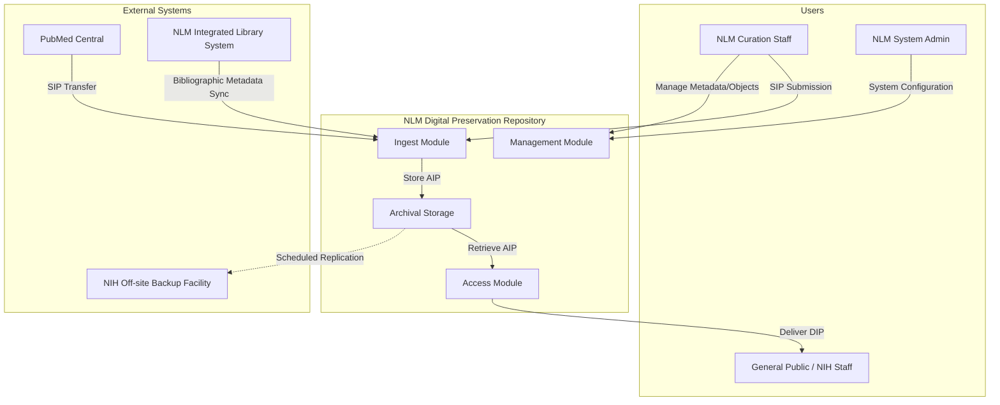

# Software Requirements Specification (SRS)
## NLM Digital Preservation Repository (NDPR)
**Version:** 1.0
**Date:** October 26, 2023
**Status:** Draft for Review

---

### 1. Introduction

#### 1.1 Purpose
This document defines the functional and non-functional requirements for the National Library of Medicine (NLM) Digital Preservation Repository (NDPR). The purpose of this system is to ensure the long-term preservation, integrity, and accessibility of NLM's digital biomedical collections. This SRS serves as a contract between the stakeholders (NLM Library Operations) and the development team, providing a complete description of the system's intended behavior.

#### 1.2 Scope
The NDPR will be a secure, managed, and standards-compliant digital repository. Its scope is limited to the ingest, archival storage, management, and dissemination of digital collection materials that are the responsibility of NLM Library Operations. This includes:
*   **Digitized materials:** Legacy collections converted to digital formats (e.g., scanned books, photographs, manuscripts).
*   **Born-digital materials:** Collections created in digital format (e.g., digital reports, archived websites, datasets).

The system is explicitly **out of scope** for:
*   The creation or initial cataloging of digital objects.
*   The management of physical collections.
*   The publication of peer-reviewed journal articles (primary function of PubMed Central).

#### 1.3 Definitions, Acronyms, and Abbreviations
| Term | Definition |
| :--- | :--- |
| **AIP** | Archival Information Package. The preserved object with all metadata and representation information needed for long-term access. |
| **DIP** | Dissemination Information Package. A derivative of the AIP formatted for delivery to an end-user. |
| **SIP** | Submission Information Package. The package of data and metadata submitted to the repository for ingest. |
| **ILS** | Integrated Library System. NLM's system for managing bibliographic and authority data. |
| **HHS** | U.S. Department of Health and Human Services. |
| **NIH** | National Institutes of Health. |
| **NLM** | National Library of Medicine. |
| **OAIS** | Open Archival Information System (ISO 14721). The reference model for digital preservation systems. |
| **PMC** | PubMed Central. NLM's repository of full-text biomedical and life sciences journal literature. |

#### 1.4 References
1.  ISO 14721:2012 - Space data and information transfer systems – Open archival information system (OAIS) – Reference model.
2.  HHS and NIH Information Security and Privacy Policy Documents.
3.  NLM Digital Collections Strategy.
4.  Functional Requirements for Bibliographic Records (FRBR).

#### 1.5 Overview
The remainder of this document is structured as follows: Section 2 provides an overall description of the product, its users, and constraints. Section 3 details the specific functional requirements. Section 4 outlines non-functional requirements including performance, security, and compliance.

---

### 2. Overall Description

#### 2.1 Product Perspective
The NDPR is a new, major component within NLM's digital infrastructure. It will interoperate with existing systems as depicted in the context diagram below.

#### 2.2 Product Functions
The core high-level functions of the NDPR are:
1.  **Ingest:** Accept digital materials and metadata from multiple submission streams, validate them, create Archival Information Packages (AIPs), and register them in the archival storage.
2.  **Archival Storage:** Provide secure, redundant, and managed storage for AIPs, ensuring bit-level preservation and integrity over time through fixity checks and migration.
3.  **Data Management:** Maintain and administer the descriptive, technical, and preservation metadata associated with all AIPs.
4.  **Access:** Provide search, discovery, and retrieval functionalities for authorized users, delivering appropriate Dissemination Information Packages (DIPs) based on access controls.
5.  **Administration:** Manage system policies, user accounts, storage reports, and interoperability configurations.
6.  **Preservation Planning:** Monitor the technological environment and recommend/execute preservation actions on stored AIPs.

#### 2.3 User Characteristics
| User Class | Characteristics | Key Responsibilities |
| :--- | :--- | :--- |
| **General Public / NIH Staff (End-User)** | Diverse technical proficiency. Requires simple, intuitive search and retrieval. May have varying levels of authorized access. | Search for digital collections. View/download accessible materials. |
| **NLM Curation Staff** | Expert in metadata standards (METS, MODS, PREMIS) and library science. Primary internal user. | Prepare and submit SIPs. Manage and enhance object/collection metadata. Initiate preservation actions. Validate ingest reports. |
| **NLM System Administrator** | Expert in system security, networking, and storage infrastructure. | Configure and maintain system hardware/software. Manage user roles and permissions. Monitor system health and performance. Execute backup/disaster recovery procedures. |

#### 2.4 Constraints
1.  **Interoperability:** Must implement APIs or standard protocols to exchange data with PubMed Central (PMC) and the NLM Integrated Library System (ILS).
2.  **Security:** Must comply with all HHS and NIH security standards, policies, and audit requirements for federal information systems.
3.  **Infrastructure:** Must be designed to interface with the mandated NIH off-site backup facility for disaster recovery.
4.  **Preservation Standards:** Must adhere to the OAIS reference model and employ community-standard preservation metadata (PREMIS).
5.  **Legal & Policy:** Must enforce access controls based on donor agreements, copyright, and privacy regulations (e.g., HIPAA for certain collections).

#### 2.5 Assumptions and Dependencies
*   **Assumption:** Submitting agents (NLM staff, PMC) will provide SIPs that are structurally valid and conform to agreed-upon profiles.
*   **Assumption:** Adequate and sustained funding will be available for ongoing storage media refreshment and system maintenance.
*   **Dependency:** The NIH off-site backup facility will provide the necessary bandwidth and support for data replication.
*   **Dependency:** The NLM ILS will maintain stable APIs for bibliographic data exchange.

---

### 3. Specific Requirements

#### 3.1 Functional Requirements

##### 3.1.1 Ingest Module
| ID | Requirement | Priority |
| :--- | :--- | :--- |
| **FR-ING-01** | The system shall accept SIPs via a secure web interface (for staff) and a secure API (for automated systems like PMC). | High |
| **FR-ING-02** | The system shall validate the structural integrity and completeness of each SIP against a configurable profile (e.g., METS-based). | High |
| **FR-ING-03** | The system shall generate and store a unique, persistent identifier (e.g., ARK, UUID) for each successfully ingested object. | High |
| **FR-ING-04** | The system shall create a comprehensive AIP from the SIP, adding preservation metadata (PREMIS) including fixity information (SHA-256 checksum). | High |
| **FR-ING-05** | The system shall provide a detailed ingest report (success/warning/error) to the submitter via the UI and email. | Medium |

##### 3.1.2 Archival Storage Module
| ID | Requirement | Priority |
| :--- | :--- | :--- |
| **FR-STR-01** | The system shall store each AIP in at least two geographically separate locations (primary and NIH backup facility). | High |
| **FR-STR-02** | The system shall perform scheduled fixity checks on all stored AIPs and alert administrators of any corruption. | High |
| **FR-STR-03** | The system shall maintain an immutable audit log of all actions performed on any AIP (read, write, delete, checksum verify). | High |
| **FR-STR-04** | The system shall support the execution of preservation actions (e.g., format migration) on AIPs as defined by preservation policies. | Medium |

##### 3.1.3 Data Management & Access Module
| ID | Requirement | Priority |
| :--- | :--- | :--- |
| **FR-ACC-01** | The system shall provide a public-facing web interface for searching and discovering repository contents using metadata fields (title, creator, subject, date). | High |
| **FR-ACC-02** | The system shall enforce role-based and object-level access controls (e.g., public, NIH-only, staff-only) during search results display and object delivery. | High |
| **FR-ACC-03** | The system shall generate and deliver a DIP (e.g., a web-friendly image, PDF, or streaming video) appropriate for the user's request and access rights. | High |
| **FR-ACC-04** | The system shall allow NLM Curation Staff to search, view, and update descriptive metadata for objects via a secure administrative interface. | High |
| **FR-ACC-05** | The system shall provide an OAI-PMH endpoint for harvesting public metadata. | Medium |

##### 3.1.4 Administration & Interoperability Module
| ID | Requirement | Priority |
| :--- | :--- | :--- |
| **FR-ADM-01** | The system shall allow administrators to define and manage user roles and permissions (End-User, Curator, Admin). | High |
| **FR-ADM-02** | The system shall provide dashboards and reports on system health, storage capacity, ingest statistics, and fixity check results. | Medium |
| **FR-INT-01** | The system shall query the NLM ILS via a defined API to retrieve and synchronize authoritative bibliographic metadata for relevant objects. | High |
| **FR-INT-02** | The system shall expose a secure API for PMC to submit SIPs and receive status notifications. | High |

#### 3.2 Non-Functional Requirements

##### 3.2.1 Performance
*   **Search Response:** The public search interface shall return results for simple queries within 2 seconds under normal load.
*   **Object Retrieval:** A standard DIP (e.g., a 10MB PDF) shall be delivered to an end-user within 5 seconds over a standard broadband connection.
*   **Ingest Throughput:** The system shall support the batch ingest of up to 1,000 medium-sized (avg. 50MB) objects within a 24-hour period.

##### 3.2.2 Security
*   The system shall comply with all applicable HHS and NIH security control baselines (e.g., NIST SP 800-53).
*   All external interfaces (web, API) shall use TLS 1.2 or higher for data in transit.
*   All authentication shall integrate with the NIH central identity management system.
*   All sensitive actions and access to restricted data shall be recorded in an immutable audit log.

##### 3.2.3 Reliability & Availability
*   The system shall have a target availability of 99.5% for the public access interface during core business hours (8 AM - 8 PM ET).
*   The system shall implement redundant application servers and load balancers to avoid single points of failure.
*   Data integrity shall be verified through annual full-audit checksum processes.

##### 3.2.4 Compliance
*   The system's preservation processes shall be auditable against the OAIS reference model.
*   The system must pass required HHS/NIH Authority to Operate (ATO) assessments.

---
**Document Approval:**

| Role | Name | Signature | Date |
| :--- | :--- | :--- | :--- |
| Product Owner, NLM | | | |
| Technical Lead | | | |
| Quality Assurance Lead | | | |