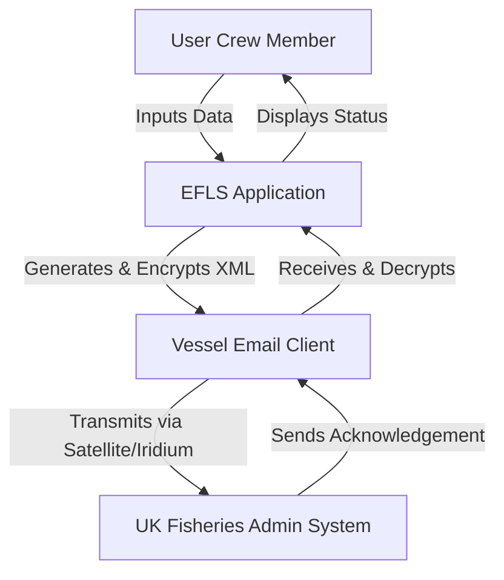

# Software Requirements Specification (SRS)
## Electronic Fishing Logbook System (EFLS)
### For UK Fishing Vessels >15m

**Document Version:** 1.0  
**Date:** 2023-10-27  
**Status:** Draft for Review

---

## 1. Introduction

### 1.1 Purpose
This Software Requirements Specification (SRS) document defines the functional and non-functional requirements for the Electronic Fishing Logbook System (EFLS). The purpose of the EFLS is to replace mandatory paper logbooks by providing a secure, electronic means for UK fishing vessels over 15 meters in length to record, validate, and report fishing activity data to the UK fisheries administration, in compliance with EU regulations (EC No 1224/2009). This document is intended for use by stakeholders, project managers, developers, testers, and quality assurance personnel involved in the software's design, implementation, and verification.

### 1.2 Scope
The EFLS is onboard software to be installed and used exclusively on qualifying UK fishing vessels while at sea. It facilitates the capture of fishing activity data (logbooks), transhipment declarations, and landing declarations. The system validates this data, packages it into a defined XML schema, and transmits it via encrypted email to the designated fisheries administration system. The system also manages message acknowledgements and allows for the correction or deletion of reports within the temporal bounds of a single fishing trip. The software is **not** intended for use by onshore agents or for vessels 15 meters and under.

#### 1.2.1 In Scope
*   Onboard data entry and validation for logbooks, transhipments, and landing declarations.
*   Generation of XML messages compliant with the official schema.
*   Secure (PGP encrypted), scheduled, and manual transmission of reports via email.
*   Reception and management of administrative acknowledgements.
*   User and credential management for vessel crew.
*   Correction and deletion of reports for the active fishing trip.

#### 1.2.2 Out of Scope
*   Integration with other onboard systems (e.g., GPS, catch sensors) is not required for initial compliance, though interfaces may be considered for future versions.
*   Data analysis or business intelligence tools.
*   Use onshore or by port authorities.
*   Management of regulatory rules or schema definitions; these are external dependencies.

### 1.3 Definitions, Acronyms, and Abbreviations
| Term | Definition |
| :--- | :--- |
| **EFLS** | Electronic Fishing Logbook System |
| **FLUX** | Fisheries Language for Universal eXchange (EU standard) |
| **PGP** | Pretty Good Privacy (encryption standard) |
| **UTC** | Coordinated Universal Time |
| **XML** | eXtensible Markup Language |
| **VMS** | Vessel Monitoring System (separate system) |
| **Transhipment** | The transfer of catch from one fishing vessel to another. |
| **Fishing Trip** | A period starting when a vessel leaves port to fish and ending when the catch is landed. |

### 1.4 References
*   Council Regulation (EC) No 1224/2009 establishing a Community control system.
*   UK Fisheries Administration Technical Interface Specification for Electronic Reporting.
*   FLUX TL XML Schema Definition (provided externally).

### 1.5 Overview
The remainder of this document is structured as follows: Section 2 provides an overall description of the product, its users, and constraints. Section 3 details the specific functional and non-functional requirements. Appendices may include data examples or UI mockups.

---

## 2. Overall Description

### 2.1 Product Perspective
The EFLS is a standalone, onboard client application. Its primary external interactions are:
1.  **User:** The vessel crew inputs data via the application GUI.
2.  **Email System:** The application uses the vessel's available email client/system (e.g., SMTP/POP3/IMAP) as a conduit to send encrypted XML messages and receive acknowledgements.
3.  **UK Fisheries Administration System:** The ultimate recipient of all reports, which sends back electronic acknowledgements.



### 2.2 Product Functions
The core high-level functions of the EFLS are:
1.  **Data Management:** Create, read, update, and delete logbook entries, transhipment declarations, and landing declarations.
2.  **Validation:** Enforce business rules and data integrity checks at entry time and prior to transmission.
3.  **XML Generation:** Transform validated internal data into an XML document that validates against the official FLUX-based schema.
4.  **Secure Communication:** Encrypt (PGP) and transmit XML messages via email. Decrypt and process incoming acknowledgement emails.
5.  **Report Lifecycle Management:** Track the status of all reports (draft, sent, acknowledged, corrected, deleted) and enable corrections/deletions for the current trip.
6.  **User & System Administration:** Manage user accounts, roles, and the unique software installation identifier.

### 2.3 User Characteristics
| User Class | Description | Key Responsibilities | Skill Level |
| :--- | :--- | :--- | :--- |
| **Vessel Master** | The captain or responsible officer. | Ultimate responsibility for logbook accuracy. Review, validate, and submit reports. Manage user access for crew. | High maritime knowledge. Moderate computer literacy. |
| **Vessel Owner** | Owner or managing agent. | May review historical data. Typically has "Master" level access. | Variable computer literacy. |
| **Crew Member** | Designated subordinate crew. | Enter specific logbook data (e.g., catch details) as delegated by the Master. | Basic maritime knowledge. Basic computer literacy. |

### 2.4 Constraints
1.  **Regulatory Compliance:** The system must adhere to the EU/UK technical specification for data format (XML schema) and transmission protocols.
2.  **Operational Environment:** Must operate reliably in a marine environment with limited, intermittent, and expensive connectivity.
3.  **Transmission Schedule:** The system must support automatic transmission of all pending reports at least once daily by **24:00 UTC**. Manual "send now" capability is also required.
4.  **Security:** All data transmissions **must** be encrypted using PGP with keys provided by the fisheries administration.
5.  **Unique Identification:** Each software installation must be assigned a unique identifier (e.g., Installation ID) that is included in the header of every XML message transmitted.
6.  **Onboard Use Only:** The software license and design are restricted to use on the vessel at sea.

### 2.5 Assumptions and Dependencies
*   **Assumption:** The vessel will have access to a functioning email system capable of sending and receiving emails via satellite link.
*   **Assumption:** The UK fisheries administration will provide valid PGP public keys for encryption and will sign acknowledgements with a private key.
*   **Dependency:** The official XML Schema Definition (XSD) is provided and maintained by the fisheries administration. Changes to the schema will require software updates.
*   **Dependency:** User authentication is handled locally by the software; no real-time online authentication service is assumed.

---

## 3. Specific Requirements

### 3.1 External Interface Requirements

#### 3.1.1 User Interfaces
*   **UI-01:** The system shall provide a login screen requiring username and password.
*   **UI-02:** The system shall provide role-based dashboards (Master, Crew).
*   **UI-03:** Forms for data entry shall mimic the logical sections of the paper logbook (e.g., haul details, catch species, quantities).
*   **UI-04:** All data entry fields shall have clear labels and, where necessary, tooltips explaining the required format.
*   **UI-05:** The system shall clearly display the status of each report (e.g., "Draft", "Queued for Send", "Sent", "Acknowledged", "Error").

#### 3.1.2 Hardware Interfaces
*   **HW-01:** The software shall run on standard commercial off-the-shelf (COTS) PCs or ruggedized marine computers.
*   **HW-02:** The software must be able to utilize the system's default email client interface (MAPI) or configured SMTP/POP3 settings.

#### 3.1.3 Software Interfaces
*   **SI-01:** The system shall integrate with a PGP encryption library (e.g., GnuPG) to perform encryption and decryption.
*   **SI-02:** The system shall include an XML parser and validator to ensure generated documents conform to the provided XSD.

#### 3.1.4 Communications Interfaces
*   **CI-01:** The system shall send email using SMTP.
*   **CI-02:** The system shall receive email using POP3 or IMAP.
*   **CI-03:** All emails containing report data or acknowledgements shall use PGP encryption as specified in Section 3.6.

### 3.2 Functional Requirements

#### 3.2.1 User Management (AUTH)
*   **AUTH-01:** The system shall allow a user with 'Master' role to create, modify, and disable user accounts for the vessel.
*   **AUTH-02:** Each user shall have a unique username, a secure password, and an assigned role (Master, Crew).
*   **AUTH-03:** The system shall enforce password complexity rules.
*   **AUTH-04:** User sessions shall timeout after a period of inactivity (configurable, default 15 minutes).

#### 3.2.2 Data Capture and Validation (DCAP)
*   **DCAP-01:** The system shall provide forms for creating Logbook Entries, Transhipment Declarations, and Landing Declarations.
*   **DCAP-02:** The system shall validate data at the field level upon entry (e.g., date formats, numeric ranges, mandatory fields).
*   **DCAP-03:** The system shall perform cross-field validation before saving a report (e.g., total catch weight consistency, date sequence logic).
*   **DCAP-04:** The system shall prevent the submission of a report that contains validation errors.

#### 3.2.3 Report Lifecycle Management (RLM)
*   **RLM-01:** The system shall allow a user to save a report as a **Draft**.
*   **RLM-02:** The system shall allow a user with 'Master' role to **Submit** a draft report, moving it to a "Queued for Transmission" state.
*   **RLM-03:** The system shall allow the generation of a **Correction** for any previously sent report from the **current fishing trip**.
*   **RLM-04:** The system shall allow the generation of a **Deletion** for any previously sent report from the **current fishing trip**.
*   **RLM-05:** Corrections and Deletions shall reference the unique message ID of the original report.

#### 3.2.4 XML Generation (XML)
*   **XML-01:** The system shall generate an XML document for any submitted, corrected, or deleted report.
*   **XML-02:** The generated XML shall validate without error against the official fisheries administration XSD schema.
*   **XML-03:** Every XML message header shall include the unique software **Installation ID** and a unique **Message ID** generated by the system.
*   **XML-04:** The system shall allow the user to preview the XML (read-only) for any report before submission.

#### 3.2.5 Transmission (TX)
*   **TX-01:** The system shall have a manual "Transmit Now" function to send all queued reports.
*   **TX-02:** The system shall automatically attempt to transmit all queued reports at least once every 24 hours, aiming to complete by **24:00 UTC**.
*   **TX-03:** Prior to transmission, the system shall encrypt the XML payload using the administration's PGP public key.
*   **TX-04:** The encrypted file shall be attached to an email addressed to the designated administration email address.
*   **TX-05:** The system shall update the status of successfully sent reports to "Sent" and log the timestamp.

#### 3.2.6 Acknowledgement Processing (ACK)
*   **ACK-01:** The system shall periodically check the configured email inbox for new messages.
*   **ACK-02:** The system shall identify emails that are PGP-signed acknowledgements from the fisheries administration.
*   **ACK-03:** The system shall decrypt and parse the acknowledgement, matching it to a sent report via the Message ID.
*   **ACK-04:** Upon a successful match, the system shall update the report's status to "Acknowledged".
*   **ACK-05:** If an acknowledgement indicates an error (e.g., schema validation failed at the admin side), the system shall alert the user and set the report status to "Error".

### 3.3 Performance Requirements
*   **PER-01:** Data entry forms shall respond to user input with a latency of less than 2 seconds.
*   **PER-02:** The generation and validation of an XML document for a typical logbook entry shall complete within 10 seconds.
*   **PER-03:** The application shall be capable of storing at least 2 years of local report data under normal operating conditions.

### 3.4 Security Requirements
*   **SEC-01:** All user passwords shall be stored hashed and salted in the local database.
*   **SEC-02:** All data transmissions (reports and acknowledgements) **must** be encrypted using PGP as specified by the administration.
*   **SEC-03:** The system's unique Installation ID shall be securely stored and not easily modifiable by the user.
*   **SEC-04:** Local data files (database, configuration) shall be protected from casual viewing by the operating system.

### 3.5 Software Quality Attributes
*   **AVAILABILITY:** The software must be available for data entry 24/7 while the vessel is at sea. Transmission functions depend on email connectivity.
*   **RELIABILITY:** The system must have an uptime of 99.5% during a fishing trip. Data loss is unacceptable.
*   **USABILITY:** The interface must be intuitive enough for a crew member with basic computer skills to be trained to use core functions within 1 hour.
*   **MAINTAINABILITY:** The software shall be designed to allow for updates to the XML schema with minimal code changes (e.g., through configuration files).

### 3.6 Business Rules
*   **BR-01:** A Correction or Deletion can only be made for a report that belongs to the **current, active fishing trip**. Once a trip is closed (final landing declared), its reports are immutable.
*   **BR-02:** The automatic daily transmission must include **all** reports in a "Queued for Transmission" or "Error" state.
*   **BR-03:** The unique Installation ID is bound to the software license and vessel. It cannot be changed without authorization from the administration.

---

## 4. Appendices

### 4.1 Data Dictionary (Sample)
*   **Message ID:** A system-generated UUID (e.g., `550e8400-e29b-41d4-a716-446655440000`).
*   **Installation ID:** A 10-character alphanumeric code assigned at registration (e.g., `VSL-UK-AB123`).
*   **Report Types:** `LOGBOOK`, `TRANSHIP`, `LANDING`, `CORRECTION`, `DELETION`.

### 4.2 XML Message Example (Simplified)
```xml
<?xml version="1.0" encoding="UTF-8"?>
<FLUXReportDocument xmlns="urn:un:unece:uncefact:data:standard:FLUXReport:3">
  <ID>550e8400-e29b-41d4-a716-446655440000</ID>
  <CreationDateTime>2023-10-27T14:30:00Z</CreationDateTime>
  <PurposeCode>9</PurposeCode>
  <SoftwareInstallation>
    <ID>VSL-UK-AB123</ID>
  </SoftwareInstallation>
  <FishingActivity>
    <!-- ... FLUX-compliant activity data ... -->
  </FishingActivity>
</FLUXReportDocument>
```

---
*Document End*