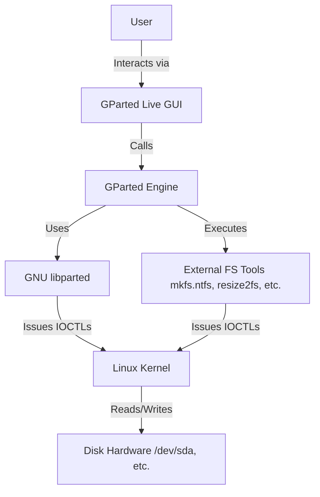

# Software Requirements Specification (SRS)
## GParted Live - Graphical Partition Editor

**Document Version:** 1.0  
**Date:** 2023-10-27  
**Status:** Approved for Development

---

### 1. Introduction

#### 1.1 Purpose
This Software Requirements Specification (SRS) document describes the functional and non-functional requirements for the **GParted Live** system, a graphical partition editor application. This document is intended to serve as a comprehensive guide for developers, testers, project managers, and stakeholders involved in the implementation, verification, and documentation of the system.

#### 1.2 Scope
The GParted Live system is a dedicated, bootable LiveCD application designed for disk partition management. It provides a graphical user interface (GUI) for performing critical disk operations without requiring installation on a host system. The system operates independently at boot time, allowing users to manage partitions on the primary hard disk or other storage devices.

**In-Scope:**
*   Graphical management of disk partitions (create, delete, format, resize, move, copy).
*   Operation as a self-contained LiveCD environment.
*   Reliance on GNU `libparted` and established external file system tools for low-level operations.
*   Support for a target user base encompassing casual users through to technical professionals.

**Out-of-Scope:**
*   Logical Volume Management (LVM) operations.
*   Network-based partition management.
*   Functioning as an installed application within an existing OS.
*   Data recovery or partition healing features beyond basic filesystem checks.

#### 1.3 Definitions, Acronyms, and Abbreviations
*   **GUI:** Graphical User Interface.
*   **LiveCD:** A bootable CD/DVD/USB medium containing an operating system that runs in memory without installation.
*   **Partition:** A logically distinct section of a data storage device.
*   **Filesystem:** A method for storing and organizing computer files (e.g., NTFS, ext4, FAT32).
*   **`libparted`:** The GNU partition editing library used for manipulating partition tables.
*   **LVM:** Logical Volume Manager (explicitly not supported).
*   **SRS:** Software Requirements Specification.

#### 1.4 References
*   GNU Parted Manual: https://www.gnu.org/software/parted/manual/
*   ISO/IEC/IEEE 29148:2018 - Systems and software engineering — Life cycle processes — Requirements engineering.

#### 1.5 Overview
The remainder of this document is structured as follows: Section 2 provides an overall description of the product, its users, and constraints. Section 3 details the specific functional and non-functional requirements.

### 2. Overall Description

#### 2.1 Product Perspective
GParted Live is a self-contained, standalone system. It is not a module or plugin for another product. It interfaces with the computer's hardware (disk drives) through the Linux kernel and leverages two key external software components:
1.  **GNU `libparted`:** For all partition table manipulation (creation, deletion, resizing of partition boundaries).
2.  **External Filesystem Tools:** (e.g., `mkfs`, `fsck`, `ntfsresize`) for operations specific to filesystems (formatting, checking, resizing).

The high-level system context is shown below:

#### 2.2 Product Functions
The core high-level functions of the system are:
1.  **Disk and Partition Visualization:** Graphically display disk layout, partition sizes, filesystem types, and used/free space.
2.  **Partition Table Manipulation:** Create new partitions and delete existing ones.
3.  **Partition Modification:** Resize (grow/shrink) and move partition boundaries on the disk.
4.  **Filesystem Operations:** Format partitions with a selected filesystem and check filesystem integrity.
5.  **Partition Data Operations:** Copy the entire content (structure and data) of a partition to another location on a disk.

#### 2.3 User Characteristics
| User Class | Characteristics | Key Goals |
| :--- | :--- | :--- |
| **Casual User** | Limited technical knowledge of disk structures. Needs clear, safe, and guided operations. | Resize a partition to create space for a dual-boot. Recover disk space from an unused partition. |
| **Developer/Tester** | Technically proficient. Understands risks of data loss. May use the tool for system provisioning or testing. | Create specific disk layouts for test environments. Wipe and reformat disks repeatedly. |
| **Documentation Writer** | Needs to understand all features and workflows accurately. | Create user guides, tutorials, and help content. Verify described procedures. |

#### 2.4 Constraints
1.  **Technical Constraint:** The system **must** use GNU `libparted` for partition table operations.
2.  **Technical Constraint:** The system **must not** implement LVM functionality. It will only handle primary, extended, and logical partitions.
3.  **Operational Constraint:** The system **must** be capable of running entirely from a LiveCD/USB environment without a hard disk installation.
4.  **Safety Constraint:** All operations that risk data loss **must** require explicit user confirmation before committing changes to disk.

#### 2.5 Assumptions and Dependencies
*   **Assumption:** The target hardware uses industry-standard partition tables (MS-DOS/MBR or GPT).
*   **Assumption:** Users possess a basic understanding of disks and partitions.
*   **Dependency:** The system is dependent on the stability and correctness of `libparted` and external filesystem tools.
*   **Dependency:** The LiveCD environment must include all necessary kernel modules and drivers for accessing the user's storage hardware.

### 3. Specific Requirements

#### 3.1 Functional Requirements

##### 3.1.1 Disk Visualization (FR-VIS)
*   **FR-VIS-01:** The system shall display a list of all detected physical disk drives.
*   **FR-VIS-02:** For a selected disk, the system shall render a graphical representation of its partition layout, showing partition boundaries, type, and label.
*   **FR-VIS-03:** The system shall display detailed textual information for any selected partition, including: device path, size, used/free space, filesystem, and flags.

##### 3.1.2 Partition Creation (FR-CREATE)
*   **FR-CREATE-01:** The user shall be able to select unallocated disk space.
*   **FR-CREATE-02:** The user shall be able to specify parameters for a new partition: size, filesystem type (e.g., ext4, NTFS, FAT32), and partition label.
*   **FR-CREATE-03:** The system shall validate creation requests against disk constraints (e.g., primary partition limit on MBR, available space).

##### 3.1.3 Partition Deletion (FR-DELETE)
*   **FR-DELETE-01:** The user shall be able to select an existing partition for deletion.
*   **FR-DELETE-02:** The system shall require explicit user confirmation before deleting a partition.
*   **FR-DELETE-03:** Upon deletion, the system shall mark the associated disk space as "unallocated."

##### 3.1.4 Partition Resizing/Moving (FR-RESIZE)
*   **FR-RESIZE-01:** The user shall be able to select a partition to resize or move.
*   **FR-RESIZE-02:** The system shall graphically allow the adjustment of the start and/or end boundary of the partition.
*   **FR-RESIZE-03:** The system shall only permit resizing/moving operations that do not overlap with existing partitions.
*   **FR-RESIZE-04:** For resize operations, the system shall first attempt to resize the filesystem (using appropriate external tools) before adjusting the partition boundary, preserving all data.

##### 3.1.5 Partition Formatting (FR-FORMAT)
*   **FR-FORMAT-01:** The user shall be able to select an existing (or new) partition for formatting.
*   **FR-FORMAT-02:** The user shall be able to choose a supported filesystem type.
*   **FR-FORMAT-03:** The system shall display a prominent warning that formatting will destroy all data on the partition and require confirmation.

##### 3.1.6 Partition Copy/Paste (FR-COPY)
*   **FR-COPY-01:** The user shall be able to select a source partition and initiate a "Copy" operation.
*   **FR-COPY-02:** The user shall be able to select a target unallocated space of sufficient size and initiate a "Paste" operation.
*   **FR-COPY-03:** The system shall create a new partition in the target space and copy all filesystem structures and data from the source partition.

##### 3.1.7 Operation Management (FR-OP)
*   **FR-OP-01:** The system shall maintain a pending operations list for all user requests before they are written to disk.
*   **FR-OP-02:** The user shall be able to view, edit, or remove operations from the pending list.
*   **FR-OP-03:** The user shall initiate an "Apply All Operations" action to commit all pending changes to disk.
*   **FR-OP-04:** During the apply process, the system shall display detailed, real-time progress for each individual operation.

#### 3.2 Non-Functional Requirements

##### 3.2.1 Usability
*   **NF-USB-01:** A casual user shall be able to perform a basic partition resize task with minimal reference to documentation.
*   **NF-USB-02:** All warning and confirmation dialogs shall use clear, non-technical language to describe potential risks.

##### 3.2.2 Reliability & Safety
*   **NF-REL-01:** The system shall prevent the user from applying operations that would render the boot disk unbootable without explicit override confirmation.
*   **NF-REL-02:** The system shall perform a sanity check on the pending operations list (e.g., no overlaps, valid sizes) before allowing the user to apply them.
*   **NF-REL-03:** The system must have a mechanism to cancel or roll back a multi-step operation if a step fails, where possible.

##### 3.2.3 Performance
*   **NF-PER-01:** The GUI shall remain responsive during long-running disk operations (e.g., copying a large partition), providing progress feedback.
*   **NF-PER-02:** The system shall load and display the partition layout of a standard 1TB disk within 5 seconds.

##### 3.2.4 Supportability
*   **NF-SUP-01:** All operations performed shall be logged to a persistent file on the LiveCD media with timestamps and success/failure status.
*   **NF-SUP-02:** The system shall provide an "undo" capability for the last applied set of operations, provided no subsequent operations have been applied and the system has not been rebooted.

---
*Document End*