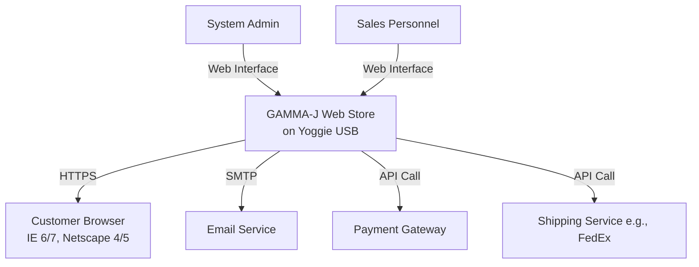

# Software Requirements Specification (SRS)
## For GAMMA-J Web Store
**Version:** 1.0  
**Date:** [Date of Creation]  
**Authors:** [Project Team]  
**Status:** Draft / For Review

---

### 1. Introduction

#### 1.1 Purpose
This document defines the functional and non-functional requirements for the GAMMA-J Web Store, a plug-and-play USB-based e-commerce system. It is intended for use by the development, testing, verification, and technical writing teams, as well as project stakeholders, to ensure a common understanding of the system to be developed.

#### 1.2 Document Conventions
- Requirements are uniquely identified using the format `[FR-XXX]` for Functional Requirements and `[NFR-XXX]` for Non-Functional Requirements.
- **Shall** indicates a mandatory requirement.
- **Should** indicates a desirable but not mandatory feature.
- *Italicized text* provides explanatory notes.

#### 1.3 Project Scope
The GAMMA-J Web Store is a self-contained, portable e-commerce solution designed for rapid deployment. It provides core online retail functionality out-of-the-box and is architected for extensibility via a plug-in API. The system operates from dedicated USB hardware, requiring minimal setup.

**In-Scope Features:**
*   Customer account lifecycle management.
*   Inventory management with hierarchical categorization.
*   Shopping cart and checkout process.
*   Order confirmation and payment processing integration.
*   A defined API for developing and installing plug-in extensions.

**Explicitly Out-of-Scope:**
*   Integration with telephonic order systems.
*   Native generation of shipping/tracking numbers (relies on external APIs).
*   Advanced customer analytics and reporting dashboards.
*   Browser compatibility beyond specified versions of IE and Netscape.
*   Management of the underlying Yoggie USB hardware or its OS.

#### 1.4 References
*   Project Charter: GAMMA-J Web Store
*   Hardware Specifications: Yoggie USB Device Datasheet
*   Security Policy: Data Encryption and Handling Standards

### 2. Overall Description

#### 2.1 Product Perspective
The GAMMA-J Web Store is an independent system housed on proprietary USB hardware. It interacts with external entities as shown below:

#### 2.2 Product Functions
The core functions of the system are:
1.  **User Management:** Secure registration, authentication, and profile management for customers and staff.
2.  **Catalog Browsing:** Display of products organized in a multi-tiered category structure.
3.  **Inventory Management:** CRUD operations for products, including attributes, pricing, and stock levels.
4.  **Shopping Cart:** Temporary storage and manipulation of items intended for purchase.
5.  **Order Processing:** Secure checkout, payment handling, order confirmation, and notification.
6.  **Extensibility:** Installation and management of plug-ins via a defined API.

#### 2.3 User Classes and Characteristics
| User Class | Characteristics | Key Responsibilities |
| :--- | :--- | :--- |
| **Customer** | External user. Varying technical skill. Requires intuitive interface. | Browse products, create account, manage cart, place orders. |
| **Sales Personnel** | Internal user. Knowledgeable about products. | Update inventory, product details, prices, and availability. |
| **System Administrator** | Internal user. High technical skill. | Manage user roles/permissions, install/configure plug-ins, monitor system health. |
| **Development Team** | System builder. Uses this SRS. | Implement, design, and maintain the system. |
| **Test & Verification Team** | Quality assurance. | Validate system against this SRS. |
| **Technical Writer** | Creates supporting documentation. | Produce user manuals and admin guides. |

#### 2.4 Operating Environment
*   **Hardware:** Yoggie-provided USB device (specifications defined by vendor).
*   **Operating System:** Slackware Linux 2.6 (pre-installed on hardware).
*   **Web Server:** Apache (pre-configured on hardware).
*   **Database:** SQL-based RDBMS (e.g., MySQL, PostgreSQL) running on the USB device.
*   **Client Browsers (Verified):** Microsoft Internet Explorer 6.0, 7.0; Netscape Communicator 4.0, 5.0.
*   **Network:** Requires host computer with internet access for email and external service APIs.

#### 2.5 Design and Implementation Constraints
1.  `[CON-001]` The system **shall** use an SQL-based database for all persistent data storage.
2.  `[CON-002]` The system **shall** be verified to operate correctly only on Microsoft Internet Explorer 6/7 and Netscape Communicator 4/5.
3.  `[CON-003]` The system **shall** be deployed and run exclusively from the specified Yoggie USB hardware environment.
4.  `[CON-004]` The database schema **shall** support an initial inventory of at least 20,000 unique items, with a design allowing expansion.
5.  `[CON-005]` All transmission of sensitive data (login, payment, PII) **shall** use HTTPS. Sensitive data at rest **shall** be encrypted within the database.

#### 2.6 Assumptions and Dependencies
*   The Yoggie USB hardware and its pre-loaded software stack are functional and provided as a black-box component.
*   The host computer into which the USB device is plugged has an active internet connection.
*   External services (Payment Gateway, SMTP for email, Shipping API) are available and have been configured with valid credentials.
*   Third-party plug-ins, when developed, will adhere to the defined plug-in API specification.

### 3. System Features and Requirements

#### 3.1 Feature: User Account Management
**Description:** This feature allows customers to register and manage their profiles, and allows administrators to manage all user accounts and privileges.

**3.1.1 Functional Requirements**
*   `[FR-101]` The system **shall** allow a new visitor to register as a customer by providing a valid email address, password, and basic personal information.
*   `[FR-102]` The system **shall** require email verification for completed customer registration.
*   `[FR-103]` The system **shall** allow registered users to authenticate using their email and password.
*   `[FR-104]` The system **shall** allow authenticated customers to view and edit their profile information (e.g., shipping address, phone number).
*   `[FR-105]` The system **shall** provide an administrative interface for system administrators to view, enable, disable, or delete user accounts.
*   `[FR-106]` The system **shall** allow administrators to assign roles (e.g., Sales Personnel) and associated privileges to user accounts.

#### 3.2 Feature: Product Inventory Management
**Description:** This feature allows sales personnel to manage the product catalog, including categorization and item details.

**3.2.1 Functional Requirements**
*   `[FR-201]` The system **shall** support a hierarchical product categorization system (e.g., Category > Subcategory).
*   `[FR-202]` The system **shall** allow sales personnel to create, read, update, and delete product categories.
*   `[FR-203]` The system **shall** allow sales personnel to add new products, assigning them a unique SKU/code, name, description, price, quantity, and category.
*   `[FR-204]` The system **shall** allow sales personnel to modify all attributes of an existing product, including marking it as out-of-stock or discontinued.
*   `[FR-205]` The system **shall** prevent the deletion of a product category or product that is associated with existing historical orders. *Deactivation is preferred.*

#### 3.3 Feature: Shopping Cart & Checkout
**Description:** This feature allows customers to select products for purchase and proceed through a secure checkout process.

**3.3.1 Functional Requirements**
*   `[FR-301]` The system **shall** allow both authenticated and unauthenticated users to add products to a shopping cart.
*   `[FR-302]` The system **shall** persist the cart for authenticated users across sessions.
*   `[FR-303]` The system **shall** allow users to view their cart, update item quantities, and remove items.
*   `[FR-304]` The system **shall** calculate and display a running subtotal, applicable taxes, and shipping costs (if available via external API) in the cart.
*   `[FR-305]` The system **shall** require user authentication to proceed from the cart to the checkout page.
*   `[FR-306]` The checkout process **shall** collect/confirm shipping address, billing address, and payment information.
*   `[FR-307]` The system **shall** integrate with a designated third-party payment gateway to process transactions.

#### 3.4 Feature: Order Processing & Confirmation
**Description:** This feature finalizes the sale, records the order, and notifies the customer.

**3.4.1 Functional Requirements**
*   `[FR-401]` Upon successful payment authorization, the system **shall** create a permanent order record with a unique order number, timestamp, and all relevant details.
*   `[FR-402]` The system **shall** reduce the inventory count for each product in the order.
*   `[FR-403]` The system **shall** automatically send an email confirmation to the customer containing the order number and details.
*   `[FR-404]` The system **shall** provide an interface for sales personnel to view orders and update their status (e.g., "Processing," "Shipped").
*   `[FR-405]` When an order status is updated to "Shipped," the system **shall** allow sales personnel to input a tracking number (obtained externally, e.g., from FedEx).

#### 3.5 Feature: Plug-in System
**Description:** This feature provides a mechanism to extend the core system functionality.

**3.5.1 Functional Requirements**
*   `[FR-501]` The system **shall** provide a documented Application Programming Interface (API) for developing plug-ins.
*   `[FR-502]` The system **shall** provide an administrative interface for uploading, installing, enabling, and disabling plug-ins.
*   `[FR-503]` The system **shall** isolate plug-ins so that a faulty plug-in cannot crash the core system.

### 4. Non-Functional Requirements

#### 4.1 Performance Requirements
*   `[NFR-601]` **Deployment Time:** The system **shall** be fully operational (web store accessible) within 60 seconds of plugging the USB device into a compatible host computer.
*   `[NFR-602]` **Concurrency:** The system **shall** support at least 1,000 concurrent authenticated customer sessions without degradation in response time. *(Degradation defined as page load time > 3 seconds for core browsing actions).*
*   `[NFR-603]` **Availability:** The system **shall** achieve 99.99% operational availability, excluding scheduled maintenance windows and failures of the underlying Yoggie hardware.

#### 4.2 Security Requirements
*   `[NFR-701]` All user passwords **shall** be stored using a strong, salted, one-way hashing algorithm.
*   `[NFR-702]` The system **shall** enforce session timeouts for inactive users.
*   `[NFR-703]` Administrative interfaces **shall** be accessible only to users with the System Administrator role.
*   `[NFR-704]` The system **shall** be protected against common web vulnerabilities (e.g., SQL Injection, Cross-Site Scripting).

#### 4.3 Usability Requirements
*   `[NFR-801]` The customer-facing interface **shall** be designed for ease of use, allowing a new user to find a product and add it to their cart within 3 clicks from the homepage.
*   `[NFR-802]` The administrative interfaces **shall** provide clear labels and logical grouping of functions for Sales Personnel and System Administrators.

### 5. Appendices

#### 5.1 Glossary
| Term | Definition |
| :--- | :--- |
| **PII** | Personally Identifiable Information. |
| **SKU** | Stock Keeping Unit. A unique identifier for a product. |
| **CRUD** | Create, Read, Update, Delete. Basic data operations. |
| **Plug-in** | A software component that adds a specific feature to the core system via the defined API. |

#### 5.2 Undecided / TBD Issues
The following items are acknowledged but require future business/technical decisions and are not part of the current scope:
1.  Strategy for integrating or transitioning existing telephonic orders.
2.  Development of an internal shipping/tracking number generation module.
3.  Implementation of customer order history analysis and reporting tools.
4.  Extending browser compatibility verification to Mozilla Firefox or other modern browsers.
5.  Roadmap for coordination with Yoggie on future hardware iterations or features.

---
**Document Approval**

| Role | Name | Signature | Date |
| :--- | :--- | :--- | :--- |
| Project Sponsor | | | |
| Lead Developer | | | |
| QA Manager | | | |
| Technical Writer | | | |