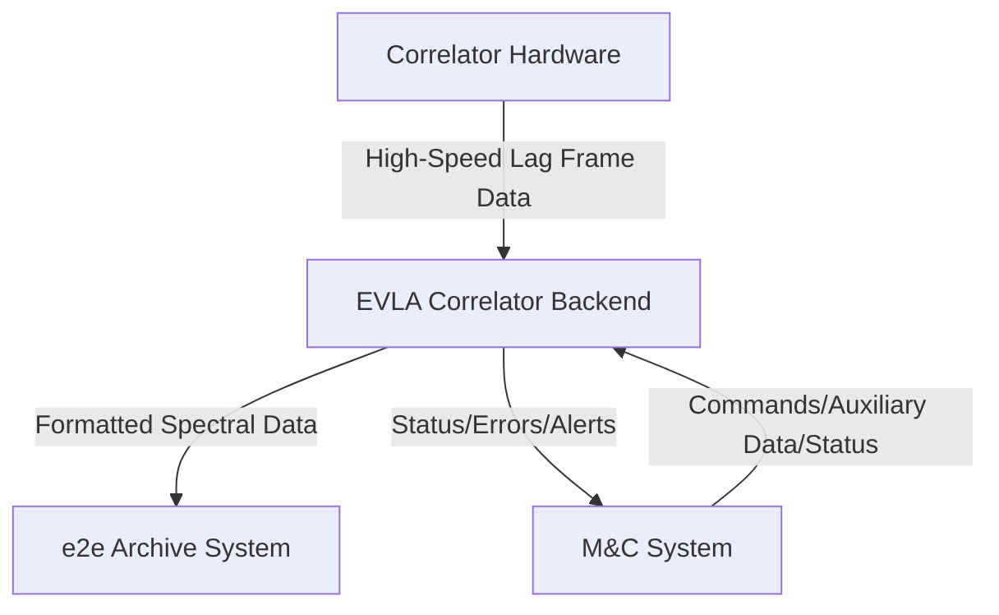

# Software Requirements Specification (SRS)
## EVLA Correlator Backend System

**Document Version:** 1.0  
**Date:** 2023-10-27  
**Status:** Draft for Review  
**Author:** Systems Engineering Team

---

## 1. Introduction

### 1.1 Purpose
This document defines the functional and non-functional requirements for the EVLA (Expanded Very Large Array) Correlator Backend system. It serves as the authoritative specification for developers, testers, project managers, and stakeholders, ensuring a common understanding of the system's capabilities, constraints, and interfaces.

### 1.2 Scope
The EVLA Correlator Backend is a real-time, high-performance astronomical data processing pipeline. Its primary function is to ingest raw correlation data from the Correlator hardware, perform necessary transformations and optional processing, and deliver formatted spectral data to the End-to-End (e2e) archive system.

**In-Scope:**
*   Real-time reception and assembly of lag frame data streams.
*   Execution of Fast Fourier Transforms (FFTs) and user-selectable processing operations.
*   Spectral integration and data formatting for archival.
*   System health monitoring, fault detection, and internal workload management.
*   Interfaces with the Correlator, Monitor & Control (M&C), and e2e archive systems.

**Out-of-Scope:**
*   Combining data from different sub-bands (this is a function of other systems).
*   Direct user interfaces for control or monitoring (all interaction is via the external M&C system).
*   Long-term data storage or user-facing data analysis tools.

### 1.3 Definitions, Acronyms, and Abbreviations
| Term | Definition |
| :--- | :--- |
| **EVLA** | Expanded Very Large Array |
| **Correlator** | The upstream hardware system that produces raw correlation (lag frame) data. |
| **Backend** | The system specified in this document (EVLA Correlator Backend). |
| **e2e** | End-to-End, referring to the downstream archive and data distribution system. |
| **M&C** | Monitor and Control system. |
| **Lag Frame** | A packet of raw correlation data for a specific time interval. |
| **Lag Set** | A complete time series assembled from sequential lag frames. |
| **FFT** | Fast Fourier Transform. |
| **Spectral Data** | The frequency-domain data produced after applying an FFT to a lag set. |

### 1.4 References
*   EVLA System Architecture Overview, Document ARC-001
*   Correlator Hardware Interface Control Document, ICD-COR-101
*   End-to-End Archive Interface Specification, ICD-E2E-202
*   Monitor & Control System API Guide, API-MC-105

### 1.5 Document Overview
This SRS is structured to present an overall product perspective, followed by detailed specific requirements covering functionality, interfaces, and non-functional attributes.

## 2. Overall Description

### 2.1 Product Perspective
The Correlator Backend is a critical middleware component within the EVLA data flow. It is positioned between the Correlator hardware and the e2e archive system. It operates autonomously in real-time but is configured and monitored via a separate M&C system. The following context diagram illustrates its ecosystem:

### 2.2 Product Functions
The core functions of the system are:
1.  **Data Ingestion:** Receive continuous, high-speed streams of lag frame data from the Correlator.
2.  **Data Assembly:** Buffer and assemble sequential lag frames into complete lag sets for processing.
3.  **Spectral Transformation:** Perform Fast Fourier Transforms on lag sets to produce spectral data.
4.  **Optional Processing:** Apply configurable processing steps (e.g., weighting, flagging) in time or frequency domain.
5.  **Integration:** Integrate (average) spectral data over a user-defined time period.
6.  **Data Formatting & Delivery:** Package integrated spectra with required metadata and transmit to the e2e archive.
7.  **System Management:** Monitor health, distribute workloads across internal nodes, detect failures, and initiate recovery procedures.
8.  **Status Reporting:** Relay operational status, performance metrics, and error conditions to the M&C system.

### 2.3 User Characteristics
| User Class | Expertise | Primary Interaction |
| :--- | :--- | :--- |
| **Array Operator** | Expert in telescope operations. | Monitors system status and high-level alerts via the M&C interface. Does not directly access the Backend. |
| **Astronomer/Scientist** | Expert in radio astronomy and data analysis. | Selects and parameterizes optional data processing steps (e.g., windowing functions) via the M&C system. |
| **Engineer/Technician** | Expert in hardware/software systems maintenance. | Uses diagnostic tools and remote access for maintenance, troubleshooting, and repair. |
| **Software Developer** | Expert in real-time systems and scientific computing. | Develops, debugs, and tests Backend software components. Requires detailed logs and diagnostic access. |
| **Administrator** | Expert in system administration and security. | Has full system access for configuration, user/role management, and security policy enforcement. |

### 2.4 Constraints
*   **Throughput Limitation:** The system's maximum sustainable data rate is constrained by the available computational hardware (CPU/GPU/FPGA) and network interface bandwidth.
*   **Real-Time Operation:** The system must process data in real-time with deterministic latency to prevent data loss from the continuous input stream.
*   **Legacy Interface Compatibility:** Must adhere to existing interface specifications (ICDs) for the Correlator and e2e systems.

### 2.5 Assumptions and Dependencies
*   **Assumption A1:** The upstream Correlator delivers properly formatted, sequential network packets within the specified protocol.
*   **Assumption A2:** The downstream e2e archive system is capable of accepting the Backend's output data at the specified minimum rate of 25 MB/s.
*   **Dependency D1:** The system relies on the external M&C system for all observational parameters, auxiliary data (e.g., timestamps, source coordinates), and operational commands (start, stop, configure).
*   **Dependency D2:** The system assumes the availability of a secure, high-bandwidth network infrastructure.

## 3. Specific Requirements

### 3.1 External Interface Requirements

#### 3.1.1 Correlator Hardware Interface
*   **REQ-IF-001:** The system shall receive lag frame data via a dedicated, very high-speed network interface (e.g., 10/40/100 GbE).
*   **REQ-IF-002:** The system shall implement the protocol and packet format as defined in ICD-COR-101.
*   **REQ-IF-003:** The system shall be capable of sustaining a **minimum aggregate continuous input data rate of 1.6 GB/s**.

#### 3.1.2 Monitor & Control (M&C) System Interface
*   **REQ-IF-010:** The system shall receive all configuration parameters, processing commands, and auxiliary data via the M&C interface as defined in API-MC-105.
*   **REQ-IF-011:** The system shall transmit real-time status information (health, performance metrics, queue depths) to the M&C system at a configurable interval (default: 1 Hz).
*   **REQ-IF-012:** The system shall immediately report all error and alert conditions to the M&C system.
*   **REQ-IF-013:** The system shall continue core processing operations without data loss for a minimum of 5 minutes if the M&C connection is lost, using the last known valid configuration.

#### 3.1.3 End-to-End (e2e) Archive Interface
*   **REQ-IF-020:** The system shall transmit fully formatted spectral data and metadata via a dedicated, very high-speed network interface.
*   **REQ-IF-021:** The system shall implement the output data format and protocol as defined in ICD-E2E-202.
*   **REQ-IF-022:** The system shall be capable of sustaining a **minimum aggregate continuous output data rate of 25 MB/s**.
*   **REQ-IF-023:** The system shall buffer output data and retry transmission if the e2e system becomes temporarily unavailable, preventing data loss for a minimum of 10 minutes under maximum load.

### 3.2 Functional Requirements

#### 3.2.1 Data Ingestion & Assembly
*   **REQ-FN-101:** The system shall accept concurrent data streams from multiple Correlator output channels.
*   **REQ-FN-102:** The system shall assemble individual lag frames into complete, time-ordered lag sets, as defined by the current integration parameters.
*   **REQ-FN-103:** The system shall detect and report missing, out-of-order, or corrupted lag frames.

#### 3.2.2 Spectral Processing Pipeline
*   **REQ-FN-110:** The system shall apply a Fast Fourier Transform to each assembled lag set.
*   **REQ-FN-111:** The system shall support user-selectable (via M&C) windowing functions (e.g., Hanning, Hamming) to be applied in the time domain prior to the FFT.
*   **REQ-FN-112:** The system shall support user-selectable (via M&C) frequency-domain processing operations (e.g., baseline correction, simple flagging).
*   **REQ-FN-113:** The system shall integrate (average) spectral data over a configurable time period (1 to 60 seconds).

#### 3.2.3 Data Delivery
*   **REQ-FN-120:** The system shall format the integrated spectral data according to ICD-E2E-202, including all mandatory metadata (timestamp, source ID, frequency parameters, processing flags).
*   **REQ-FN-121:** The system shall generate and attach a data integrity checksum (e.g., CRC-32) to each output data block.

#### 3.2.4 System Management & Fault Tolerance
*   **REQ-FN-130:** The system shall continuously monitor the health of its internal processing nodes, network links, and storage buffers.
*   **REQ-FN-131:** The system shall automatically redistribute processing workload if a node failure is detected.
*   **REQ-FN-132:** The system shall log all significant events, errors, and state changes to a persistent, queryable log store.
*   **REQ-FN-133:** The system shall provide a mechanism to pause, drain, and restart the processing pipeline without data loss for planned maintenance.

#### 3.2.5 Data Integrity & Reversibility
*   **REQ-FN-140:** All data processing steps (windowing, FFT, frequency operations) shall be mathematically defined and logged such that the original raw lag frame data can be reconstructed from the final spectral data and the processing metadata.
*   **REQ-FN-141:** The system shall maintain the full dynamic range and fidelity of the input data throughout the processing pipeline, with quantization error being the only permissible source of data alteration.

### 3.3 Non-Functional Requirements

#### 3.3.1 Performance Requirements
*   **REQ-NF-201:** The system shall meet the input/output rate requirements (**1.6 GB/s in, 25 MB/s out**) simultaneously and continuously under nominal operational load.
*   **REQ-NF-202:** The end-to-end latency (time from receipt of the last lag frame in a set to delivery of the corresponding integrated spectrum) shall be less than 2x the integration time.
*   **REQ-NF-203:** The system architecture shall be scalable to support a future target of **2 GB/s per Correlator output channel** without a fundamental redesign.

#### 3.3.2 Reliability & Availability
*   **REQ-NF-210:** The system shall achieve an operational availability of 99.5% over a calendar year, excluding scheduled maintenance.
*   **REQ-NF-211:** The system shall self-detect and automatically recover from software process failures within 30 seconds.
*   **REQ-NF-212:** The system shall continue loss-less data processing during temporary failures of the M&C or e2e systems, as specified in REQ-IF-013 and REQ-IF-023.

#### 3.3.3 Security Requirements
*   **REQ-NF-220:** All interactive access to the system (for maintenance, development, administration) shall require unique user authentication.
*   **REQ-NF-221:** An administrator role shall control the creation, modification, and revocation of all user accounts and their associated privileges (e.g., read-only, operator, engineer, admin).
*   **REQ-NF-222:** All data and command interfaces (M&C, administrative) shall be encrypted in transit using industry-standard protocols (e.g., TLS 1.3).

#### 3.3.4 Design Constraints
*   **REQ-NF-230:** The software shall be designed for a modular, distributed architecture capable of running on a cluster of commercial off-the-shelf (COTS) servers.

## 4. Verification & Acceptance

### 4.1 Acceptance Criteria
Formal acceptance of the system will require successful demonstration of the following:
1.  **Performance Test:** Sustained operation for 24 hours at the target input rate of 1.6 GB/s and output rate of 25 MB/s, with no data loss or backlog growth.
2.  **Integrity Test:** Verification that raw input data can be perfectly reconstructed from output spectral data and logged processing parameters (REQ-FN-140).
3.  **Fault Tolerance Test:** Simulated failure of the M&C and e2e interfaces, demonstrating continued processing and data buffering without loss, followed by successful recovery upon reconnection.
4.  **Functional Test:** Successful execution of all user-selectable processing options and correct formatting per the defined ICDs.

### 4.2 Priority Guide
*   **Priority 1 (Critical):** Requirements essential for basic operation (e.g., REQ-IF-001, REQ-IF-003, REQ-FN-110, REQ-NF-201). Must be fully implemented for initial acceptance.
*   **Priority 2 (High):** Important requirements for reliable, usable operation (e.g., REQ-FN-130, REQ-FN-131, REQ-NF-211, REQ-NF-220).
*   **Priority 3 (Medium):** Requirements that enhance functionality or maintainability (e.g., advanced processing options in REQ-FN-112, detailed performance metrics).

---
*Document End*