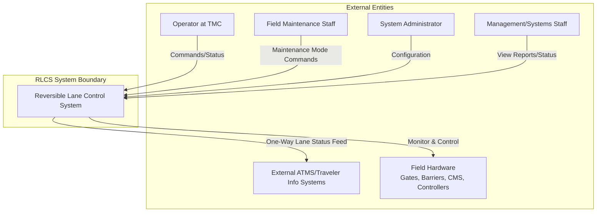

# Software Requirements Specification (SRS)
## Reversible Lane Control System (RLCS)
### For the California Department of Transportation (Caltrans)

**Document Version:** 1.0
**Date:** 2023-10-27
**Status:** Draft for Review

---

## 1. Introduction

### 1.1 Purpose
This Software Requirements Specification (SRS) document describes the functional and non-functional requirements for the Reversible Lane Control System (RLCS). The primary purpose of this document is to provide a complete description of the system to be developed, serving as a basis for agreement between Caltrans and the development team. This document is intended for use by project managers, system architects, software developers, testers, and end-user representatives.

### 1.2 Scope
The RLCS is a safety-critical software system designed to automate the opening and closing of reversible traffic lanes on the I-15 freeway for daily peak-hour traffic management and special events. The system replaces an aging legacy control system and interfaces with new field hardware (gates, barriers, signs, controllers). It provides centralized monitoring and control from the Traffic Management Center (TMC).

**In-Scope:**
*   Centralized software for operator control and monitoring.
*   Interface drivers for new field controllers and I/O devices.
*   Execution of predefined lane reversal sequences.
*   User authentication, authorization, and audit logging.
*   Safety rule validation for all control commands.
*   Generation of operational and maintenance reports.
*   One-way data feed for external traveler information systems.
*   Secure remote access for authorized personnel.

**Out-of-Scope:**
*   Control of freeway exit ramps.
*   Acceptance of real-time operational commands from external traffic systems (e.g., ATMS).
*   Direct control of traffic signals not part of the reversible lane infrastructure.
*   Wireless communication between field controllers.

### 1.3 Definitions, Acronyms, and Abbreviations

| Term | Definition |
| :--- | :--- |
| **ATMS** | Advanced Traffic Management System |
| **Caltrans** | California Department of Transportation |
| **CMS** | Changeable Message Sign |
| **GUI** | Graphical User Interface |
| **I/O** | Input/Output |
| **MD5** | Message-Digest Algorithm 5 (used for integrity checks) |
| **RLCS** | Reversible Lane Control System |
| **TMC** | Traffic Management Center |
| **2070 ATC** | A standard type of traffic signal controller |

### 1.4 References
*   Caltrans ITS Standards & Specifications
*   Legacy RLCS Operational Manuals
*   I-15 Corridor Improvement Project Plans

### 1.5 Overview
The remainder of this document is structured as follows: Section 2 provides a general description of the product, its users, and constraints. Section 3 details the specific functional requirements. Section 4 specifies the non-functional requirements, including performance, safety, and security.

## 2. Overall Description

### 2.1 Product Perspective
The RLCS is a new, self-contained software system that replaces a legacy control system. It operates on a private, secured Caltrans network. The system interfaces with external entities as shown in the context diagram below:

### 2.2 Product Functions
The core functions of the RLCS are:
1.  **Operator Interface:** Provide a secure, graphical interface for real-time status visualization and command issuance.
2.  **Device Control:** Monitor the state of and send control commands to field devices (gates, pop-up barriers, lights, CMS).
3.  **Sequence Execution:** Automatically execute stored, step-by-step sequences for opening and closing reversible lanes.
4.  **Safety & Security:** Enforce user authentication, authorization, and validate all commands against immutable safety rules to prevent hazardous states (e.g., wrong-way openings).
5.  **Data Management & Reporting:** Log all system events, operator actions, and device states. Generate predefined operational and maintenance reports.
6.  **System Configuration:** Allow administrators to configure users, devices, schedules, and sequences.

### 2.3 User Characteristics

| User Class | Expertise | Primary Tasks |
| :--- | :--- | :--- |
| **TMC Operator** | Trained in RLCS operations and traffic management. | Log in, monitor system status, initiate/cancel scheduled sequences, command individual devices (override), acknowledge alarms. |
| **Field Maintenance Staff** | Technicians familiar with field hardware. | Log in at field workstations, execute diagnostic and maintenance sequences, perform manual device control **only in maintenance mode**. |
| **System Administrator** | IT/Systems engineer with network and software admin skills. | Configure user accounts and permissions, define devices and control sequences, set system schedules, manage software updates. |
| **Management/Systems Staff** | Supervisors, engineers, planners. | View system status dashboards, generate and export historical reports. **No control authority.** |

### 2.4 Constraints
1.  **Communication:** The system must use only the private, wired communications network (fiber optic/copper) provided by Caltrans. Wireless connections between field controllers are prohibited.
2.  **Security:** The system must operate on an isolated, secured network segment.
3.  **Legacy Integration:** The system must be deployable and testable while the legacy system remains operational during off-hours.
4.  **Regulatory:** Must comply with all Caltrans and relevant state safety and ITS standards.

### 2.5 Assumptions and Dependencies
*   **Assumption:** The new fiber optic network along the I-15 corridor will be deployed and operational prior to RLCS commissioning.
*   **Assumption:** Field hardware (controllers, I/O cards) will be installed, powered, and physically connected to the communications network.
*   **Dependency:** System functionality is dependent on the continuous availability of the Caltrans private network.
*   **Assumption:** All users will receive formal training on the new system prior to operational use.

## 3. Specific Requirements

### 3.1 Functional Requirements

#### 3.1.1 User Management & Security (RLCS-FUN-0100)
*   **RLCS-FUN-0110:** The system shall require user authentication via a unique username and password to access any functionality.
*   **RLCS-FUN-0120:** The system shall enforce user authorization based on five factors: Command Level, Allowed Devices, System Mode (Normal/Maintenance), Workstation Location, and Specific Function.
*   **RLCS-FUN-0130:** The system shall allow only one user to hold "command control" (the ability to issue lane reversal commands) at any given time in Normal Mode.
*   **RLCS-FUN-0140:** The system shall provide a "System Administrator" role with privileges to create, modify, and disable user accounts and assign authorization factors.

#### 3.1.2 Graphical User Interface (RLCS-FUN-0200)
*   **RLCS-FUN-0210:** The GUI shall provide a schematic map display of the I-15 reversible lane section, showing real-time status (open/closed/moving/fault) of all controlled devices.
*   **RLCS-FUN-0220:** The GUI shall provide dedicated control panels to manually command individual devices or device groups (where safe to do so).
*   **RLCS-FUN-0230:** The GUI shall display a list of pending, active, and completed lane reversal sequences.
*   **RLCS-FUN-0240:** The GUI shall provide clear visual and audible alarms for system faults, device failures, and safety rule violations.

#### 3.1.3 Device Monitoring & Control (RLCS-FUN-0300)
*   **RLCS-FUN-0310:** The system shall poll and display the status of all field devices at an interval not to exceed 5 seconds.
*   **RLCS-FUN-0320:** The system shall send open/close/activate/deactivate commands to specific field devices (gates, pop-up barriers, CMS, lane-use lights) via the appropriate controller driver (e.g., 2070 ATC driver).
*   **RLCS-FUN-0330:** Before executing any control command, the system shall validate the command against a set of safety rules stored in non-volatile memory.

#### 3.1.4 Sequence Execution (RLCS-FUN-0400)
*   **RLCS-FUN-0410:** The system shall store predefined sequences for "Open Northbound Lanes" and "Close Northbound Lanes" (and equivalent for southbound).
*   **RLCS-FUN-0420:** A sequence shall include sequential steps such as: "Set CMS message 'LANE CLOSED' at entrance A", "Verify gate B is closed", "Activate pop-up barrier C", etc.
*   **RLCS-FUN-0430:** The system shall allow an operator to initiate a scheduled or manual sequence. Initiation shall require a final confirmation from the commanding operator.
*   **RLCS-FUN-0440:** The system shall execute each step in order, only proceeding to the next step upon verification of the successful completion of the current step. If a step fails, the sequence shall pause and raise an alarm.

#### 3.1.5 Safety Rule Validation (RLCS-FUN-0500)
*   **RLCS-FUN-0510:** The system shall maintain a core set of safety rules in non-volatile memory that cannot be modified during normal operation. Examples include:
    *   "An entrance gate for northbound traffic shall not be opened if the corresponding southbound gate is not confirmed closed."
    *   "A 'LEFT LANE CLOSED' CMS shall be activated before moving any barrier in that lane."
*   **RLCS-FUN-0520:** Every control command, whether from a manual action or a sequence step, shall be validated against all applicable safety rules before being transmitted to the field.

#### 3.1.6 Reporting (RLCS-FUN-0600)
*   **RLCS-FUN-0610:** The system shall automatically log all operator logins/logouts, commands issued, sequence initiations/completions/failures, and device state changes.
*   **RLCS-FUN-0620:** The system shall generate daily and monthly operational reports summarizing lane usage, sequence executions, and system alarms.
*   **RLCS-FUN-0630:** The system shall generate maintenance reports listing device failures, communication errors, and diagnostic data.

#### 3.1.7 External Interfaces (RLCS-FUN-0700)
*   **RLCS-FUN-0710:** The system shall provide a one-way, read-only data feed (e.g., XML over HTTPS) to external servers, containing current lane status (open/closed/direction) and customer eligibility information.
*   **RLCS-FUN-0720:** The system shall support a secure dial-in or VPN interface for authorized users to access the RLCS network from remote, pre-authorized locations.

### 3.2 Non-Functional Requirements

#### 3.2.1 Availability & Reliability
*   **RLCS-NFR-0110:** The system shall be available 24 hours a day, 7 days a week, 365 days a year. Calculated yearly uptime shall be at least **99.99%**.
*   **RLCS-NFR-0120:** The system shall implement redundancy (e.g., hot-standby servers) to allow for degraded operation in case of a primary hardware failure.
*   **RLCS-NFR-0130:** The mean time to recover (MTTR) after a software or hardware failure shall not exceed **10 minutes**.
*   **RLCS-NFR-0140:** The system shall operate continuously without requiring a restart due to a software error for a period of at least **30 consecutive days**.

#### 3.2.2 Performance
*   **RLCS-NFR-0210:** The GUI status display (map, device icons) shall update to reflect a confirmed field device status change within **2 seconds**.
*   **RLCS-NFR-0220:** The time from an operator confirming a control command (or sequence step) to the physical field device beginning its response shall be no more than **12 seconds** under normal network conditions.

#### 3.2.3 Safety & Security
*   **RLCS-NFR-0310:** Safety rule validation (RLCS-FUN-0520) shall be performed at both the application level and within the field controller driver software.
*   **RLCS-NFR-0320:** The system shall use the **MD5 algorithm** to verify the integrity of critical software files and configuration data (e.g., safety rules, sequences) upon system startup and periodically during operation.
*   **RLCS-NFR-0330:** All communication between the central system and field controllers shall be encrypted.
*   **RLCS-NFR-0340:** All user passwords shall be stored using strong, salted hashing.

#### 3.2.4 Usability
*   **RLCS-NFR-0410:** A trained operator shall be able to initiate a standard lane reversal sequence with no more than 3 user actions from the main screen.
*   **RLCS-NFR-0420:** The system shall provide context-sensitive help accessible from all major screens.

## 4. Acceptance Criteria
All requirements listed in this SRS are classified as **"Must Have."** Final system acceptance by Caltrans is contingent upon the successful demonstration of the following in a witnessed Factory Acceptance Test (FAT) and Site Acceptance Test (SAT):

1.  Execution of all defined operational sequences (Open/Close for both directions) without safety rule violations.
2.  Verification of all performance metrics (2-second GUI update, 12-second device response, 10-minute recovery).
3.  Demonstration of the safety interlock system preventing a simulated "wrong-way opening" command.
4.  Demonstration of user role-based access control, including exclusive command control.
5.  Validation of all external interfaces (one-way data feed, remote access).
6.  Successful generation of sample operational and maintenance reports.