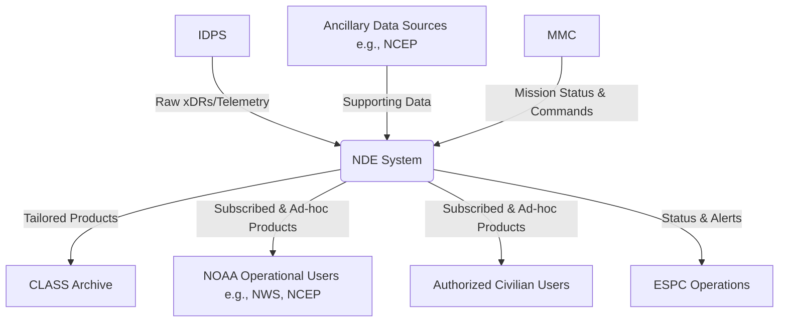

# Software Requirements Specification (SRS)
## NOAA Data Exploitation (NDE) System

**Document Version:** 1.0  
**Date:** 2023-10-27  
**Status:** Draft for Review  
**Authors:** Systems Engineering Team

---

### 1. Introduction

#### 1.1 Purpose
This Software Requirements Specification (SRS) document defines the functional and non-functional requirements for the NOAA Data Exploitation (NDE) system. It serves as a comprehensive guide for developers, testers, project managers, and stakeholders, ensuring a common understanding of the system's capabilities, constraints, and interfaces. The intended audience includes the development team, NOAA operational personnel, and quality assurance teams.

#### 1.2 Scope
The NDE system is a downstream processing, packaging, archiving, and distribution system for environmental satellite data from the NPP (National Polar-orbiting Partnership) and NPOESS (National Polar-orbiting Operational Environmental Satellite System) programs. The system's core mission is to serve NOAA's operational and climate communities by generating tailored and NOAA-unique data products, providing customer services, and ensuring long-term data stewardship.

**In-Scope:**
*   Ingestion of data records (xDRs), telemetry, and ancillary data from external sources.
*   Generation of NOAA-unique environmental data records (EDRs) and environmental data products (EDPs).
*   Tailoring (reformatting, re-projecting, aggregating) of data products per customer specifications.
*   Distribution of products to authorized users and delivery to the long-term archive.
*   Provision of customer services (registration, subscription, help desk).
*   System health, performance, and quality monitoring.
*   Operation in defined modes (Open, Degraded, Restricted Access).

**Out-of-Scope:**
*   Primary satellite data processing (function of the IDPS).
*   Physical long-term data storage (function of the CLASS archive).
*   Development of core scientific algorithms (provided by NOAA).

#### 1.3 Definitions, Acronyms, and Abbreviations

| Term | Definition |
| :--- | :--- |
| **NDE** | NOAA Data Exploitation |
| **NOAA** | National Oceanic and Atmospheric Administration |
| **NPP** | National Polar-orbiting Partnership |
| **NPOESS** | National Polar-orbiting Operational Environmental Satellite System |
| **IDPS** | Interface Data Processing Segment |
| **CLASS** | Comprehensive Large Array-data Stewardship System |
| **ESPC** | Environmental Satellite Processing Center |
| **MMC** | Mission Management Center |
| **xDR** | Environmental Data Record (SDR, EDR, etc.) |
| **EDP** | Environmental Data Product |
| **NWS** | National Weather Service |
| **NCEP** | National Centers for Environmental Prediction |
| **BUFR** | Binary Universal Form for the Representation of meteorological data |
| **GRIB** | GRIdded Binary |
| **netCDF** | Network Common Data Form |
| **FEA** | Federal Enterprise Architecture |
| **FGDC** | Federal Geographic Data Committee |

#### 1.4 References
*   NPOESS System Architecture Document
*   NOAA IT Security Manual
*   Federal Enterprise Architecture (FEA) Reference Models
*   FGDC Content Standard for Digital Geospatial Metadata

#### 1.5 Overview
The remainder of this document is structured as follows:
*   **Section 2:** Overall Description - Provides context, user characteristics, and constraints.
*   **Section 3:** Specific Requirements - Details functional requirements, external interfaces, and non-functional requirements.
*   **Appendices:** May include glossary, data definitions, and traceability matrices.

### 2. Overall Description

#### 2.1 Product Perspective
The NDE system is a critical component within NOAA's ESPC ground segment. It acts as a middleware system, positioned between the upstream **IDPS** (primary data source) and downstream **end-user communities** (data consumers). It also interfaces with the **CLASS** archive for long-term preservation and the **NPOESS MMC** for mission coordination.

**System Context Diagram:**

#### 2.2 Product Functions (High-Level)
1.  **Data Ingestion:** Reliably receive and ingest all data from IDPS and ancillary sources.
2.  **Product Generation:** Execute NOAA-supplied scientific algorithms to create unique environmental data products.
3.  **Product Tailoring:** Transform products through reformatting, re-projection, compression, and aggregation based on customer subscriptions.
4.  **Product Distribution & Archiving:** Deliver products to users via push/pull mechanisms and deliver designated products to the CLASS archive.
5.  **Customer & Data Services:** Manage user identities, subscriptions, ad-hoc orders, and provide help desk support.
6.  **System Operations & Monitoring:** Provide tools for operators to monitor health, control the system, validate data, and manage incidents.
7.  **Mode-Based Operations:** Seamlessly transition between Open, Degraded, and Restricted Access operational modes.

#### 2.3 User Characteristics

| User Class | Characteristics | Key Tasks |
| :--- | :--- | :--- |
| **NOAA Operational User** (e.g., NWS Forecaster) | Expert in meteorology/oceanography; Requires low-latency, reliable data for time-sensitive models and forecasts. | Subscribe to data streams; Access near-real-time products; Submit ad-hoc requests. |
| **Climate Researcher** | Scientist analyzing long-term trends; Requires consistent, well-documented, and archived data products. | Access historical data catalogs; Order tailored datasets; Download bulk data. |
| **NDE System Operator** | IT/Operations staff with system administration privileges; Works in 24/7 operations center. | Monitor system dashboards; Manage processing jobs; Handle trouble tickets; Execute mode changes. |
| **Customer Support Staff** | Personnel trained on NDE products and user management. | Process user registrations; Manage subscriptions; Respond to help desk inquiries. |
| **External System** (e.g., IDPS, CLASS) | Automated machine-to-machine interface. | Push/pull data via defined protocols and schemas. |

#### 2.4 Constraints
*   **Technical:** Must reuse existing Government-Furnished Equipment (GFE) and software where feasible.
*   **Regulatory:** Must comply with Federal Enterprise Architecture (FEA) and FGDC metadata standards.
*   **Policy:** Must adhere to all NOAA IT security policies and procedures.
*   **Dependency:** System functionality is dependent on the continuous, correct operation of external systems (IDPS, CLASS, ESPC infrastructure).

#### 2.5 Assumptions and Dependencies
*   **Assumption:** NOAA will provide validated, maintained scientific algorithms for product generation.
*   **Assumption:** The IDPS will deliver data according to agreed-upon schedules, formats, and service levels.
*   **Assumption:** CLASS archive interfaces and performance will be stable and available.
*   **Dependency:** System security (PKI, access control) is dependent on the broader ESPC security infrastructure.

### 3. Specific Requirements

#### 3.1 Functional Requirements

**3.1.1 Data Ingestion (F-INGEST)**
*   **F-INGEST-001:** The system shall ingest all xDR, telemetry, and ancillary data files delivered by the IDPS via the specified interface protocol.
*   **F-INGEST-002:** The system shall perform integrity checks (e.g., checksum validation) on all ingested files and generate alerts for corrupted data.
*   **F-INGEST-003:** The system shall ingest ancillary data (e.g., model outputs from NCEP) from defined external sources on a scheduled basis.

**3.1.2 Product Generation (F-GEN)**
*   **F-GEN-001:** The system shall execute NOAA-supplied scientific algorithms to generate NOAA-unique EDRs and EDPs from ingested xDRs and ancillary data.
*   **F-GEN-002:** The system shall manage the processing workflow, ensuring all prerequisite input data is available before algorithm execution.

**3.1.3 Product Tailoring (F-TAILOR)**
*   **F-TAILOR-001:** The system shall reformat data products into customer-specified formats including, but not limited to, BUFR, GRIB2, and netCDF-4.
*   **F-TAILOR-002:** The system shall re-project geospatial data to coordinate reference systems as defined by the customer subscription.
*   **F-TAILOR-003:** The system shall aggregate data temporally (e.g., daily composites) or spatially as per product specifications.

**3.1.4 Distribution & Archiving (F-DIST)**
*   **F-DIST-001:** The system shall automatically distribute products to users based on active subscriptions immediately upon product availability.
*   **F-DIST-002:** The system shall support ad-hoc product orders via a user portal or API, processing them according to priority.
*   **F-DIST-003:** The system shall deliver all NOAA-unique EDPs to the CLASS archive interface for long-term preservation.
*   **F-DIST-004:** The system shall prioritize and route SARSAT and A-DCS telemetry data for delivery within 1 minute of receipt.

**3.1.5 Customer Services (F-CUST)**
*   **F-CUST-001:** The system shall provide a web-based portal for user registration, profile management, and subscription management.
*   **F-CUST-002:** The system shall notify users of order status changes (e.g., received, processing, completed, failed).
*   **F-CUST-003:** The system shall provide a ticketing system for help desk inquiries and trouble reporting.

**3.1.6 System Operations & Monitoring (F-OPS)**
*   **F-OPS-001:** The system shall provide a real-time operational dashboard displaying system health, job status, data latency, and error conditions.
*   **F-OPS-002:** The system shall allow operators to manually start, stop, pause, and reprioritize processing jobs.
*   **F-OPS-003:** The system shall generate daily and monthly performance and quality assurance (QA) reports.
*   **F-OPS-004:** The system shall operate in three distinct modes:
    *   **Open Mode:** All functions operational.
    *   **Degraded Mode:** Limited functionality due to internal or external failure; core product generation continues.
    *   **Restricted Access Mode:** Limited distribution based on data sensitivity or system security events.

#### 3.2 External Interface Requirements

**3.2.1 IDPS Interface**
*   **EI-IDPS-001:** Interface Type: Machine-to-machine, push-based.
*   **EI-IDPS-002:** Protocol/Format: As defined by the IDPS Interface Control Document (ICD).
*   **EI-IDPS-003:** Data: Raw xDR files, telemetry streams, metadata.

**3.2.2 CLASS Archive Interface**
*   **EI-CLASS-001:** Interface Type: Machine-to-machine, push-based for delivery, pull-based for retrieval.
*   **EI-CLASS-002:** Protocol/Format: As defined by the CLASS ICD.
*   **EI-CLASS-003:** Data: Final, quality-assured NOAA-unique EDPs with full FGDC-compliant metadata.

**3.2.3 User Delivery Interfaces**
*   **EI-USER-001:** The system shall support product delivery via secure FTP (SFTP), HTTP/S, and dedicated multicast streams as specified per user agreement.

#### 3.3 Non-Functional Requirements

**3.3.1 Availability**
*   **NF-AVAIL-001:** The core capabilities (Data Ingestion, Product Generation, Distribution, Operations Monitoring) shall have a composite availability of not less than 99.7%, meaning unplanned interruptions shall not exceed 2 hours in any 24-hour period or 4 hours in any consecutive 30-day period.

**3.3.2 Performance**
*   **NF-PERF-001:** **Latency:** For standard environmental data products, the time from receipt of the last required input data element to product availability for distribution shall not exceed 5 minutes (P95).
*   **NF-PERF-002:** **Latency (Critical):** SARSAT and A-DCS telemetry data shall be delivered to the designated processing centers within 1 minute of receipt by NDE (P99).
*   **NF-PERF-003:** **Throughput:** The system shall sustain a continuous input data rate of 4 Terabytes per day and an output data rate of 8 TB/day for NPP, scalable to 8 TB/day input and 16 TB/day output for NPOESS missions.

**3.3.3 Reliability**
*   **NF-REL-001:** 99% of all scheduled and event-driven system tasks (e.g., algorithm runs, distribution jobs) shall execute successfully in any consecutive 30-day period.

**3.3.4 Security**
*   **NF-SEC-001:** The system shall comply with all applicable NOAA IT security policies, including access control, audit logging, and data encryption standards.
*   **NF-SEC-002:** All system access shall require authentication and authorization. User roles and privileges shall be managed by the system.
*   **NF-SEC-003:** The system shall protect data integrity against errors, malfunctions, and disasters via mechanisms like checksums, write-once storage, and redundant processing paths.

**3.3.5 Maintainability & Supportability**
*   **NF-MAIN-001:** The system shall be designed to be scalable, allowing for the addition of processing nodes and storage without service interruption.
*   **NF-MAIN-002:** The system shall support the updating of scientific algorithm packages and core software components during planned maintenance windows without requiring a full system rebuild.

**3.3.6 Data Quality**
*   **NF-QUAL-001:** All products delivered to users and the CLASS archive shall have associated quality flags and metadata as defined by the product specification.

### 4. Appendices

#### 4.1 Acceptance Criteria
Formal acceptance of the NDE system will require demonstration of, but not limited to, the following:
*   Successful end-to-end processing of a representative suite of data from IDPS ingestion through product delivery to a test user and the CLASS interface.
*   Verification of all quantified non-functional requirements (Availability, Performance, Capacity, Reliability) via a 30-day continuous operational test.
*   Successful security assessment and accreditation (ATO) in accordance with NOAA policy.
*   Validation of all major external interfaces (IDPS, CLASS, MMC) via integrated testing.

#### 4.2 Traceability Matrix
*(A separate traceability matrix will link these requirements to higher-level system requirements, design elements, and test cases.)*