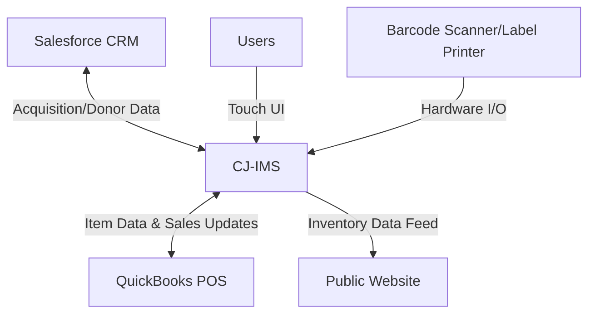

# Software Requirements Specification (SRS)
## Construction Junction Inventory Management System (CJ-IMS)

**Document Version:** 1.0  
**Date:** [Date of Creation]  
**Status:** Draft for Review  
**Author:** [Author/Team Name]

---

### 1. Introduction

#### 1.1 Purpose
This document defines the functional and non-functional requirements for the Construction Junction Inventory Management System (CJ-IMS). It is intended for use by the project stakeholders, development team, quality assurance team, and management to ensure a common understanding of the system to be developed.

#### 1.2 Document Conventions
*   **Must/Shall:** Indicates a mandatory requirement.
*   **Should:** Indicates a desirable but not mandatory requirement.
*   **May/Could:** Indicates an optional feature or capability.
*   **Bold Text:** Used for key terms and system names.
*   `Code Blocks`: Used for interface names, data formats, or technical examples.

#### 1.3 Project Scope
The **CJ-IMS** is a new application designed to create, maintain, and view Construction Junction's categorized inventory. It will manage the lifecycle of donated items from acquisition through to sale. The system will **not** replace the existing QuickBooks Point of Sale (POS) system for sales transactions or the Salesforce CRM system for constituent management. Instead, it will integrate with these systems to provide a seamless operational workflow. The system will also interface with CJ's public website to display inventory data.

**In-Scope:**
*   Management of a hierarchical inventory structure (Departments > Categories > Items).
*   Processing of all acquisition types (Drop-Off, Pickup, Deconstruction).
*   Item management (add, modify, split, adjust quantity).
*   Generation of donation receipts and item tags.
*   Bi-directional synchronization of item and sales data with QuickBooks POS.
*   Integration with Salesforce CRM for acquisition and donor data.
*   Role-based access control and audit logging.
*   Generation of inventory and acquisition reports.
*   Providing inventory data to the public website.

**Out-of-Scope:**
*   Processing of financial transactions (handled by QuickBooks POS).
*   Management of donor relationships beyond acquisition linkage (handled by Salesforce CRM).
*   Direct e-commerce sales on the website (potential future phase).

#### 1.4 References
*   QuickBooks POS API Documentation
*   Salesforce CRM API Documentation
*   CJ Technology Standards Document
*   CJ Business Process Manuals

### 2. Overall Description

#### 2.1 Product Perspective
The CJ-IMS is a new, self-contained subsystem that will integrate into CJ's existing technology ecosystem. It acts as the central system of record for all physical inventory, sitting between the donor-facing CRM (Salesforce) and the customer-facing POS (QuickBooks).

#### 2.2 Product Functions
The core functions of the CJ-IMS are:
1.  **Inventory Hierarchy Management:** Create and maintain the tree structure of Departments and Categories.
2.  **Acquisition Processing:** Receive items into inventory via three workflows linked to Salesforce.
3.  **Item Lifecycle Management:** Perform all actions on inventory items (add, edit, price, split, adjust, delete).
4.  **Document Generation:** Print donor receipts and item price/specification tags.
5.  **System Integration:** Synchronize data bi-directionally with QuickBooks POS and pull data from Salesforce CRM.
6.  **Reporting:** Generate standard and ad-hoc reports on inventory status, valuation, and acquisition history.
7.  **Data Provisioning:** Supply inventory data to the public website.

#### 2.3 User Classes and Characteristics
| User Class | Key Characteristics | Primary Use Case |
| :--- | :--- | :--- |
| **Administrator/Director** | Technical & business authority. | Configure system, manage users, define inventory structure, access all reports. |
| **Manager** | Supervisory role, price-setting authority. | Adjust item pricing, review inventory levels, generate performance reports. |
| **Receiving Associate** | Dock staff, primary data entry. | Process drop-off donations, enter item details, print receipts and tags. |
| **Pickup/Decon Associate** | Field staff, mobile access needed. | Initiate pickup/deconstruction acquisitions, perform preliminary item entry. |
| **Sales Associate** | Checkout staff, uses POS. | Process sales (in POS), which triggers automatic inventory updates in CJ-IMS. |
| **Customer Service Rep** | Office staff, uses CRM. | Create drop-off acquisition records in CRM for donor appointments. |
| **Donor/Buyer (External)**| Interacts via CRM or Website. | Donate items (initiates process in CRM) or browse inventory online. |

#### 2.4 Operating Environment
*   **Software:** Must operate on CJ's standard desktop operating system (e.g., Windows 10/11). Must be compatible with the corporate network, firewall, and security policies.
*   **Hardware:** Must support touch-screen monitors, USB barcode scanners, and standard label printers (e.g., Zebra).
*   **Integration:** Must operate in an environment with stable network connectivity to the QuickBooks POS server and Salesforce CRM cloud instance.

#### 2.5 Design and Implementation Constraints
1.  The system **must** be developed using CJ-approved technologies (to be specified in the System Design Document).
2.  The system **must** be supportable by the existing IT staffing model and skill sets.
3.  The system's data model **must** accommodate the existing categorization logic used by CJ.
4.  All user interfaces for acquisition processing **must** be designed for touch-first interaction.

#### 2.6 Assumptions and Dependencies
*   **Assumption:** All acquisitions (donations) will be created as records in Salesforce CRM before being processed in CJ-IMS.
*   **Dependency:** The successful operation of CJ-IMS is critically dependent on stable APIs and continued service from QuickBooks POS and Salesforce CRM.
*   **Assumption:** QuickBooks POS will remain the system of record for final sales transactions and financial data.

### 3. System Features and Requirements

#### 3.1 Inventory Hierarchy Management
**3.1.1 Description**
Authorized users must be able to view, navigate, and manage the hierarchical structure of inventory (Departments containing Categories containing Items).

**3.1.2 Functional Requirements**
*   **FR-1:** The system shall display the inventory hierarchy in a navigable tree view.
*   **FR-2:** Users with 'Administrator' role shall be able to add, edit, and delete Departments and Categories.
*   **FR-3:** Users with 'Administrator' or 'Manager' role shall be able to move Categories between Departments.
*   **FR-4:** Any deletion of a Department or Category that contains items shall require confirmation and shall specify the disposition of child items (e.g., move to another category).

#### 3.2 Acquisition Processing
**3.2.1 Description**
The system shall facilitate receiving donated items into inventory through three predefined acquisition types, which are initiated from Salesforce CRM.

**3.2.2 Functional Requirements**
*   **FR-10:** The system shall allow users to search for and select an existing Acquisition record pulled from Salesforce CRM.
*   **FR-11:** For a selected Acquisition, the system shall present a touch-optimized interface for entering individual items, including description, category, condition, quantity, and initial price.
*   **FR-12:** The system shall support three acquisition workflows:
    *   **FR-12.1:** **Drop-Off:** Receiving Associate can finalize the acquisition, marking items as "Received."
    *   **FR-12.2:** **Pickup:** Pickup Associate can enter items on-site but must flag them as "Pending Receipt." A Receiving Associate must later confirm and finalize receipt at the dock.
    *   **FR-12.3:** **Deconstruction:** Similar to Pickup, with items flagged as "Pending Receipt" until final receipt is confirmed.
*   **FR-13:** Upon finalizing an acquisition, the system shall automatically generate a unique, sequential Donation Receipt Number.

#### 3.3 Item Lifecycle Management
**3.3.1 Description**
Users shall be able to perform various actions on inventory items throughout their lifecycle in the store.

**3.3.2 Functional Requirements**
*   **FR-20:** Users with 'Receiving Associate' or higher role shall be able to add new items to inventory (linked to an acquisition).
*   **FR-21:** Users with 'Manager' role shall be able to modify item properties, including price, description, and category.
*   **FR-22:** The system shall allow users to "split" a single inventory record of quantity *n* into two records (e.g., quantity *x* and quantity *n-x*), allowing for separate pricing or tracking.
*   **FR-23:** The system shall allow users with 'Manager' role to perform quantity adjustments (for loss, damage, or correction), requiring a reason code.
*   **FR-24:** The sale of an item via QuickBooks POS shall automatically decrement the item's quantity in CJ-IMS. A sale of the last item shall change the item's status to "Sold."

#### 3.4 Document Generation
**3.4.1 Description**
The system shall generate and print physical documents for donor relations and item labeling.

**3.4.2 Functional Requirements**
*   **FR-30:** The system shall generate a printable Donation Receipt PDF for a finalized acquisition, containing CJ details, donor info (from CRM), receipt number, date, and list of items.
*   **FR-31:** The system shall generate and send print jobs to configured label printers to produce item tags. Tags must include Item ID, Description, Category, Price, and Date Received.

#### 3.5 System Integration
**3.5.1 Description**
The system shall exchange data with external systems to maintain consistency and automate workflows.

**3.5.2 Functional Requirements**
*   **FR-40:** **Salesforce Integration:** The system shall periodically poll or receive push notifications from Salesforce for new or updated Acquisition records.
*   **FR-41:** **QuickBooks POS Integration - Outbound:** When a new item is finalized in CJ-IMS, the system shall create a corresponding item record in QuickBooks POS via its API.
*   **FR-42:** **QuickBooks POS Integration - Inbound:** The system shall receive sales transaction data from QuickBooks POS (or poll for it) to update item quantities and statuses in CJ-IMS.
*   **FR-43:** **Website Integration:** The system shall expose an API or generate a data feed (e.g., JSON/XML) containing available inventory items for the public website to consume.

#### 3.6 Reporting
**3.6.1 Description**
The system shall provide standard reports to support business operations and decision-making.

**3.6.2 Functional Requirements**
*   **FR-50:** The system shall generate an **Inventory Valuation Report** showing total inventory value by department/category.
*   **FR-51:** The system shall generate an **Acquisition Summary Report** showing donations received over a date range, by type and donor.
*   **FR-52:** The system shall generate an **Inventory Change Log Report** detailing all adjustments, price changes, and deletions, with user and timestamp.

### 4. External Interface Requirements

#### 4.1 User Interfaces
*   The primary application interface shall be a responsive web application compatible with modern browsers.
*   All data entry screens for acquisition processing (**FR-11**) shall be designed for touch interaction, with large buttons, minimal text input, and dropdown selectors.
*   Administrative screens may use a more traditional desktop UI paradigm.

#### 4.2 Hardware Interfaces
*   The system shall accept input from standard USB barcode scanners. Scanning a barcode shall focus the cursor to the relevant search/input field.
*   The system shall support printing to network-connected label printers using standard page description languages (e.g., ZPL for Zebra printers).

#### 4.3 Software Interfaces
*   **SI-1: QuickBooks POS Interface**
    *   **API Type:** REST/XML
    *   **Data Synced:** Item Add/Update (SKU, Description, Price, Category), Sales Data (SKU, Quantity Sold, Timestamp).
*   **SI-2: Salesforce CRM Interface**
    *   **API Type:** REST (Salesforce API)
    *   **Data Synced:** Acquisition Records (ID, Donor, Type, Scheduled Date), Donor Contact Information.
*   **SI-3: Public Website Interface**
    *   **Mechanism:** Secure API Endpoint or scheduled file export.
    *   **Data Provided:** Item ID, Description, Category, Price, Condition, Image URL (if stored).

#### 4.4 Communications Interfaces
*   The system shall communicate over HTTPS using TLS 1.2 or higher for all external integrations.
*   Internal communication between the application server and database shall be over a secured private network.

### 5. Non-Functional Requirements

#### 5.1 Performance Requirements
*   **PR-1:** The system shall support concurrent access by a minimum of 25 users.
*   **PR-2:** Common user interactions (screen loads, saving an item, searching) shall have a response time of less than 2 seconds under normal load.
*   **PR-3:** Batch operations (e.g., end-of-day sync with POS) must complete within 15 minutes.

#### 5.2 Safety Requirements
*   Not applicable.

#### 5.3 Security Requirements
*   **SR-1:** The system shall implement Role-Based Access Control (RBAC) as defined in Section 2.3.
*   **SR-2:** All user authentication shall integrate with CJ's central Active Directory (or equivalent) system.
*   **SR-3:** The system shall maintain an audit log for all sensitive operations, including but not limited to: user login/logout, item price change, item deletion, quantity adjustment, and user role change. Each log entry must include username, timestamp, action, and affected record.
*   **SR-4:** All sensitive data at rest (e.g., audit logs) shall be encrypted.

#### 5.4 Software Quality Attributes
*   **Availability:** The system shall achieve 99.5% availability during CJ's core business hours (9:00 AM - 7:00 PM, 7 days a week). Outside these hours, 95% availability is acceptable for reporting and admin tasks.
*   **Usability:** The system shall be designed such that a new Receiving Associate can be trained to proficiently process a drop-off acquisition within 30 minutes.
*   **Reliability:** The system shall have a Mean Time Between Failures (MTBF) of no less than 720 hours in a production environment.
*   **Maintainability:** The system shall be designed with modular components. All source code shall be documented and stored in CJ's version control system.

### 6. Other Requirements

#### 6.1 Priorities
*   **High Priority (MVP):** FR-1, FR-2, FR-10, FR-11, FR-12.1, FR-20, FR-21, FR-24, FR-30, FR-31, FR-41, FR-42, SR-1, SR-3.
*   **Medium Priority:** FR-12.2, FR-12.3, FR-22, FR-23, FR-40, FR-43, FR-50, FR-51, FR-52.
*   **Low Priority:** FR-3, FR-4, Website e-commerce features, E-blast flagging module.

#### 6.2 Acceptance Approach
Acceptance of the CJ-IMS will be based on:
1.  Successful execution of all defined functional requirement test cases.
2.  Verification of all non-functional requirements (performance benchmarks, security audit, availability simulation).
3.  Successful end-to-end integration testing with QuickBooks POS and Salesforce CRM in a staging environment.
4.  User Acceptance Testing (UAT) sign-off from representatives of each key user class.

---
**Document Approval**

| Role | Name | Signature | Date |
| :--- | :--- | :--- | :--- |
| Project Sponsor | | | |
| Lead Developer | | | |
| Quality Assurance Lead | | | |