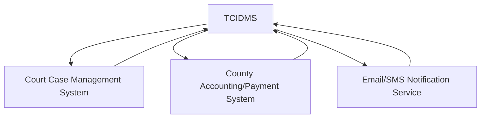

Of course. Below is a comprehensive Software Requirements Specification (SRS) document for the Tarrant County Indigent Defense Management System, structured professionally and formatted in Markdown.

***

# Software Requirements Specification
## For
# Tarrant County Indigent Defense Management System (TCIDMS)
**Version 1.0**

| | |
| :--- | :--- |
| **Prepared by:** | [Your Name/Organization] |
| **Date:** | 2024-05-20 |
| **Client:** | Tarrant County Integrated Justice Information System |

***

## Table of Contents
1. [Introduction](#1-introduction)
    1.1 [Purpose](#11-purpose)
    1.2 [Document Conventions](#12-document-conventions)
    1.3 [Intended Audience and Reading Suggestions](#13-intended-audience-and-reading-suggestions)
    1.4 [Project Scope](#14-project-scope)
    1.5 [References](#15-references)
2. [Overall Description](#2-overall-description)
    2.1 [Product Perspective](#21-product-perspective)
    2.2 [Product Functions](#22-product-functions)
    2.3 [User Classes and Characteristics](#23-user-classes-and-characteristics)
    2.4 [Operating Environment](#24-operating-environment)
    2.5 [Design and Implementation Constraints](#25-design-and-implementation-constraints)
    2.6 [Assumptions and Dependencies](#26-assumptions-and-dependencies)
3. [System Features](#3-system-features)
    3.1 [Electronic Counsel Request Management](#31-electronic-counsel-request-management)
    3.2 [Appointment and Notification System](#32-appointment-and-notification-system)
    3.3 [Attorney Roster and Rotation Management](#33-attorney-roster-and-rotation-management)
    3.4 [Compliance Reporting](#34-compliance-reporting)
4. [External Interface Requirements](#4-external-interface-requirements)
    4.1 [User Interfaces](#41-user-interfaces)
    4.2 [Hardware Interfaces](#42-hardware-interfaces)
    4.3 [Software Interfaces](#43-software-interfaces)
    4.4 [Communications Interfaces](#44-communications-interfaces)
5. [Non-Functional Requirements](#5-non-functional-requirements)
    5.1 [Performance Requirements](#51-performance-requirements)
    5.2 [Security Requirements](#52-security-requirements)
    5.3 [Software Quality Attributes](#53-software-quality-attributes)
    5.4 [Legal and Compliance Requirements](#54-legal-and-compliance-requirements)

***

## 1. Introduction

### 1.1 Purpose
This document describes the functional and non-functional requirements for the Tarrant County Indigent Defense Management System (TCIDMS). The SRS will serve as a contract between the development team and the client, ensuring a mutual understanding of the system's capabilities and constraints. Any changes to this document require formal approval.

### 1.2 Document Conventions
- Requirements are specified using the **Shall** convention.
- Functional requirements are listed in Section 3.
- Markdown is used for formatting, with code blocks for structured data examples.

### 1.3 Intended Audience and Reading Suggestions
- **Project Sponsors & County Management:** Focus on Sections 1 (Introduction) and 2 (Overall Description).
- **Judicial Staff & End-Users:** Focus on Sections 2.3 (User Classes) and 3 (System Features).
- **Developers, QA Testers, & System Architects:** Should read the entire document thoroughly.

### 1.4 Project Scope
The TCIDMS is a web-based software solution designed to integrate with the Tarrant County Integrated Justice Information System. Its primary goal is to automate and manage the process of appointing legal counsel to indigent defendants, ensuring compliance with the Texas Fair Defense Act (FDA) and related statutes. The system will replace manual, paper-based processes with a secure, efficient, and auditable electronic workflow.

### 1.5 References
- Texas Code of Criminal Procedure, Chapter 26 & Chapter 15
- Texas Government Code, Chapter 552 (Public Information Act)
- Texas Fair Defense Act
- Texas Department of Information Resources (DIR) Standards and Guidelines

## 2. Overall Description

### 2.1 Product Perspective
The TCIDMS is a new, self-contained module that will integrate with existing county systems. It will function as a "feeder" system for attorney appointment data and a "consumer" of case and financial data.

*Diagram illustrating the key system integrations.*

### 2.2 Product Functions (MVP Summary)
1. **Electronic Submission & Processing:** Enable courts to submit and process requests for appointed counsel digitally.
2. **Notification Engine:** Automatically notify defendants and attorneys of appointments and critical case updates.
3. **Attorney Management:** Maintain a master list of eligible attorneys and manage appointment rotations fairly.
4. **Compliance Reporting:** Generate standardized reports to demonstrate compliance with the Texas Fair Defense Act.

### 2.3 User Classes and Characteristics
| User Class | Key Characteristics | Primary Responsibilities |
| :--- | :--- | :--- |
| **Court Clerk** | County employee, familiar with legal procedures. | Initiate counsel requests, input defendant data, trigger notifications. |
| **Judge / Court Administrator** | Judicial officer, approves appointments. | Review and approve attorney appointments. |
| **Indigent Defense Coordinator** | County administrator, manages the program. | Manage attorney roster, oversee rotation, run compliance reports. |
| **Attorney** | External user, registered with the county. | Receive appointment notifications, acknowledge assignments, update case status. |
| **System Administrator** | IT staff. | Manage user accounts, system configuration, and technical health. |

### 2.4 Operating Environment
- **Software:** Web-based application accessible via modern browsers (Chrome, Firefox, Edge). Backend built on a standard stack (e.g., .NET/Java, SQL Database).
- **Hardware:** Hosted on Tarrant County's secured servers or an approved cloud environment compliant with DIR standards.
- **Network:** Accessible over the county's secure intranet, with potential for secure external access for attorneys.

### 2.5 Design and Implementation Constraints
1.  **Legal Compliance:** The system **shall** strictly adhere to all appointment timelines and procedural rules outlined in the Texas Code of Criminal Procedure and the Texas Fair Defense Act.
2.  **Integration:** The system **shall** be designed to integrate with the existing Court Case Management System and the County Accounting System via defined APIs or data exchange protocols.
3.  **Records Management:** All electronic records created by the system **shall** comply with the Texas Department of Information Resources (DIR) guidelines for electronic recordkeeping, including retention and audit trails.

### 2.6 Assumptions and Dependencies
- **Assumption:** Court staff will be trained on the new electronic process.
- **Assumption:** The existing Court Case Management System provides stable and accessible APIs for integration.
- **Dependency:** Successful integration is dependent on the cooperation and technical capabilities of the external system vendors.

## 3. System Features

### 3.1 Electronic Counsel Request Management
**Description:** This feature allows court clerks to create, submit, and track requests for appointed counsel for indigent defendants electronically.

**Requirements:**
- The system **shall** allow a court clerk to create a new counsel request by entering defendant biographic and case information.
- The system **shall** provide a form to capture the financial eligibility determination as per state guidelines.
- The system **shall** automatically timestamp the creation of the request to establish the start of the statutory appointment timeline.
- The system **shall** allow a clerk to save a request as a "Draft" and submit it as "Pending Approval."

### 3.2 Appointment and Notification System
**Description:** This feature manages the workflow of appointing an attorney and notifying all relevant parties.

**Requirements:**
- The system **shall** automatically assign an attorney from the eligible roster based on a configured rotation algorithm (e.g., next-in-line, by court).
- The system **shall** allow a Judge to review and manually override an automated assignment.
- Upon appointment approval, the system **shall** automatically generate and send a notification to the appointed attorney via email and/or SMS. The notification **shall** include defendant name, case number, court, and appointment date.
- The system **shall** generate a notification to the defendant (via mail or email, as configured) informing them of their appointed counsel.
- The system **shall** maintain a log of all sent notifications.

### 3.3 Attorney Roster and Rotation Management
**Description:** This feature allows the Indigent Defense Coordinator to maintain the list of attorneys eligible for appointments and manage the rotation logic.

**Requirements:**
- The system **shall** provide an interface for the coordinator to add, edit, deactivate, and categorize attorneys (e.g., by practice area, court).
- The system **shall** maintain a record for each attorney including contact information, areas of expertise, and appointment history.
- The system **shall** implement a configurable rotation system to ensure fair distribution of appointments.
- The system **shall** track an attorney's acceptance or rejection of an appointment and adjust the rotation accordingly.

### 3.4 Compliance Reporting
**Description:** This feature generates pre-defined and ad-hoc reports to demonstrate compliance with state law.

**Requirements:**
- The system **shall** generate a "FDA Compliance Summary Report" showing the time elapsed between counsel request and attorney appointment for all cases within a date range.
- The system **shall** generate an "Attorney Activity Report" detailing appointments, acceptances, and rejections per attorney.
- All reports **shall** be exportable to PDF and CSV formats.
- The system **shall** allow filtering of report data by court, date range, and case type.

## 4. External Interface Requirements

### 4.1 User Interfaces
- The UI **shall** be a responsive web design, accessible from desktop and tablet devices.
- The UI **shall** follow Tarrant County's web design standards and be compliant with WCAG 2.1 AA for accessibility.

### 4.2 Hardware Interfaces
- None specified beyond standard server and client hardware.

### 4.3 Software Interfaces
1.  **Court Case Management System (CCMS)**
    - **Purpose:** To receive new case data and update case status with appointment information.
    - **Protocol/Format:** RESTful API or SOAP web service with JSON/XML payloads.
2.  **County Accounting System**
    - **Purpose:** To submit attorney payment vouchers for processed appointments.
    - **Protocol/Format:** Batch file transfer (e.g., CSV, XML) or direct API integration.
3.  **Email/SMS Gateway**
    - **Purpose:** To send all system-generated notifications.
    - **Protocol/Format:** SMTP for email; Twilio or similar SMS API provider.

### 4.4 Communications Interfaces
- All external communications **shall** use encrypted channels (TLS 1.2 or higher).

## 5. Non-Functional Requirements

### 5.1 Performance Requirements
- The system **shall** support concurrent access by a minimum of 200 users.
- The system **shall** load any dashboard or main screen in under 3 seconds.
- The system **shall** process and display search results for cases/attorneys in under 5 seconds.

### 5.2 Security Requirements
- The system **shall** implement role-based access control (RBAC) as defined in Section 2.3.
- All user authentication **shall** integrate with the county's active directory.
- The system **shall** log all user logins, data changes, and appointment actions for audit purposes.
- All Personally Identifiable Information (PII) **shall** be encrypted at rest and in transit.

### 5.3 Software Quality Attributes
- **Availability:** The system **shall** achieve 99.5% uptime during standard business hours (7:00 AM - 6:00 PM CT).
- **Reliability:** The system **shall** have a mean time between failures (MTBF) of no less than 720 hours.
- **Usability:** A new court clerk user **shall** be able to create a counsel request with minimal training (under 15 minutes).

### 5.4 Legal and Compliance Requirements
- The system **shall** retain all records in accordance with the Texas State Library and Archives Commission retention schedules for indigent defense records.
- The system and its data management practices **shall** comply with the Texas Public Information Act.